# [中英字幕] UC Berkeley 深度无监督学习 CS294-158-SP24  ｜ 2024年春 （更新至0824） - P7：7 自监督学习 - AInsight - BV17W421P7QA

好吧，让我们开始吧，今天，让我们看看我们在哪里，课堂上我们已经讲了很多，我们，涵盖了迄今为止所有的生成模型，尽管以某种方式构建的模型，你可以从他们身上取样，生成与您类似的新数据，训练数据，嗯。

通常可能是，你想要什么，但通常你想要的是，实际上是一个模型，预训练模型，然后您可以，针对您关心的任务进行微调，真正想要从预训练中得到什么，模型的特点是它以某种方式提取了好的，来自您的数据的表示。

生成模型也可以做到这一点，但是，你可能会说为什么不只是纯粹专注，在变得好起来，表征嗯历史上的方式，人们变得很好，代表是通过培训，监督，这是最大的事情之一，深度学习中从未有过的事情。

以前在其他类型中发生过，学习你所做的深度监督学习，在 imageNet 上学习，结果是，您从主管那里获得的功能，在imageNet上学习在其他方面也表现良好，数据集，这就是最初的，预训练类型的版本。

预训练在 imageNet 上进行监督，但是，那没有规模化，因为那时人们，需要注释太多数据等等，今天我们要审视自己，生存学习方法意味着，寻找真正尝试的方法，专注于预训练并取得良好成绩，陈述出来了。

所以几乎所有，我们今天将看到的评估，我们涵盖的论文将沿着，预训练后的线条现在很好，调整或在顶部放置一个线性分类器，学习新网络，看看如何，只需少量数据即可完成，或经常使用少量数据，但是，有时也有大量数据。

稍后使用 看看效果如何，与从头开始训练相比，我将大致介绍前半部分，埃德里提到过，但我想说，不幸的是我不能做办公室的演讲，我去伯克利需要几个小时，筹款活动支持我们的校长，会议 一些捐助者回家了，穿着西装。

就像出现在那里，嗯，并谈论人工智能，所以我的意思是它应该是，一个有趣的，但，它不会是几乎，与我们这里一样详细的人工智能聊天，但是我仍然会谈论人工智能，所以我想在办公时间之后，讲座我什至可能会起飞。

就在菲利普上场的时候，但是正如我在 Ed 上所说的，如果你需要的话，今天讲座结束后想找我，你真的很想尽快抓住我，给我发电子邮件，我们会安排时间，设置视频通话可能会打开，周五下午，所以明天。

下午或星期一我们会做一个。

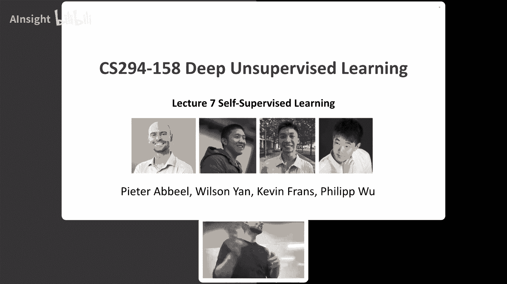

视频，打电话好吧，这是一个例子，我们是，借用伊恩·古德费罗 (Ian Goodfellow) 的，甘斯的发明者来自他的一位，教程，本质上是，良好的表达很重要，如果你，想要学习一个分类器。

蓝色圆圈和绿色三角形，在右边更容易，他们已经很好地分开了，在它们之间画一条线，而在，剩下你必须找到本质上，它们之间的圆圈是一个更，需要学习和定位的复杂事物，正确的是XY有什么区别，坐标与极坐标 um。

现在这是一个手工设计示例但是，这是为了展示这样一个概念：如果你，能以某种方式想出正确的，代表您自己或，通过学习它可以帮助你解决，问题更容易，之后嗯以深度学习的方式，这往往会起作用，因为在像素中。

如果您只处理像素，则将事物调平，具有适量的原始像素，处理你没有得到一个完整的，很多呃信息从中出来嗯什么，我们在这些网络中看到的是该层，他们开始逐层，我们已经看到的监督学习，但今天我们将讨论单元格。

尽早监督学习，可能是边缘检测器然后可能有，将其他形状的探测器圈起来并在，某些时候可能会有面部探测器，等等出现在这些里面，网络，本质上是什么，发生的事情就像，小单位最初得到，将它们组合成越来越大。

在一些国家得到认可的单位，内部更具有语义意义的方式，网络，如果您有，预先训练好的网络，有一个神经元，因为我不认识脸或，笑脸与悲伤脸的眼睛，闭上眼睛睁开所有的东西都是，已经在那里训练一些东西。

最重要的是然后识别是否，某人高兴或悲伤变得非常，很容易做到，所以请记住这一点，这就是共同点，今天的讲座嗯所以目标是，表征学习就是预训练，神经网络连接，确保我没有插错，目标是预训练网络，以便它可以。

进行微调以获得良好的性能，在有限的下游任务上，下游数据生成模型，可以实现这一目标，但今天我们要，看看不存在的替代品，涉及生成模型，好吧，我们在讲座前聊天，这里，呃，有人提出了 300 多个。

今天的幻灯片是的，这真是太棒了，一组幻灯片 很多幻灯片 嗯其中一张，关于李尔王的疯狂事和，感谢菲利普呃贡献你的，你的公平份额对销售来说令人惊叹，学习就是有这么多，不同的想法，嗯，另一件事，有点有趣的是。

想法往往非常务实，概念上往往不存在，大量的数学推导，与 VA 相关的有很多，推导得到我们需要得到的东西，一旦你开始思考，再一次，关于它还有很多数学知识，这些销售额增长的方法几乎。

就像一大堆技巧组合在一起，具有良好的深度学习专业知识和，突然之间你就会变得惊人，结果有时比其他更好，次嗯，因为你会看到万物之主，你知道的对她进行摄像的技巧，写了一些最重要的。

我们今天要讨论的论文他刚刚得到，其他人不知道的事情，可以工作，这非常有趣并且，我认为这是一个非常独特的事情，自我监督学习，我们会看到，讲座开始时的一些事情，人们尝试过但没有成功。

然后 5 年后 King 重新做了它，有效并且是最先进的，未来有趣的事情，这是联合国学习数据的版本，总体上提供监督，我们保留部分数据并且，真实网络中的任务是 任务是，来预测我们保留的数据。

数据拉出一些需要重新填充，嗯，这就是所有人的大局，今天的内容差不多，但是选择，正确的任务 正确的任务，要切片的数据或数据角度是，真正是什么让所有，区别 我想多给一点，这是来自Yan的主题演讲的动机。

laon 在 nurbs 给了我相信十二月，2015年或2016年12月所以嗯相当多，几年前，当时所有的兴奋，是强化学习 我还是一个，强化学习的忠实粉丝但是，那时每个人都兴奋不已，深度思维强化学习。

Alpha go um the T 的突破，游戏和 Bri 我们有机器人学习，突破，所以每个人都很兴奋，关于深度呃深度强化，学习，Y 想给人们一个，现实检验这并不是全部，强化学习他说你知道。

你需要数据 你的大部分数据都在，无监督或自我监督，这就是蛋糕的基础，那么你可以标记大数据，现在被称为的一点点，他监督聊天的微调阶段，基本上预测了聊天GPD，训练的顺序，然后是。

最后一步本质上是 RH CH，RL 是蛋糕上的樱桃，我们的数据量最少，让事情顺利进行很重要，你希望它们工作的方式，但它是，确实发生了所有的小事，最后的方式所以我认为很漂亮，有趣的是。

本质上是聊天 GBT，完全训练的方式，在此之前六七年预测，呃颜龙和他的，蛋糕很好，蛋糕的基础是，我们今天的重点是，有很多内容要介绍，嗯，让我们深入探讨一下，我猜，所以即使在深度学习真正出现之前。

成功其实已经有了，致力于自我监督学习 是，像你一样提问，[音乐]，提及 mod aut，和有什么区别，统一 有什么区别，生存和自我生存学习我会，说 unvis 学习是任何一种，学习你不做任何明确的事情。

您可能会努力进行数据注释，还是写一个下载脚本，下载了一堆数据，但你没有，坐在那里调整标签或，任何类似的无人监管的事情，现在在无人监督的情况下学习，学习我认为有两个，类别 一类是生成性的，模型。

另一类是自我，监督学习生成模型，你可以使用你训练的模型，重新生成数据，如训练数据，通常出售监督学习，这不是意图或可能的，所以，这是一个不同类别的模型，我们今天会介绍，但这就是我想要的，呃基本上勾勒出。

景观改变了人们的行为方式，辅助学习甚至早于深度学习，这么努力深度学习才刚刚开始，2012年与Alex net合作，甚至在那个人之前就突破了，事实上我们正在做 Sal vir 学习，人们不必深入。

学习工作且时间最长，人们认为这也许是唯一的方法，要让它发挥作用，就得靠自己做，学习嗯然后微调，后来人们就是这样，当时尝试过，并且在某些方面，许多人感到惊讶的是，alexnet 发现它完全。

监督没有进行预训练，没有什么只是完全监督得到的，工作完成了，当时给我很大的惊喜，大多数人至少我确信不会，杰夫 但对大多数人来说，有噪音的自动编码器，你有一个图像，在这种情况下，你给它添加了噪音，那就是。

第二但有一堆噪音，对该图像进行编码，然后对其进行解码并，希望你能找回原来的样子，图像可能会让您想起扩散，模型在其上添加噪音并尝试消除噪音，事实上当你看图片时，这样它本质上是相同的，嗯，但嗯。

我们走的时候请耐心等待，通过这个所以这是完成的方式，早在 2010 年，因为深度学习，其实渐变很难做，不会通过网络传播，那时，嗯，这些技巧还不存在，让谷物传播，所以事情，一次训练一层，所以你。

让你的图像用一个编码，你用一层解码，然后你，希望你恢复降噪版本，当你这样做了一段时间之后，训练编码器的第一层，和你的解码器的最后一层，然后你又开始这样做，那么什么样的噪音可能是，高斯噪声可能会掩盖噪声。

可能是椒盐噪声，意味着饱和到底部或顶部，激活是可能的，所以人们，尝试所有这些事情可能，提醒你发生很多事情，今天但这又回来了，2010 年，思考这个问题的方式是：你在你的数据上添加了噪音。

本质上是把你的数据从，流形以及什么是去噪自动，编码器正在学习是为了让你回来，到，歧管 嗯，这就是它的样子，就像本质上你有某种，失去你试图拥有你的，重建尽可能接近，回到你原来的，嗯，我们不要进入。

细节细节全部改变了，从那时起戏剧性地嗯然后你呃，反复堆叠即可获得深度，经过意大利分层训练的网络，层然后有一个表示，你可能知道需要多层，计算然后在最后添加，监督成本呃或通常称为。

这些天的损失和你训练的目的是什么，你关心的就是分类。

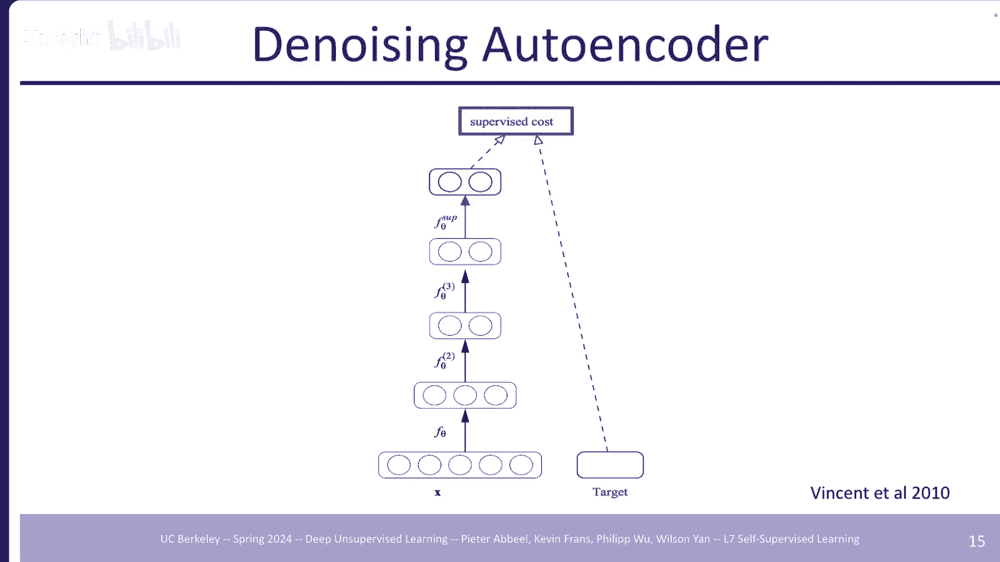

或者分割什么的，否则当然可能会让你想起，扩散模型实际上是，做同样的事情，嗯，你知道，构想至少是相同的事情，细节已经改变但你添加了噪音，对您的数据进行降噪，然后学习对其进行去噪，um 扩散模型是生成式的。

模型，我们可以从，完全嘈杂的图像并将其变成，呃图像看起来像真实的图像嗯，但扩散模型也是如此，可以预先训练，然后你可以，f 调整甚至零镜头注释，分割，所以想想扩散，模型也许是现代的化身。

这些 Den 噪音 汽车，编码器如何代替放置，你掩盖了上面的噪音，工作从伯克利开始，2016年嗯预测缺失的部分，想法是如果一个神经网络并且在，这次人们已经想出了如何，训练更深层次的网络，这样你就可以。

一个 GO 训练一个深度网络来解决，更复杂的任务让我们训练它，填写，现在空白，这不是一个确定性任务，但你有监督和你的，训练网络尝试匹配什么，在您的监督下，同时也有，一些概括。

能力，以便网络吸收，带有 MK 区域的图像有一个，编码器然后有一个解码器，填回呃空白，你就有了，相比之下的损失，两个嗯，你可以有不同的选择，就什么来消除大的，中间较小区域的区域，散开或者你可能会逃跑。

也许是某种片段或其他东西，其他你有的并且只是分割出来，整个片段，看看它是否可以学习，填补呃轻轻回来，在他们注意到的一件事中，重要的是同时使用，重建损失和对抗性，仅使用重建时的损失，正如你将看到的那样。

法律并非如此，正如您将在其中之一看到的那样，下一张幻灯片你填写的是，看起来很不顺利的东西，非常真实，如果你学得还不够，包括像甘斯那样的对抗性损失，你会得到一个更有趣的呃，填空行为和。

这里的符号本质上只是说，损失仅定义在，图像中您有过的区域，空白，其他部分没有损失，这张图片你不用担心什么，网络正在那里做，现在你可以，辩论你可能会说，对抗法应该针对你，从某种意义上知道作用于整个。

图像因为如果你填空并且，看起来很现实，但不匹配，那么空白之外的东西就很好，你在做什么你并没有真正明白，是的，但是在他们的工作中他们选择了，让对抗性损失集中于，空白与重建法，希望有助于确保它已被填满。

以兼容的方式而不仅仅是，在现实的，这就是他们的架构，看起来像是那种网络，那时你可以使用嗯，可能我的意思是国王让她重温一下这个，我们将用更现代的方式来讨论这个问题，架构嗯，但这就是以前的样子。

有点像第一个化身，如果你只使用你得到的 L2 损失，这个模糊填充在第二张图片中，如果你只使用对抗性损失，你会得到，非常现实的填空，但它并没有真正关注，到其他任何东西，但它看起来很现实。

对于空白呃如果你使用接头，训练损失然后填回，你会得到更接近的东西，你，想要嗯然后这里有一个比较，所以你预训练填空我，相信那是在嗯图片网上，这是一个更大的数据集，然后，他们查看图像网络上的分类。

这是大数据集，时间，然后他们看看检测和，在不同的数据集上进行分割，称为 Pascal，它要小得多，数据集，所以你在这里看到的是，imag net预训练帮助效果，Pascal um 上的检测和分割。

你可以看到嗯时间所以，填空很有竞争力，与其他嗯销售修改方法，不是顶部的旧方式，但相当，检测方面具有竞争力，同样，对于分割，它实际上是，最好的图像监督预训练，net 仍然更好，事实上那就是，一种趋势。

只有当人们，开始在非常大的数据集上进行训练，比图像网呃数据大得多，让你训练更多，呃，规模更大的你，开始从自我中获得真正的好处，修改，学习还好所以重点是你，预测你从另一个角度看你会走。

从原始数据到损坏的原始数据 Den，自动编码器有噪音并尝试恢复，原来的，你可以这样做，如果您有多个渠道又怎样？通道 假设 RGB 也许可以，清空一些通道而不是，区域并尝试重建其他区域，频道还有一个组。

实际上在伯克利，呃他们是，做了很多这方面的早期工作，空间，嗯，原始图像是彩色图像，它不是在 RGB 空间中转换的，而是在空间中转换的，La L 本质上就像格雷斯等级，image 和 AB 是颜色方面。

如果将它们组合起来，图像的，你一起找回原始图像，只是空间不同，RGB 所以他们说如果我们设置它会怎样，我们将所有图像转换为实验室图像，空间给网络输入了 L，引导并要​​求您预测 A 和，乙。

明确预测的通道，舞会和所有彩色图像，互联网上你可以下载并训练，对他们来说，这是一个很好的方式，当然，如果你的最后，分类任务关心颜色，你可能有点不走运，因为你没有得到那么多，有关颜色的信息。

在你的规模学习中学习，但你，实际上隐式地学到了很多，颜色，因为你学会了填充它，你会学到很多关于结构的知识，图像中的内容可以做到这一点，这就是它可以做的事情。

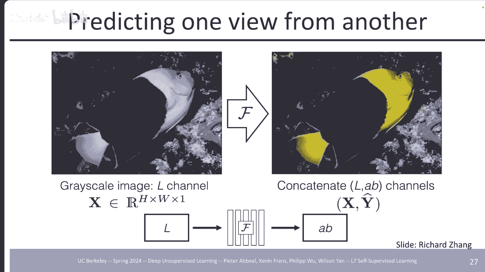

把东西填回嗯然后一件事，他们看着没关系，损失应该是什么，我们当时用的还不是那么呃，共同避免 L2 损失，因此 L2，关于重建的法律规定，往往会给你那些平均结果，无法对多模态分布进行建模，因此。

如果你的训练例子是这样的，确实存在多模态预测，可能需要覆盖，结果分布 L2 不合适，事实上，对于着色来说，它经常是，有多种可能的情况，汽车 该车可以是蓝色或绿色或，也许呃红色等等，仅此而已。

并不总是那么容易从，灰度图像汽车或汽车是什么颜色，鸟真的是这样你就可以得到一些东西，呃，棕色的鸟儿都出来了，时间，但如果你按像素进行，颜色返回时的分类含义，其中包含 256 个值。

每个香奈儿频道然后你就可以建模，多峰分布意味着，那么当你采样时你也可以得到呃，该多式联运的高峰之一，抽样分布而不是分布，介于呃之间的某个平均值，可能性，所以他们没有，他们做到了。

这个嗯你知道这是主要的之一，使用 you 在纸上观察，知道交叉熵离散损失，有效地而不是 L2 损失，有很大的不同嗯，然后他们用另一个增强了这个，他们说哦什么的版本，如果我们不分裂成 L 和 ab。

L 是输入，ab 是输出，如果我们分成 L 和 ab 会怎样？然后我们有两个网络处理它并且，他们每个人都必须找回那些东西，他们没有，然后我们添加它们，在一起，最后的损失在于如何，嗯，它重建了原来的。

某种意义上的图像，这就是所谓的，裂脑自动编码器嗯，这是，你会得到什么，你知道通行证，通过这种网络F1和F2，这里有火车网络吗？恢复相反的通道，然后，结合起来你就得到了预测图像，显然你必须回来一点。

有点小心，因为最简单，你所做的一切的解决方案就是做加法，最后就是通过一切，通过不尝试预测相反的情况，那里一定有额外的损失，为了防止呃，发生的事情可以与其他东西一起使用，在这里。

他们用深度通道做到了这一点，RGB 所以你有一个 RGBD 相机收集，从中获取数据，然后尝试进行交叉，模型，现在预测是我要做的事情之一，当时觉得很有趣，嗯，不同的小组 该小组表明，如果你进行颜色预测。

可能很难，也许在视频中你可以，问题的框架略有不同，你可以说嘿而不是预测，我要从无到有的颜色，我自己访问了第一帧，视频，然后我得到灰度，我是，应该预测所有的颜色，未来，现在你的姿势好多了。

我们知道多式联运的问题，分布更难，训练比单式你得到更多，更接近于单峰分布，案例确实是你正在做的事情就是你，必须在第一帧中查找，你在后面的帧中看到的所有内容是什么，它对应于，所以这是一种方法。

短语函授学习问题，有效地，它实际上效果非常非常好，看看这个就像汽车驶过一样，显然这辆车并不全是绿色的，但这突出显示的方式相同，他们没有那种颜色的爆发，人们，但这是为了突出一个，细分 您首先细分。

框住你想要跟踪的内容，然后它，显示它如何在整个过程中跟踪它，视频，这样你就可以得到一些非常好的嗯，学习追踪呃，现在反对可能有的论文，对视觉空间影响最大，至少在自我生存学习方面是最重要的，纸质汽车。

有趣的是，编码器也是如此，工作范围，但可能只是一些细节，我们得到了更多正确的东西，也许是时候尝试一下，嗯，在桅杆自动编码器中，输入是，一张图像的一堆区域被掩盖，然后编码器编码，非医疗区域补丁，然后。

从中你得到一个嵌入然后，解码器将缺失的部分填入空白，件，然后开始解码呃到，希望回到原来的样子，图像你看到我放在那里的大图，编码器大解码器小这是一个，设计选择 um 选择它的原因，这样就可以了。

你需要一个编码器，可以捕捉事物的起源，在图像中获得有趣的语义，表示，所以编码器是，实际上我们在这里关心的是，我们实际上并不关心解码器，之后你就会把它扔掉，编码器是你关心的东西，在这次培训中。

让我们花我们的时间，计算，还有另一件事正在发生，这是编码器只需要，处理一小部分补丁，那种超参数设置，往往很受欢迎，只有 25%，补丁仍占补丁的 75%，被掩盖，好的，所以编码器只处理一个。

数据量的四分之一，相比之下，解码器是另一件事，有趣的是，如果你想，有效地处理修补图像，嗯，传统上图像是用，转换起来非常复杂如果，约定以某种方式处理这些，修补了某些部分的图像，失踪等等更不用说像。

真的扔掉了 75% 甚至不做的人，对这些位置的任何计算，所以这也与变形金刚不谋而合，在计算机中变得越来越流行，愿景 架构使用愿景，变压器，所以变压器有一个，非常轻松的时光，基本上只有你。

知道有多少补丁通过，它只是做它没有问题处理，嗯，每个补丁都有一个位置，编码以便 Transformer 知道在哪里，它来自嗯，但如果有的话也没关系，正在错过它，只是你知道不会有，向失踪者发出的任何询问。

刚刚保存的补丁，计算嗯另一件事是，值得注意的是，在这种情况下，嗯，补丁只是线性的，投影输入 Transformer，架构非常简单，嗯，我认为这是一个非常自然的选择，因为你正在尝试做。

表征学习（如果有的话），在你基本上之前把它放在那里，强迫其他代表，学习或者你有一个前趋势的东西，你把它放在那里，所以就成功了，编码器最大程度地灵活，学习表征而不是你自己，强迫任何东西。

所以这很有趣是什么，看起来虽然正确，但 75% 是，蒙版看左上角，例如，这是一个时钟，但对于人类来说，很难看出这是一个，时钟嗯但是我已经受够了，训练可以恢复呃空白，修补并显示这确实是一个时钟。

顺便说一下，所有这些都一样，75% 的掩蔽是非常高的掩蔽，我认为没有人预料到的比率，这是正确的掩蔽量，直到它被证明是要做的事情，嗯看看我们之前报道过的论文，只是遮挡中间的一些区域，或某个地区。

其他地方很少，离得不远，75% 和 bir 语言的对应部分，已经存在了一段时间了，大约 25 30% 所以很自然，尝试和愿景是也做 25，30% 也许人们尝试过但结果并非如此，伟大的成果从未发表过。

但是，在这篇论文中，他们认为 75% 可能是，需要什么，确实嗯，它确实非常有用，好吧，当你掩盖得足够多时，人们对此的直觉是，如果你没有充分掩盖任务，可能太简单了，所以你可以，只需从补丁中复制内容即可。

没有被掩盖到被掩盖的补丁中，而你并没有真正学习，真实的代表，语义嗯，这是一些验证图像，你又看到了重建，在中间，呃，相当，好的，嗯这是对掩蔽比的研究，嗯，如果稍后你进行微调或稍后。

你在这两种情况下都进行线性探测，看起来就像你周围的掩蔽比，知道 75% 已经相当不错了，调整 我想你有更多的灵活性，嗯，因为我想你应该接受更多训练，l 稍后再用线性探测你，需要学习你的整个表征。

在细胞监督学习期间，你需要对牢房进行监督，学习做得更好是，在某处提问，是啊是啊怎么这么简单，可能比以前好得多，之前有，嗯，有时人们只是忽略了，正确的事情，有时是正确的，是时候做某事了，两者的结合。

所以这是在异象之后发生的，变形金刚问世了，这是第一个，论文显示 Transformer，如果你有足够大的架构，他们可能需要更多的训练数据，训练但你有足够大的，他们可以做的训练集，组件好吧，现在有两个。

变形金刚的各个方面是，非常灵活，因此使用，变压器架构在这里但直到，那么不一定是预期的，可行的愿景似乎是，如此重要的优先地点等等，所以尝试是充满信心的，过去的事情并没有那么顺利，另一件事是当你尝试使用。

相信这实际上很难，让这个工作成功，因为这意味着什么，掩盖你正在放置的东西，那里是空白的，但你的卷积仍然存在，跑过它，所以你仍然，处理你刚刚处理的那些区域，在那里处理零，所以很友善，你有点摆脱。

分布行为 Uh 而具有，你无法摆脱的变压器，你所拥有的分布行为，您可以查询许多其他内容，就是这样，它变得正常化，你的输入和一切都正常，不管你的大小，图像或有多少个补丁，自信地掩盖你的掩盖方式。

所有这些东西都会影响以后，不屏蔽时的微调，现在发生了什么所以就像，不匹配 基本不匹配 罚款，调整，我认为人们也只是，从来没想过这么大的掩蔽，比率是要做的事情，就是这样，非常令人惊讶，因为就是这样。

很多时候你必须掩盖，这就是魔鬼的一部分，详细信息可能有人尝试过，视觉 Transformer 都尝试过，的东西，但没有掩盖那么多，掩蔽给出了正确的感应偏置，学习语义还可以让你，扩大培训规模，因为你。

屏蔽掉，75% 你可以有效地训练一些东西，四倍四倍大，因为你只，为每个人做四分之一的工作，你进入的数据点，所以你，可以训练更大的编码器 训练它们，数据量比某人多四倍，谁不掩饰太多所以是的我的意思是。

有趣的是这些东西是如何，玩，我当时会说给一个，更多背景信息，菲利普会说话，关于那项工作，嗯，赌注，人们正在制作或最喜欢，常用的自我方法，计算机视觉中的监督学习，不是基于掩蔽，而是。

基于一种叫做对比的东西，学习非常不同的工作，并且在这方面取得了很大进展，这行工作有很多有趣的地方，仍然非常相关的想法，但是，由于某种原因人们已经停止尝试，直接掩盖并填充事物，它是黑色的，有趣的是也来了。

发表了一篇主要论文，对比学习前面所以他涵盖了，都是他的工作，但我认为，其实有时候你就是这样的，知道你正在做你正在做的事情，边境，你开始意识到也许，还缺少一些东西，当其他人仍然兴奋的时候。

关于这一行的工作并思考，那就是他们应该去的地方，已经认为实际上存在，你接下来应该做什么吗？应该搬到，这是理想的，如果，这就是你可以做的，与之前的状态进行比较，最先进的持续击败它将，涵盖其中一些作品。

但没有一个，这些有前有这种格式，填空的那个，所以它是，实际上很漂亮，但就像，在某种意义上就像Mee的尝试，有一些细节错误，因此，效果不太好，但就是这样，以前发生过，这是一个步骤，在某些方面是正确的方向。

感觉所以有很多我的表兄弟姐妹，衍生品，其中大部分是，衍生品，这也是公认的，他们的名字都有 Mae 或 AE，在呃他们的名字和给予的末尾，事实上，归功于马的论文，发生在 Mee 之前，但我没有报道。

之前因为我是最，今天很重要，但是现在我也会，告诉你这句话做了什么，我们为什么不做鸟类预训练，图像变形金刚也是如此，变形金刚也填补了空白嗯，他们做了什么不同的事情所以他们嗯，预训练了一个，分词器。

然后有效地，标记化空间中的 um 掩码，意思就是，嗯，你在这本书中没有学到其中的一部分，流程部分已经过预训练，与一个离散的 vae 可能是，你想要或不想要的东西，但你，有点无法访问那个。

预先训练了另一件事，他们的设置中发生的是他们嗯，没有掩盖那么多，所以那就是，他们做了不同的另一个设置，他们没有，嗯他们没有把桅杆拆掉，他们还处理了蒙版的补丁，出补丁所以这些是一些，两篇论文之间的差异和。

再次回答你的问题你知道在哪里，它是来自它现在的工作方式吗？就是这些细节 我的意思是，本质上是离我最近的，至少在，事情过去的历史，开发的视频是我直接构建的，我说好吧为什么不这样做，同样的事情，视频 嗯。

有几件事需要考虑，他们称他们提出了这个概念，两管掩蔽 嗯什么是管掩蔽，这意味着通常当你有一个，视频如果在某个区域，框架现在可能有一些东西，也出现在下一帧中，这样你，应该掩盖特定的位置。

你掩盖了一切的区域或者也许，如果你有时掩盖的话，没什么CU，这个位置然后那个位置你可以，只需从前一帧复制到，下一帧填充该区域并且，任务变得太简单了所以就是这样，他们称之为管掩蔽，确保你。

无法进行简单的复制，从第一帧到第二帧等等，否则本质上是 Mae um High，掩蔽比比我还高90到，95% 的原因是因为视频更重要，比图像冗余，所以你需要，掩盖更多以防止事情发生。

任务不再变得太简单非常，即使在很小的情况下也能得到令人印象深刻的结果呃，这是预训练的数据集，实际上即使它们预先打开，3，000 个视频的数据相对较小，获得良好的表征学习一，他们的观察结果是数据质量。

比数据量更重要，这次预训练和主要转变，预训练和目标数据之间，套装是一个重要因素，所以给我视频，带有香草 vit Vision Transformer，骨干动力学可达87。4%。

400 um 这些数字在摘要中，也许对你来说没有多大意义，但本质上这些都很好，在这些数据集上的表现，如果，您正在研究视频生成或，与视频相关的东西这些是数据，你可能想看看 Kinetics 400。

101 的 V2 UCF 的东西和，hmdb 51 呃，它们很值得查找，如果您正在这个空间或计划中工作，在这里工作 是的 是什么意思，这里的数据质量所以嗯我想什么，他们的意思是，嗯，他们想要嗯。

更高质量的视频我不知道是什么，否则他们尝试过我不记得是什么类型的，他们可能尝试过的其他数据集，质量不太好的地方，这是个好问题，我们得走了，回头看看，论文所以这是他们的结果，不同尺寸的视觉变形金刚。

事实证明你知道这些，他们在这里考虑的基准，往往做得非常非常好，他们有，不使用外部数据，而许多，之前学习的其他内容，从视频中表示，然后找到，tun on 其他东西已经添加，在其他数据集上进行预训练 是的。

问题，诸如扩散模型之类的东西，以及你从 2010 年开始展示的东西，早些时候它实际上就像你的噪音，所有的数据然后你试图，推断原始图像，看起来一点也不像的东西，图像然后这里几乎就像，当你掩盖事物时的插值。

你只是想填空但是，看来外推法更好，学习的方式，因为他们几乎被掩盖了，一切都需要学习，所以就像是，最好删除尽可能多的，尽可能的初始信息，因为，现在就像扩散模型一样，据我所知最好，基本上通过删除所有内容。

迭代噪声过程也是如此，这就是为什么这种极端的掩蔽是，更好所以问题本质上是，掩蔽应该有多极端以及，添加多少噪声以及什么是，这些论文中的权衡，发现你需要屏蔽掉，很多嗯我认为你本质上是面具，尽可能多地出去。

仍然可以想出某种，我认为解决你的问题，如果你掩盖太多，挑战是，解决方案可能会变成，多模态和多模态分布，建模比较困难，所以你可能，想要尽可能地掩盖，同时以某种方式拥有单峰，所填内容的分布。

应该是现在 那到底是什么，就掩蔽量而言，我的意思是，认为你只要知道做某事就可以做到，超参数搜索，如果您比较，扩散模型它们可以来自所有，从全噪声回到真实图像，但如果你把噪音调到最大，他们就不会。

像我们一样回到原来的形象，在原始示例中看到，扩散纸你可以去，扩散步骤，你将无法恢复，您可以查看的原始图像，500，你仍然可以恢复，原始图像现在对我们来说，500步后的噪音图像很漂亮。

仍然很难辨别发生了什么，但我想对于计算机来说它仍然是，更清晰呃CU不那么分心，所有的小噪音泡菜都是我的，预感嗯，但我也想说的是，你的另一个问题是，扩散模型比这些更好，扩散模型最适合，现在的一代我不认为。

他们必然总是最适合，表征学习我想了很多，今天的表征学习是，仍然完成大规模自动编码器，为了，愿景谢谢，动力学实验 400 um so，他们通常在这个视频中说，本质上你需要认识到。

活性所以动力学 400 意味着，有 400 种不同的活动，当您进行微调或，您需要学习的线性探测，预测正在发生的活动，在这个特殊的，视频所以 V 非常好，嗯，这里是，又一个想法 我想了很多。

今天我们报道的呃报纸，想法很聪明，但数学，不必那么深，这就是为什么，我们可以涵盖很多论文，但通常，在深度学习中这就是胜利，策略你的数学越复杂，变得几乎就像几乎，保证你的实验不会，如果不按比例缩放。

也可以按比例缩放，那么你的结果就不会那么好，所以保持事物的相对性是有好处的，简单但你想利用一些，回想一下，直觉是正确的，嗯，正确的着色，我们得到了，第一帧，然后是灰度，未来的帧和你的颜色回来。

能够参考第一帧，我们得到了一个自动分段器，它实际上是 C Mae 中的跟踪器，本质上的架构，重新审视完全相同的想法，但，5年后的工具使用，愿景 Transformer 使用 Mae 思想。

结果变得更好了，所以在这里你，有视频您将获得初始，您将使用框架并保留代码，你所采取的一切都构成了你的未来，掩盖几乎所有事情和任务，就是把它填回来，现在在视频中我们不想，这样做我们说过我们可以复制。

事情过去太容易了，我们却不是，将学习正确的表示，但这取决于你想做什么，我们正在尝试学习视频 M 中要做的事情，语义表示可能是，狗跳或者狗可能躺在地上，沙发有不同的语义，但是，这里的目标是学习跟踪。

所以这是一个非常不同的部分，训练的目标和，当你想学习追踪你想要的，学会与人通信，上一张图片并了解在哪里，事情最终出现在下一张图片中，所以，思考这个问题的方式就是这样，作者解释说我真的很喜欢。

解释是你得到的几个补丁，to see 本质上是告诉你如何，移动的事物给你一种全球感，事物是如何变化的，现在是你的 NE 网络，由此需要能够填写，其他一切都会移动的地方，使其一致并能够。

这样做使它能够做好事，在那一秒跟踪 95% 的掩蔽，框架嗯我会表演最先进的，视频对象的自监督方法，分段 keyo 传播和，语义部分传播所以这些是，全分段传播传播。

与视频中不同的任务，是关于，分类所以这就是它的样子，喜欢但实际上确实有一些，我想展示的很酷的视频，这在，行动所以这就是结果，就跟踪能力而言，你基本上在第一个注释，框出您想要跟踪的内容，然后或。

您想要跟踪的人，然后来自，在那里它会自动跟踪，在整个，这是另一个视频，嗯，你在哪里，应该跟踪。

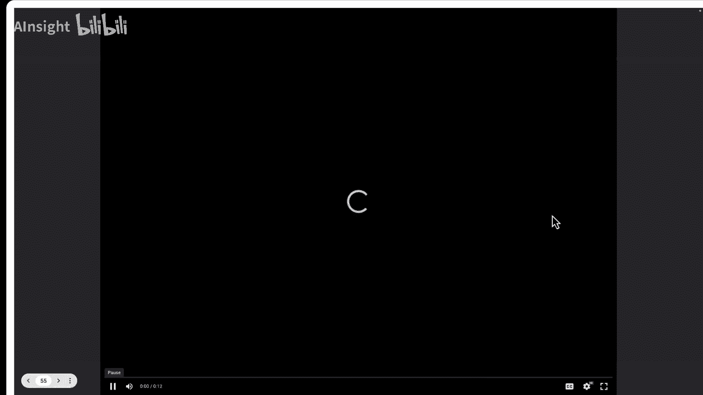

本质上是骨架，解释了我猜的姿势，人又可以让你知道，学会做，你最先进的表演嗯，感谢这种，预训练和。

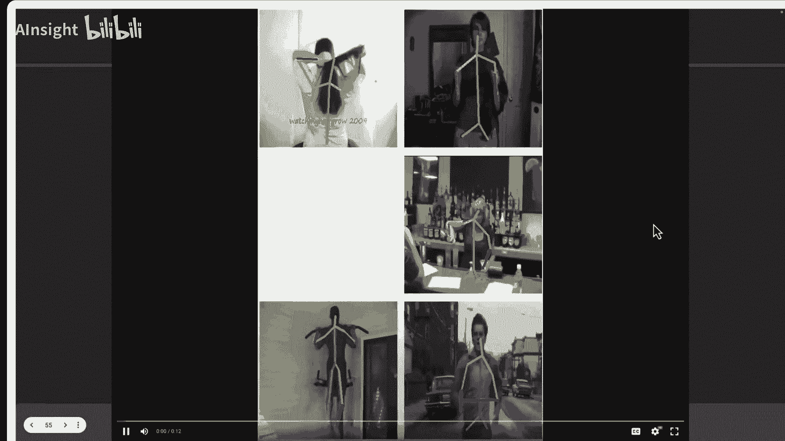

那么应该是一个，更多这里是零件跟踪所以，是一个，嗯，你实际上已经分手了，比如说头发、脸、T恤等等，它可以跟踪组件或，整个过程中那个人的部分是，所以当你说你，像你一样注释第一张图片。

就像字面上画它的一部分，不同的颜色我不知道它们是什么，这是一个很好的问题，他们注释了我能看到的第一张图片，看到这种情况以两种方式发生，一种是如果，你关心特定的事情，你自己也许你所做的就是跑步。

图像上的标准分割器以及，然后你点击你想要的区域，说这些是区域，也许构成我关心的对象，它已经将其作为一个单独的对象，也许不是，也许你需要合并一些，或者分割一些东西或者你可以，原理只是分割初始场景。

自动然后让它跟踪，随着时间的推移，所有的部分都不是这样的，他们在这里这样做也许是因为这很难，看看发生了什么，因为那里，可能有很多小部分在做，难以理解的事情，所以这里的例子他们重点关注。

就像视频中的主要主题一样，是的，我不知道他们是否手动，选择了细分市场或者他们是否有，某种其他系统说像抢，然后以任何方式追踪该人，是合理的，然后尽可能，生产所有这些未来的框架，他们本质上喜欢拿第一个，帧。

然后采取下一帧，不分段然后将其屏蔽掉，预测它与，这是一个好问题，我应该看看，再次详细说明呃回答这个问题，问题，但我认为有两个，这里的选项或者你记得是的，是的，他们基本上接受了他们，对第一帧进行编码。

提取出那些，特征，然后他们以此为条件，帧，然后使用编码器，提取出对应的特征，他们试图将功能与，原始框架，因此它们仅适用于每个，他们只是一帧一帧地做，一对明智的匹配，然后他们，投射回来，变成谢谢你，菲莉。

是的，你有问题吗？有一个场景，而不是视频，你有几张图片，取相同的，实例来回你需要吗？能够工作或者因为，图像数量无法接近，就可用框架而言，您可以，做，你在训练方面的意思是一样的，所以是的。

我的意思是训练这个，你要做的，这里训练的假设是，您有一个有意义的视频，连续意义，如果你有削减，您想要的视频中间，本质上是整理你的数据集，当有一个切口并且你去，不同的场景，那就变成了。

你的你的独立部分你知道，您的训练集中没有新项目，想要跨越这些过渡，因为，你将无法着色，我想在这种情况下或在这种情况下填充，在空白中呃跨越那些切口所有，很容易嗯，但这一切都取决于也许，对于某些剪辑。

你仍然可以这样做，但是，如果是完全不同的剪辑，那么你可能没有机会，所以在某种意义上是的，我的意思是它是值得的，我想值得强调的是，即使，尽管我们称之为自我监督，无监督学习有一定的，数据管理量仍然。

现在正在发生，其中一些可以编写脚本，你可能会说嘿，如果我的下一帧，这和以前有很大不同吗，框架我以为有一个切口，我是，要把它分开，所以有，也许可以编写脚本，但是有，某种工作涉及确保，你知道你的训练数据是。

表现良好，你在这里所做的假设是，训练这只是，突出最先进的，这些跟踪所获得的性能，任务所以因为这是，嗯视频对象分割人类帖子，传播和语义部分，传播和这项工作是状态，艺术遍及所有，那么你如何才能做同样的事情。

您编码的不同模态音频，将您的音频转换为频谱图，本质上意味着您将 Windows 纳入其中，时间并进行 frea 变换，该窗口并查看中的数据，频域呃，区间 um 仅拟合非 mas。

通过编码器层的令牌所以只是，就像梅呃解码器和我一样你，重新排序以确保物品在，正确的地方填空 um local，解码器中的窗口注意这是，有点不同，他们有一个解码器，这更适合音频数据，显然还有更多，地点呃。

这很重要，但又无关紧要，解码器上有额外的工作，寻找掩蔽较低的编码器，目标数据集的比率，可能是为了获得更多的分销呃，当你做你的下游时，任务然后嗯显然设置了新的，六个音频的性能状态和，语音分类任务输出。

执行其他最近使用的模型，外部监督预训练，在我纸出来之后就像，这一系列作品的问世，建立新的艺术水平，selfis 预训练，甚至任何类型的，预训练这是架构，你把你的音频信号变成，频谱图你删除了大部分补丁呃。

做一个编码器解码器，嗯，那就是，埃森妈，它看起来很像我，因为象形图看起来像，图片，这些是一些数字，他们实现了我不是某方面的专家，我很难提供很多详细信息，这些数字很常见，但我认为，这里重要的一点是，实现。

ma 的最先进和美丽之处在于，当然这是最简单的之一，想法只是填补空白呃所以，很高兴看到最简单的事情做，所以，好吧，所以它在这里做了什么，说你知道为什么为什么只有你知道一个，模态为什么不是多种模态和。

你可以戴不同类型的面具，不同方式的比率或，不同比例的组合和，然后你就可以学习填写其他的，模态嗯可能一如既往地有 RGB，那么你就有深度也许有语义，他们使用语义分割作为其中之一，他们的输入通道不。

真的有这样的感觉，自我监督，但他们的看法是，基本上有很多漂亮的，不错的分割算法 um run，那些，与此结合，嗯，这并没有被训练去做，它被训练做的分割，表征学习等，也将分割作为，培训有效地使其发挥作用。

更难弄清楚一些，那些事情，嗯，它有助于他们，实验然后在测试时你，原则上可以将其用作，分段器 当然，分段器会，仅与您预先标记的一样好，分割那里的数据但是你的，表征学习呃可能是呃，非常好。

然后你就可以找到调音，更多细分数据，如果您，希望 um 编码器只处理，非大众代币是共同主题，呃浅解码器呃伪标签，非RGB，模态嗯图像网上的评价，1K 嗯我真的不知道其他数据，也设置，嗯语义分割数据集和。

显然做得相当，这里还有更多实验，所以这些是，跨模型预测 RGB 输入，语义深度预测，预测你从深度到，其他两个或其他两个的语义，嗯，从某种意义上说，这有点，在这种情况下生成模型，因为它。

可以从中重建其他模式，原本的，输入这是我们所做的工作，伯克利当时没有，真的什么都没有，现在是，一年半前还没有什么，嗯特别擅长多式联运，文本和图像之间的学习 um，有一种像剪辑一样的学习。

本质上是对比学习，菲利普会报道嗯但没有，梅风格的东西实际上可能，是 是，更好，所以占主导地位的多式联运，演示学习范式，时间是对比的，学习交叉模型的缺点，对比的是它只适用于。

配对数据 您的所有数据都必须配对，否则它并没有真正做出贡献，到培训 嗯 这个案例 嗯，我们发现多模式预训练，m3a 嗯关于这个隐藏字幕数据集，达到呃明显更高，1K 线性图像的性能，分类基准比较。

仅对图像进行预训练，因此有，关于多方面的一些有帮助的事情，提取更好的表示，图像并不太出乎意料，因为，显然有这样的语义，信息应该告诉你一些事情，关于不只是存在的图像，如果你只进行图像训练，但它是。

很高兴看到它证实了嗯性能，即使应用高面膜比率也是最好的，关于语言有点令人惊讶，语言上的当时，每个人都使用 30% 的鸟类掩蔽，在这种情况下 75% 似乎更好，选择也许是因为有一个，图像中的免费信息。

呃事实上有时甚至低于 30%，在呃鸟模型编码器图像上，补丁和语言标记 愿景，Transformer解码器也很，轻量级以下所有梅呃我，猜测学到了，课程呃你输入图像pafi它，只输入不存在的补丁。

屏蔽掉你输入的文字你也，编码器所做的空白，然后是大量的工作和解码器，应该重建呃这对或，有时只是图像只是文本如果，这就是你，请稍等一下进行比较，与 Mee um 的微调比较，准确度绝对比仅仅好。

这是一个纯粹的视觉任务，嗯，线性的，准确性更好地表明，学到的底层表示是，比底层的 Mee 好很多，学习了表征，但如果，网络很大我想如果你能调整一下，以及一切你仍然可以变得漂亮的东西，接近于。

这是我在这个类别中的最后一个，想要强调的是multiv视图，Mast World 模型这里的想法是要做的，相同，但现在有了多个摄像头，看着同样的，想象一下相机的场景，从不同角度填写，其他观点的空白需要。

相当深的语义和几何，菲利普将了解现场情况，多谈谈那个人，因为他是，涵盖了一堆作品，本质上是在上下文中思考这一点，基于视觉的机器人，控制让我们看看有一个问题，在前面，是的，我们是两侧。

在这里查看 Ping um 的文字，MH 你也嗯，您是否确保屏蔽掉的文本，你必须确保他们是，与来自的相同，图像，因此在这种情况下这些图像是配对的，所以这是一个配对的图像和文本那又怎样。

我没有掩盖的图像部分，我是否确保我的文字至少，描述了，嗯，没有机制可以确保，我想你可以完全重建，只有一个超参数多少，你修补了所以是的相当高，掩蔽比让您仍然，恢复得很好所以那就是，这就是超参数的所在。

是随机出现的，因为，如果只是关闭并且他们没有的话也会，确实如此，信息丰富，面具上的随机，文本是随机的，是的，好吧，那么让我们切换到，完全不同的类别，所以 Mee 风格，作品是一件事填空或。

填写其他频道呃还是我，意味着它是最受欢迎的之一，今天购买，它不是那么旧了，嗯，它仍然是最重要的之一，热门购买，今天人们还有其他的Tas，想出了嗯，我想强调它们，即使它们可能不那么受欢迎，今天有趣的是。

看到他们实际上给出了很好的，好的结果嗯相对补丁，预测拼图旋转我会，简短地解释一下，嗯，但也许，这里要考虑的大局是，在梅之前的时候，感觉是，重建图像作为一种方式，进行表征学习，愿景没有实现，所以我们需要。

想其他的办法，表征学习，这些是，人们提出的一些事情，在这样的背景下呃，预测嗯在这里你应该，预测相对位置，第二个补丁尊重第一个所以，看左边你会看到一个鼻子，你看到右边有一只猫的眼睛，猫的耳朵可能是什么。

可能就像进入的耳朵，图像的右上角，如果鼻子和，眼睛在中间 比如说，因为我们了解关于猫的事情，如果您从未见过猫或任何其他动物，那就对了，任何你可能不会成为的动物，能够预测 iict 等等。

本质上我们想做的是，迫使视觉模型理解，视觉世界以一种可以的方式，正确地重新定位事物的一部分，这里的美妙之处在于你所需要的只是，你只需要一个分类器，将补丁分类到嗯，比方说一个，九个地点，因此作为。

古斯特当时的说法是，难以计算 难以重建，整个图像也许只是不均匀，有必要什么是更便宜的输出我可以，在 9way 上生成分类，便宜得多的分类让，我训练并自我学习，能够抵御这种损失，如果，你看看这些并不完美。

位置正确，但它们并不完美，就像一组等间隔的位置，这就是 CAS 的原因，他们也是，实际上并不相邻，所以这些，如果你真的做到了，事情就很重要，邻居你可以看看，纹理非常局部，看看它在哪里。

匹配然后那就是他们的地方，彼此之间是相对的，但你没有，希望这是您想要的解决方案，语义理解是，问题的解决方案和同样的事情，你可能会说哦，你知道也许如果，你总是在右上角，也许有一些关于存在的模式。

右上角没那么多，关于这里事物的语义等等，边缘是否有伪影，图像或其他你不想要的东西，必然一直处于边缘，因为这可能会泄露嗯在哪里，你在，图像所以 CNN 处理这个就是，当时最先进的技术是什么。

输出我猜八个可能的位置，因为中心是给定的并且，你应该对其他人进行分类，到嗯他们可能在的地方呃我们，是对的，它是右上角，图像嗯谈论包括间隙抖动，补丁位置，事实上，右边的东西正在说明，抖动颜色。

使颜色局部变化，模式可能有一定的原因，照明等可能有，某些你不想要的模式，有话要说哦我要付钱，注意细节的色彩图案，要知道这些实际上是，就在你想要的附近，在这种情况下有信心理解，图像中内容的语义。

所以添加随机扰动使，确保解决方案不是太简单，在本地，纹理嗯从那里你可以去，解决拼图游戏，嗯，你有九个，基本上你知道你可以，以九种阶乘方式排列它们，这不是一个小数字，但它不是，一个超级大的数字，我不知道。

大概大约是 th000 10，000，分类器上的输出或其他内容，对于所有可能的九个阶乘 um，呃配置，所以嗯，这就是，在这里再次输出，确保它们是，实际上并不相邻并且做，正确的抖动嗯，所以实际上。

他们要去 64 不知道怎么去，只是 64 嗯，我们得看看那是怎么回事，哦，不，它只是决定它在它的里面，排列 64 um 但一切皆有可能，允许排列它表明，排列 64 是它决定的排列，正确的输出。

然后实际上有人提出了，这件事你所要做的就是预测，现在的旋转，图片图片是拍摄下载的哦，问题全部完成后完成，但我很好奇这些效果如何，技术转移到更少的对象，centri 数据集所以在很多，物体很像的例子。

图像的焦点清晰，但更多，杂乱的图像首先执行，陈述转移是吗，可以学习同样好的，less qu 下的表示就是，这是一个很好的问题，程度是n作为a的成功程度，购买与数据类型相关，你知道摄影数据集中在。

特定项目或主题，而，机器人环游世界并不，有相同类型的视觉数据出现，这是一个很好的问题，嗯，这绝对是这样的，嗯，很多事情都不能概括，对于不遵循的数据来说很好，摄影模式嗯现在就是这样。

当他们接受这样的训练时，然后对其他没有的数据进行测试，真正评估这些方法，所以我不，知道是否有这样的人，我的意思是某人，必须根据以下规定收集数据，您当时拥有的其他发行版，重新运行该方法并查看是否仍然如此。

一个好方法或不是我不知道，嗯，如果有人真的这么做了，但我，你知道alos fos曾经有过这个吗，漂亮的幻灯片，他将在其中使用它，就像以对象为中心的数据一样，本质上是数据集，然后使用，训练有素的分类器。

YouTube 数据，它就像是，不善于分类，在，那些，所以这里的想法是我们想要，强制对事物进行语义理解，在图像中，但我们不想标记，图像，所以如果我们有它预测，四种可能的轮换中哪一种是，应用了应该明白。

从语义上讲图像中的内容是因为，然后它理解自然的方式，在这种情况下，鸟是，现在定位你认为这是吗，你认为比拼图游戏更好吗，它比着色等等更好，事实证明很难知道，这是所有这些技巧中最好的，这是效果最好的一个。

这绝对与人们如何，拍照尤其是这张，因为你知道你的定位方式，相机确定这是否是，旋转或不正确嗯但是然后，调查如果你有更多怎么办，可能的轮换 看起来也许，它可以做得更好，更努力，分类问题证明。

并没有真正的帮助，也许像这些，非 90° 旋转有点奇怪，并创造一种不同的，设置嗯，这样你就可以看到这里，嗯，这是打开的，你基本上知道趋势之前呃我，认为这可能是 alexnet 或，与此旋转类似的架构。

预测，然后使用 con 4 或，con 五层然后呃呃做线性，Image Net 上的分类，你嗯，通过轮换网络做到最好，比我们见过的任何其他人都好，这里并不比后来的梅好，但是，任何其他呃技巧呃我们。

看到了，但当时实际上是即时消息，使用标签呃甚至有效，更好，嗯，如果你使用，不同的 com 层所以数一是，最早的层效果不太好，显然它没有语义a，表示为第四层和。

5 然后在 Pascal 上进行测试进行检测，分割，嗯也在这里实现了最先进的，我们反对所有这些其他人，谈到着色拼图分割，大脑嗯，颜色，嗯所有这些都是由执行的，旋转，但再次所有这些，然后又被桅杆汽车超越。

从那时起编码器的性能也优于，眼睛清晰 s 不是我清晰 Sim 清晰 Moco，呃，菲利普将报道哪个，之后，好吧，我们早点休息吧，今天我们将在 25 点重新开始，一个小时，我们会看看其他的呃。

非常有趣的细胞监督，学习，方法，嗯，好吧，所以涵盖了很多种类，方法，但现在我们将讨论另一个，人们非常流行的方法，用于呃自我监督，学习，称为对比学习，这是第一次成功，本文提出的工作范围，本文表示学习。

对比预测编码这是，在 DeepMind 完成，2018 年以及他们的想法，这里嗯以及那种设置，他们正在接近这里是音频所以，这就是下面所看到的，我们这里有一些，音频 C 的背景和一些未来，该音频的一部分。

X 和嗯我们之前见过的，重建类型的目标是，我们可能想尝试从 C 预测 X，但在这种对比的方法中，我们实际上并不直接预测，X 相反，我们要做的是我们会尝试，预测，的一些 um 表示。

X 以及它们的配方类型，动机是我们想要尝试最大化，之间的相互信息，上下文以及我们正在尝试的内容，预测未来，所以实际情况是这样的，我们可以尝试有效地审视我们的，语境，嗯然后尝试。

将 C 与向量 Z 匹配我们的未来，具有许多其他潜力的向量 Z，Z 的候选人，你可以想象，这些未来的候选人 Z 是，来自各种其他音频块，不同的音频序列或嗯，不同的呃音频块，相同的顺序，目标是我们。

希望我们的上下文 SE 能够匹配，与中匹配的那个密切相关，当前序列，我们称之为，一个积极的例子，而那些，来自不同的序列或序列，那些离我们关心的地方很远的地方，关于那些将被称为负面。

例子以及我们可以比较的方式，也就是说我们使用某种距离，度量和距离度量，本文使用的是双线性 DOT，产品本质上只是一个，常规点积，但我们有这个，额外重量，矩阵可以为您提供更多信息，富有表现力的嗯。

表现力嗯，这个损失将是，非常重要，嗯，这就是所谓的“他们”，称之为信息或噪音，对比性的，估计，这会出现，整个呃这个剩下的，的部分，推介会，嗯，这就是他们的，建筑看起来就像他们来的那样。

所以他们有一些音频编码器，G 他们正在编码该音频并且，然后他们有这个呃格鲁，这是，处理这些特征来创建，这些上下文向量 C 就是，本质上是聚合上下文，这，然后他们会执行来自该上下文的音频 C。

各种不同的预测，在这种情况下，时间块是，预测仅领先一步，步骤的方法，嗯，是的，这只是信息，我们刚才谈到的损失，那么嗯你可以尝试直接最大化，这个然后分母是多少，他们是从不同的地方获取音频块吗。

来自不同的音频波形，他们在同一个迷你中进行了采样，批次等你有效的，在这种情况下，如果你去的话，回到这里你在，采取嗯是的你正在采取你的，上下文 C 并且您正在尝试分类，它对抗一堆不同的，潜在的例子。

所以它必须，学习可预测的特征，音频的未来部分并帮助它，与嗯其他的区别，类似不相关的部分，音频，所以这是一种可视化，执行此操作后会发生什么，使用此信息进行预训练的类型，左边的目标是。

可视化他们采取了10种不同的，音频块然后对其进行编码，和他们的，编码器 um G 在这里然后他们，看看泰伊，可视化嗯所有的，音频的颜色相同，扬声器，所以你可以看到，模型已经能够学习，可以聚类的表示。

一起，该波形的不同块，同一个扬声器，有效地所以这的另一个方面，预测任务是否高度依赖于，您选择的种类以及数量，你试图提前预测你可以，想象一下如果你也尝试预测，遥远的未来，嗯，这可能是。

实际完成的任务非常困难，这就是这里所代表的嗯，x 轴是未来的时间量，您尝试预测的步骤和，y 轴代表您的健康状况，能够预测所以如果你想的话，嗯之后立即预测你可以，essenti 更容易学习。

因为相关性非常高，当前音频块与，下一个嗯，但这很难做到，如果它更进一步，未来嗯所以这就是这样的，他们实际上完成的演讲任务，测试呃左边是一些假的，分类，嗯他们也做了一些，您所在位置的扬声器分类。

试图对哪个说话者进行分类，对应于哪个，音频，您可以在其中看到 CPC，音素分类效果更好，比这些 um 这个 mfcc 功能是我，认为一些手工设计的特点是，它越来越接近受监督的状态，至少在说话人分类中。

它也已经非常接近做，纯监督，学习对不起他们学习的方式，CPC 特征的分类器是，他们采用了《冰雪奇缘》的特色，在此之上学习了 Ling 分类器，这些功能而主管，你端到端地训练一个网络，任务。

这又是一种常见的方式，就像我们在 Mee 中所做的线性，probank 测试，我们将参加，冻结特征，然后呃粘住，你专心致志，然后尝试学习，来自那些学习的分类器，CPC 的优点是。

你实际上可以将这个想法应用到，完全不同的一堆不同的，域，这也是一部分，中国共产党的最初动力是我们，想要或者他们想要，可以学习的自我监督方法，跨越一堆的代表，不同的方式，你可以想象。

这个上下文试图预测一些，未来的特色任务非常，一般，这就是他们的结局，制定它的目的，图像，以便他们从，图像嗯，在这种情况下，他们做了 50%，重叠与我们看到的不同，M 呃他们通过它提取特征。

将这些补丁中的每一个传递给，重置然后他们尝试预测，特征是，在图像中那个补丁下面，所以在这种情况下，这就是我们的上下文，我们正在尝试预测以下特征，是二三四行，下面呃所以视觉上看起来，像这样的原始图像。

我们用 50% 的重叠来修补它，补丁看起来像，这，嗯，通过这样做，我们，当时可以，这又回到了，2018 年，如果你还记得 Peter 的时候，说到我，我们大概是 70%，在这里，呃。

以 1% 图像网计算，准确性，但就回到过去而言，2018 年，这就是现状，VR，他们也有一个人呃，这是针对前 5% 的人，他们正在关注这里的准确性，一些图像网络特征嗯他们，呃通过网络传递一些图像。

看看这些功能，然后，将其与功能进行比较或进行比较，修补，跨越不同图像的补丁，你可以看到它学习了这些，相当不错的对应关系，实际上是语义学习，有意义的补丁功能嗯并且能够，做相关的，检索嗯是的。

他们扩展了这个，NLP 以及，在这种情况下强化学习，你可以看到这看起来非常相似，他们在音频中所做的事情除了，他们添加了嗯，所以现在你可以做，相同的未来预测任务以及，有你原来的强化，学习目标嗯所以他们。

本质上是添加CPC作为辅助，损失 U 能够表现出改进并且和，我们将介绍更多 RL 和基于控制的内容，方法与，嗯嗯自我监督学习一点，少量，所以他们用原始的 CPC 论文，介绍了这个想法并表明。

它看起来很有希望以及，事实上，你可以在整个系统中使用它，各种各样的领域，现在我们将，主要关注图像领域，因为那是人们去过的地方，很大程度上是通过自我监督来推动，方法以及嗯这些对比。

方法呃所以 CPC V2 本质上就是，尝试扩大每次点击费用并变得更好，结果以及我们将看到的结果，和 Mee 一起看到的是，结果就像，很多技巧和正确的见解，实际上可以走很长的路，嗯，它是。

很难确切地说没有，超越背后有很多理论动机，只是有好的，工程 他们在 cpcv 2 中做了什么，它的设置与以前相同，除了，他们正在使用更深的网络，所以，在我相信他们使用树脂之前。

50 并且他们扩大规模使用resinet，161 所以 161 um 层数，深度提取那些，特点嗯，然后又是你，让你的预测器位于你的之上，在这种情况下，预测器就像一个像素，CNN 类型的架构就是这样。

阻止你展望未来，因为我们当然正在努力，预测进入，未来，嗯，是的，这就是我们的背景 C，然后我们尝试预测，特征 Z 经常出现在行中，下面他们再次使用这个双线性，将乘积作为距离度量，特征 C 和 z 之间。

呃，具有相同的信息和c，负片损失是的 W uh W 就是，嗯，一个额外的 Lal 参数，这样你，普通的点积可以吗，只是 Z 和 C 嗯，但你可以有，这个额外的可学习参数，尝试学习也许更具表现力，距离。

公制他们这只是一个东西，你可以添加或删除，他们会发现，这至少对他们有帮助，下游结果，嗯，所以呃重要的是这里他们有呃什么时候，他们拿负片或东西，他们试图分类，他们在其他图像上有补丁，底片，但它们也有补丁。

在与底片相同的图像中，不在他们预测的行，嗯，所以我认为他们专门为此，只是 Tred 只预测前面两行，嗯，其他一切都被认为是，负数所以你可以想象这使得，任务实际上有点多，困难，因为现在你必须知道。

到底是什么样的两行，低于当前值，补丁，然后就像一个普通的，如果需要的话我们会看到的主题，让任务足够困难，模型必须学习得非常好，交涉但你做不到，太难了，实际上是不可能的，学习但你也做不到。

任务太琐碎的地方太容易了，嗯，所以这里总是保持平衡，这些任务呃这些训练如何，自监督任务是，定义了一些额外的技巧，他们训练的时间更长，在本例中，他们训练了 500 人，当时大约需要一个时代，周嗯。

你可以想象是的，与你的一些作业相比，更长，嗯，他们增强了他们，做很多不同的增强，到他们的形象，所以他们这样做，空间和色彩，增强和再次这个数量，负面因素非常，重要所以这些是不同的，他们测试下游任务。

以便他们，进行我们刚刚进行的预训练，描述他们做这个线性，imag 网上的分类，嗯嗯你也可以调查一下呃，在您不擅长的地方进行高效分类，提供您可能提供的所有标签，1%或更少的百分比，你的调音的完整标签。

任务你也可以在转移时尝试这个，这些模型所在的学习任务，在 imag net 上进行了预训练，但也许我们，想在帕斯卡块上测试它，这就像数据中的 b 构造，设置嗯，这是呃图像网上的结果，L 你的分类器得分。

我们看到，我们已经取得了巨大的进步，我们之前看到过，所以 CPC V1 坐着，大约 48%，但随着 cpcv 2 我们已经消失了，一直到，61% 嗯，你当然知道型号，尺寸更大，所以有点小。

如果我们看一个很难直接比较，我们看到相似的模型尺寸给我们带来了，回到，63。8 um 但仍然比，我们在 CPC 中看到了什么，V1 所以这里基本上是所有的，模型的改进让他们放弃了。

从 CPC V1 一直到 CPC V2 嗯，我不会详细讨论这些细节，但是，是的，你可以看看，如果你是，感兴趣，所以这个情节显示了什么，它正在显示吗，这里的红色曲线就是，从头开始重置像素训练。

与你第一次看到的蓝色相比，预训练图像网络，嗯，然后你就可以微调，一定比例的标签，所以，这种情况下我们只有 1% 的标签，这是完全监督的，这是，随后进行第一次无监督预训练，通过监督微调 1%。

数据一直到100%，这的动机是，做某事总是有利的，对您进行无监督的预训练，即使数据集为 100%，我们仍然看到，通过拥有少量的收益，无监督预训练，步骤和嗯在很小的百分比，你可以看到标签非常非常，有帮助。

所以这表明，无监督预训练，嗯，我们可能，需要更少的标签并且可以，数据效率更高，这绝对是我们所看到的，现在的趋势是呃大量，我们可以得到一堆互联网数据，无监督数据，这确实是，帮助完成这些下游任务，我们。

大约很酷，所以呃，CPC，接下来我们将调查实例，歧视所以我们正在寻找什么，之前我们试图，将图像的一部分与，同一张图片的另一部分嗯但是，我们现在要做的是尝试，在这种情况下查看图像是，狗，我们会尝试。

呃看看与其他的比较，同一条狗的实例，与呃完全不同，图像，这是我们制作的狗，灰度图，这是我们的同一只狗，有点翻转然后放大嗯，我们希望那些有类似的，陈述而我们想要这只狗，有一个非常不同的代表，在这个。

杯呃这些方法将是莫科，和简单，清楚所以第一个是Moco动力，无监督视觉对比，再次表示学习这个，来自国王，呃，这是在，2019 年，King 正在研究这个，当时的无监督预训练，当时他正在研究这个，对比型。

客观呃彼得的工作，之前提出的 Mae 是在 2021 年完成的，几年后，所以 ping 会首先，花一些时间在这种对比类型上，目标，然后再努力，重建目标呃，是的，我们看到了很多成功，Moco 的想法是。

嗯，我们又得到了图像 X，我们是，将其通过编码器传递给，来一些，查询并且我们想要比较它，反对自身的增强版本，以及随机其他，但这里的问题是呃，如果我们想要做很多事情，相比之下，我们需要一个巨大的。

批量大小，当时我们没有，具有可扩展计算的类型，我们今天所做的基础设施等等，这通常意味着如果你想做，这种对比是因为我们，现在与完整图像对比，没有，更长的补丁可以让你，更多样本进行对比，你变得非常小，样品。

这样就制成了这种类型的，就像对比的想法并不真正有效，所以这里的洞察力是我们，可以获取一堆一堆的历史，键，然后将它们缓存在 Quee 中，然后与这个提示进行对比，嗯 Q 的样本，有几个。

获得这个所需的技巧，实际工作也如此，所以是，现在我们实际上需要，这给这个编码器增加了动力，所以我们，无法接受我们的查询 q 将其传递，编码器进行增强并且，通过与我们相同的编码器传递它。

实际上必须通过这个，波利亚平均版本，编码器所以这就是呃正在看，更详细一点所以我们，拿，我们的观察 我们的形象 o 我们应用，对其进行两种不同的增强，就像我们看到的例子我们可以把它变成。

灰度或者我们可以翻转它并缩放，我们采用特征提取器 F 和，然后得到我们的查询 q 然后，我们得到钥匙的方法就是传递它，这，我们编码器的 Polya 平均版本，这本质上只是一个指数，的权重的移动平均值。

编码器然后我们应用正常，信息数控系统，损失，我们实际上再次保持，所有这些键的提示，所以一旦我们提取，出这个密钥，我们保留一个很长的缓冲区，这些键嗯，我们在我们的，负面例子所以是的我认为。

理解这一点的最好方法可能是，只要看看代码即可，实际上很简单，所以我们可以很快，现在就走一遍但是，本质上我们有我们传递的图像 X，它通过随机增强，我们，获得这两种不同的增强，我们通过我们的网络传递它。

这里我们有 fq，这是关键网络，然后查询网络K在这里，这给了我们两个，例子然后我们就做一个矩阵，乘以得到点，产品然后给我们我们的，logits 然后我们尝试做信息，nce 这实际上只是交叉。

我们试图将其标记为熵，图像应与此增强后的图像匹配，相同图像的版本且不匹配，所有其他的，图像，然后是我们的反面例子，只需从我们的 cu 中获取即可，尺寸，是的，我们只是选择十字架，熵损失然后你可以看到。

这是我们处理问题的地方，然后查询我们从中获得的新密钥，当前批次，然后我们 um DQ if，必要的，就像我们填满我们的，我们想要删除旧的缓冲区，例子，是的，是的，这是正确的，所以我认为一件事。

与呃这种对比，客观的，嗯，你想要你的功能吗，代表不可知论喜欢，你想要的表现形式，学习应该对某些事物不可知，在这种情况下就像这样，增强以及您选择的方式，这些增强功能很重要，嗯，这对于，你的下游任务。

我认为是，关于自我监督学习的一件事，人们谈论得不够多的是，我常常觉得它会，很大程度上取决于你关心什么，在您的下游任务中，我们很多时候，只是把它当作哦你可以做某种类型，通用预训练，我会。

神奇地改善您的下游，任务，但应该是你的前任，任务在术语上有某种类型的重叠，你真正关心的是什么，下游测试以实际实现，工作得很好嗯，在这种情况下，这些分类类型任务嗯在哪里，我们更关心这些以对象为中心的。

类型特征事实证明这些，非常基本的基于图像的类型，增强似乎效果很好，出色地，嗯他们，我做了相当积极的增强，会说我的意思是是的所以通常我们会，看到人们会尝试一大堆，不同的惩罚增强但。

那么一般来说他们做得很重，裁剪嗯或至少一部分，图像将被严重裁剪，因为，是的，这种颜色，抖动旋转，翻转，是的，我现在就讨论这个，所以嗯我们也许可以，看待我们潜在的不同方式，我们会嗯我们。

可以采取这种方法所以呃你，刚刚问了一个问题：为什么我们需要，势头良好也许我们不需要，势头，所以我们可以采用一种潜在的方法，采取的是呃我们有我们的单一图像，获取查询中的密钥并传递它，相同的编码器。

然后我们就可以做，我们的信息法在这里我们的 Rive 损失和，然后通过后退支撑，两人都遇到了问题，时间是真的很难适应一个大的，批量大小只是由于计算而定，限制和，所以你希望它的工作方式，好吧。

这种对比损失就是你，想要一个大尺寸的蝙蝠，这样你，有足够的底片可供比较，为了语义学习，有意义的特征，因为例如，假设我们只限制你，您的批次中有一个任务是 Tri，微不足道，因为你总是可以分类，对抗你自己。

所以你真的，为此需要非常大的批量大小，表现良好，因为我们想要，也许有某种技巧，也许可以保持更大的批量大小，拥有这段记忆是有意义的，银行嗯，这就是我们能做的，可能会重来，这是记忆的问题，像这样的银行。

因为你的目标是你，可能会导致某种类型的喜欢，在你有你的地方崩溃，编码器在这里，然后这些东西，总是，修复了，那么他们怎么处理，动量编码器是你想要的，拍摄你的图像 X 你传递它，这个动量编码器是一个非常。

慢慢地，不是很慢，而是慢慢地，编码器重量的移动平均值，你可以将其视为更多，平稳分布，所以你，多给它一点东西，编码器必须匹配的静态，反对嗯，这样有助于稳定，培训并防止嗯崩溃问题，所以这有点像。

他们提出这个想法的动机，这个记忆库加上必要性，有动量编码器，我们会看到，这是一个常见的主题，这些类型的方法是，因为我们试图预测，在某个潜在的空间里有所有这些，嗯崩溃的潜在问题和。

有一个更慢移动的目标可以，帮助稳定事情，是的，嗯，所以，这就是这个，这就是准确性，在图像网上显示的，这是呃，他们比较，反对不同的呃方法所以，nend to end 是我们刚刚讨论过的，这是一个。

你可以看到，他们只能扩大到批量，之前的大小为 1024，如计算方面，他们无法扩展的时间，更进一步，嗯，如果你只使用存储库，你可以看到性能是，实际上这里有点低，嗯，如果你使用 Moco，那就是。

右边的一个你可以看到，它实际上只是匹配性能，端到端方法，但它，让您可以轻松扩展至巨大，他们能够扩大批量规模，到嗯，65，000 um 是的，能够扩大规模，获得当时最高的图像准确度，他们的，发布。

接下来我们将讨论 Sim，清楚哪个嗯嗯非常相似，我们刚刚用一个小覆盖物，改变所以我们只是谈论了嗯，Moco 嗯，他们有这种动力，他们网络的一部分，所以 Sim 清楚地了解，摆脱它，但他们做了额外的。

改变，他们所做的就是添加这个，额外的G网络，um 预测了我们的特征 Z，试图与我们的对比，表示所以在 mocho 中我们，直接使用了我们的功能，与我们的代表形成鲜明对比，他们在这里学习额外的知识。

网络到地图，那，所以通过这个技巧，事实证明你，实际上并不需要嗯动力，编码器呃过程方面看起来很，类似，我很难表现出我认为，没有呃，是的，实际上，这个过程看起来是，完全相同，除了现在呃是的。

过程看起来完全一样，除了现在，因为我们已经消除了这种不对称性，有了动力，你实际上可以，做事有两种方式，你可以采取 X1 或 x，i 和 XJ 实际上也翻转了它，这就是我们在这里看到的。

对图像处理进行一项增强，它通过网络采取第二个，增强处理它通过，网络，然后承担损失 um，他们承受损失的地方，这样 Sim 清晰的方法非常有效，并且能够超越，Moco 和嗯有点删除这个，额外的复杂性。

势头嗯我会跳过，是的，这有点像，更直接的比较，Sim 清晰方法与 moo 的比较，Sim 上的方法很清楚，就是这样，更完整的端到端方法，我们，处理这些帧并能够做到，对比当前的一切，批次而动量对比让。

我们向编码器传递更少的例子，因为我们可以保留一个巨大的线索，消极的，例子和我猜你的权衡，可以认为更像是，计算权衡，你真的能够拥有，我们拭目以待，莫科后来实际上摆脱了，他们自己的负 q 并做了某事。

与 sim clear um 更相似，更好，计算，因为现在我们可以做，一切与当前，批量嗯我会跳过其中一些因为，时间如此，Moco B3 嗯，他们，告诉自己什么都没有，它们的内容非常新颖。

在这里提出他们只是给出一些，工程技巧和规模扩大到，使用视觉变压器，当时工作得很好，嗯，是的，我会省去细节，代码，但实际上主要的呃变化，他们所做的是他们删除了，动力或抱歉他们删除了。

负面缓冲和势头依然存在，保留，嗯，他们更换了网络，与一个，vit 所以他们注意到当缩放到，你实际上会产生很多维生素，不稳定，这就是这里所看到的，当我们增加批量大小时，你会看到所有这些位块传输。

训练嗯这也发生了，与学习无关，率，他们有点建议他们，当他们监视这些嗯，他们注意到这些训练曲线，梯度尖峰首先发生在，第一层网络，然后，几个步骤呃一些训练迭代，下线将在稍后发生，层或最后一层，网络。

他们假设，这种不稳定可能只是由于嗯，就像嗯，是的，发生了太多的变化，在网络中较早出现，然后，后来向下传播，嗯，如果你有的话，这些梯度峰值你是有效的，就像忘记一些功能和，所以他们的目标是尽量避免这种情况。

他们这样做的方式是，而不是学习补丁，当您拍摄时的投影，图像补丁在你学习的 vi 中，嗯就像一个线性层他们只是，使用随机层并冻结它，所以你无法学习那个投影，等等你的陈述，V 是固定的，他们发现只是。

解决了问题，现在你不再，有这些呃训练亮点那就是，此处显示绿色曲线，而蓝色曲线，这里的曲线有这些训练，嗯是的，你可以看到，我们能够获得更大的学习率，获得更高的性能，就像图像网上的两个百分点。

就这么简单来说就很大了，改变，这是一个技巧，可以降低，线其他呃模型也会使用时，他们找到了，有帮助，很酷，所以下一个模型，我们将介绍的这一行工作是双，或者引导你自己的，潜在呃这里的方法看起来很。

类似于我们在哪里看到的，你对同一个事物有两种看法呃，图像，然后传递它以获得，表示，然后我们将其投影到，一个新的呃功能空间它们是什么，他们正在添加，他们称之为谓词的附加内容，网络嗯，然后而不是做。

对比损失实际上是，将其简化为使用 L2，失去了所以现在我们通过第一个之后怎么办，通过图像增强呃我们，将其归一化，我们得到归一化的 Z 和，我们从呃得到标准化的Q，目标网络，然后我们可以使用 L2。

这里的损失实际上是，现在只是一个硬币的距离损失，我们已经使事情正常化了，并且再次如此，目标网络是指数网络，我们原来的移动平均版本，体重增加，这里，所以嗯，这看起来不错，因为我们能够，到。

现在删除对比成分，我们可以简单地实现这个功能，带有 L2 损失的预测，看起来呃比必须去容易得多，通过所有的复杂性，就像信息 NC 损失一样，结果是，那就是它似乎也在执行，也好得多，所以这里是比较。

使用 resonet 50 编码器 呃，最上面的一个，图像网络精度现在为，74% 嗯，如果你把它扩大到，resonet 200 我们能够得到，79，嗯 by 的另一个很好的组成部分是，即使与，批量较小。

因此 Sim 清晰，有一件事那就是最后的结局，我们正在讨论的方法，早些时候 slear 似乎当，当你减少时，你就减少了 B oops，批量大小太小，你会得到一个巨大的，性能下降，这就是我们所希望的。

如果我们去两个小批量，这里展示的，尺寸减少最多 4%，准确性而减少了，这似乎更稳健一些，那，嗯，我们看到 b 似乎也更，对增强量具有鲁棒性，我们正在申请我们的，这是另一个观点，B正在做什么。

所以看起来很奇怪，我们能够神奇地摆脱，对比损失但模型仍然，能够学习可能​​的特征，预测呃而不是微不足道的，删除的一个潜在问题，对比损失是如果你不尝试，排除你的负面例子，那么你可以将所有内容映射到。

特征空间中的同一点，例如，如果将所有内容映射为零，那么嗯你可以获得完美的 L2 损失但是，那么你还没有真正学到任何东西，有用，特点如此，嗯，哎呀，这有点奇怪，b 实际上能够做得很好并且。

作者没有提到这一点或研究这一点，到底为什么在他们的工作中但我认为，这是一个非常有趣的直觉，实际使用的是，在他们的 MLP 投影网络中，他们，有此批次标准，嗯，发生的事情实际上是你。

从 Bol 中删除该批次 Norm，预测网络性能，基本上就像你一样，使用一些完全随机的特征，如果你真的调查了，学习到的功能z um事实证明，它确实崩溃了，它只是地图，到特征中的同一点。

空间以及实际发生的情况，当你使用这个批次时规范它，事实证明它可能正在做一些，类似的类型是对比学习，嗯，批量标准可能是，需要什么来防止这种情况发生，模式鼓掌，因为现在嗯，当你，通过批次映射特征。

规范你减去平均值和，然后除以标准差，所以一切都变得有点，重整化回归，嗯，所以你正在比较，本质上是一切的平均值，您的小批量由于批次，网络标准化，本身所以是的，这就像一个快速的，不同方法的总结。

到目前为止我们已经介绍了 Sim 的清除方法，一切从头到尾 嗯，没有必要，对于任何动力，但你通常是，需要相当大的批量大小，他们实际使用的 MLP 网络，批，层内以及处的范数，这。

输出 Moco 看起来非常相似，差异是他们的动力，用于他们的目标网络以及，内存库 内存库是，在 Moco B3 中被摆脱了，他们只是，使用同一批次中的所有内容，例如，simair 但他们仍然保持，动力。

但有了动力你就可以，看看你能逃脱不，在 MLP 中具有任何批次范数或，抱歉，我的意思是我们需要对比损失，对于该批次 Norm 是不同的，是的，但他们在这里不使用蝙蝠规范，对于 Bol。

我们看到他们不使用，对比L但他们仍然有这个，bat Norm 在这里以及添加，这个额外的预测，恩沃，所以接下来我们会讨论一些，蒸馏方法看起来，与我们所看到的非常相似，除了，他们会尝试摆脱，对比损失。

我们可以看到，B已经在那个方向了，不要使用对比损失，所以也许，最好把theol放进去，这一部分从技术上来说嗯但是这些，类型的方法将旨在，移动对比，损失所以呃恐龙是嗯作品之一，生产线非常好。

结果所以首先让我们考虑，知识，蒸馏嗯你可以考虑，知识蒸馏为拥有一些，老师网络然后就说你，在 imag net 上预先训练一些东西并且，你想把它提炼给学生，Network U 也许你正在尝试拥有一个。

较小的网络仍然可以获得，和老师一样的表演，网络所以呃你可以做到的方式是，很简单，你只需经历所有，您的数据集中的示例和您，尝试让学生匹配输出，你的分布，老师，嗯，是的，我们只是想尽量减少。

这两者之间的交叉熵，发行版看起来就像，你通常会怎么做，而不是，拥有像 Z1 标签，你就会有，老师给的标签为，出色地，是的，抱歉，我还没到，我只是在尝试自我监督的部分，引入这个知识概念，蒸馏就像更典型的。

例如你有一个冷冻的，老师假设你预先训练过它，Imet 你得到了很好的结果但是，假设它是树脂 2，000 或 200，你想要一个 resonet 50，可以获得相同的性能，您可以尝试。

将您的较小网络提炼为，达到与您相同的性能，更大的网络，所以在这个Cas你，然后你只需将图像 X 传递到你的，老师和你的学生如何，匹配该分布所以这就像，一个更典型的地方，就像知识蒸馏或，例如。

假设您有一种语言，您希望您的 llama 7B 获得的型号，70b 型号的性能，就拿一堆例子来冻结，7bb 然后尝试使用 7B 模型，匹配相同的分布，7 是的，在这个，在这个，呃，在这个，监督设置。

是的，那是一个，打字错误，谢谢，我会纠正它，或者让我们，只是。

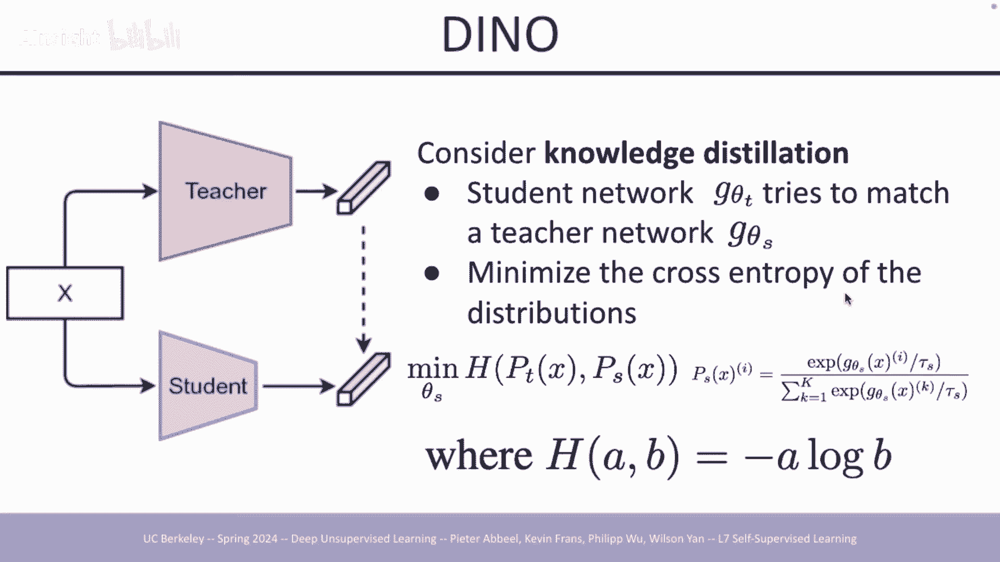

现在，嗯。

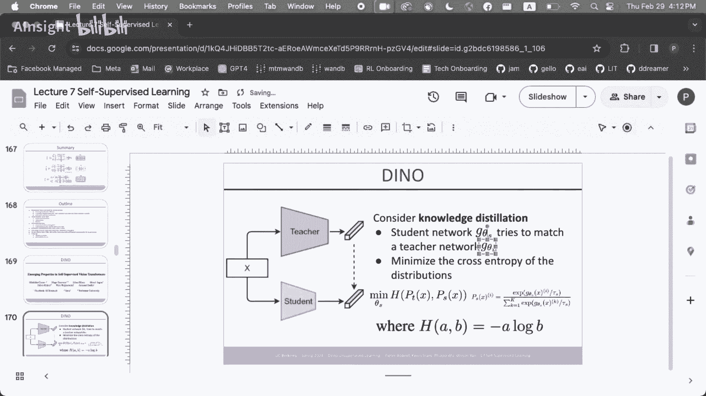

好的，所以呃迪诺试图接受这个，方法，然后将其应用到，自我监督，现在就解决这个问题，因为我们没有，实际上有一个未来的网络所以我们，没有地图，我们只有，网络重新尝试学习和，嗯嗯是的所以他们尝试做一些。

让它发挥作用的技巧，但当你，可以看到现在我们又回到了这个问题，与我们看到的非常相似的设置，在我们有图像 X 之前，现在申请正在申请两个不同的，增强到，它，嗯，所以这是学生方面的道路。

发生的方式与我们通过我们的方式相同，通过学生 G 的图像然后我们，获得一些功能分布，反而，呃现在只是一个功能本身，我们将这些视为，分布是我们如何得到的技巧，我们的老师是我们将再次使用。

我们的指数移动平均线，学生网，我们的直觉是我们想要，尽量稳定老师的说法，网络是我们不要老师，分布移动太多我们，想要相对而言，固定的，当然正在更新，随着学生学到更多，但它是，相比之下会更加稳定，这，学生。

嗯，我们要申请，这个呃我们会忽略这个居中部分，现在我们会生产一些，分布然后我们想尝试，与 um 一样匹配这些分布，知识蒸馏，所以这里又就像 um 和 B 一样，我们没有什么可以真正阻止的，坍塌，是的。

就是这样，居中零件进来，所以，这个中心发生的事情是，你减去平均值，重新输入您的，分布，呃你可以在，伪代码我们有我们的增强，我们通过图像 X 的两个增强，他们通过学生和老师，然后我们应用交叉熵损失。

在这里我们的知识升华，损失然后，更新但是我们有哦是的所以，我们还对我们的，教师参数然后我们有这个，额外的 C 这就是我们的方式，我们以，分布以及我们的方式，中心分布是我们看一下，老师的特征历史。

我们创建了一个指数移动，那些的平均值，特点是这样写出来的，看起来像这样我们有我们的，图像，我们应用这两个，对其进行增强，我们得到这些，两侧的分布，网络，然后我们尝试最小化这个，呃对面，熵。

这个居中步骤是，对于防止模式崩溃很重要，经过这个训练呃程序之后你，他们可以应用到 Vari 范围吗，各种不同的任务，我们只是，看看一些嗯，例如你可以，得到这些很好的分割嗯，完全无人监督的方式。

他们这样做是因为他们只是看看，注意面具，他们将其阈值设置为，CLS 令牌，然后他们比较一些，与地面树的相似性，面具，你可以看到迪诺能够，实际上要更加关注，场景内的物体与，监督维他命。

具有线性和 K 最近的网络 um，图像网络上的邻居分类，你还可以看到Doo正在表演，75% 线性探头效果很好，如果你是的话，使用resinet 50的精度，使用一点版本嗯它能够得到，甚至更高一点。

77% 你也可以 他们也看过，这些显着性地图着眼于，各种自我关注，参考点，你可以看到，它在语义上关注，类似的部分在，场景并能够很好地关注，喜欢客观性和某种忽视，背景，嗯，也许看看有帮助。

与 dyo 相比有一些差异，我们之前看过的这些方法，所以交叉熵就是我们的损失，看到我们之前按顺序使用过，进行匹配，但你可以想象，您也可以使用 MSE，如果你使用 MSE 损失，结果会是损失。

你实际上得到了合理的下降，性能等等呃有这个哎呀，有这个蒸馏损失是相当不错的，重要的是如果你消除了动力，可以看到这立即导致，崩溃嗯，所以有一个更稳定的，老师很，很重要。

所以他们通过 iBot 采取了这一点，人们使用它们的想法，dyo 他们认为如果我们尝试，找到刚刚的分布，图像的特征我们也可以做到吗，我们可以在更细粒度的层面上做些什么，它在补丁级别，嗯。

这正是他们所做的，所以对于图像的每一个增强，你有你的在线分词器或者你的，在线网络占据了所有功能，然后你就有了你的学生网络，拍一个 Patchi Patchi 版本的，图像，当你通过它时。

尝试之前您喜欢的网络，图像上的蒸馏，通过在 CLS 上应用该功能来级别，viit 的令牌，但你也可以，应用相同的损失，但是在呃上，p 补丁或您的补丁，传递给学生所以学生，会有一定数量的补丁。

被放置在这里有一些，已被屏蔽，但你可以尝试，与完整版本相匹配，老师嗯已经看到了并且老师得到了，查看所有补丁，所以现在您，试图有效地嗯，学习一个可以预测的特征，所见过的某事，已经看过整个的功能，图像，嗯。

这个技巧可以让你，超越 dyo um 并扩大规模，取决于，81% 图像净 uh 线性探头，准确性，嗯，我们会快速收集 Dino V2，但实际上他们采取了这样的想法。

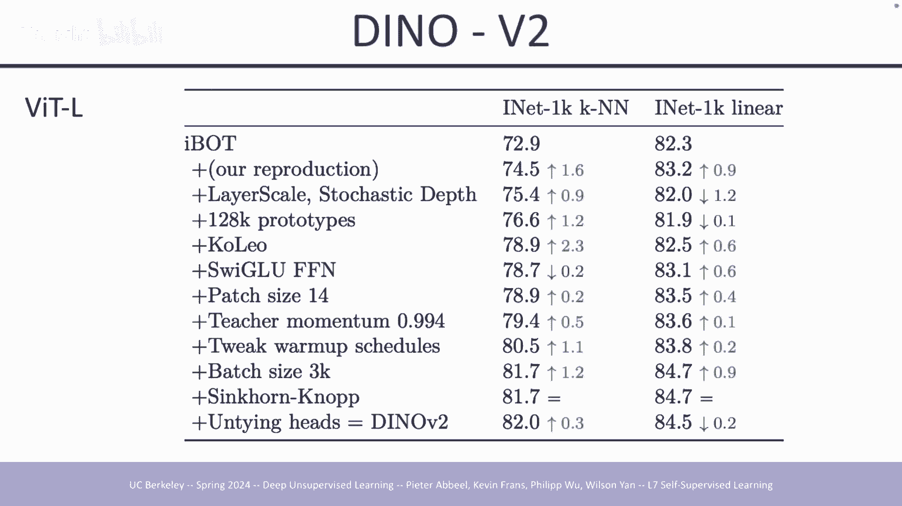

iBot 并添加了一堆其他技巧，能够进一步推动性能嗯并且，你能够变得更好 G 呃，这些类型的可视化和嗯，这是一个可视化，um 的第一个主成分，输出。

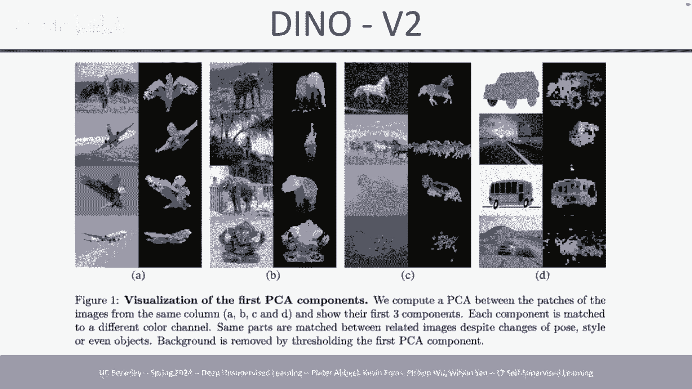

嗯，你可以做到这些，自我监督任务也非常好，将其用作进一步的预训练，下游任务，如分割和，深度，预测在接下来的工作中，我们要讨论的是 JEA 所以，在 JEA 中，严伦认为这种方法，在他的论文中提出，嗯。

在 2020 年或，2022 呃这篇论文真的很大而且它，提出了你的想法，路径是的，就像一个巨大的提案，各种不同类型的机器，学习以及如何建立一个真正大的，具有凝聚力的系统，因此 JEA 非常。

它的一小部分，它不是全部，嗯，但实际上他在说什么，这是他相信的，我们应该这样做，无监督的未来预测是，嗯，所以我们有不同的方式，看到我们进行自我监督，到目前为止的学习和Yan Lon的方式。

认为最有希望的是我们采取，我们的图像 X 通过我们的编码器传递它，嗯，而不是直接预测 y，我们想预测这条巷子里的嗯，特征空间，所以我们通过了 X，我们的 Y 进入某个潜在空间并且。

然后我们尝试预测 uh Y，潜在空间 lat 是的，我们尝试，预测 Y um 的 Laten 空间版本，来自 X so one 的 Laten 空间版本，激励性的例子是让我们。

说 x 是 a 的视频剪辑，汽车嗯这些潜在的空间表示，可能就像汽车的语义，位置和汽车，速度 um 然后也许，预测是，我们想要预测未来的Laten，空间但我们真的不知道如果我们是。

尝试在 BL 像素空间中进行操作，我们可能会，必须担心语义或低级问题，细节，嗯，也许是这样，失去了一些 SYM 指标，但是，理想情况下，我们的编码器只需付费，注意对称相关，信息，这意味着我们会。

希望只需要注意，比如汽车位置和汽车速度，而不是专注于较小的层面，细节，例如叶子如何，背景是，移动嗯，是的，[音乐]，呃，是的，让我去这里吧，也许这个，会更有意义，嗯，所以我们所看到的，到目前为止。

对比学习看起来是这样的，像这样的联合嵌入，生产让我们说 Moco 或 Sim 明确，我们有我们的图像 X 我们传递它，一些编码器，我们得到一些功能和，然后我们尝试像交叉熵一样，示例或呃对比学习。

这些生成式中的例子，例如，架构让我们说 vae，我们首先看到的或者是我们，首先获取我们的图像 X 我们对其进行编码，嗯然后我们将它通过解码器传递给，尝试恢复原始图像 X 或，是的，原始图像或原始图像。

某事，例如，这可以，也像一堂课我的意思是他他尝试过，在一般示例中表述这一点，但在这种情况下我们，看着只是说这些都是，同一图像的实例或，同一图像的增强，嗯，这个联合嵌入是什么，预测架构的意思是。

我们通过了一切都在通过，进入这个纬度的空间就像，嗯，但是我们还有这样的，附加预测网络即，尝试在 X 之上进行预测，所以我们，尝试做一些额外的预测，上面给出的内容，但我们可以。

可能以额外的 lat 为条件，尝试建模的变量，不确定性呃 Z 就像随机的，变量 是的，这有意义吗？所以也许还有另一种方式来看待这个，如果我们回顾过去，Moco 或 Sim 之间的比较。

clear 与 bol 相比，bol 多了一个，预测头在未来之上，空间，你可以看到它，实际上就是严仑所说的，像这里的预测者一样打电话，这样你，只是有一个额外的头，你用最简单的方式预测，案件，抱歉。

这里的 Z 只是随机的，您可能会遇到的变量，条件是他们实际上并没有使用它，在这里，嗯，但你可以把它当作，额外的噪声来建模，分布如果有，不确定性，所以是的，在这篇论文中，我 JEA，他们尝试采取这种方法。

然后运用到学习中，自监督功能来自，图片，嗯，具体来说他们在做什么，你有吗是的所以现在再次记住，我们现在的情况是，一些 X 和一些 Y 在这种情况下 X 是什么，称为 context，Y 称为 this。

目标和我们想做的就是我们想做的，尝试预测嵌入的特征，我们的或我们想要尝试预测，我们的 Target 的嵌入式功能来自 uh，我们的上下文的嵌入特征加上，一些预测器，网络让我们有共同的背景，编码器。

在本例中是 um a vit，需要补丁的网络，图像，呃，我们是的，我们生产这些功能，表示嗯然后现在我们想要，尝试预测这些 所以这就是，我们经过这里的这个灰色盒子，在 COD 上，我们得到了呃灰色特征。

图像的那部分，现在我们想要，尝试预测这些部分，目标嗯以及他们的方式，代表这就是他们代表，这些作为质量，令牌，以便他们传递 cont this，上下文及其质量标记，获取预测的特征 oops 预测。

来自目标编码器的特征和，然后他们应用 L2 损失，不同的，功能，所以这应该看起来类似于，Bol 但他们有点结构化，任务有点不同，以及喜欢的架构和东西，他们是，使用 um 所以这里有一个示例。

他们构建自己的背景和，目标，所以他们首先构建他们的，通过获取原始图像和，他们呃对这些随机块进行采样，这，图像呃然后他们基本上采样，上下文的随机块，然后，减去一个，这样就没有了，重叠的块和你有效地。

以此作为你的背景，嗯，他们，使用，这就是他们构建这些的方式，训练，配对所以如果你训练你的模型，这个过程是在大数据集上进行的，你能，嗯，计算效率非常高，结果，所以他们在这里展示的是。

GPU 预训练小时数与，图像网前 1%，评估和类型的一个优点，与这样的方法相比，像梅这样的东西你实际上并不，需要进行重建，这意味着，一切都在你的车道上运行，空间，这意味着它可以，可能更多，计算效率为。

嗯，是的，我们看到了良好的表现，在这里尽管只受过训练，与我相比，300 epox 让我们，说正在接受培训，160 1，600，嗯，他们可以在这里做的另一件事，即使我们做了，他们也可以尝试。

我们可以在潜在空间中进行预训练，尝试学习一个模型，给定 ENC 编码的重建，潜在的，所以这是在之后完成的，预训练步骤和有效嗯，他们学习条件扩散模型，嗯，它试图学习如何做，基于这些学习的扩散，陈述嗯。

这些是，您在这里看到的表示，你可以看到它能够，有效捕捉到有一只鸟，这是它的位置，嗯，它是怎样的，应该摆出姿势，但是有点像，不注意诸如此类的事情，背景细节嗯就像是的什么什么，背景颜色应该是一样的，嗯。

这里的狗，你可以，看到姿势和一切，狗是非常正确的，即使可能，一些较小的细节和东西是，缺失，因此该信息是，至少呃存在于，代表所以 V JEA 是后续，两周前刚刚发布，我认为嗯，他们应用了确切的。

同样的想法，但我认为在视频领域，由于时间关系我会跳过它但是，如果你们都感兴趣的话细节，是，嗯，接下来我们将讨论剪辑，所以，剪辑嗯有点让我们了解这个年龄，嗯自我监督学习使用，文本到图像，嗯。

我相信你们都知道，剪辑但是嗯这就是他们呃实际上的样子，这样做就像，在嗯之前我们想拿两个我们有的，一些 X 和一些 y 但不是，同一图像的增强，它们实际上是不同的方式，一对所以我们有图像及其。

相应的文本对，然后我们，将应用我们的对比，我们尝试分类的目标，正确的文字和正确的图像，呃，反之亦然，还有其他的，批次中的示例被视为，我们想要的反面例子，特色尝试与众不同，嗯嗯，一旦你接受了预训练。

客观希望你的特点非常，您的图像特征和文本，功能非常好，嗯非常，对齐，这让你有希望做到，类似下游分类，非常容易地以零射击方式，你会怎么做 假设我们是，尝试进行 IMET 分类，我们可以。

参加我们所有的 imag 网络课程并，然后为其创建一个文本标签，例如我们喜欢玩汽车狗，然后我们可以在这里制作一个标题，狗的照片，然后尝试，将这些文本标签与，我们图像中的特征，编码器嗯所以在剪辑时。

没有那么多真正好的开放，呃文本图像数据集嗯在他们的，他们提到有这个论文，一个 YC yfcc 100 万 1 亿 但是，他们提到有很多，相当低质量的字幕，该数据集中的元数据就像这样，是数据集的标题之一。

其中显然不包含任何，有语义意义的信息 um，所以他们最终建造了他们的，自有4亿图文数据集，配对嗯这是专有的，他们，和一些类似的人一起做了这个，搜索呃呃自动搜索，一些生成的，查询代码和实现，剪辑非常简单。

你只需，一些图像编码器，一些 viit 和一些，文本，编码器，然后你将其传递给，你所有的图像和文本，然后，你会得到这些相应的功能，将它们标准化，然后你就得到了点，您应用点积得到的产品。

你的 logits 然后你只需申请，交叉熵，你可以双向应用它，所以是的，那么这可以让你拥有，嗯，真的，真的令人印象深刻，时间零射击能力，分类，所以他们在，各种各样的不同的，右侧的分类任务，是。

显示零镜头剪辑与，完全监督线性，基线，你可以看到他们的，基于零射击的线路能够做到，比你完全喜欢一个更好，的监督版本，当然这不完全可比，只是一个完全监督的版本，根据原始数据拟合线性分类器，嗯。

但它仍然表明，呃这个，预训练很，有效嗯很酷所以除了，只是它在零射击中的用处，分类它实际上可以是一个非常，对于下游模型有用的功能，因此，所以我们之前在 uncli 中看到你，可以使用预先训练的文本编码器。

获得我们可以的那些文本特征，然后使用图像条件，嗯，我们看到了很多呃vlm，今天的模型 视觉语言模型 我们，实际上使用预先训练的剪辑模型来，将 um 图像编码为一定数量的，令牌，然后传递到，语言模型，嗯。

是的，这些功能是，在其他设置中很有用，例如，出色地，嗯，好吧，我会跳过 CP 和，从那时起就有了很多嗯，剪辑的不同呃扩展只是，因为该模型非常有用，我认为很有趣的是，这个叫。

再次翻转 kaiming 呃 atair 他是，最后一位作者，所以，观察这是在 Mee 和他的，Mee 的观察是这样的，掩蔽是一种非常有效的策略，加快计算速度，只需要对你的进行计算，暴露的，补丁嗯。

所以我的想法是如果你，可以将此类策略应用于剪辑，在某种意义上进行训练，看看是否可以，改善，嗯，你可以看到，在这里受益，所以在格雷这里，如果您只应用普通剪辑或，他们的剪辑再现。

那么如果你应用 50% masing 策略，你得到这个学习曲线的图像，y 轴是 image net 1 uh 线性，概率，准确度如果你应用 70% 的掩蔽，你在这里得到了这个呃学习曲线。

所以你可以看到你能够，得到一个你可以训练更多的东西，高效，如果你正在看这个，相同的最终表现，获得大约 3。7 倍的加速时间，与您的训练时间相同，能够变得更高，表现，所以，嗯，你必须做的一件事。

如果你这样做的话要小心的是，有一些火车和考试时间，不匹配，因为在火车时间我们，遮盖部分图像但在测试中，是时候我们想看到完整的图像了，所以他们提到的是你必须，之后进行此未屏蔽的微调。

我相信你做预训练是为了，这就像你为3个纪元做了一个完整的结束，结束微调，呃看到完整的，完整图像，嗯，这对于 if 来说最重要，你的掩蔽率非常高，例如，对于 75% 的人，您会看到这个巨大的。

这里的差距嗯，如果你是的话，那就不那么重要了，使用较小的掩模比，例如，50 微米，所以我们已经涵盖了各种各样的内容，不同的方法，所以你可能会问，我们可以通过任何方式将这些结合起来。

方法 um slip 是一种方法，这也是诺曼在这里做的吗呃，在，伯克利，嗯，这个想法很不错，简单让我们尝试添加一些，基于剪辑的自我监督学习，看看是否有自我监督学习，目标能够，帮助所以呃滑他们的方法显示。

在这里你可以得到，零射击方面提高了 5% 呃，如果你应用一些性能，自我监督学习，损失嗯，凭借纯粹的自我超视觉，就没有，零射击能力，所以没有显示，在这里，通过线性分类，你，看到还有一个好处。

剪辑顶部或仅使用纯，自我监督，学习算法很漂亮，简单明了，他们正在使用 Sim，清晰如他们的自我监督学习，呃，我们再次来到这里，我们有我们的，两次增强，因为我们需要，为了我们的自我监督学习。

方法嗯我们嵌入这些功能，得到我们的呃预测值或我们的，我们的潜在值 Z 然后我们可以应用，只是正常的 Sim 明确损失和，正常剪辑损失并将它们相加，一起显示在此处，这，是的，呃，我们可以看到这有帮助。

嗯跨越了各种各样的不同，架构以及规模，相应地 um 穿过 viit 小 uh，底座和大尺寸模组，mod um 下一篇我会很快介绍，是 cocow 呃对比字幕是，还有图像文字基础，模特们。

他们在这里所做的就是他们，应用此字幕任务来尝试，学习图像编码器和文本，编码器，他们实际上能够，达到 1% 的最高准确度，最先进的 91% 这是，在相当长的一段时间内都是最先进的，我想现在已经被接管了。

嗯嗯但是是的这就是这非常，好的，好的，我会跳过“是的”，所以，本质上这个想法非常，首先简单我们要做的，对比损失就像我们对剪辑所做的那样，这就是这里显示的内容，我们通过。

图像我们得到了一些 CLS 代币特征 um，与文本相同，我们也这样做，另外我们要去对比损失，拥有这个多模式解码器头，这将尝试重述，图像所以有了剪辑我们就得到了这个，标题：嗯。

但现在我们可以应用一个 shiy，版本 um 并进行下一个令牌预测，还尝试预测给定的标题，只是，图像，他们发现是的，这就是，能够获得非常好的结果，巨大的呃各种各样的不同，基准测试。

让我们看看需要花多少时间，我们，有，嗯，好吧，我会跳过这些嗯，但还有其他一些，人们采取的有趣方法，嗯，如果你们都有兴趣参加，看，稍后所以嗯接下来我将简要介绍一下，涵盖我们可以使用的不同方式。

自我监督学习，强化学习和，控制，所以呃第一个是由，阿尔文是原作之一，指导这门课程的讲师，无监督的旋度对比，强化代表，如此架构地学习我们会看到，我们见过的非常相似的东西，之前与对比方法，其中。

我们有我们的观察，我们有我们的，嗯，两个独立的特征编码器，我们正在应用对比损失，嗯，但再次记住现在我们是，尝试做一些下游，强化学习，呃，我们从我们的，编码器，我们进行正常的强化，学习那些，功能。

例如如果我们划掉，这个强化学习管道，只是正常的对比，学习，如果我们继续划掉这个，对比学习部分就是，正常强化，学习嗯这里的动机是，这可能是无人监督的，目标可以帮助我们获得更多的比特和。

更多信息嗯学习明智的，我们的下游，RL，所以是的，方法非常相似，我是，不会涵盖 RL 因为那是，超出了本课程的范围，但我们可以，谈谈如何进行无监督学习，帮助下游RL，过程嗯所以这里是增强。

他们发现最有帮助的是作物，尝试了一堆不同的其他，增强嗯，正如我们所说，关于下游任务之前，实际上很重要，所以很多这样的，至少对于这个来说更多基于颜色的东西，这些模拟毛子中的任务类型，环境并不重要。

但也许关心更多的空间，关系实际上很重要，所以作物，是他们正在使用的那个，是，再次使用 um 交叉熵损失，然后他们测试了几个，不同的设置，所以一种是使用，指数移动平均线或无 um，我们再次需要指数移动。

平均得到好，性能嗯然后是使用，使用什么类型的损失，距离度量所以有 B，线性与直接或使用直接，硬币距离和双线性 uh 也是，很有帮助，这里所以左边这里正在运行，kurl 与 sack sack 是基础。

他们基于的算法 kurl 是，添加表示学习，顶部嗯，所以 State Sac 只是使用，环境的原始基本状态，而红色的卷曲是从原始训练，像素，你在这里看到的是，有卷曲的可以匹配，灰色曲线几乎适用于所有。

环境不错，令人印象深刻，因为卷曲实际上没有，可以访问底层状态并且，所以你基本上可以匹配，地面真相状态信息呃，只看性能，像素和嗯这里是对应的，与几个比较的性能，其他不同的算法，你可以。

看到curl能够执行，在这种情况下具有竞争力，好吧，接下来我们看看 r3m，所以 r3m 的动机，我们想要寻找机器人吗，我们想要某种类型的操纵，交易前视觉，代表性 um 的共同策略。

机器人技术是采取预先训练的呃资源，网络图像网上然后使用那些，功能嗯，但当然那些重置，特征的训练就像尝试，进行随机分类，所以可能，不注意某些，我们关心的机器人功能，所以也许如果我们呃想想。

数据和预训练我们可以得到，更好地代表类型，我们关心的机器人任务，那么事物的类型有哪些，我们可能关心一个人是暂时的，场景的动态所以希望我们，代表性应该以某种方式，了解各国如何，过渡到其他状态嗯另一个。

重要的特征可能是相关性如何，嗯，要注意那些事情，与各种任务语义相关，我们可能关心的东西，比如物体，以及他们与每个人的关系，其他的，嗯，另一个就是，紧凑所以数据和，他们在这里使用的过程是。

他们将使用 e 4D 作为他们的，预训练，数据和呃这是一个优点，有很多 inth 野生数据，入口可见，它有语言，注释以及嗯它有一个很大的，各种不同的呃是的很多，视频数据来源非常多样化，地点。

所以我们再次要去，应用对比学习的理念，但方式略有不同那又怎样，他们在这里做的是他们正在做的，时间对比学习，他们是，将时间动态编码为，代表嗯我们可以你没有，过于仔细地调查损失我会，只是解释直觉但有效。

我们想要的是我们想要的框架是，靠得更近 嗯，有一个代表，即，彼此靠近，所以我们希望这样，成为积极的一对，我们想要一些，离我们很远的框架，锚定为负对 um 并且，这实际上就是他们决定的方式。

选择什么是积极的，什么是消极的，消极的，配对另一个是有嗯视频，语言对齐，因此这些视频是，at 用 a 的语言，正在发生的事情的语言动作，那个视频，分段并再次这种对齐应该，哦，是的，直觉是我们。

希望对齐增加，如果我们正在做一些视频的过程，行动希望那种语言，注释应该更准确，我们进一步进入视频，嗯，嗯以及语言的框架，应该与当前视频匹配，但是，应该远离呃其他，不同的视频，嗯，我们可以再次。

应用类似对比的目标，实现，那么我们就扔掉所有这些，共同承担我们的损失，然后我们，也应用一些正则化，这些 L1 和 L2 正则化为，鼓励某些类型的。

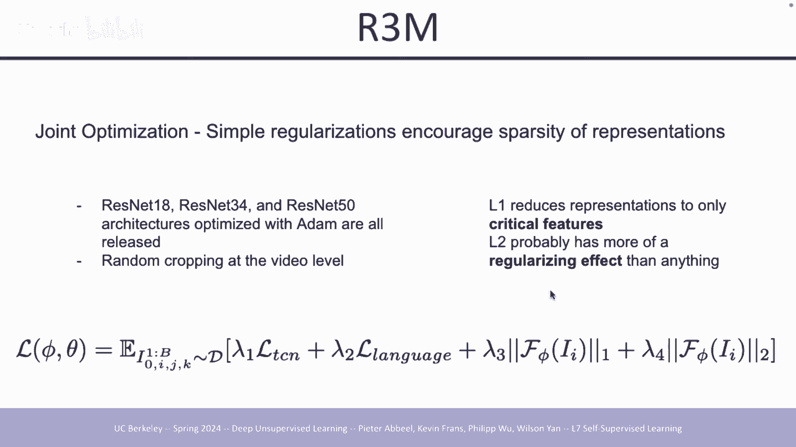

稀缺性嗯下游通道，他们的测试只是模仿学习，呃模仿学习你可以思考，你的基本事实状态为，以及他们证明的行动，跨越这些各种各样的不同。

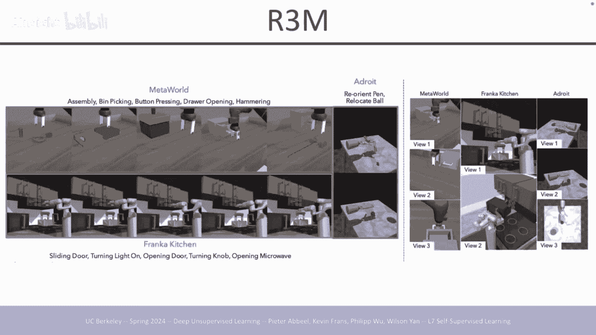

环境，这些是他们的，我们之前看到的基线如此摩乔，嗯，莫乔，我们有剪辑，我们有图像网的表示，我们有监督代表，从头开始训练的代表，你可以看到他们能够做到这一点，这些 um r3m 表示能够。

在这些机器人任务上做得更好，嗯 Loco 345 只是意味着他们，采取中间特征，那些我认为像的部分，倒数第三个 倒数第四个和第五个，持续，层，所以我们看到了这些类型，对比型目标是，用过。

我们可以使用其中之一吗，重建型目标，嗯，彼得正在谈论，早些时候嗯，所以这就是所做的，该面罩用于运动视觉预训练，对照纸由 Titan Ilia 完成，ly 这个想法是尝试将 Mee 应用于。

学习机器人控制的功能和，他们有一个非常好的程序，类似于Mee，他们正在采取，呃入门手大视频数据集，焦点型数据有很多，对象交互可能更多，与机器人和呃预训练相关，和 Mee 然后下游他们是。

从他们那里获取这些陈述，编码器这个冻结编码器，然后，试图学习一项政策，那是我们不需要的具体细节，详细说明，这是数据，他们所做的数据集组合，史诗小猫 YouTube 10 天就在眼前，某物，某事某事。

一些东西，呃，他们创造了这个，基准本质上只是一个，收集各种不同的，机器人任务以及他们的训练，使用 po 制定他们所有的政策，嗯，是的，这个数字有点，小但有效你可以看到，嗯 MVP 是他们的榜样 嗯这个。

Orange 正在使用 Oracle 地面实况，状态然后嗯黄色，是嗯从头开始监督，你可以看到，与 MVP 进行预训练 MVP，功能有助于提高性能，很多已经非常接近甲骨文了，可以访问的政策。

地面TR um，[音乐]，状态，嗯，所以我们的另一个潜在问题是，在机器人技术方面我们有一个很大的，各种不同的数据具有，很大的不同，有很多，不同的方式，有时我们，可能只有视频数据，而我们没有。

其实有对应的视频，轨迹或随之而来的动作，那些对喜欢学习非常有利，可以利用所有人的代表，这些不同的数据，这就是我们在本文中所做的，MTM，嗯，在 MTM 中，我们首先采取我们的一堆，轨迹数据和轨迹可以。

只是被认为是多式联运，um 的序列 的多模态序列，各种不同的元素呃我们，可能有国家 我们可能有行动，我们可能有愿景，值 um，所以我们将其扁平化为，共同嵌入，空间嗯，特别是我们刚刚看了。

在这个嗯的模拟环境中，我们，将国家的奖励和行动作为我们的，不同的，方式嗯，如果我们遗漏了，我们的数据集中的模式然后我们可以，只是把它当作一种力量，掩码，然后我们就可以了，与 Mae 类型类似地训练。

我们随机屏蔽的目标，我们的序列中的部分，然后尝试，重建那些失踪的人，因此在本文中我们探讨了，各种各样不同的事情但是呃我会，只谈国家代表，与这个相关的一个，的一部分，讲座使程序有效。

我们用一些随机掩蔽进行预训练，对这些使用我类型的方法，轨迹水平，数据，然后下游我们尝试测试，这些表示的效果如何以及，这就是这里正在做的事情所以，设置是我们有一些离线数据集，机器人做各种各样的事。

不同的事情，嗯，我们预先训练，这些，然后我们运行 RL 的轨迹，这些呃学习的算法，表示并将其与，在原始数据上学习 RL 算法，状态 um 和 这些 RL 算法，有时你需要状态，但是，有时你需要像州和。

行动，所以我们也可以共同嵌入，使用我们的特征的状态动作对，提取器所以绿色是基础，橙色特征提取器正在使用 um，微调然后紫色正在使用，状态动作特征，你可以看到，呃我们能够变得更好，基于原始特征的状态。

有时甚至击败了 ASM，受过全面训练的国家或oxm，经过全面训练的嗯嗯方法是能够，要得到，那么接下来我就来说说这个工作呃，用于视觉控制的海量世界模型，这是 yungo 领导的工作，时间在。

伯克利嗯所以所以这是这个的基础，方法是嗯，梦想家，我们不会谈论，梦想家，但只是为了让你们都知道是什么，在引擎盖下有两个，组件之一是这个世界模型，其中，你正在努力学习，你的未来状态如何受到影响，行动。

然后另一个是政策，学习你使用这个世界的方面，尝试学习政策的模型呃，您可以阅读该论文的详细信息，如果，你对这种类型感兴趣，方向 uh yio 的创新，让我们尝试解耦，表示学习，动态学习在这种类型中。

我们尝试学习的方法，代表以及学习，这些表示的动态但是，我们可能可以尝试解耦，那呃在并且那可能使，更多的事情，高效，所以这就是这里所做的，在这种视觉表征学习中，阶段如左侧所示，然后，相应地。

我们将进行动力学，学习这些提取的特征，从我们学习的自动编码器和，我们的结构设置是 um，又是另一种大众自动编码器风格，我们将在其中的结构，学习这个特征表示，通过重建随机掩模，嗯，特别是他们做了几个 Y。

在这里做了一些改变，实际上第一个非常重要，就是将原始图像通过，首先是一些 com 层，我们会谈谈，为什么这很重要然后在，呃重建空间我们也是，将传递一个质量令牌，奖励因为我们想要并且我们要去。

重构 R 的奖励以及想法，希望这就是我们的状态，维护让我们可以使用的信息，就像预测奖励一样，分配给这个，说明这个顶部是新的，表示学习损失底部，部分是原来的呃世界模型损失，再次，呃，数学你们都可以看一下。

如果您自己感兴趣并且，所以这是对应的呃，结果呃图像的顶部序列是，的基本事实序列，图像这是重建的，版本嗯使用大众世界模型我们，有一个预测版本就是你，有效地在您的世界中展开，模型空间并尝试查看。

嗯嗯相应的图像，它会是什么样子，底部是什么，梦者的预测，在这种情况下，有点难看，但是有，这就像机器人的小苹果，试图移动嗯，你可以看到，苹果出现在机器人的这里，与大众世界模型，但你看它是。

实际上并不存在于梦想家中，正在发生的事情就是那个梦想家，有点关注这些，像素级特征更多，图像中大量出现，但有点，忘记了这一点来建模这个更小的，喜欢这个苹果不太相关的功能，嗯，结果发现这个奖励，预测组件和。

卷积特征组件有帮助，模型更关注这些，特征 um 卷积组件，有点允许您使用的功能，之前进入 Mae 有，更大的背景，所以它能够，如果你有一个非常小的物体，就像这个物体呃这个立方体，你试图关注它可以。

帮助呃让模特付更多的钱，注意这些呃较小的像素，你的元素，图像所以是的 M 模型能够执行，基本算法你可以看到蓝色，曲线能够跑赢这些下行，这里，嗯，再一次，这是消融，关于使用 com 功能，如果您。

删除 com 功能哦，如果您，删除 com com 功能，您会看到，你实际上做不到那么好，实际上梦想家效果更好但添加，之前的几个卷积特征，嗯，你把它传给我，重建目标有助于，彼得简短地提到了很多。

这是以前的事，但现在我们要做桅杆呃，多视图，Mee 和在这个环境中，嗯，机器人技术是我们的一个环境，很多时候需要处理多个，相机看起来如此，如果我们可能有一个以自我为中心的相机，机器人将物体视为。

就像第三人称相机一样，这是，来自嗯是的，这就像一个机器人，我们有很多不同的手，正在俯瞰的摄像机，手，所以关于 Mee um 的精彩部分，Transformer是我们可以处理的。

原始代币空间中的所有内容然后，就像编码器解码器不关心，代币实际上是什么，嗯等等，我们现在可以映射两个图像，手腕相机和俯视图，嗯令牌空间并尝试做，重建就像以前一样，纸很有帮助，pfy之前首先是卷积特征。

并传递到，编码器，是的，这里的主要想法是，重建群众观点嗯要学习，交叉查看信息所以希望现在，我们可以，根据给定的部分进行预测，我们应该能够的风险观点，预测第三人称摄像头会发生什么。

视图看起来就像你在这里看到的那样，在这里我们完全掩盖了另一个，查看并希望能让我们学习，也许更强大的代表性，因为，模型应该能够学习，特点嗯，是的，那可以重建嗯，不同的，意见和，下游我们嗯下游我们现在可以。

以几种不同的方式应用这个模型，一是我们可以使用编码器来，对两个视图进行编码，但可能是这样，下游我们只有一个，查看嗯，这样我们就可以训练模型了，只是那个的单一视图版本，单视版本，环境嗯所以这是表演。

嗯如果，所以如果你使用多个视图，可以看到这很有帮助，但也许嗯，但我们在多视图中训练它所以，也许就像多视图预训练，在这种多视图设置中有所帮助，嗯，这个另一个实验是我们只给出，它是正面的单一控制视图。

我们使用预先训练的编码器，我们可以看到我们能够保持静止，实际上优于其他方法，比没有的情况下获得更多两倍，嗯，所以让我们，看到另一个，我们在机器人技术方面存在的潜在问题，我们必须安装相机。

有时人们会移动你的机器人，摄像头，然后你的政策就不再，有效，因此非常有利，制定真正强有力的政策，工作涉及广泛的不同领域，观点，我们可以应用这种多，查看我们可以的设置的想法，生成一堆不同的，视图。

然后使用与 multi 相同的方法，查看呃大师世界模型训练，第一步是我们这样做，代表观点，随机化而不是仅仅，腕式相机和概览相机，我们将随机化这些不同的，观点嗯然后我们学习使用。

我们的 RL 算法的特征来自，这学到了，编码器和下游我们可以应用我们，可以看到这如何应用得有多好，当我们应用时模型能够应用，一堆随机化到我们的相机，视图并且我们能够看到，这种多视图方法能够。

表现优于先前，接近嗯，这是一个真实的世界，这个机器人现在在哪里的例子，仅拍摄相机图像的是，抢劫所有这些不同的半身像，增强我们的实际情况，尽管事实上如此拿着相机，你知道我们在晃动相机。

周围很多我们正在移动它周围，很多嗯政策仍然强劲，这些。

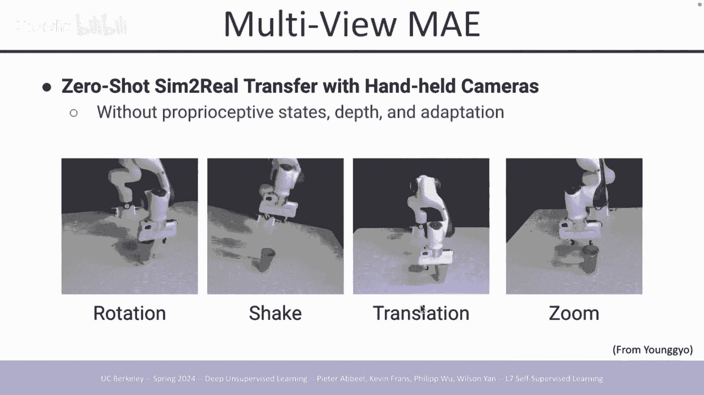

改变很酷所以我想我会结束，在这里演讲，我们有一些小，我留在幻灯片中的组件，关于语言模型但是，我们将有一个语言模型，下周有专门的讲座所以我想，如果我们没有完全覆盖也没关系。

