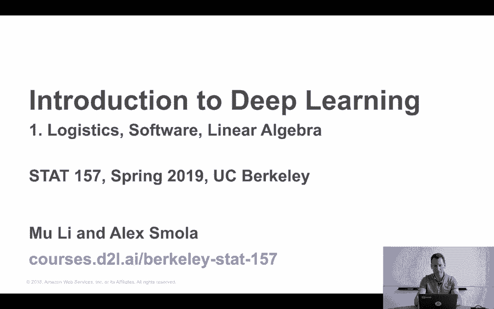
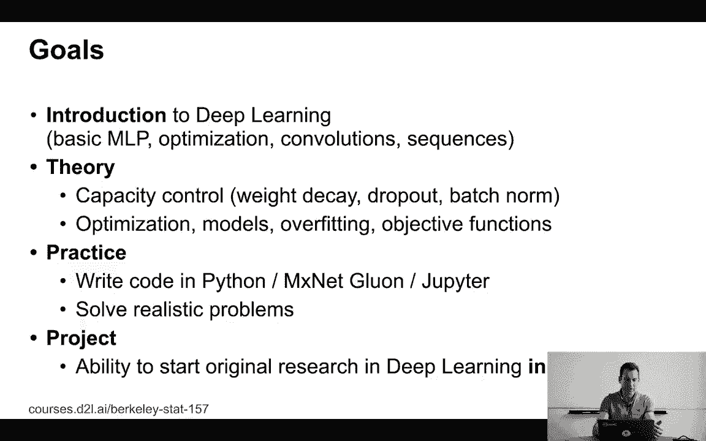
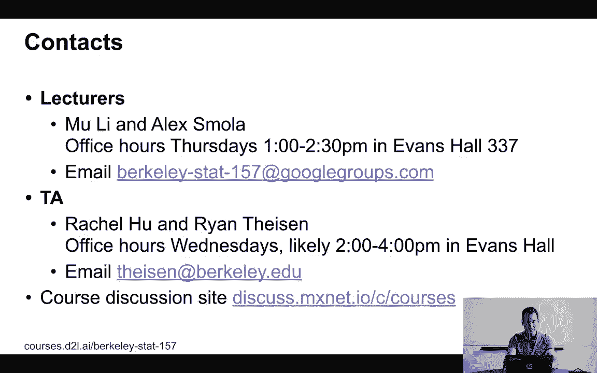
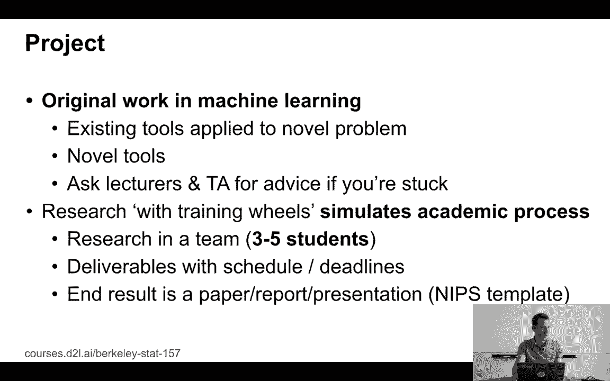

# P1：1. L1_1 课程安排 - Python小能 - BV1CB4y1U7P6

欢迎来到这门深度学习课程。这是加州大学伯克利分校春季学期统计学157课程的第一讲。由于直播录制的技术问题，这个视频是重新录制的。所以对于没有现场录制视频，表示歉意。我们希望重新录制的版本能够被接受。

好的，首先我们应该在这门课上讲解的是课程安排。也就是说，作业、项目、考试、上课时间、用户组以及其他事项是如何运作的。接下来，我们将简要介绍深度学习。然后会讨论一些关于软件安装、线性代数的内容。

然后是MX-NIC-1的最终存储格式。

让我们从课程安排开始。这样做的目的是让我们了解课程的运作方式以及如何完成所有任务。那么这门课的目标是什么呢？首先，我想给大家介绍一下深度学习。具体来说，就是基础的多层感知器、优化方法、卷积、序列模型（例如LSTM），也许还会涉及一些注意力机制等内容。

这实际上只是如何构建深度网络的基本框架。但同时，我也希望确保每个人都理解背后的深度学习理论。至少要达到本科级别的深度学习入门课程的水平。所以这意味着我们需要讨论容量控制、权重衰减、dropout（丢弃法）、批量归一化等内容。

但也会涉及优化、不同类型的模型、过拟合、目标函数等内容。现在，既然这是一个深度学习课程，并且它是一个实践课程，我希望确保每个人都能真正理解如何在实践中执行和应用深度学习。所以你们将需要在Jupyter Notebooks中用Python编写代码。

并且我们的深度学习框架选择是MX-NIC-1。但如果你熟悉例如PyTorch或TensorFlow等框架，这应该不会让你感到太意外。我们的目标是让你能够解决实际的问题，尽管这些问题不一定是大规模的、复杂的，但至少是现实的、可操作的问题。最终。

这个项目帮助你顺利开始，实际上是带有辅助功能的研究，将帮助你搞定实际操作。所以这实际上是你开始做原创性深度学习研究的起点。

重要的是不仅仅是个人学习，而是在团队中学习。现在，我们达到目标的方式有两种。一种是通过课程，该课程将在周二和周四下午3:30到5:00举行，地点在con。显然，如果你能参加这门课，那你应该知道这个地方。如果不能，你也可以随时在YouTube上观看直播。除此之外。

我们会将所有的讲义和笔记本通过网站发布在线。YouTube频道总是会更新最新的讲座内容。显然，如果没有技术问题的话，这也是因为第一讲的内容曾经有所延迟。我们会将所有内容上传到GitHub仓库，地址是d2l-ai，Berkeley-Stad 157。

除此之外，还有《深入学习》中的Jupyter笔记本。这些笔记本构成了我将在本课程中带你们操作的笔记本的基础。显然，不仅仅是我，Mully，我的共同讲师，也会参与其中。然后还有一个GitHub仓库，你可以直接去那里并使用git clone所有这些内容。所以，基本上，如果你查看d2l-ai仓库，你会发现里面有很多详细内容。

包括课程内容、书籍以及接下来几个月的其他资源。

讲座？那就是Alex Smoller、我和Mully会教授课程的另一半。我们会在星期四的1点到2点，在13号Evans Hall进行办公时间。你也可以通过电子邮件联系：Berkeley-Stad-157@googlegroups.com。我们的勇敢的助教是Rachel Hu和Ryan Tyson。办公时间大概率是在星期三的2点到4点，地点在Evans Hall。

有关详细信息，请查看网站。他们正在安排办公时间的具体地点，因为可能会有很多人参加。如果你有任何问题，请发送邮件到课程的总邮箱地址——即Berkeley-Stad-157，或者发邮件给Ryan。课程讨论在本课程的讨论平台上，访问 discuss.amixnet.io/c/courses。

所以我们不再使用Piazza，而是放在这里。主要的原因是，如果是与MXNet相关的问题，你可以直接在这里发布。如果是其他与机器学习相关的问题，可能其他人也会觉得你的问题很有用。如果是一些私密问题，欢迎在办公时间来找我们，或者直接发邮件给我们。

好的，现在来说一下作业。显然，一种确保每个人都能从中有所收获的方式就是确保他们已经进行过实践。这就是作业的目的。我们会有10次作业，它们每周发布一次。选择每周发布的原因很简单。我希望确保你们不会拖延，直到最后一天才完成作业，也不至于等到一两周或四周的最后期限。

所以我想，最好是每周发布一次作业。这样量就小一些。作业会有一定量的编码任务和一些理论内容。所有内容都是解释型的。你基本上可以在作业发布后一周提交，之后我们会给出结果、评分并更新相关内容。好的一点是，如果你。

如果由于某种原因，没能完成某个作业，没关系。我们只会计算最好九个作业中的成绩，此外，你还可以因任何原因缺席今天的作业。因此，这应该能帮到你，比如你需要参加一个会议，去面试，或者生病等等。

这会给你一些灵活性。最后，所有的作业提交都是通过Git进行的，所以你甚至不需要在现场。实际上，你完全可以在夏威夷提交你的GitHub作业，提交到GitHub，一切都可以。

所以，操作方式是，你在作业截止日期的星期二下午4点前提交作业。然后助教会在截止后进行pull请求。你可以或应该以PDF、TruePit和Notebooks的形式提交。PDF仅仅是为了保险起见，以防TruePit无法正确渲染。

然后，助教会通过Git提交注释反馈，因此你需要向Git添加RY-T-H-I-E-I，以便他可以从你的仓库执行Git pull。请联系Ryan获取详细信息，基本上是将你的Git地址和仓库名称发给他，这样他就能自动获取这些信息。关于这一点，Ryan将在另一个会议中介绍如何使用Git，如果你之前从未使用过它的话。

请记住，这是一项非常有用的技能，将对你的职业生涯有所帮助，无论你是工程师、科学家，还是经理，Git都是你的朋友。而且，嗯，使用Git比通过电子邮件提交作业更容易。除此之外，如果你仍在等待名单上，那就提交作业到Git里吧。

这样我们就有了时间戳，即使延迟了，我们依然可以用它来验证你是否已按时完成任务。当然，这并不能算是确凿的证据，因为你总能篡改Git上的时间戳。但另一方面，如果你能做到这一点，你大概能顺利通过课程。所以，没问题。

我在这里，老实说，是在恳求你。

有一场考试。这只是期中考试，日期定在2019年3月19日。是开卷考试，但不允许使用计算机、手机、平板或类似设备。关键是，我不希望你能通过Google找到答案，对吧？所以，使用你拥有的任何笔记。完全可以，如果你愿意，打印出所有的幻灯片。那完全取决于你。重点是。

不过，你不能仅仅把解答发给别人，让别人帮你提供答案之类的。因此，需要有一个机制来确保是你自己在提供答案。这也是为什么会有一场正式的考试，而不是仅仅依靠项目和作业，因为我希望确保至少有一种证明，证明你是这个课程的参与者。

否则，你可以把一切外包给，假设是，印度，这可能提高你的管理技能，但如果你真的想学点什么的话，可能就不那么有用了。没有期末考试，因为项目才是最重要的，而项目的分数实际上占了绝大多数。

现在，项目。这个想法是让你在机器学习领域做原创性工作。所以，原创性工作可以有多种方式。你可以，举个例子，使用现有的工具，应用到一个新问题或新的数据集上，或者你可以提出新的算法。现在，我理解这并不容易，因为，嗯，这可能是你第一次做这样的事。

比如，研究研究。所以，你可以问我，可以问助教们，如果你遇到问题停下来。毕竟，这是有辅助轮的研究，模拟学术研究。这将帮助你起步，帮助你成为一个更好的科学家，一个更好的研究员。

随着项目的进行，你还会成为更好的工程师。而且，它也会教你如何在团队中进行工作和研究。所以，你应该尽早与，假设是，三到五个学生组成团队，然后开始规划你的工作，对吧？那么，会有交付物和截止日期等事情。

这样做的主要原因是，如果我把所有事情都留到最终项目，那每个人可能会在项目截止前的一周才开始做，幸运的话。然后大家就会疯狂赶工，在一周内完成任务。至少我们都会感到压力山大。我自己也有经验，如果我没有任何约束条件的话。

我可能会把它拖到最后才做。所以，别这么做。我已经设定了一些约束条件，以确保这种情况不会发生。现在，最终结果将是一些论文报告和演示文稿。而且恰好的是，这个项目是按照NIPS模板做的，且恰好项目截止日期大约在NIPS前两周。

所以，如果你做得非常好，还有额外的奖励，也许你可以把它提交到某个会议上。我相当确定，这将增加你未来做什么的机会，可能是做博士学位，可能是做硕士学位。所以，整个过程并非浪费努力。做得好，它将远远帮助你，不仅仅是在这门课程里。

所以，时间安排。我希望你们尽早注册团队。这就是为什么有一个2月5日的截止日期。到那时，你们需要注册一个团队。那意味着需要提供姓名和一个工作标题。不，你不能单独提交项目提案。如果你坚持这么做，我们会随机把你分配到另一个团队，且该团队成员少于五人。

你可能不喜欢我们为你分配的团队成员。所以，如果你真的希望和一个你喜欢的团队一起工作，请现在就选择一个。所以，现在开始，项目提案，即一到两页的书面材料，和五分钟的全班展示将于一个月后的3月5日进行。届时你将站在全班面前展示你计划做的事情。

这五分钟的讲话是为了确保你能获得强有力的鼓励，提出一些好的东西，否则你会在大家面前让自己尴尬。顺便说一下，除非你反对，否则我们会录制这个，并将其发布到网上。

现在，这听起来可能很可怕，但实际上并不，因为我们会在这里帮助你。所以，随时过来，开始讨论项目想法、项目提案、建议，任何评论。这个活动真的就是为了帮助你起步。如果你觉得太害羞，我仍然希望你至少和团队中的某个人交流一次。所以。

在4月22日至25日之间或更早之前，你必须与助教沟通，讨论项目。如果你没有这么做，你会失分。这真的是为了确保每个人都与助教交流，并获得反馈，确保项目能够正确进行。

因为你仍然有大约两到三周的时间来修改。所以，你的最终项目和展示将在5月7日和9日进行，届时将使用两节课来进行项目展示。你需要提交至少六页的报告，最多不超过20页。超过20页的内容将不被考虑，内容多并不代表更好。

这个限制是为了确保可怜的助教们能在审阅材料时得到一些睡眠。此外，你需要为你的展示制作至少六张、最多20张幻灯片。再次强调，这样做是为了确保你能做出至少一些有意义的努力，同时也避免你在10分钟内展示60张幻灯片，开始接近计算机游戏的帧率。嗯，虽然不是完全这样，但我想你明白我的意思。所以，和你的助教谈谈，和我们谈谈。

这是我们的责任来帮助你。早点开始。现在还不是很紧张，但以后你可能会有其他课程，事情会变得很忙，你需要在团队中进行合作。

这是Vark团队。好的，总体目标是让你享受过程，学到东西。我们希望能教你。

[BLANK_AUDIO]。
