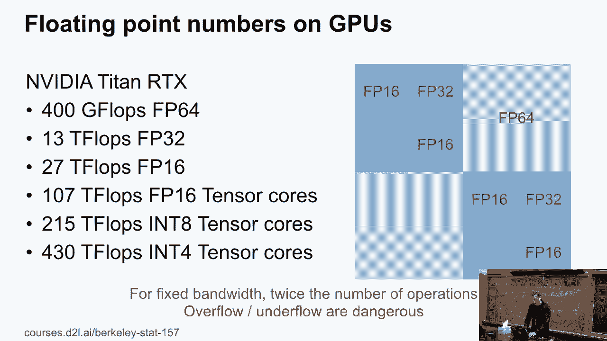

# P10：10. L2_5 朴素贝叶斯 - Python小能 - BV1CB4y1U7P6

还有其他东西。 所以，朴素贝叶斯。 我猜，好的，谁听说过朴素贝叶斯？

所以我讲这个的原因有两个。 首先，它是一个荒谬简单的算法。 其次，也是为了展示你可以使用这些工具，比如深度学习框架，做一些除了神经网络之外的其他事情。 好的。 那么朴素贝叶斯的关键假设是什么？ 好吧。 我假设给定垃圾邮件的情况下，P（第一个单词，第二个单词，...，第n个单词）。

它很容易分解成给定垃圾邮件的W i的P。 好的。 很简单。 所以如果我在给定单词的情况下做出这个假设，那么我的基本规则就是。 给定与P的比例，乘以乘积。 对吧？ 唯一缺少的，就是。 这就是为什么我们有比例符号，缺少分母。 我会懒得重新计算分母。

之后，只需在P（垃圾邮件）内，乘以乘积，然后对垃圾邮件和正常邮件进行评估。 好的。 实际上，我们来看看这个。 好的。所以我们需要做的事情是，训练我们的朴素贝叶斯分类器，需要做两件非常简单的事情。 第一个是我们需要计算P（垃圾邮件）。 好吧，这很简单。

我只是看我收到的所有邮件。 我数一数有多少垃圾邮件，多少正常邮件。 这已经是一个相当不错的P（垃圾邮件）估计了。 然后，我关心的是P（W i 给定垃圾邮件）。 所以我只需要看看“viagra”这个词在垃圾邮件和正常邮件中出现的次数。 除非你在做生物学研究，否则很有可能这是一个相当显著的特征。

所以问题在于，如果你有一个朴素贝叶斯的M-fulfurger计划，假设是很多这些事情的概率是相等的。 换句话说，那些短语根本没有任何意义。 但由于我们也在看单个单词的概率，你会得到一些无意义的东西。

所以这应该已经告诉你，也许朴素贝叶斯有点太朴素了。 这是图形模型。 但如果你从未见过，这实际上就是一个所谓的有向图模型，垃圾邮件，然后是给定垃圾邮件的各种单词。 假设是我们的友好的尼日利亚垃圾邮件发送者。

坐在键盘前，每个词都有一个按钮。 或者他会以某种概率生成这些词。 但这些邮件完全没有意义。 好的。 你有见过这种情况吗？ 好吧，曾经有一次垃圾邮件攻击。 它会包含完全垃圾的内容。 然后在最后一行和第一行。

会有一些随机的关键词，它们根本不属于垃圾邮件。 只是被随机撒进去。 这样做的目的是完全迷惑朴素贝叶斯垃圾邮件过滤器，并让邮件通过。 一段时间里，它成功了，因为基本上那个垃圾邮件过滤器实在是太朴素了。 顺便说一句。 显然，统计学家不喜欢画左边这样的图。

画这些圈是很繁琐的。所以他们发明了自己的 for 循环。就是右边这个，它叫做“板块”。这意味着对于从 1 到 n 的所有 i，执行这个操作。如果你有两个互相嵌套的 for 循环，事情就会变得更加有趣。然后你可以在统计学中做一些操作。

这些事情在计算机上做起来并不容易。不幸的是，如果你需要实现这些，你就得硬着头皮去做。例如，对于推荐系统，你需要为所有用户和所有电影构建一个系统。但是你实际上只会关注用户和电影之间的交互。总之，这只是一个小插曲。

如果你对这个话题感兴趣，可以去上图模型的课程。这里面有一些非常酷的内容。那我们有什么呢？我们有像电子邮件、标签，甚至是图像这样的数据，我们需要获取这些数据的概率分布。请注意，这里做了过度简化。这里只是邮件的头部，文本实际上在最下面。

上面其他的部分基本上是元数据，记录了这封电子邮件的处理过程，从发送者发送到邮件主机，再到它到达你的邮箱。所有这些信息对于判断邮件是否合法非常有用。那么，我们如何构建非常朴素的朴素贝叶斯分类器呢？嗯……

我们想要得到特征概率。在这种情况下，我只关心二元的情况。xi 的 P 等于——在给定 y 的情况下为真。所以我只需要统计这种情况发生的次数，然后除以总发生次数。这样就能得到特征 i 的概率。我会对所有的 i 都进行这样的计算。

我还需要垃圾邮件的概率，然后我就完成了。听起来不错。你能看到这个方法中存在的一个根本性问题吗？除了这个假设非常糟糕之外，这种方法会在哪里出问题？是的？

如果某个特征没有出现。没错。所以如果某个特征没有出现，那么你就会遇到克鲁格效应。这是朴素贝叶斯分类器的致命问题，在这种情况下，分类器会对某个事情充满自信，并且会直接给出一个明确的分类。

如果你有一个特征总是出现，而另一个特征从未出现，然后在测试数据中，情况正好相反，那么你会得到一个“不是数字”（NaN）的结果。所以你说得完全正确，这就是事情可能出大问题的时候。所以人们做的事情是，他们给所有的东西都加上了伪计数。

他们只是把所有的数字都加了一次。这叫做拉普拉斯平滑。这里有什么有趣的地方呢？在非参数化的贝叶斯方法中，有很多相关的内容，比如中国西方过程、狄利克雷过程等等。所以，去上两位学者的课程，他会详细讲解这些内容。甚至有一个以他命名的过程，叫做 Pittman-Yor 过程。是的。

我们将仅仅触及表面。现在，正如所说，这里有一个非常简单的算法。对所有文档，聚合标签计数，聚合各种计数，然后我们会在代码中查看这个过程。

不用担心。但在我们这样做之前，现在我们来讲点完全不同的内容。

你可能会想，为什么会这样？这张幻灯片似乎和我之前告诉你的内容完全不相关。我为什么突然要深入讨论浮点数、指数、尾数等问题？其实，浮点数有——这就是为什么它们叫浮点数的原因。它们基本上有两部分。

一部分精确地指定了值是什么，另一部分则指定了数值的数量级，也就是最大的指数部分是尾数。然后，好的，你还需要一个额外的位来表示符号，但就是这些。如果你使用的是双精度数，那么你有64位，生活就比较美好，通常不会出现数值溢出或下溢。

如果你使用的是单精度数，那么是32位，并且你会维持任何指数的缩小。这还可以。如果你使用16位，情况就变得很糟糕了。接下来，如果你用8位或4位，我会在下一张幻灯片中解释为什么这很重要，你需要做很多技巧才能让它工作。好吧，那么在这种情况下该怎么办呢？顺便提一下，发生这种情况的地方是。

比如，如果你在计算概率的乘积，每个概率看起来可能都没什么问题。假设是50%。然后突然间，你得到了100个这样的数字，最后你得到的是2的-100次方，大约等于10的-30次方。所以事情会迅速变得非常糟糕。

如果你在加法和归一化等操作时，会出现溢出、下溢、无效数字等情况，这样你的代码将无法运行。所以罪魁祸首是我们基本上把所有信息都塞进了指数部分，而尾数部分几乎没有被使用。换句话说，当双精度存储格式被定义时，所做的权衡。

处理概率时，使用这种方法是错误的。那么我们该怎么做呢？其实并不难。我们只需要取对数。突然之间，乘法变成了加法。所以一切都变得简单了。我们唯一需要做的就是，因为加法涉及到概率，我们需要对其进行指数运算，然后再取对数。

然后事情可能就会变坏。那么让我快速在白板上写出问题所在。我们想计算e的a次方加e的b次方的对数。现在，假设a和b大约是100级别。这将导致严重的数值溢出，所以我们得到的是inf，这里的log inf也是inf，因此事情就彻底出错了。

但是你可以立即看出，这和a加上e的对数，减去a是一样的。 所以这是0加上e的b减去a。 这可能更好。如果b小于a，那么效果会更好。如果b大于a，我仍然会得到溢出，所有事情都会出错。所以我简单地做的是，取b和a的最大值，提取出来。

然后我再次在内部进行减法。 这样，所有的计算都在数值上是稳定的。 这不仅仅适用于深度学习，如果你正在做图模型和其他东西，也需要非常小心。 否则，你的代码实际上可能无法正常工作。 那么我们为什么关心这个呢？ 因为在GPU上，速度基本上是这样发展的。

每次你将浮点数或数值格式增加两倍时，事情就会变得更快。 这并不完全正确，因为还有一些像张量核心这样的东西，使得事情更加高效。 但是你基本可以这么理解。 在给定带宽约束和带宽预算的情况下，我可以包装两倍或四倍的数据。

进入我发送到处理器的相同数量的数据。 而且请注意，事实证明，所需的硅量是按平方比例增长的，随着比特数的增加。 所以添加低精度操作几乎是免费的。 例如，这就是为什么NVIDIA在他们的新Turing GPU上添加了int four的原因。 因为在硅方面几乎没有成本。

他们可能在希望——谁知道——是否那个操作会带来回报——。 通过添加这些操作，你可以添加一些其他——。 你可以通过增加两倍的加速，获得一个大约1%到2%更大的芯片。 鉴于此。

你可能会很高兴地接受这个两倍的加速。 那么你会问，可能会有哪些算法能够利用这一点呢？ 仍然有一些论文要写。 好吧。那么现在我们有了这个——。

