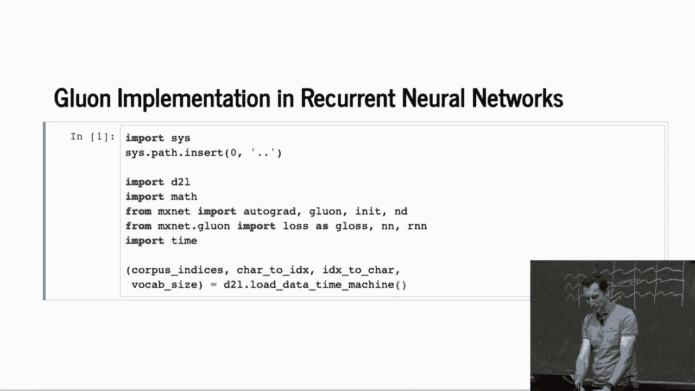
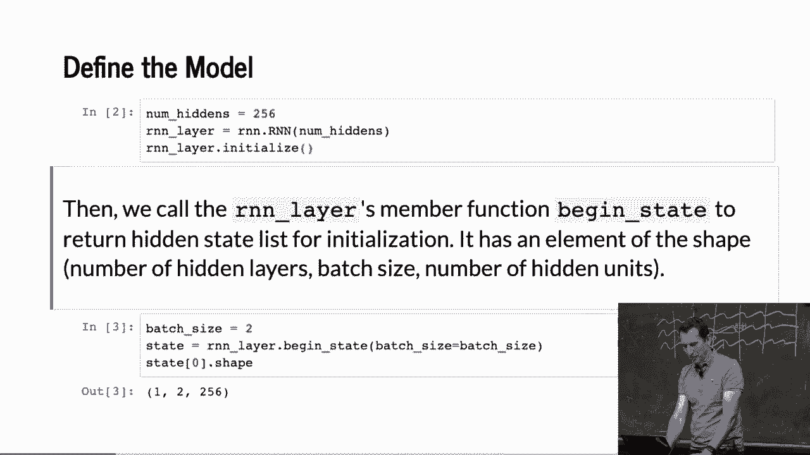

# P101：101. L19_4 Gluon中的递归神经网络 - Python小能 - BV1CB4y1U7P6

所以这个蓝色版本的实际上非常，非常简洁。

所以我需要做的第一件事是，嗯，我像之前一样加载数据。好了。

然后我定义了我的模型。

我有RNN模块。所以RNN。大写的RNN，隐藏单元数量给我一个，嗯。256个隐藏单元的RNN。初始化了RNN层，初始化了它。所以基本上我们之前做的所有工作只是那三行代码。好了。让生活更轻松，对吧？不过我们还需要做一些其他事情。所以我们需要，嗯，启动它。

对吧？所以假设mini批次大小等于2。我们需要一个初始状态。所以我们得到的是这个。那就是mini批次大小。那是隐藏单元的数量。256，对吧？然后这是它输出的地方。好的。所以我们可以做的就是看看如果我往前走一步，发生了什么。然后，35步就意味着，嗯，简单地说，嗯，往前走，嗯。

一系列35步，你知道，产生了这个。所以这与我们之前的代码完全相同。这个只是检查输入和输出在形状上是否匹配。所以两个状态匹配，并且状态的形状也匹配。好的。明白了。这真的很简单。好了。接下来，这就稍微复杂一点。

我们需要定义一个RNN块。这个RNN块，好的。所以我们需要块的原因是因为RNN模型本身只是，嗯，处理数据的输入和输出。块做的是整个前向传播，其中你知道，如何进行one-hot编码并做所有其他便捷操作。

围绕它的常规操作。首先我们需要的是，嗯，它需要去，嗯，构造RNN层，然后对于解码和编码，它需要创建一个密集矩阵。所以这只是构造函数。现在，对于前向传播，像这里的这个。它需要进行one-hot编码输入。好了。然后它运行RNN，接着它需要生成输出。

因为RNN本身并不了解这些。好了。因为，嗯，你知道，我们可能在这里做了什么奇怪的事情。最后，我们去返回输出和状态。然后我们需要另一个函数，begin state，这样RNN块就知道，嗯，如何启动。好了。好了，到目前为止有什么问题吗？是吗？ >> 那么我怎么获取输入呢？

>> 对不起，你能大声一点说吗？ >> [听不清]， >> 对不起，我还是-， >> [听不清]。 >> 不。好了。那么问题是，这个是不是和序列采样有关？不。还没有。所以这实际上只是一个机制，嗯，这里有一个设备，我把一些数据输入进去。然后它产生了另一个状态序列，对吧？

它实际上并没有做任何准备输入数据的事情。好了。我们仍然需要手动完成这一步。好吧。或者，你知道，显然要编码。但，嗯。好吧。哦，天哪。这就是热核的麻烦。对于预测，它看起来与之前非常相似。唯一的区别是，嗯，我们现在调用的是 RNN 模型。所以这是这里的模型。

所以我们初始化它。开始状态。这正是我们调用的内容。我们生成我们的输出，接下来我们将把东西放进去。然后，对于该序列中的所有字符，好吧。所以我们重新调整形状，然后让 RNN 向前迈进一步。对吧。这基本上是因为 RNN 就是，嗯，你知道，这个设备，你知道。

一次生成一个下一个对象。而且，嗯，然后，你实际上可以看到，例如，在这里的解码，你知道，通过 argmax，对吧。这实际上是将其从向量转换回字符的过程。现在。如果 NLS 与我们之前的完全相同，换句话说，如果这仍然是其中的一部分。

你知道，我最初输入的原始字符，它不会覆盖那些字符。它只是把它们从输入复制到输出。只有在它跑完了最开始应该看到的字符后，才会开始生成新的字符。所以现在有个显而易见的问题。为什么我们就让它一次处理一个字符，然后我们没有。

其实很在乎那里的输出。有人能给出个好理由，解释为什么我们会做这么浪费的事情吗？

对。这个很奇怪，对吧。为什么我不直接开始，你知道，在那些我已经知道存在的字符之后？好吧，让我给你个提示。如果我忽略前几个字符，然后直接从那些字符之后开始，嗯。我的模型还会考虑这些字符吗？

它是否还会在意前几个字符是 "time traveler" 还是 "chainsaw"？好吧，我猜大家开始摇头了。大概不会。那应该没关系吧。对，这正是重点。所以如果你忽略前几个字符，那么你的隐藏状态就不会。

依赖于这些字符。所以前几个步骤并不是浪费的。它们只是为了将隐藏状态加载到某个有意义的东西中。对吧。这就是为什么我必须从一个有意义的隐藏状态开始的原因。所以，如果我想拥有更好的隐藏状态，我只需摄取更多的内容。好吧。然后最终。

嗯，我只是将一切拼接在一起，就是这样。我们试试看看。这与我们之前所做的完全相同。你知道，我从 "traveler" 开始，然后让它生成另外 10 个字符。那 10 个字符完全没有用，因为，嗯，嗯。现在，再次。

接下来是稍微复杂一些的函数。为了节省时间，我只会讲到这里。我强烈建议你之后查看那些在线笔记本。好的，我们来看一下。对，我们有一个损失函数，就是你知道的，softmax 交叉熵。我初始化了我的模型。然后我调用了我的训练器。对，那是我的优化算法。好的。

然后你遍历数据，你知道，无论你有多少个周期。这就像之前一样只是时间问题。而我所做的唯一事情就是只使用连续数据迭代器。因为另一个方法反正效果不好，所以没必要实现两个。这个在 gluon 中的训练预测 RNA 函数将非常有用。

比如说，做你的作业时，你会反复调用这个函数。所以，第一步是初始化状态，对吧？就像你预期的那样。然后你拿到数据。这里有个奇怪的操作，我在做的是 est.detach。对于 estin 状态，调用 detach。对吧？这就是告诉 autograph 不要在我的边界之外进行反向传播。

小批量。对吧。所以这是在小批量开始时，我有这个操作，我只是在说，嘿，以前的状态中的任何信息，都从计算图中删除。好的。我们将在周四更详细地讨论这个内容，到时候我们会实际看一下反向传播、时间切割和其他那些技巧。

但现在先相信我，这样做是有意义的。然后我们进行常规的训练循环。所以通过 autograph 记录，现在正式开始了。我们从模型中生成输出和状态。我们拿到 y 值，并通过损失函数进行比较。好的。一旦得到结果，就去计算梯度。然后拿到参数向量，对它们进行裁剪。

然后你所要做的就是计算一次更新，从训练器中更新损失函数。就是这么简单。好的，这真的就是全部了。最后一件事，我会略过的是，这实际上只是为了监控，去确定困惑度是多少。对于作业，你需要阅读这一部分。区别在于，作业中你实际上需要实现一些东西。

你将会在一个未见过的测试集上测量困惑度。在这里，我们只是记录训练集上的困惑度。区别在于作业中你需要保持训练集和测试集的分离。除此之外，其他部分差不多。好的，有什么问题吗？好的，那么我们开始吧。

也许我们可以将其运行超过 200 个周期。也许跑 400 个周期。看看会发生什么。好的，到目前为止有什么问题吗？是吗？使用多个 GPU 的过程就是你展示的那个吗？就是你展示的几个不同数字的那个吗？好的。多个 GPU 在序列模型中的应用。差不多，基本思路是相同的。你为很多批次计算梯度，然后将它们发送到不同的 GPU。

这些不同的 GPU 做各自的工作，然后你会得到梯度。基本上，序列模型在 CPU 上的负载要重得多。即使是那些使用大量粘合和功能的模型也是如此。如果你有一个相对较慢的 GPU 和一个快速的 CPU，这倒不会成什么大问题。

如果你使用像 P3 16x 大型机器配备 8 个 GPU，这可能会成为一个问题。混合网络在这种情况下表现相当不错，因此 Python 部分相对轻量，但它仍然是**非平凡**的。也有一些情况，你可能会陷入一种局面，基本上是**CPU**限制了其他部分的性能。这就是为什么它需要更多的工作。

如果你想深入了解这个问题，你应该查看最新的 **Bluhan NLP 工具包**，它支持为 BERT 等转换器模型进行并行分布式训练。这是一个非常复杂的语言模型。它能让你对如何高效地并行处理有一些了解。在这种情况下，大多数难题实际上是工程问题。好吧，但现在我们可以看到的是。

好的，首先，它运行得快了很多，对吧？所以你可以看到，它大约是每次**0.15**秒。在作业中，数据集会大得多。这个数据集大约有 140,000 个字符。在作业中，数据集会有 500 万个字符，因为你将要。

与莎士比亚的全集一起玩乐。然后我们可以看看你的模型是否能生成另一个莎士比亚作品，对吧？或者至少你能看到它能接近多少。是的，这是团队合作的工作，别太担心。我是说，你可以组队。好，其他问题呢？好的，那么继续。
