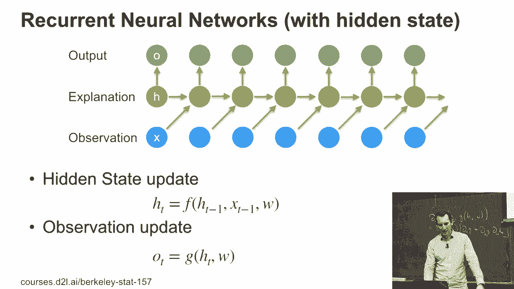
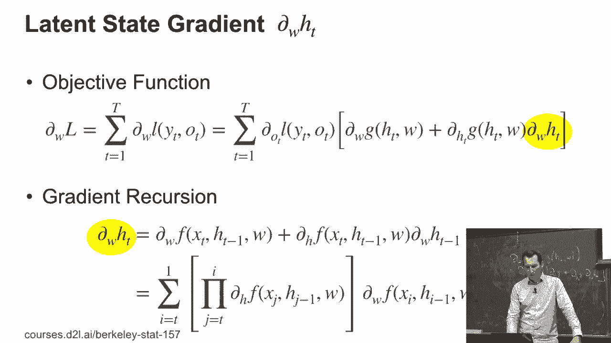
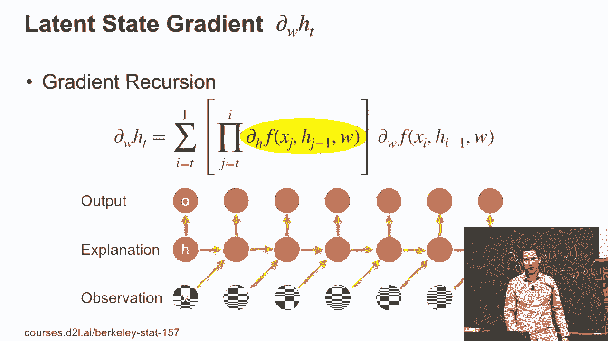
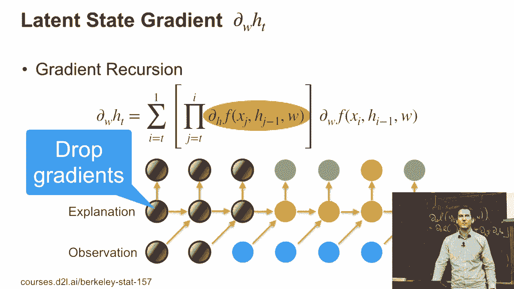
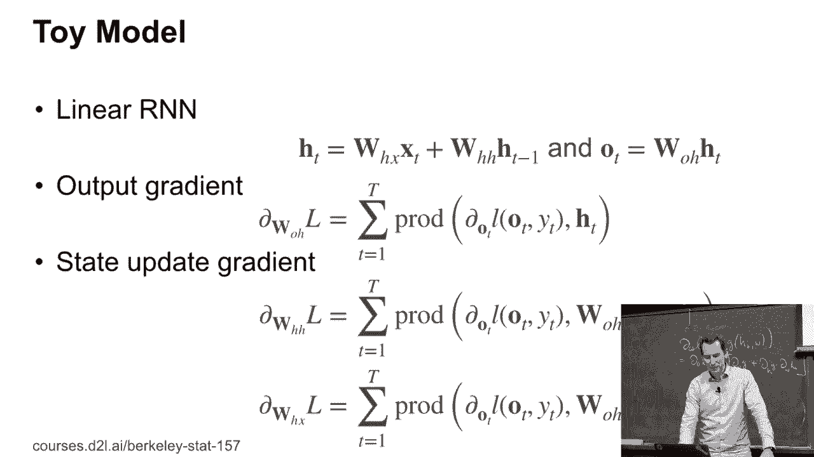
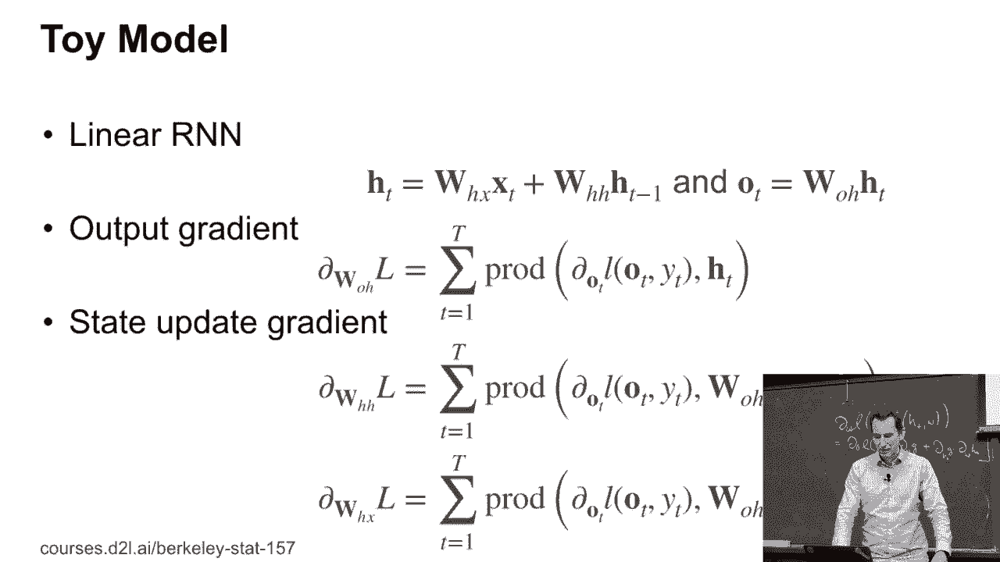

# P102：102. L19_5 截断反向传播 - Python小能 - BV1CB4y1U7P6

现在是时候看看截断反向传播了。所以我们其实已经在之前设置那些小批量时遇到过截断反向传播，然后我们说，好，行。分离梯度。这有点奇怪，像是你知道的，为什么你需要分离梯度？让我们来看看有隐藏状态的RNN和一点点。

所以我们假设我有一些隐藏状态的更新，对吧？这只是非常基础的。HT是HT减去1，XT减去1和W的某个函数。然后我有一些观测值，这由HT和W的某个其他函数G给出。所以这其实是非常直接的。这就是普通的RNN单元。

虽然不同的网络可能有非常不同的特性，是的，基本上它们中的任何一个都能很好地工作。

好，现在让我们来计算它的梯度。所以我有一个损失，对吧？在损失中，我将输出与目标Y进行比较。所以我对序列Y进行求和，从T=1到T。即便我在讲的是单词，我仍然使用时间。

但这只是为了表示某些具有意义的顺序依赖关系。所以我只是对那些损失进行求和。好，现在如果我要计算梯度，第一个部分很简单，也就是说，既然我有一个求和，梯度就会进入求和，对吧？

所以现在让我们来计算损失的梯度，然后这只是链式法则，对吧？所以我有LDO，因为输出是唯一依赖它的部分。现在我可以进一步应用链式法则。也就是说，我有G的HT和W。所以如果我把这个写出来，我的损失是Y的损失。然后我有某个函数G，所以是Y，T，H。

T和W。所以如果我对它取导数Dw，那么，当然，这就是什么都不等于L的Do。再乘上两个项。也就是说，我可以得到Dw的G加上DhT的G乘以Dw的HT，对吧？这只是基本的链式法则。大家对最后一行还感到舒服吗？好，O不就是G的HT，W吗？

是的，这正是它的意思。所以上一张幻灯片中，OT是G的HT和W。

这只是扩展了这里的内容。现在，除了最后一项，其他都很容易计算，对吧？

因为我们知道HT，所以对G的DhT很容易得到，而对G的Dw也很容易得到。同样，第一个部分也是如此。最后的部分正是会让我们头痛的地方。造成头痛的原因是因为HT依赖于HT减去1。这样，HT减去1就依赖于它从HT减去2，HT减去3继承的所有东西。

然后继续下去。所以它基本上会一直回溯。就像是，如果我在第一堂课上说了一些非常愚蠢的话。你现在可能仍然记得，并且认为Alex是个傻子。或者如果我说了一些启发性的东西，你可能会觉得我很聪明，或者类似的。但基本上。

你可能会有非常长距离的影响。而这些非常长距离的影响可能会非常影响你如何看待当前的讲座。例如，如果你认为Alex是个傻子，那么你可能就不太可能关注我现在说的话。因为，嗯，你已经在脑海中设定了这个想法，对吧？或者反过来，也是一样。所以长话短说。

这个H，T的Dw就是我们要的。

我们要好好玩一玩。我们实际上来看一下，对吧？所以H，T的Dw。H，T是由这个函数给出的，F（X，T）和H，T减1，和W。第一部分，还是很简单的，对吧？第一部分就是，嗯，你知道的，来自F的依赖函数的东西。第二部分意味着我们现在取导数。

关于H的F，现在我们有了H的Dw，T减1。我们刚刚做的事情是写出了递归关系，表示H的梯度，T是H，T减1的梯度作为函数，和一些我们可以很容易得到的其他项。所以，如果你进一步写出这个过程。

你基本上会得到从I等于T到1的和，从J等于C到I的F（X，J减1）和W。所以这基本上是链中所有过去的依赖项，再乘以F对W的相应依赖项。是吗？F通常是什么？

就像是多个百分比抽取吗？是的。所以F将是——F和G将是相当简单的函数。我们稍后会通过一个实际的例子来讲解，对吧？

R和F模型也是这样吗？是的。所以它们会稍微复杂一些。好的，实际上我们已经在星期二看到了F和G的例子，对吧？

所以当我们实现第一个R和N时，这些基本上只是线性函数。然后可能会有一些切线或ReLU，或者其他东西加在上面。显然的问题是，嗯，更现代的模型呢，这真的是你能做的最聪明的事吗？

实际上有两个可能的方向，你可以走。我们稍后会更详细地讨论它们，也许今天，也许下个星期二。但我们会讲到的。现在假设这些是相对简单的函数。

所以这里真正的问题是，如果你看这个梯度，是什么情况？

你有很多项，所以这计算起来很昂贵。另一个问题是，你基本上会得出矩阵的乘积，对吧？那些梯度矩阵，你知道的，H的F。问题是，如果我把很多这些矩阵相乘，如果运气不好。某些特征值会爆炸，或者有些会消失。

或者可能整个产品会消失。所以你会得到梯度爆炸或消失的情况。唯一不会发生这种情况的时候，是当特征值基本上接近1时。而这通常是非常罕见的情况。所以换句话说，灾难几乎是这个问题的必然结果。这是一个真正的问题。

现在，这听起来非常抽象。是的，下面是发生的例子。假设，我有这个红色符号，这个红色输出。然后我需要一直回溯，通过这个红色链条，直到第一个H。而第一个H可能，仍然对输出产生一些影响。

这可是坏消息。所以解决这个问题的一种方法是说，嗯，我们就忘掉前面部分，只看后来学到的依赖关系。这看起来像是，为什么我们要这么做？这感觉不对。所以人们最开始就这么做，而没有太多思考。然后他们实现了它，运行了模型，它有效。

所以这就像，嗯，好吧，我们破解了它，它有效。那它一定是好的。那么这意味着什么呢？就是说，我拿这段时间，停下来，只是回顾这次情况下，可能只看前两个时间步。然后我就进行截断。它实际上有一些相当有益的效果。

这些效果可能不是很明显。首先，是的，这样做要快得多。因为我丢弃了很多我本该做的事情，我做的工作少了。所以当然速度更快。第二个好处是我正好丢弃了那些包含多个矩阵乘积的部分。那部分正是会消失或发散的地方。

所以这是另一个好处。第三个好处是，嗯，它实际上有一些。正则化的效果。因为它迫使我主要关注最近发生的变化，而不是我可能在过去很长时间里观察到的变化。所以，通过本质上迫使我的模型主要利用我最近学到的东西。

我可以得到一个更强大的模型，它不会像之前那样，受到蝴蝶效应的影响。所以我猜大家都知道蝴蝶效应吧？

所以本质上是，嘿，在某一时刻，某只蝴蝶扇动了翅膀，突然间一年后在明尼苏达州出现了龙卷风。嗯，也许不是明尼苏达州，但某个龙卷风频发的地方。但关键是，那些效果，即使是微小的变化。

最初会影响到后续状态的因素被，你知道，隔离开了，从而防止它们被引入到你的模型中，从而避免过度拟合过去，仅仅通过截断。所以这实际上是违背了我所知道的一切。

之前所说的近似充足统计量，我们实际上学到它们是如何完成的，因为这实际上意味着我能够非常好地聚合。但是至少我并没有将效果回传。我依然在聚合，依然在计算。

这一链条上的一切都只是因为我停止了某个部分的梯度传递。到目前为止有任何问题吗？是吗？所以你说的就是这样。在某个时刻进行三维梯度计算的步骤不会影响你的模型描述的家族。

只是你处理它的方式的效果。没错。实际上，它甚至不会影响你如何计算估计量。它只是影响你如何训练和优化参数。所以前向传递是完全相同的。没有变化。只是对于梯度计算，我计算了一个稍微不准确的梯度。抱歉，这样回答你的问题了吗？[INAUDIBLE]，[INAUDIBLE]，不，不，实际上。发生的情况是，模型可能会收敛到不同的东西。所以从这个意义上讲，是的，严格来说，我正在像其他正则化一样约束模型空间。

但功能形式是一样的。现在，能够证明这正是发生的事情，并且模型空间是如何被约束的，我们可以这样说。如果你搞明白了这个问题，这将是篇非常好的论文，你应该立刻写出来，因为人们会想要了解。这个问题还没有被很好地理解。有几个类型的问题，人们会在某种程度上。

理解它。有很多类型的正则化，我们可能会稍后讨论其中一些方法，看看如何在约束中进行限制。比如说，有一种叫做zone out的方法，你可以简单地强制你的递归神经网络在一步到下一步时不更新状态。就像在讲座中之前提到的。

假设你zone out了五分钟，那么你的机器学习内部状态不会被更新，因为你在想着其他事情，比如今晚要约会。然后一旦你恢复注意，你的状态依然是zone out之前的状态，在某种程度上来说。

这应该是对你学习方式的一种正则化。虽然我不确定是否推荐在这个讲座中使用zone out，因为你可能需要重新看视频，但这些技术可以使状态估计更加稳健。

那么让我们实际看看在实践中它是怎样的。如果我们有类似于H.G. 威尔斯的时间机器这样的东西，你可以做的是直接拿整个链条，看到底部箭头。然后我必须对所有内容进行反向传播，而这非常昂贵。

或者我可以在固定间隔处截断，那是中间的线，它是一个近似值，但实际上在实践中效果很好。或者你可以参考TALEC和Olivier在2015年发表的这篇有趣的论文，基本上你使用估算器来代替精确的求和，我会在下一张幻灯片展示给你看相关的数学推导。

你基本上使用一个随机长度来截断。是的，我回到之前的幻灯片。那我就是这么做的。

包括像是截断梯度吗？是的，截断梯度就是你实际操作中会做的。你说得对，非常好的观察。那么，截断梯度的意思就是在某一部分之后停止求导。还有其他问题吗？

所以有变量长度，这就是TALEC和Olivier所做的，这个方法是精确的。基本上你做的就是重新给较长的片段加权，权重比较短的片段大，然后你就能得到一个合适的分布。你可以说这个其实是有效的，这是数学推导。

发生了什么？基本上，我在递归中使用了一个随机变量，它的值是0或1，或者更确切地说是0和1除以1减去p。所以，根据某个概率，我就停止了。因为一旦这个随机变量psi t是0，那么递归就停止。如果它是非零的，那么递归会继续下去，我需要继续执行这个链条。

这就是你从上面那行得到的结果。如果我使得期望值为1，那么psi t的期望值就为1，它取值0，然后是1除以1减去p。这样你就能得到一个精确的结果，并且能够得到梯度的无偏估计。问题是，在实践中它并没有表现得更好，所以这篇论文是个很有趣的研究。

它大概有10次引用，也许在这门课程后会多出20次。这是一个有趣的想法，但事实上，在截断反向传播中，可能还有其他的东西在发生，换句话说，它对模型的约束更多，这就是为什么基本上不推荐这样做的原因之一。不过也许有人能让它起作用。所以我们来看一下计算图。

这是一个三步HMM，非常明确的模型。

这里我们先写出方程。所以，如果ht是WHX乘以xt加上WHH乘以ht减去1，那么ot就是WOH乘以ht。所以这是一个完全线性的模型，完全没有非线性。这基本上就像是……

简单明了。所以我们来看一下这个图。我从一些h0开始，然后观察x1，然后得到h1，再得到h2，然后是h3。然后这个结果与WOH混合。这里是中间的第二个权重矩阵，然后我得到输出。接着这个输出与所有的yi进行比较，这样就得到了我的损失。这就是依赖图。

实际上发生在计算机上的是什么，基本上是在 MXNet 或 PyTorch 或 TensorFlow 运行时。当你实现这个时，嗯，他们会做一些稍微复杂一点的操作，来将参数绑定在一起，但除此之外，这基本就是正在发生的事情。到目前为止，对于这个图表有什么问题吗？是吗？过渡其实是非常直接的吗？

那么，为什么不使用三状态或四状态呢？嗯，你基本上是切掉一层，对吧？

所以，如果你切掉最上面的一行，忽略 L，显然。然后你得到的就是只有两个整型状态。如果你再加上一层，你会得到一个有四个整型状态的东西。这只是另一个时间步。这个就是将一切展开到最详细的状态。是吗？[无法听清]，哦，好的。好的。

让我在这里更具体一点。对于隐状态，我的意思是每个观察一个隐状态。现在，你可能在想的是隐单元。那么隐单元，实际上就是 H 的维度。我可以选择它为 1，或者选择它为 10,000。那本质上就是如何确定其丰富性和容量。

我可以在那个隐状态中存储多少信息。那是一个独立的设计参数。那是我可以轻松调整的。隐状态的数量本质上是每个时钟一个。所以每次 RNN 执行某些操作时就是一个。现在，这条规则是有例外的。例如，如果我有一个 LSTM，我将有两个隐状态。一个是隐状态。

然后一个叫做记忆。我们今天稍后会讲到。但除此之外，你考虑的可能是维度性。现在，还有其他问题。你可以问，我能让它更线性，更复杂吗？那就是网络的深度。我们可能下周会讨论这个。那么，为什么你会需要更多或更少的隐单元呢？

我知道你会希望有无限数量的隐单元，对吧？所以你将它和这个进行处理。好的。所以更多的隐单元并不能让我做得更快。它的作用仅仅是允许我在隐状态中可能存储更多的信息。所以如果你可以假设你的隐状态动态是非常简单的。

也许你在隐状态中不需要很多维度。也许我们可以稍后稍微调整一下。

所以让我们来看一下。让我们实际算一下，让这个更清晰。

现在所有的权重向量都有了名称。WH 是输出与隐状态的乘积，HH 是隐状态与隐状态的乘积。HH 是隐状态与观察状态的乘积。所以 WH，那个很简单。基本上是 dOT（点积）于 LOT 和 Y。这个很简单。WH，嗯，那个会给我们带来麻烦。因为如果你看它，那个是 d WH 的 HT。然后我们有最后一个，d WHX 的 HT。

所以这完全是直接明了的。现在让我们开始迭代。

所以我们得到递归，换句话说，dHT的HT加1是WHH的转置。也就是说，如果我有H的大写T，并且我想对H的小写t求导数，那就是WHH的转置提升到大写T减去小写t的幂次。所以你已经可以非常明确地看到我所说的梯度表现不良的原因。

因为如果矩阵WHH的幂有一些特征值大于1，它们将基本上变得无穷大，指数增长。反之，如果我有一些特征值小于1，相关的空间将趋于零。对吧？

所以我们是这两种W矩阵之一，对吧？为什么我们不能应用某种光谱归一化之类的方式来使用导数呢？这其实是一个很好的主意。我们能否使这些矩阵条件良好？在完全线性情况下，你可能可以这样做。你可能需要处理一个事实，那就是你实际上是。

现在在流形上执行优化，因为你基本上是在更新并将其投影回去。这可能会导致梯度表现出奇怪的行为。因为如果你——假设在球面的表面上，如果我坐在这里，这是我的梯度。我可以移动到这里，然后需要传送回来，我接下来。

我在这里移动，然后再传送回来？这种奇怪的事情可能发生，但也许你可以用数学解决它。更难用数学解决的事情是，如果你之后有另一个非线性关系。所以实际上，它不仅仅是WHH，而是与某些其他数据相互作用的函数。

这就是你数学保护措施基本上不再起作用的地方。但这是一个很好的建议，对于线性系统，人们实际上会做这样的事情。基本上，如果你查看完整的递归，你会看到基本上是W的幂的和。然后你只需丢掉那些你不喜欢的东西。所以你实际做的事情就是。

而这正是。

从之前的敏锐观察，你只需要调用detach。这也是为什么数据的随机采样并不是一个很好的主意，因为顺序采样会更好。很好。那么，这基本上就是截断反向传播的全部内容。有什么问题吗？对吗？我们是不是在断开所有的状态？

所以你在每个小批量的开始做这个。实际上发生的是，你在小批量内有稍微不同的链接。所以你实际上得到了一些依赖范围的组合。因为你有所有后续部分。但基本上，你在小批量之间做了分离。

是的？对于我们关心的那些术语，梯度会在向导的同化过程中重新连接。没有。好吧，基本上我可以这样说，嗯，到这里为止，就像是，你在这里切开胶带。然后你去记录更多的东西。对于你记录的这些新东西，自动求导会计算梯度。只不过你已经在这里切断了你的依赖图。

所以自动求导不会重新连接这些东西，但它会继续。只要跟踪剩余的路径。如果你想做一些复杂的图形操作，那就需要更多地了解 MXNet 引擎。但是除了这些，这基本上就能解决问题。

好的。

那么这样，我们——。
