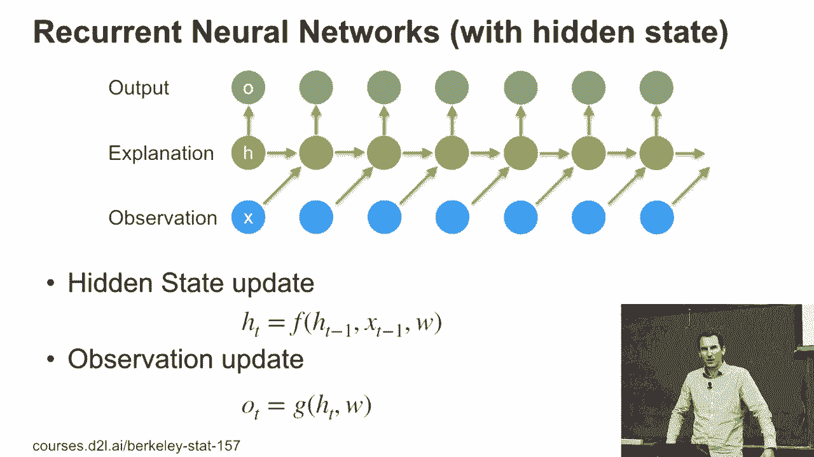
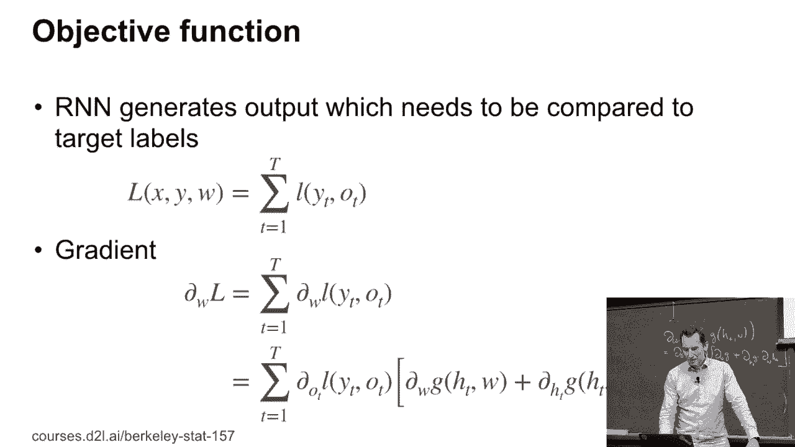
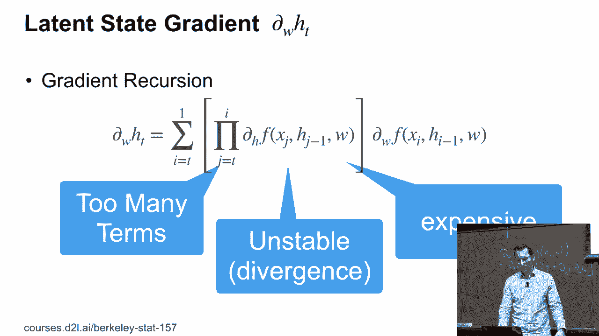
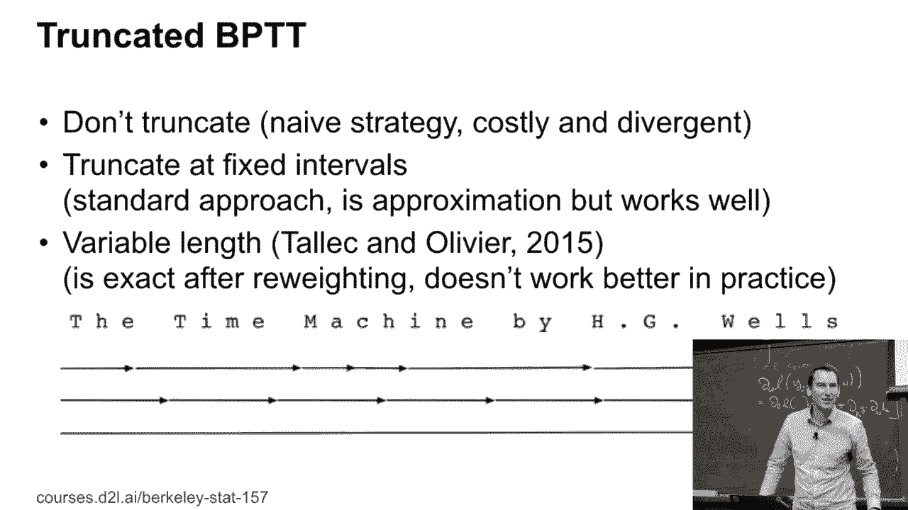
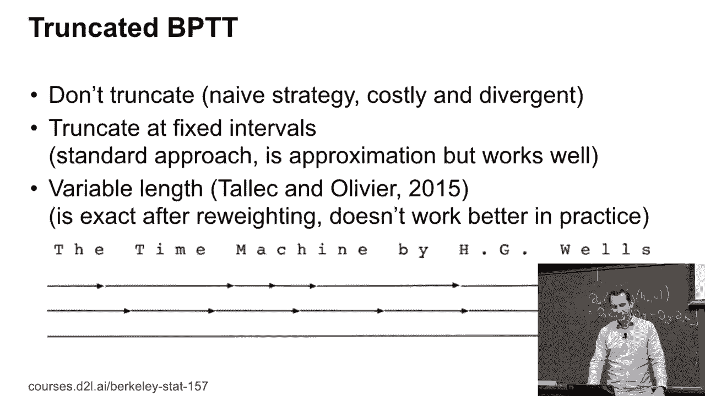
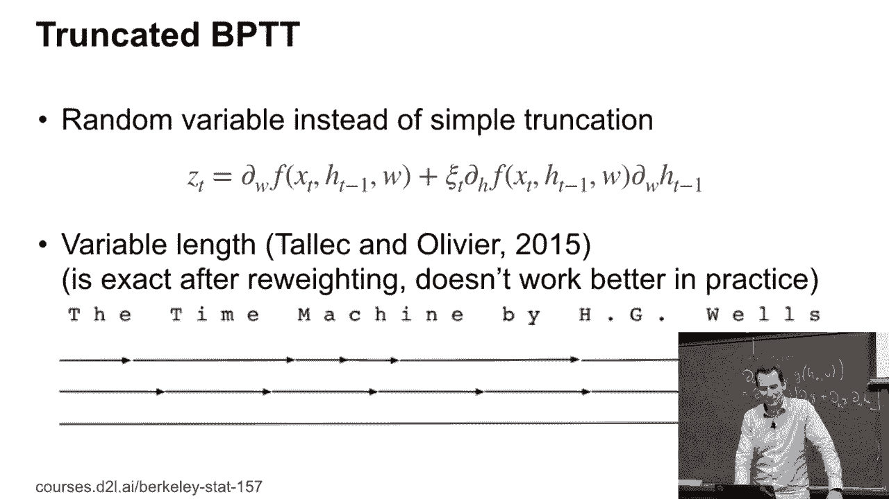
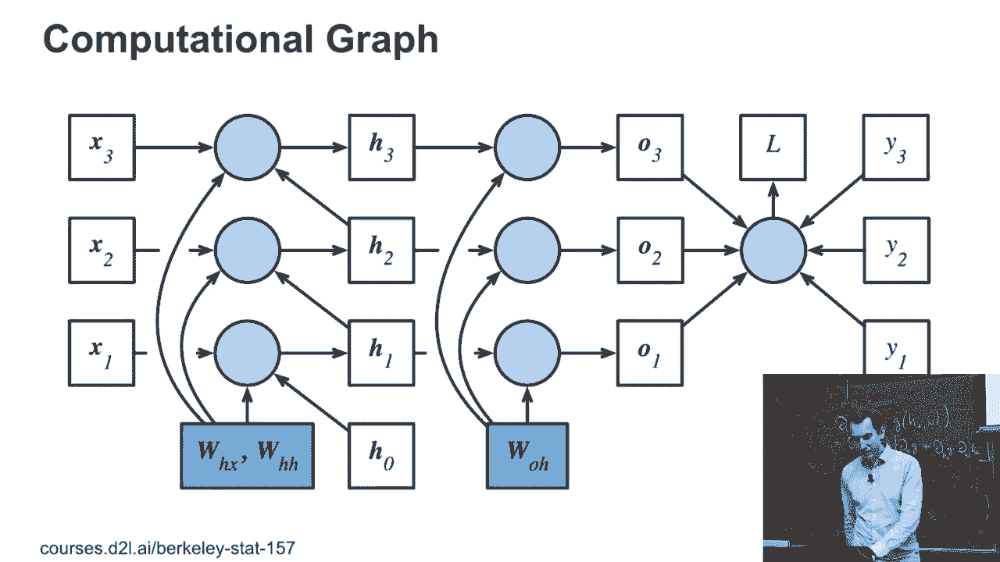
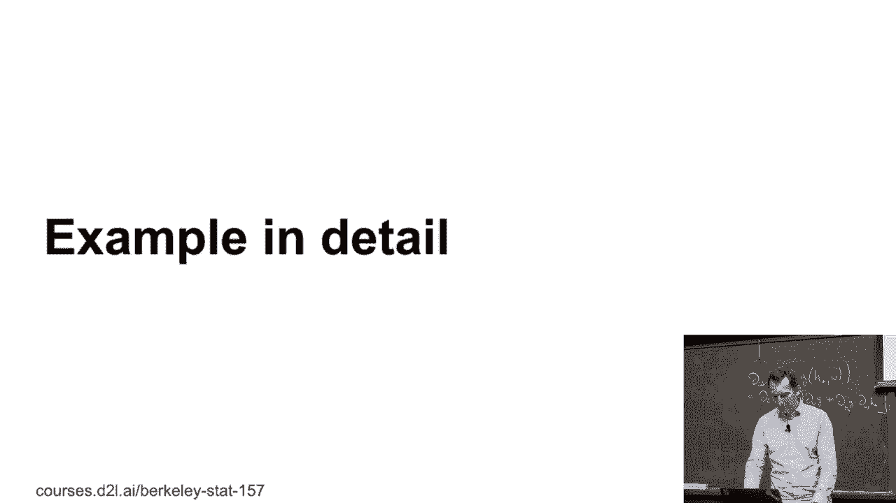
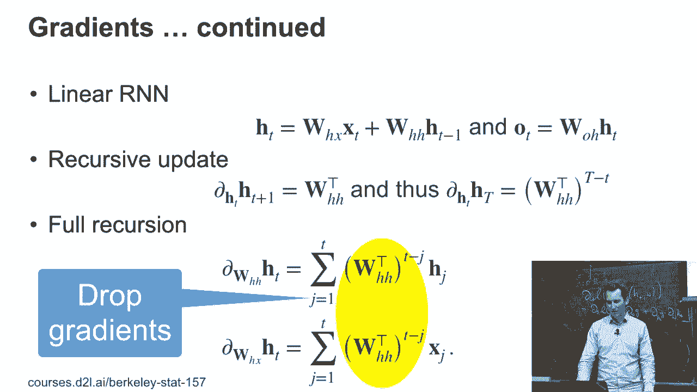
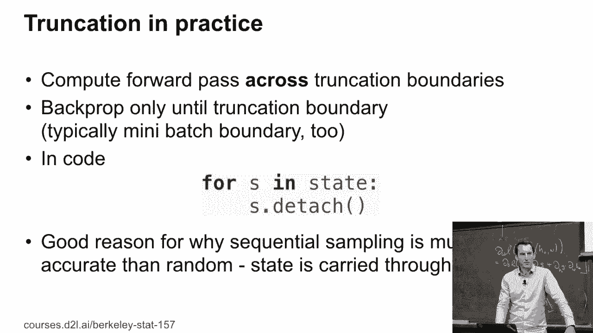

# P102：102. L19_5 Truncated Backprop through Time - Python小能 - BV1CB4y1U7P6

 It's time to look at truncated backprop。 So we actually already encountered truncated backprop。 through time before when we set up those mini batches and， then we said， well， okay。 detach gradients。 And this was kind of weird， it's like， you know， why on earth。 do you need to detach the gradients？ Let's look at the RNN with hidden state and a little bit。

 of what happens。 So let's say I have some hidden state updates， right？ So this is just very basic。 HT is some function of HT minus 1， XT minus 1， and W。 And then I have some observation。 which is given by some other， function， G， of HT and W。 So this is really completely straightforward。 This is unit vanilla RNN。

 And while different networks might have very different， characteristics， yeah。 basically any of them would work nicely。

 Okay， so now let's compute the gradients of that。 So while I have a loss， right。 in the loss I'm comparing the， output with the targets the Y's。 And so I sum over the sequence Y at T equals 1 up to capital T。 And I'm using time even though I'm talking about words。

 But that's just to indicate something that has a meaningful， sequential dependency。 And so I just sum over those losses。 Okay， now if I want to take the gradient， well， the first。 thing is easy， namely， since I have a sum， the gradient just， pulls into the sum， right？

 So now let's take the gradient of the losses and then it's just， a chain rule， right。 so I have the LDO， right？ Because the output's the only part that depends on it。 And now I can pull that chain rule further。 Namely， I have G of H and W。 So if I were to write this out， my loss is a loss of Y。 And then I have some function G， so Y， T， H。

 T， and W。 So if I take the derivative， Dw of this， then， of course， this。 is nothing else than Do of L。 Times now two terms。 Namely。 I can have Dw of G plus Dh T of G times Dw of H， T。 Right？ That's just basic chain rule。 Is everybody comfortable with that last line？ OK。 Is O just G of H， T， W？

 Yeah， that's exactly what it is。 So previous slide， O， T， is G of H， T， and W。

 That's just expanded here。 Now， everything but that very last term， is easy to compute， right？

 So because we know H， T， so Dh T of G is easy to get， well， Dw of G is also easy to get。 And likewise， the first part。 The last part is exactly what's going to give us the headaches。 And the reason why this gives us the headaches， is because H， T depends on H， T minus 1。 And with that， on all the things that H， T minus 1， inherits from H， T minus 2， H， T minus 3。

 and so on。 So it basically goes all the way back。 It's a little bit like。 suppose I say something really stupid， in the first lecture。 You might still remember it now and still think Alex is， an idiot。 Or if I say something enlightening， you might think that I'm smart or whatever。 But basically。

 you may have very long range effects。 And those very long range effects may very well。 affect how you perceive the current lecture。 For instance， if you think Alex is an idiot。 then you're probably less likely to pay attention， to what I'm saying right now。 Because， well。 you've kind of set that in your mind， right？ Or maybe the other way， right？ So long story short。

 this Dw of H， T is what we're。

 going to have fun with。 Let's actually look at that， right？ So Dw of H， T。 So H。 T is given by this function， of F of X， T， and H， T minus 1， and W。 And the first part， again。 is easy， right？ So the first part is just， well， you know， whatever。 comes from the function of the dependency from F。 The second part means we now take the derivative。

 with regard to H of F。 And then now we have Dw of H， T minus 1。 So what we've just done is we've just written out， the recursion where we get the gradient of H。 T with regard， as a function of the gradient of H， T minus 1。 and some other terms that we can easily get。 And so if you then write this out even further。

 you'll basically get the sum from I equals T down to 1， from J equals C up to I of F of X。 J minus 1， and W。 So this is basically all the past dependencies in that chain。 times then the corresponding dependencies of F on W。 Yes？ What is F usually？

 Is it like a multiple percent drawn？ Yeah。 So F is going to be-- so F and G are going。 to be fairly simple functions。 And we'll see a work through example afterwards， right？

 Is there what the R and F models as well？ Yes。 So well， there'll be a little bit fancier。 OK。 so actually we saw examples of F and G already， on Tuesday， right？

 So when we implemented our first R and N， then these were just essentially linear function。 and then maybe some tangent or some relu， or something else on top of it。 The obvious question。 well， what about more modern models， is this really the smartest thing you can do？

 And there are actually two possible directions， into which you can go。 And we'll cover them in a bit more detail。 Maybe today， maybe next Tuesday。 But we'll get to that。 For now， assume that these are fairly simple functions。

 And so here's really the issue of what happens。 If you look at this gradient， right？

 You have a lot of terms， so this is expensive to compute。 And the other thing is you basically。 end up taking products of matrices， right？ Those gradient matrices， you know， the H of F。 The problem is that if I multiply a lot of those matrices， together， then if I get unlucky。 some of the eigenvalues， will blow out， or some of them may vanish。

 or maybe the entire product will vanish。 So you will get either gradients that explode or that vanish。 The only time when that doesn't happen， is if the eigenvalues are basically pretty close to 1。 And that's very rarely the case。 So in other words， disaster is pretty much。 engineered into that problem。 That's a real issue。

 Now， this sounds all very abstract。 And yeah， so here's the example of what's happening。 So basically， let's say I have this red symbol here， the red output。 Then I need to work my way all the way back through that red， chain up to the very first H。 which the very first H could， still have had some influence on what comes out。

 That's bad news。 So one way to fix it is to say， well， let's just forget。 about the earlier part and only look at the dependence， that I've seen later。 So this looks like。 why are we doing that？ That doesn't feel right。 So people first started simply doing this without thinking。 very much about it。 And they implemented it。 And then they ran the model and it worked。

 So it's like， well， hey， we hacked it and it works。 So it must be good。 So what this simply means is I take this summer and I just。 stop somewhere by just going back in this case only maybe， two previous time steps。 And then I truncate。 It actually has a couple of rather beneficial。

 effects that might not be quite apparent。 The first thing is， yeah， this is a lot faster。 So because I just throw away a lot of the things that I， should have done， I just do less work。 So of course it's faster。 The second thing is I'm throwing away exactly the pieces。 that have many products of matrices。 So that's exactly the part that will either vanish or， diverge。

 So that's the other good thing。 The third good thing is， well， it actually has some。 regularizing effect。 Because it forces me to focus mostly on the changes that。 happened recently as opposed to changes that I would have， observed a very long time in the past。 So by essentially forcing my model to mostly take advantage， of stuff that I've learned recently。

 I can get a model， that is a lot more robust and doesn't suffer quite that much。 from the butterfly effect。 So I guess everybody knows about the fly effect is right？

 So it's essentially the thing about， hey， at some point。 some butterfly flaps its wings and all of a sudden we have a， tornado a year later in Minnesota。 Well， maybe not Minnesota， but some way where tornadoes are。 But the point is those effects where some minor change。

 initially would have affected the later state very much， you。 kind of prevent them from being engineered into your。 model and therefore overfitting too much into the past by， just truncating。 So this kind of flies in the face of what everything that I。

 said before about approximate sufficient statistics and we。 actually learn how they are done because that actually。 would assume that I am able to aggregate very nicely。 But at least I'm not propagating the effects back。 I'm still aggregating， still computing。

 Everything on that chain is just that I stop taking the， gradients beyond some part。 Any questions so far？ Yes？ So this is what you're saying。 Doing the three-one-dobby gradients at a certain time。 step doesn't affect the family that your model describes。

 just the effects of how you are addressing it。 Correct。 Well。 it actually doesn't even affect how you calculate the， estimator。 It just affects how you train and optimize the parameters。 So the forward pass is completely identical。 It doesn't change。 It's only that for the gradient computation， I compute a， slightly incorrect gradient。 Sorry。 does that kind of answer your question？ [INAUDIBLE]， [INAUDIBLE]， No， no， actually。 what will happen is that the model will， likely converge to something different。 So in that sense。 yes， strictly speaking， I am， constraining the model space by just like any other， regularization。

 But the functional form is the same。 Now， being able to prove that this is exactly what happens。 and how the model space is being constrained， let's put， this way。 If you figure this out。 this is a very nice paper to write， and you should write that immediately， because people。 would want to know。 This is not well understood。 There are a couple of type problems where people sort of。

 understand it。 There are types of regularization， and we might cover。 some of them later for how to restrict in constraining。 So for instance。 there is something called zone out， where， you simply force your recurrent neural network not to。 update the state for one step to the next。 So that's like in the lecture。

 let's suppose you zone out， for five minutes， and so your internal state about machine。 learning doesn't get updated， because you're thinking about。 I don't know going out on a date tonight。 And then once you zone back in。 your state is still the one， before you zone out， and that to some extent。

 supposedly it regularizes the way how you learn。 Not sure I'd recommend that zone out for this lecture。 because you might have to rewatch it on video， but these。 are techniques to make the state estimate a bit more robust。

 So let's actually have a look at what this looks like in， practice。 if we have something like the time machine， of HD Wells。 what you could do is you could just take the， entire chain， and that's the bottom arrow。 and then I have， to backprop through everything， and that's very expensive。

 Or I could truncate that fixed intervals， that's the middle， line， and it's an approximation。 but it rocks really well in， practice。 Or what you can do in this is fun paper by TALEC and Olivier。 in 2015， you basically use an estimator to replace this， exact sum。 and I'll show you the math for that on the next， slide。

 where you essentially use a random length to truncate。 Yeah， so I'm going back to previous slides。 so does I just。

 include like two or detaching the gradient？ Yep， so detaching the gradient is what you do in practice。 You're spot on， very good observation。 So detaching the gradient simply means stop taking any more。 derivatives beyond a certain part。 Any other questions？

 So there's variable links， so that's what TALEC and Olivier， did， and this is exact。 Basically what you do is you just reweight the longer。 segments with a higher weight than the shorter ones， and you。 have a suitable distribution over that。 And you can argue that this actually， so here's the math。

 what happens。 Basically， what I do is in my recursion， I have a random， variable that's 0 or 1。 or rather 0 and 1 over 1 minus p。 And so therefore， with some probability， I just stop。 because once this random variable， psi t is 0， then， that recursion stops。 And if it's non-zero。 then it will continue， and then I， need to continue that chain。

 So that's what you get with that top line。 And if I make it so that in expectation， psi t has an。 expectation of 1， it just takes on value 0 and then 1 over 1， minus p。 Then you get an exact。 and you get an unbiased estimate of， the gradient。 The trouble is it doesn't actually work any better in， practice， so this was a neat paper。

 It has probably about 10 citations， maybe after this， course it gets another 20。 It's a cute idea。 but the fact that something else is going， on as well in truncated backdrop， namely that it。 constrains the model a little bit more， is one of the， reasons why basically you don't do that。 But maybe somebody can make it work。 So let's actually look at the computational graph。

 So this is for a three-step HMM， a very explicit model。

 where we just write the equations first。 So if ht is WHX times xt plus WHH times ht minus 1。 and then， ot is WOH times ht。 So it's an entirely linear model。 So nonlinearities whatsoever。 this is really about as。

 dumb and simple as it goes。 So let's look at the graph。 So I start with some h0， then I observe x1。 so I get h1， then I get h2， then I get h3。 And this is then mangled with WOH。 So this is the second weight matrix in the middle， and then， I get the output。 Then this is compared with all the yi's， and this gives me， my loss。 So that's the dependency graph。

 what's actually happening on， a computer， basically in the MXNet or PyTorch or TensorFlow， runtime。 when you implement this。 Well， they're going to do something a little bit fancier。 to how to tie parameters together， but short of that。 That's pretty much what's going on。 Any questions about that graph so far？ Yes？ Is it basically very straightforward to transition。

 to instead of being three-state or four-state？ Well， you would basically chop off one layer， right？

 So if you were to chop off the top row， short of the L， obviously。 then you get something that has only two， int states。 If you were to add another layer on top。 you'd get， something with four int states。 It's just another time step。 This is just unrolling everything in its most， excruciating detail。 Yes？ [INAUDIBLE]， Oh， OK。 OK。

 So let me be more specific here。 So with hidden states， I mean one state per observation。 Now。 what you're probably thinking of is hidden units。 So hidden units。 that's essentially the dimensionality， of H。 And I can pick that to be one。 or I could pick it to be 10，000。 That is essentially the richness， the capacity of how。

 much I can store in that hidden state。 That's a separate design parameter。 That's something I can easily adjust。 The number of hidden states is essentially one per clock。 So one， for every time the RNN does something。 Now， there are exceptions to that rule。 For instance。 if I have an LSTM， I will have two hidden states。 And one is the hidden state。

 And then one's called the memory。 And we'll cover that later today。 But other than that。 what you're thinking of is， probably dimensionality。 Now， there's something else。 You can ask。 can I make it more linear， more complex？ And that is in the depth of the network。 And we'll probably get to that next week。 So I guess， why would you want more or less hidden units？

 I knew you would have infinite number of hidden units， right？ So you process it against that。 OK。 so having more hidden units doesn't let me do anything， faster。 What it does is it simply allows me to store possibly more， information in my hidden state。 So if you can assume that your hidden dynamics is very simple。

 then maybe you don't need a lot of dimensions in the hidden， state。 Maybe we can actually play with that a little bit later。

 So let's see。 Let's actually work this out just to make this more explicit。

 So now all the weight vectors have names。 So WH is output times hidden state， HH is hidden hidden。 HH is hidden observed。 So WH， that's an easy one。 That's basically dOT of LOT and Y。 That's easy。 WH， well， that's the one that's going to give us headaches。 Because if you look at it。 that's d WH of HT。 And then we have the last one， d WHX of HT。

 So this is completely straightforward。 Now let's iterate。

 So we get the recursion， namely dHT of HT plus 1 is WHH， transposed。 So in other words， therefore。 if I have H capital T， and I， want to take the derivative with regard to H， little T。 that's WHH transposed to raise， the power of capital T minus little T。 So there you can already see very explicitly what， I meant with gradients misbehaving。

 Because if that power of the matrix WHH has some eigenvalues， that are larger than 1。 they will go to infinity， basically， that they grow exponentially。 Whereas if I have some eigenvalues that are less than 1， the corresponding spaces will go to 0。 Yep？

 So are we two of these W-matrices， right？ Why can't we just apply some sort of like spectral。 normalization or something to use the derivative？ That's a--， OK， that's actually a great idea。 Can we make these matrices well conditioned？ So in the fully linear case， you could possibly。 do something like that。 You might then have to deal with the fact that you're actually。

 now performing optimization on a manifold， because you're。 basically taking the updates and projecting back。 And that may give you weird behavior in your gradients。 Because if you--， let's say on the surface of a sphere， and if I'm sitting here。 this is my gradient。 Can I move here， and I need to transport back， and I then。

 move here and I transport back？ So weird things like that may happen， but maybe you could。 fix that with math。 The thing that's harder to fix with math is if you have。 another nonlinearity following it。 So in practice， it's not going to be just WHH， but it's。 going to be some functions of interactions of that with， some other data。

 And that's where essentially your mathematical safeguards， will no longer do you much good。 But it's a very good suggestion， and for a linear system， people actually do stuff like that。 Basically， if you look at the full recursion， while you see， basically sums of powers of W's。 and then you just throw away， the things that you don't like。 And so what you're doing in practice。

 and this was exactly。

 the astute observation from before， you just call detach。 And that's also one of the reasons why random sampling， of the data isn't such a great idea as。 sequential sampling is going to be better。 Good。 So this is essentially all that is to truncate a backprop。 Any questions？ Yep？ Are we detaching all of the states？

 So you do that at the beginning of every mini batch。 And so what's actually happening is that you have， slightly variable links within the mini batch。 so you get， actually a little bit of a portfolio of dependency ranges。 Because you have all the subsequent parts。 But basically， you're detaching between mini batches。

 Yes？ For the terms we care about， the gradients are reattached， during the wizard homograd。 No。 OK。 so I basically go and say， well， up to here， this is like， you cut the tape here。 You go and record more and more and more things。 And now for the new things that you record。 autograd will， compute the gradients。 It's just that you've cut your dependency graph here。

 So autograd isn't going to reattach things， but it will。 just follow up on the path that are remaining。 If you want to do fancy graph surgery。 that requires that， you probably look a little bit more into the MXNet engine。 But short of that。 this will pretty much do the trick。

 OK。

 And with that， we--。