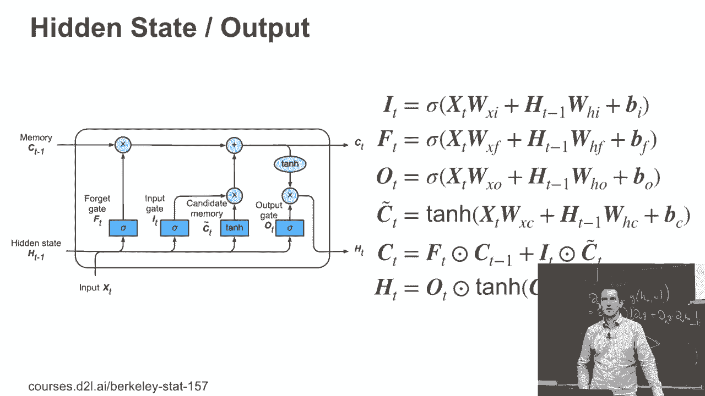

# P105：105. L19_8 Long Short Term Memory - Python小能 - BV1CB4y1U7P6

 So long short-term memory。 So this， there's a fun story to it， or several stories。

 So if you haven't heard of Yürgen Schmittuber， he's a very memorable researcher。 You should check him out。 But basically at some point， so the story goes， you're a， great angel。 at least this is the version from Yürgen， that I've heard。 Post the question to Yürgen Schmittuber about， you know。

 remembering things in time series and so on。 And while the story goes， then basically you're。 engineered something called long short-term memory。 And actually the guy who really did it was the poor writer。 And he， I think。 master student at the time。 And where they probably started was， this was like， 1980， '97， '98。

 And at that time this was a strange paper。 I mean， I knew about it。 It was like， okay。 yet another weird neural network paper。 Well， what's the point？ Right？

 And that's pretty much what everybody thought。 And I think it was a very， very， very difficult。 And I think it was a very difficult thing。 And I think it was a very difficult thing。 And I think it was a very difficult thing。 And I think it was a very difficult thing。 And I think it was a very difficult thing。 And I think it was a very difficult thing。

 And I think it was a very difficult thing。 And I think it was a very difficult thing。 And I think it was a very difficult thing。 And I think it was a very difficult thing。 And I think it was a very difficult thing。 And I think it was a very difficult thing。 And I think it was a very difficult thing。 And I think it was a very difficult thing。

 And I think it was a very difficult thing。 And I think it was a very difficult thing。 And I think it was a very difficult thing。 And I think it was a very difficult thing。

 And I think it was a very difficult thing。 And I think it was a very difficult thing。 And I think it was a very difficult thing。 And I think it was a very difficult thing。 And I think it was a very difficult thing。 And I think it was a very difficult thing。 And I think it was a very difficult thing。 And I think it was a very difficult thing。

 And I think it was a very difficult thing。 And I think it was a very difficult thing。 And I think it was a very difficult thing。 And I think it was a very difficult thing。 And I think it was a very difficult thing。 And I think it was a very difficult thing。 And I think it was a very difficult thing。 And I think it was a very difficult thing。

 And I think it was a very difficult thing。 And I think it was a very difficult thing。 And I think it was a very difficult thing。 And I think it was a very difficult thing。 And I think it was a very difficult thing。 And I think it was a very difficult thing。 And I think it was a very difficult thing。 And I think it was a very difficult thing。

 And I think it was a very difficult thing。 And I think it was a very difficult thing。 And I think it was a very difficult thing。

 And I think it was a very difficult thing。 And I think it was a very difficult thing。 So the first thing we have to do is we need to go and design gates。 And those gating functions are exactly the same as before。 We have IF and O。 And they are just sigmoid offs。 They're in some linear function of input and hidden state and then some bias。

 So far this looks pretty much the same as before。 Just that we have three before that we have two。 And with three you can do more than with two。 So fine。 So the next thing is let's look at the candidate memory。 And this is where things get a little bit interesting。 So our candidate memory cells。

 this is not the hidden state。 It's the memory。 It's basically given by， well。 some linear function of the hidden state。 And the input。 And that's the memory。 Okay。 So remember you can basically read stuff into memory on a memory cell， like in electronics。 And so they designed this。 Okay。 And so then， well。

 the next thing is I need to decide whether to forget something。 And so they forget， okay。 is exactly the thing that helps me decide whether I should just keep what I have before。 Or whether I should update it to the new thing。 It's the new C tilde。 So this is a little bit similar to what we have before with Z and the GRU。

 But now this just operates on the memory。 Right now that memory doesn't do anything useful yet。 It just is there。 You can't read it。 You can't do anything with it。 But we've already used up one gate to just decide whether we should reset the memory or how we should update it。 Okay。 And then now comes the fun thing。 Namely， the hidden and output gate is just the output gate times。

 well， tang of that memory cell。 Okay。 So remember this h t actually then is used to， you know。 manipulate the memory again。 And then this is used again to manipulate the hidden state。 So that's why you really need two of those variables to carry around with you all the time。 So this was probably a little bit long-winded and complex。

 Here's the entire thing in its full glory。 So I have three gates， I F and O。 So input。 forget an output。 Have candidate memory， see tilde。 I have the actual memory， see。 And then I have the output that's just some function of the memory。 Okay。 So this looks like， well。 okay， it's more complicated。 We are moving more towards a Rück-Golberg machine。 But yeah， okay。

 why not？ But it does very similar things that we discussed before。 just that they have a little bit more， expressive freedom in how I parameterize things。 Okay。 Any questions so far？

 Okay。 Well， in that case。