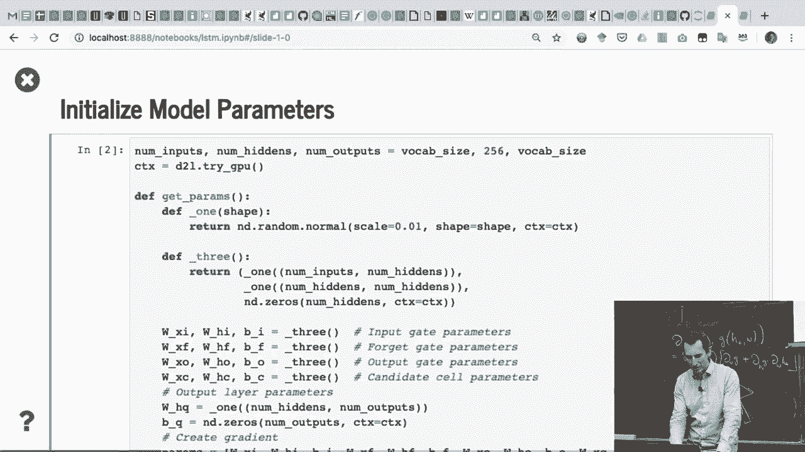
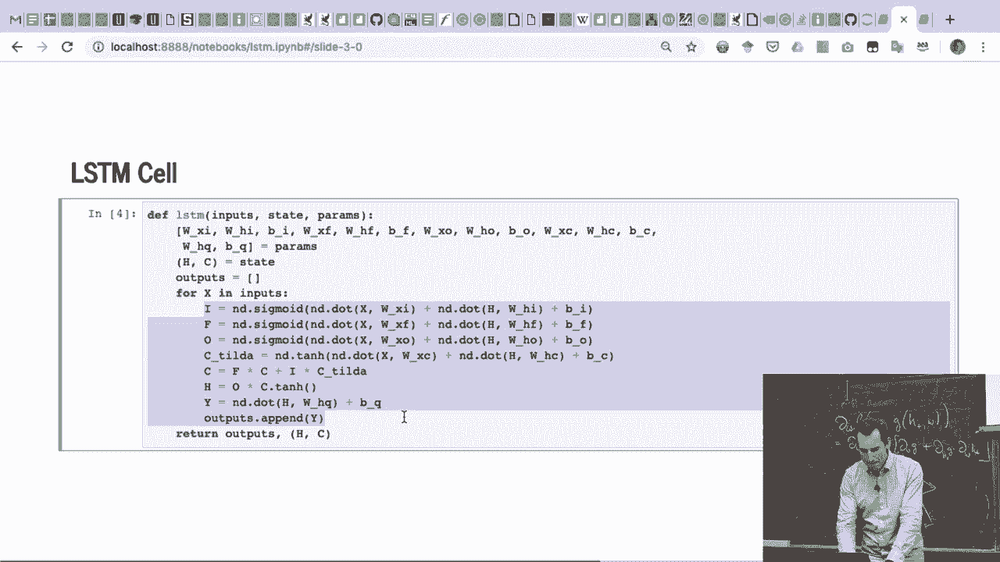
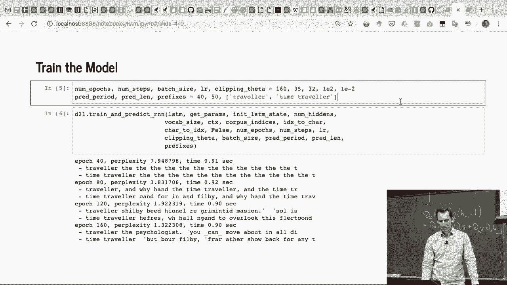
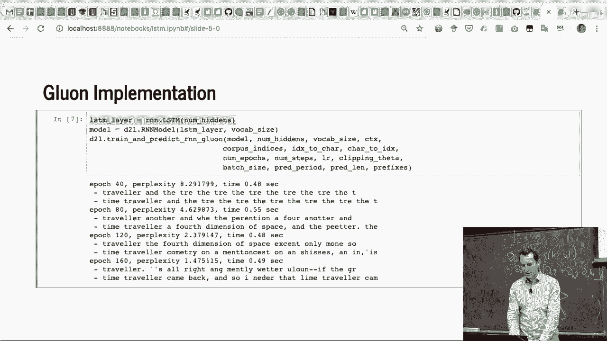

# P106：106. L19_9 长短期记忆网络在 Python 中的实现 - Python小能 - BV1CB4y1U7P6

让我们来看一下 LSTM 代码。第一件事是加载数据。

所以这与之前完全相同。

然后我们需要初始化参数。再次强调，参数初始化方法与之前相同。只是我们多了一组权重向量，对吧？所以我们再次使用正态高斯分布来初始化，偏置为 0，并且它们有三组参数，对吧？输入门，遗忘门。

还有输出门，以及候选单元的参数。我们在这里停一下。然后，当然，我需要输出。好了。现在我把所有东西都整合在一起。然后，“魔法”就发生了。我得到了附带梯度的参数。这就是我返回的内容。所以，这变得有点无聊了，对吧？这和你之前看到的代码完全一样。

接下来我们需要做的事情。

我们需要初始化状态。其实，这没做什么别的，只是返回。在这种情况下，返回的是两个全为 0 的向量。我为什么现在返回两个全为 0 的向量，而不是返回 1 呢？

完美无缺。所以，这就是完全正确的——我们有一个状态，还有一个记忆单元。两者都需要传递下去。所以记住，记忆单元只是静静地存在那里，在后台做事情。我不能直接读取它，但它仍然需要随我一起携带。

接下来我们看到的是，稍后我们将查看实际的代码。

现在，隐藏状态实际上会将内容分解为这两个部分。

所以，这就是魔法发生的地方。这里是我的参数。我只是将其分解。这个过程可以很方便地在 Python 中完成。现在，我将我的状态分解为隐藏状态和记忆状态。现在，输出仍然为空。现在，这基本上就是 LSTM 的数学原理。

所以我有我的三个门，IFNO，全都带有 sigmoid 函数。我有 CTIL，它包含候选记忆单元，并带有 tanh 函数。它对所有内容进行操作，对吧？

你可以看到括号中的绿色部分，指代的是所有这些。我然后使用候选值和相应的遗忘门，得到实际的记忆单元。接着，这是输出。就是这样。然后你只需要返回这个。所以这实际上与我们在幻灯片上看到的内容完全一样，只是更详细一些。

然后，训练过程和之前完全相同。步数等设置也是一样的。

由于我们时间有点紧，实际上已经没多少时间了，我不会运行训练了。但如果你运行它足够长时间，你会看到它比GRU稍微好一点。是的，现在你可能会问，如何在GLUON中做到这一点。

嗯，之前我们看到的唯一区别是，现在你不再调用RNN.GRU，而是RNN.LSTM。然后按下U-F-U-LSTM。另一个要注意的地方是，这个速度较慢。所以在之前，我们有0.3秒，现在是0.48秒。

在这里是0.9，而不是0.7或者0.8。基本上，好吧，我的笔记本电脑在后台做一些事情，所以它会变慢。但基本上，时间应该差不多。然后你运行这个，你就得到了LSTM。很好。现在，做任何更复杂的事情，就是我们下周二要讲的内容。然后我们会深入探讨。

我们将采用双向（bidirectional）。我们也许能稍微有机会看看词嵌入（word embeddings）。所以，感谢今天的内容。

保重，下周见。
