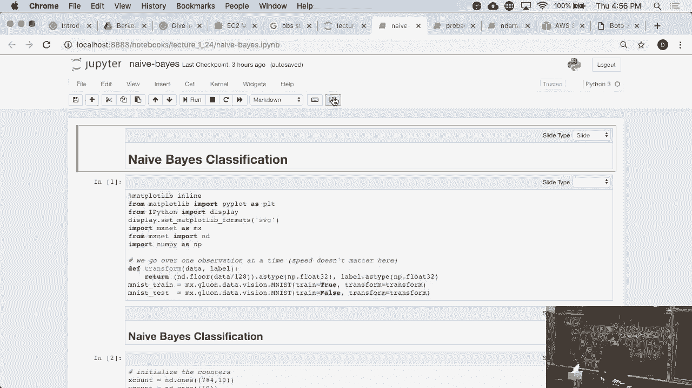
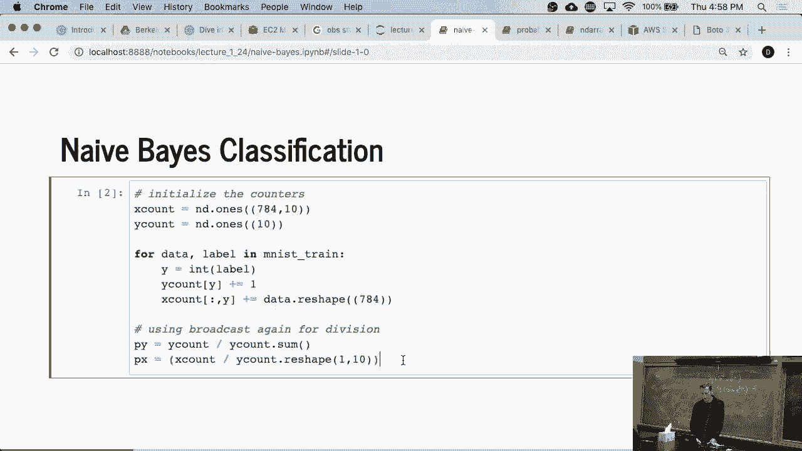
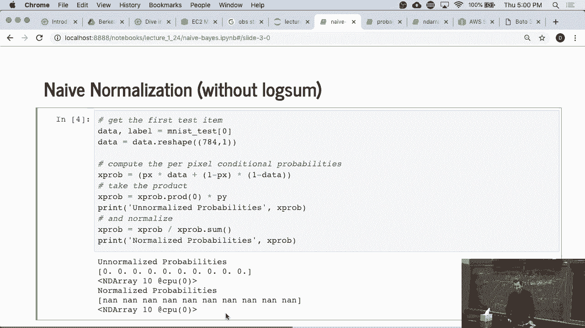

# P11：11. L2_6 Naive Bayes Jupyter - Python小能 - BV1CB4y1U7P6

[笑声]。

所以我们可能会超时两到三分钟。希望你们没问题。让我们简要看一下朴素贝叶斯。我们将进行常规的导入，导入 MXNet 和 DRA，并且我们还会导入 NumPy。另一个要点是，我们实际上将加载一些训练数据。由于是 MNIST 数据集，它是一个图像数据集。

这只是一个标准的图像加载器。

所以朴素贝叶斯，我们要做的是，我将分配计数统计量。y 计数是相当直接的。它只是出现的次数。这是一个数字分类数据集。我们有从 0 到 9 的数字。所以我需要 10 个维度来存储 y 计数。而对于 x 计数，嗯，由于这些。

图像是 28x28 像素，我总共有 784 个维度。这些像素只有黑色或白色，乘以 10，因为我有 10 个类别。所以我基本上需要为每个类别计算每个像素被激活的次数。这个代码做的事情并不特别令人兴奋。除了它只是遍历所有数据，并且为特定标签增加某些东西。

比如说，如果这被标记为数字 3，它将对 x 计数的第三维度添加某些东西。然后最后，我们去除以观察总数，类似地。我们对像素也进行这样处理。

所以非常简单。然后如果你看这个，嗯，这些看起来比较--。这些是我们平均样的数字。这基本上是所有 0、1、2、3 等数字的叠加。类概率接近 1/10。现在，这实际上是我们进行分类所需的所有信息。

我们要做的是，取这些数字与我们新的测试图像的重叠部分，使用这些重叠部分来估算概率。我们做的一个可怕的假设是，所有像素都是独立的。

这显然是愚蠢的，但让我们看看会发生什么。

这只是为了说明，如果我没有正确归一化，事情会严重出错。所以我正在计算 x 概率。这基本上是那个像素开启的概率乘以 1 减去那个像素关闭的概率。所以这是因为我的测试图像是 0 和 1。所以基本上，对于所有像素开启的地方。

我需要查看 px。对于所有像素关闭的地方，我需要查看 1 减去 px。这些是介于 0 和 1 之间的概率。然后我把这个项乘以--。所以我对这些概率进行乘积，因为我们对每个像素都有这些概率。所以我得到 784 个数字，再乘以 y 概率，适当地在零维度上。

因为我们需要 10 个类别。然后我得到相应的概率。如果我想做--。你会进行归一化，确保它们的和为 1，我除以这个。然后如果我这样做，我得到的就是垃圾。

你应该重新运行这段代码。它在你的笔记本上不会花太长时间。现在，如果我稍微小心一点，我会做的是对所有这些概率取对数。所以这是 log px 和 log py 以及 log px neck。现在，我不再是进行乘法运算，而是进行加法运算。所以我得到这个。然后如果我运行这个，哇，奇迹发生了。

一切进展顺利。

所以对于这里的这些数字，我得到了一些实际上相当有意义的东西。这些是这些数字的条件类概率。如果你把 Tard 给弄进来，你会看到这里应该是 7，那里应该是 2，那个地方是 1，0 就在那里。

所以它运行得相当不错。好吗？

你可以计算总体的准确率，我们大约有 15% 的误差。这是基准。我们很快就会看到深度网络，它们会把这个基线打得像气球一样。但那是下周的内容。所以非常感谢你们再耐心听我多讲一点。

我们将在周二继续进行更多内容的学习。
