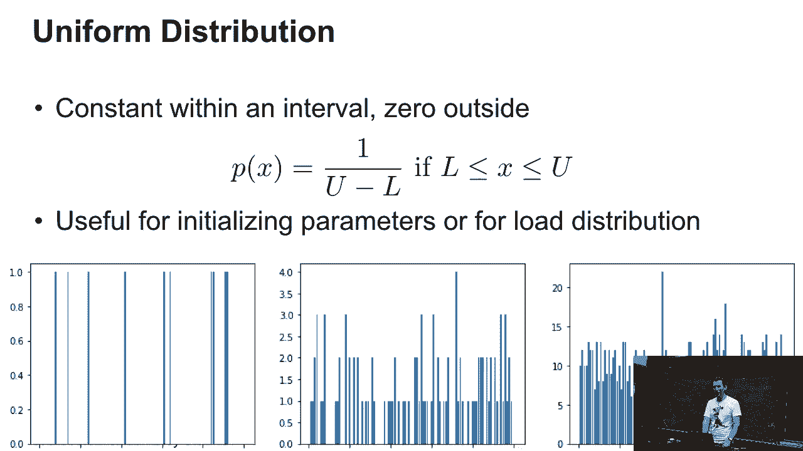
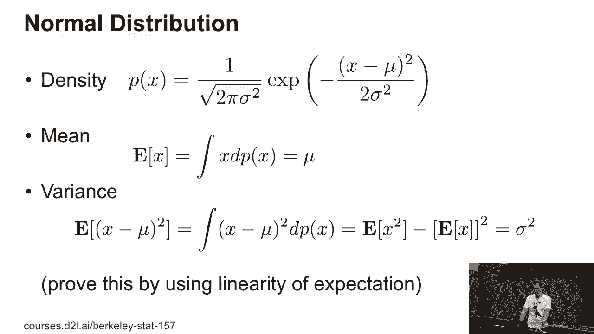
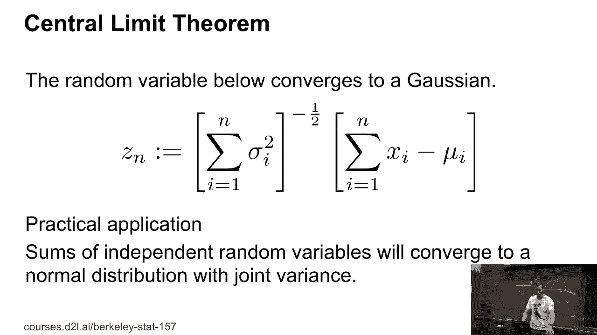

# P12：12. L3_1 抽样 - Python小能 - BV1CB4y1U7P6

好的。这是周四课上剩下的内容，即抽样。所以，我的意思是，你们可能已经习惯了一个决定性的操作，那就是如何进行抽样，对吧？

你们有没有在生活中实现过一个样本？好吧。在做完这个作业后，所有的手都会举起来，因为实现一个样本将是你们需要做的作业之一。好的。那么，我能选什么最简单的分布呢？嗯，实际上是一个均匀分布。

这很简单，对吧？在均匀分布中，嗯，我做的是，我只需要说，好吧，你知道，有一个区间从L到U，也就是从下界到上界。在这个区间内，所有值发生的概率是相等的。超出这个区间，什么也不会发生。你典型的均匀随机数生成器就是这样。如果从中抽取10次，100次。

然后我重复1000次，你会看到结果开始看起来越来越均匀，但还不完全均匀。我的意思是，显然我没有画得足够细，因为如果画得足够细，线条会非常窄。所以你会看到一些地方稍微高一些。我会在某个点进行量化。但这本质上就是从均匀分布中抽样的结果。稍后我们会在实际中看到这个过程。

现在，稍微有趣一点的情况是，从离散分布中抽样。所以这是一个非常愚蠢的语言模型，对吧？这个语言模型有六个词：the、and、how、C、is、white、A。嗯，好吧，这些词语没有什么意义，但我已经给它们附上了一些概率，对吧？

也许某个词的出现概率是10%，而另一个词的出现概率是5%。所以，我可以通过暴力方法，从这个分布中抽样，时间复杂度是线性的。好的。那么，我该怎么做呢？我的意思是，首先我们假设这些数字加起来确实是1。如果它们不加起来是1，那么就有点尴尬了，但我们就假设它们加起来是1吧。

我可以做的是，取一个介于零和一之间的随机变量。然后，我可能在这里抽取一个值。好的。接着我就遍历整个数组，并从中减去0.1，再减去0.05，再减去0.05，再减去0.1，再减去0.2。

然后突然在下一次减法时，我得到一个小于零的值。换句话说，我只是继续从随机变量中减去所有的概率，直到得到一个小于零的值。现在我知道我已经进入了那个区间。所以，这就是你如何从离散分布中抽样的过程。

概率分布。现在，这个代价非常高，对吧？因为如果我有n个结果，我需要平均抽取大约n/2次。好吧，有人知道我该如何重新排列上面这个概率分布，以便最小化减法的次数吗？好的，确切地说，我会将它从最大到最小排序。这样做的话……

因为你知道，我会这么做，因为基本上这里的某些东西需要所有这些操作，对吧？所以这将给我一个比线性时间更快的算法，特别是如果我大多数事件的概率非常非常小，那么我真的只关心大的块，只偶尔需要处理……

付出稍微多一点的费用。这不是一个坏主意，但你可以做得更好。所以，做得更好的一个方法是，如果我构建一个堆。假设我有整个概率集，像这样，我把它们组合在一起。将它们组合在这里，然后我对这两个进行求和，对这两个进行求和，以此类推，直到向上。

现在如果我沿着这个堆向下走，嗯，如果我的随机变量大于这些项的和，我就知道我需要在这里。所以，这实际上就是实现了二分查找。好的，给你们一个难题。这不是作业内容，但这是一个有趣的问题，值得你们思考。我可以在这里就地构建这个堆吗？

需要超过n个条目？我的意思是，显然这必须是可能的，因为这些是这些数字的线性组合，对吧？所以，如果我这里有n个数字，那里有n个数字，就必须这么做。那么想想看，你会用什么数据结构以及什么条件。这个问题可能是个有趣的问题，无论如何值得思考。它不是完全无用的，因为……

如果你设计任何采样器，也许是为了你的项目，或者在你未来的职业生涯中，你可能会非常需要回到这种数据结构。还有很多其他的复杂数据结构，超出了这一点。如果你上任何关于MCMC方法的课程，尤其是那些注重数值计算的课程，它们可能也会研究像这样的技巧。所以，这在很多情况下是有用的。

数学可以轻松地让你在数量级上提升速度。好的代码可能只能让你提升50%的速度。好的，现在当然，我们稍后会估计这些概率。

我们只会使用这个最大值来进行计算。现在，如果我们掷骰子，之前的情形是类似的。你知道，如果我掷12次，你会期望每个结果出现两次。但例如，2并没有出现过一次。所以，只有当我们抽取更多时，我们才会得到接近平均值的结果。好的，我们将精确地观察这个转换率。

片刻。但对，显然这些家伙不行。现在，另一个问题是正态分布。

所以密度是相当简单直接的，对吧？我的意思是每个人都看过。正态分布。所以在德国，曾经有一张纸币，一张薄的德国马克纸币，实际上上面印着正态分布的方程。这是。高中生最喜欢的Exi-Ampre，因为当然你可以带上它。

合法货币进入课堂。但好吧，现在我们有了欧元，所以这个已经不再适用。但无论如何。这就是正态分布。我想这个图应该不会让任何人感到惊讶。好的。所以显然有一些有用的量与此相关。比如均值和方差。均值是mu，方差是sigma平方，它们由以下给出。

你知道，x乘以x的积分dp。方差只是dp x乘以，嗯，在这种情况下是x减去mu平方。然后，嗯，我们有一个非常好的分解成x平方的期望和x平方的期望。好的。谁以前看过这个推导？大概有60%到70%的人。好的，我会快速做一下，只是为了复习。

这只是回顾了期望的线性性质作为游戏。所以x减去mu的期望是。 当然，除了x平方的期望减去2u x加上mu平方之外，别无他法。好的。所以这是个好消息，因为我们可以拆解这三项。因此，我们有x平方的期望加上x平方的期望减去2 mu乘以x的期望。然而，现在。

这是我可以做到的，因为通过线性性，我可以将其从期望中提取出来。现在。幸运的是，这两个项随后会相互抵消。对吧？所以我得到的是负号。好的。所以这是一个非常简单的分解。但，好吧，那它为什么有用呢？假设你正在一次观察xi的值。你想得到均值和方差，对吧？而且。

你知道，如果你看这个，我的意思是它看起来像是不可能完成的任务，对吧？因为。我的意思是，你需要知道均值才能得到方差。但鉴于此。我可以计算x平方的滚动平均值和x的滚动平均值。然后当时机来临时，我只需实例化这个。好的。那应该是相当。

直接明了。很好。现在，我们有一个叫做中心极限定理的东西。这是一个非常有用的性质。它是关于均值和它们行为的最基本性质之一。基本上假设我有一些随机变量xi。我去做。减去它的适当均值mu i。然后我知道这些随机变量的总和。

变量的总方差将是各个方差的和，对吧？

因为所有这些随机变量，至少如果它们是独立的，这个条件就成立。对吧？否则就不成立。现在，如果我去重新缩放，使得这个随机变量具有零均值和单位方差，零均值来自于我逐个减去均值，而单位方差则通过除以来获得。

总体方差。那么我得到一个具有零均值和单位方差的随机变量。可以证明，在合理的规律性条件下，当 n 趋于无穷大时，比如 sigma i 平方不太大，这会收敛为高斯分布。所以这是一个很好的理论，但它在实践中真的很有用，因为这会发生。

相当快。所以，十几个随机变量就能给你一些表现得相当不错的东西，至少如果个体成分看起来不错的话。好的。让我快速给你举个例子。嗯，是的，我从Grace Wabbe那里学到了这个推理，最初它是完全令人惊讶的。假设我有一个函数，它只是一个。

指示函数，对吧？它的值可能从-1到1。所以这就像是从-1到1的卡方分布。假设它在这里的值是1/2。那么你可以看到这就像是从-1到1的均匀分布。如果我去折叠并且把这个东西和自己卷积几次，那么很快你就能看到，如果你将它和自己卷积。

那么我就把这个东西叫做 p1。嗯，实际上我叫它 b0。所以 b 样条和 b1 当然看起来是这样的，b2 也将是这样的，依此类推。然后你可以证明这个东西很快会收敛为高斯分布。但你必须根据中心极限定理重新缩放这个东西。基本上你。

可以调用中心极限定理来证明，通过适当的重新缩放，在将其与自身进行无穷次卷积的极限中，我会得到高斯分布。所以这是利用中心极限定理在泛函分析中证明的一个结果。Neatrix。是吗？哦。是的，还是很有必要覆盖这个内容，因为我们将会做卷积，而它们不仅仅共享。

它们实际上共享数学公式。所以，如果我有某个函数 f 和 g 的卷积，那么它被定义为 f(x) 乘以 g(，z - x) dx 的积分。所以我基本上是在计算两个函数之间的重叠，并且第二个函数已经被移位到两边。这就像是你在应用的滤波器。例如，如果我想要。

要对音频应用低通滤波器，我会把音频信号和你知道的、看起来合适平滑的东西进行卷积。所以，比如你可以做的一个方法是，你可以把相邻的采样值做平均，这样就能得到一个低通滤波。但确实有更好的低通滤波方法。是吗？好的，我不确定我对此非常擅长。

这一部分你可以理解为是计算在这种情况下它与自身之间的重叠区域，对吧？就只是这里的那个区域。或者更一般地说，你有一个函数可能像这样做的，另一个函数像那样做的。现在你计算的是逐点的乘积并且对所有逐点乘积进行积分。好的。

这是g。但是你实际上需要翻转g。所以它就像是一个内积。对吧？

那么它是怎样的？它是交换的吗？是的，在这种情况下，你实际上可以推导出它是交换的。所以它有一些不错的属性，比如说它具有谱保持的特性，等等。所以没问题。上信号处理课时，你可能会花半节课的时间做卷积，至少在基础课程中是这样。我们只需要非常基础的。

这是计算机视觉中的一些非常基本的属性，我们不会讨论一维卷积，而是二维卷积以及更高维度的卷积。所以，你基本上是遍历图像，并适当地使用平滑处理。好的，现在这听起来像是很多理论，让我们实际上尝试一下实践。

