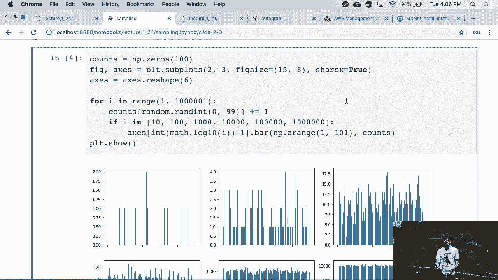
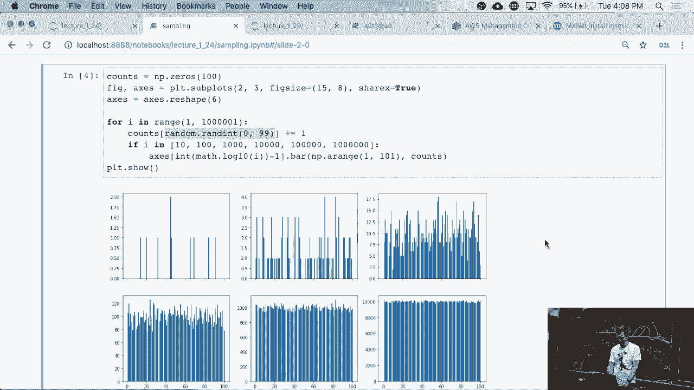
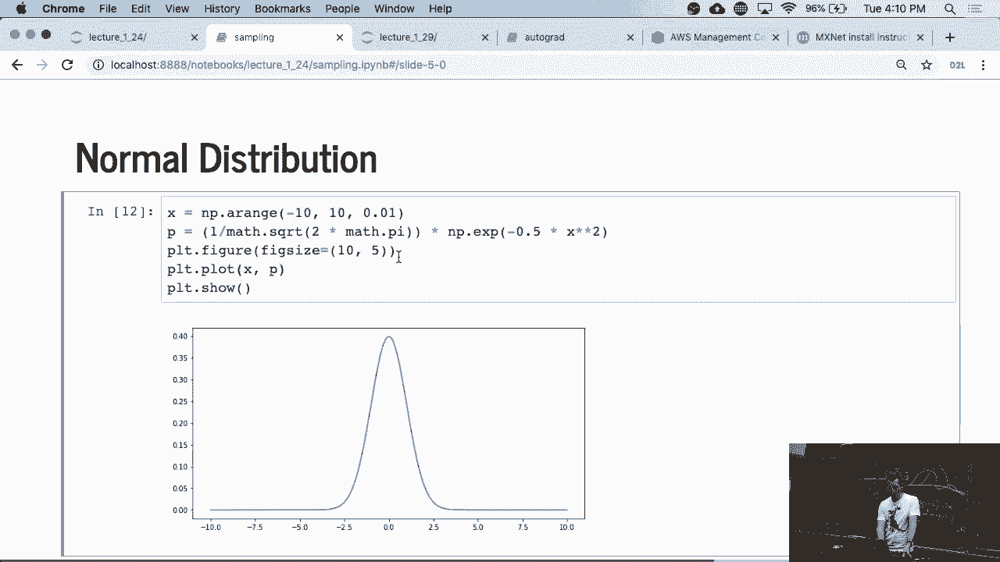
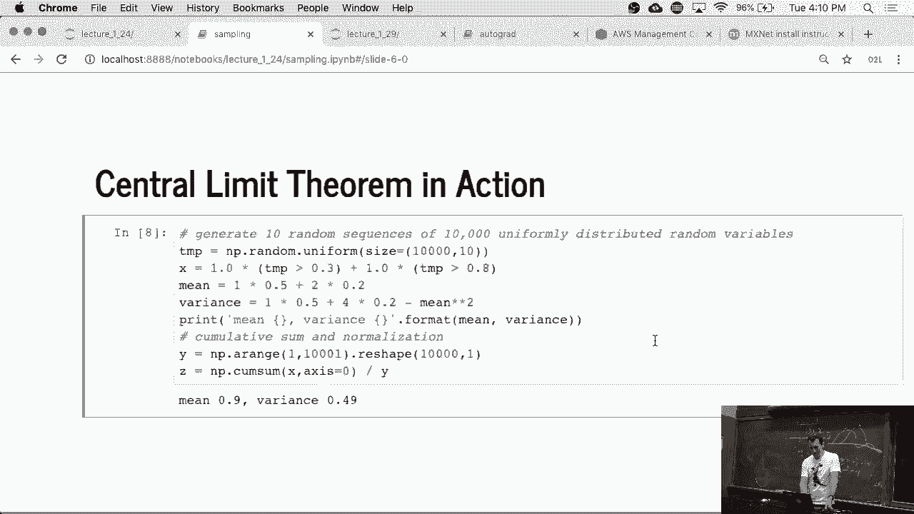
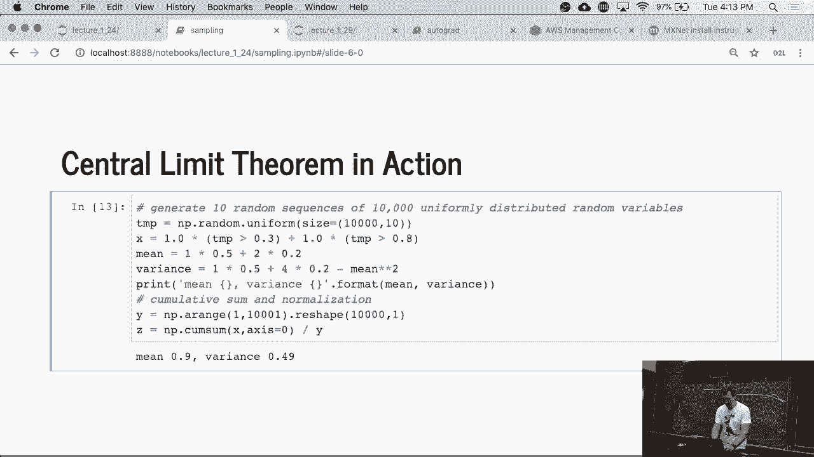
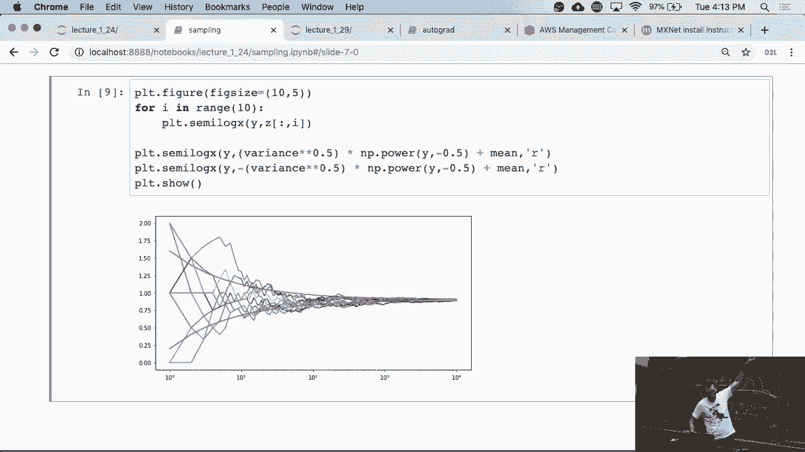

# P13：13. L3_2 Jupyter中的采样 - Python小能 - BV1CB4y1U7P6

好的，现在我们来看看当我们进行采样时实际上会发生什么。好吧，我能做的最简单的事情就是你知道的，生成一些随机数字，在这种情况下，我只会得到一些介于0和1之间的数字。这就是典型的中等水平的伪随机数生成器，知道吧，它在CPU或GPU上运行得相当高效。

它可能不是最统计学上或加密学上最纯粹的随机数生成器，但它是一个相当快速的生成器。

所以，不管怎样，这就是你得到的结果。我想这里没什么有趣的东西。如果我想得到随机整数，我也可以做到。而且，你知道的，那个是通过一个随机整数来调用的。所以现在你得到的是介于1到100之间的数字，实际上是1到99之间，结果正如预期。我竟然得到了1两次。让我们看看。好吧，现在得到其他的结果了。

好吧，这里没有什么特别的。这是我们之前看到的图片，但现在实际上已经实现了。

好吧，让我们解释一下发生了什么。所以我只是选择了100个区间并做了一些，你知道的，绘图，重新整理。然后我会生成介于0到99之间的随机整数。好的，基本上，是的，开始的时候是那样的。现在我做的实际上是，如果我在合适的区间里，那么，你知道的，继续。

然后增加计数。否则，嗯，如果计数器在10、100和1000之间，等等，我就会去绘制这个东西。所以我在这里做的事情，仅供参考，我甚至不费心去明确地调用`random random`然后检查条目。我只是直接通过索引来处理它，知道吧？

所以随机的计数值直接进入那个字段，并且它会将值增加1。好吧，比如说，如果那个值是3，那么它就会增加那个值为3的bin。为什么我们要从0到99呢？嗯，因为是Python。它所有的索引都是从0开始的。然后我们可以看到，随着我们越来越多地进行采样，比如说，百万个项，我们就可以看到效果了。

我们得到的东西相对平滑，但对于10来说，就不那么好看了。好了，到目前为止有任何问题吗？

我可以做一些像分类分布的事情，对吧？所以在这种情况下，我只是看两种可能的结果，你知道的，0和1。我所做的是从0到1之间选择一个区间，对吧？

如果随机变量小于0.35，我就认为它的结果是0，否则它的结果是0.35。好了，我就这样手动做了这个采样器。好吧，这是一个相当无聊的采样器。我的意思是，它就像是在掷一枚有偏的硬币。然后我又重新计算了那个东西，对吧？

所以我基本上只是运行这个。对，嗯，我在检查每个随机变量。你知道的，有一百万个，看看它们是否大于或小于0.35。我在这里批量处理。比起整个循环，这要快得多。但我想通过第一次作业，现在大家都知道完整的循环是有问题的，对吧？

然后我绘制这个。所以如果你绘制对应的分数，我是说，它们的总和必须为1。你可以看到，嗯，它在上下波动了一些，最终它趋向于0.35和0.65，就像你预期的那样。好的。

现在，好的，最后但同样重要的是，正态分布。就是这样绘制1，对吧？

这只是，嗯，创建一个范围从-10到10，网格间距为0.01。然后你在这里评估这个函数。

你绘制它。就这样。对吧？没有什么特别的。

除了现在我们要做的是，我们将实际尝试我们的运行。我们的中心极限定理是怎么做的。所以我将创建一个运行。运行变量为0，概率是多少？没错。因为如果小于0.3，我什么也得不到。那这个运行变量为1的概率是多少？所以这就很激动人心了。

一个有趣的线是这个，对吧？值为1的概率是多少？

你也可以在代码中读取它，对吧？好的。那么temp是一些，嗯，随机数，它们介于0和1之间。我创建了，嗯，一些大数组，你知道的。基本上我创建了10个实例，每个包含10,000个样本。现在我在检查temp中的每个条目，看看它是否大于0.3。好的。所以因此。

对于所有不大于0.3的项，嗯，好吧，结果是0。现在对于所有大于0.8的条目，嗯，基本上两个不等式同时生效。所以，概率是0.2时，结果是2。而概率是0.5时，结果是1。那边有个问题。哦，好吧。哦，好吧。抱歉，我之前没看到你。

我道歉。顺便说一下，这也正是问题的答案，对吧？它是0.5乘以1加上0.2乘以2。而现在这实际上就是计算方差，就像我们一样，对吧？

这正是我们之前的分解。所以它是0.5乘以1的平方，加上0.2乘以2的平方，结果是4，减去均方。好的。接下来我们可以打印这个，然后，嗯，好吧，我们做一些维护工作。基本上我们只是将项聚合起来，并按计数除以它们。好了，我们就这么做吧。

现在让我们打印它。你可以在这个图表中看到10次执行的平均值。

你可以看到它们都差不多汇聚到了一个点，而这个点恰好就是这里的平均值。嗯，更接近一点。但另一个要点是你会看到上下界。所以仔细看看那张幻灯片，因为它会帮助你完成自己的工作。好的，至此我们已经完成了这本笔记本的内容。

好的。
