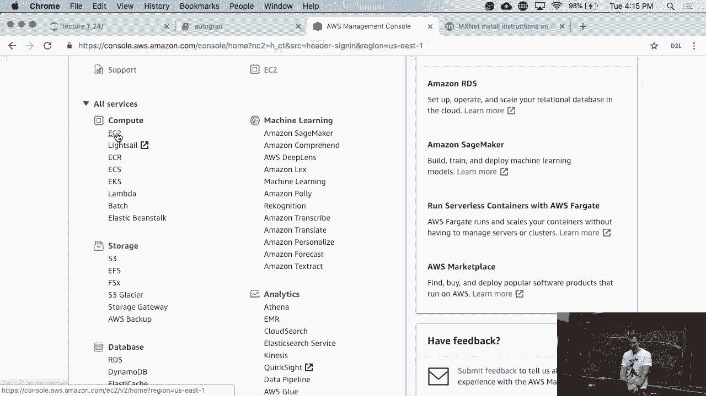
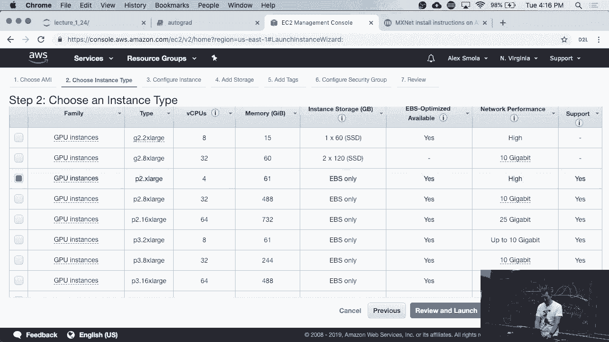
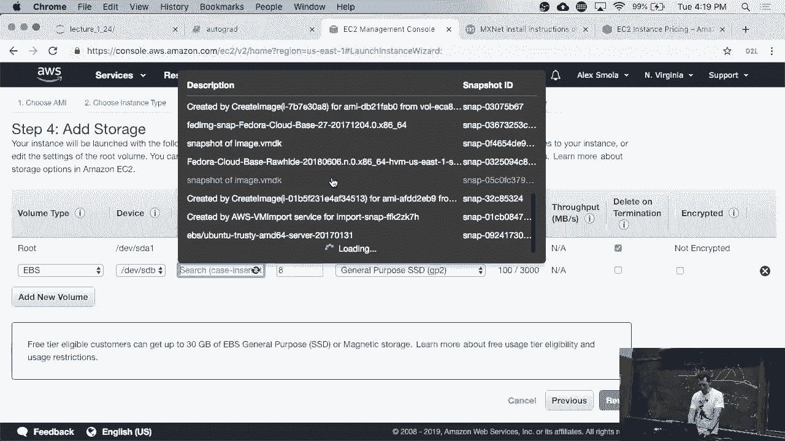
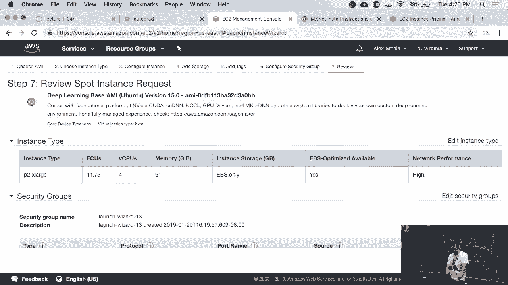
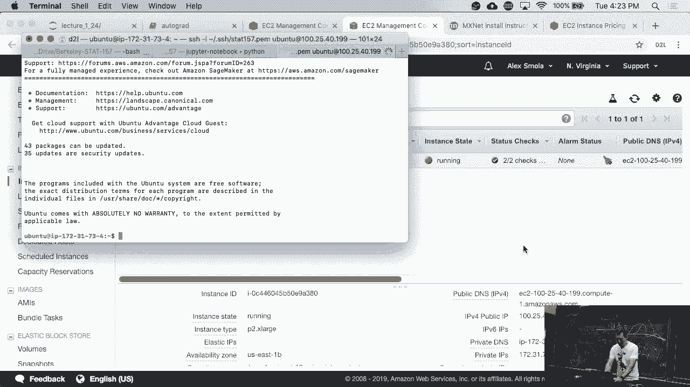
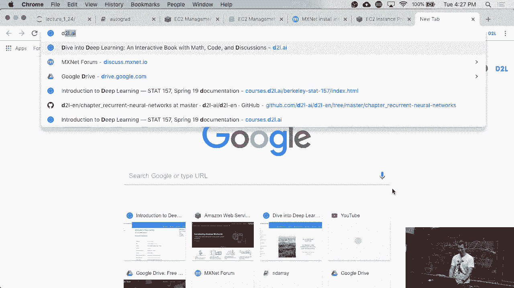
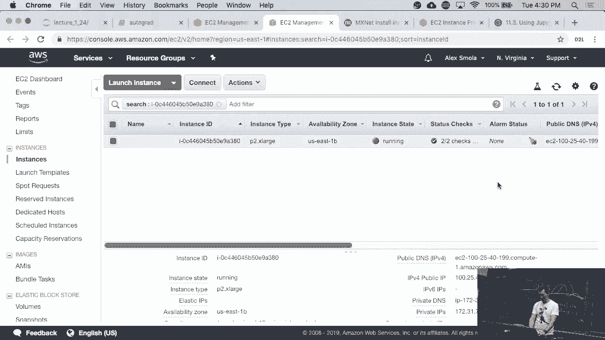
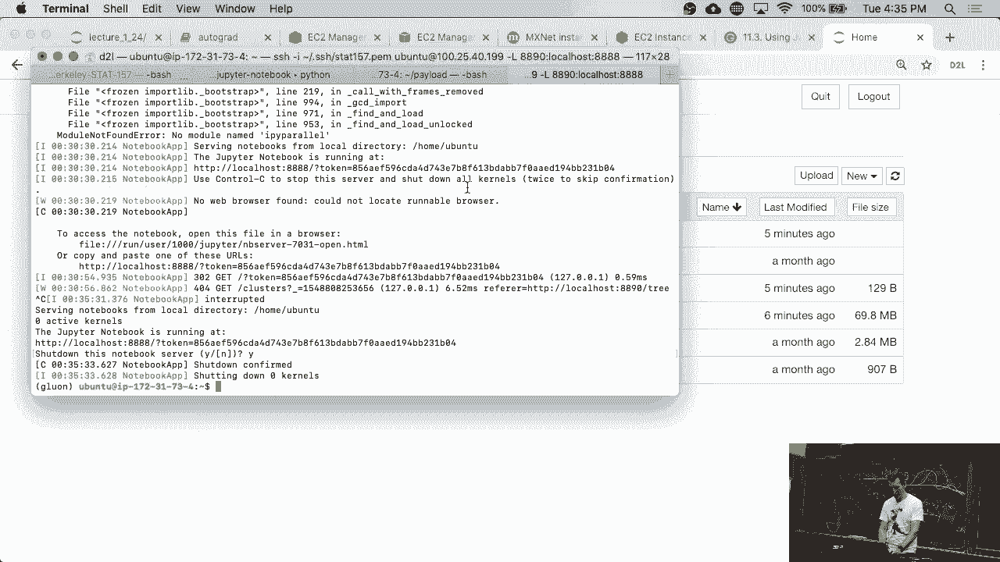
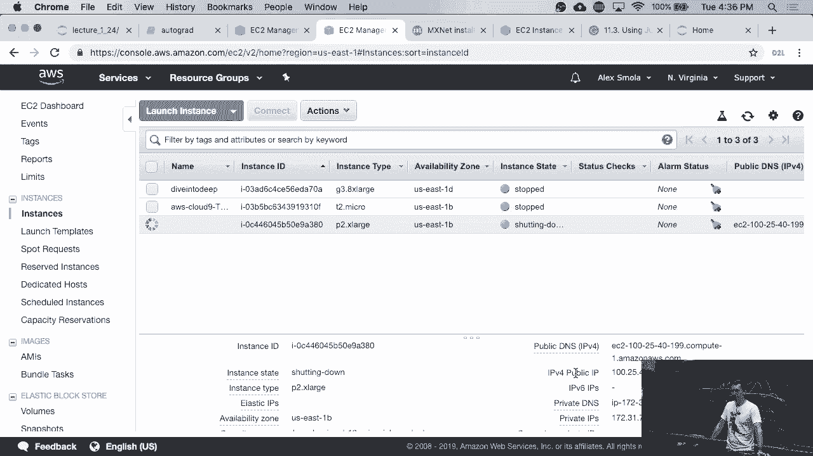
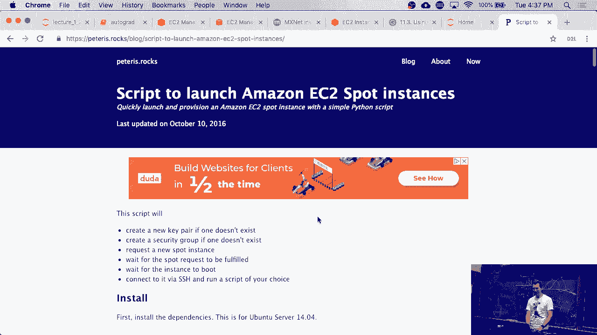

# P14：14. L3_3 在AWS上设置GPU实例 - Python小能 - BV1CB4y1U7P6

好的，首先我们要做的是访问AWS的官网（aws.amazon.com），我已经登录了，现在让我们启动一个实例。

这次我已经确认，确保我启动了正确的实例。我选择了深度学习基础Ubuntu版本15.0。现在，如果我想在GPU上运行任务，我需要选择一个实际上有GPU的实例，对吧？

不要选择像T2这样的实例，因为它没有GPU。事实上，你家里的Raspberry Pi可能比T2实例还快，平均来说可能是这样。所以T2 nano是最小的实例了。无论如何，我们选择一个GPU实例，我选择的是P2 X大实例。好的。

现在让我们快速说明一下竞价价格的问题。

所以我们来搜索一下，看看按需实例的定价。

这是在俄亥俄州，如果你去其他地方，价格会更高。这些是GPU实例。P2 8X大实例有8个GPU，P2 16X大实例有16个GPU。我们感兴趣的是P2 X大实例，它可能足够应付你大多数的工作。如果你的项目需要大量计算能力，跟我们联系。

我们可以帮助你解决这个问题，那么如果你必须支付，应该怎么做呢？

我们会帮你，给你一些积分，但不会给每个人发空白支票。至少我们想知道你打算用它做什么。所以AWS积分不能用于比特币挖矿。其实现在回报率很低，但还是不行。无论如何，如果你看一下P2 X大实例，它的价格大约是每小时90美分。

让我们来看看这个。所以这就是我们选择的内容。现在我们来看看竞价实例。那么这些竞价实例是不是便宜很多呢？它们的价格大约是每小时37到30美分之间。你可能会想，为什么人们会为此支付不同的价格，这些竞价实例最初来自哪里？

竞价实例本质上是目前没有人完全使用的剩余实例，因为AWS尽力确保任何人一旦说“嘿，我想要一台机器”，就能获得相应的计算能力。因此，AWS会将这些空闲的资源进行拍卖，类似eBay的模式。

你能以相当便宜的价格获得这些实例，但有个陷阱。如果某个时候其他人愿意支付更高的价格，或者直接支付全价，而你被淘汰了，可能会被踢出去。不过好消息是你不会为被踢出去的最后一小时支付费用。所以我们其实不想被踢出去，所以我们会出价50美分，尽管这有点鲁莽。

别觉得这个很贵——相对于你否则要支付的90美分，这其实是个便宜的交易。好了，接下来是添加存储。这里是50GB，记住，当这台机器关闭时，这50GB就会丢失。

那么我们来添加一个新的存储卷，我将——好吧，先创建一个新的。

所以我可以对其进行快照，等等，但无论如何，还是按照这个做。所以这将是持久的，这样我就可以重复使用它。可以把它当作你插入的USB密钥，理解吗？接下来会添加一些标签。没有安全组，没问题，开放给全世界，没安全性。好了。

这告诉我它将会花费。

现在这台机器上没有密钥对，所以start 157并下载这个密钥对。好的，这现在会请求一个Spot实例。

好的，Spot实例现在正在创建中，很好。查看Spot请求。瞧，这个请求已被满足。太棒了。现在我可以点击它，它会告诉我正在初始化并执行任务。与此同时，我们来快速做两件事。我们快速创建一个SSH目录。

SSH keygen，然后我会把这个密钥移到SSH里。它可能会不同意这样做，因为现在这个是——不，其实应该没问题，我们来看看。好了，现在如果我们查看实例，会看到它正在初始化，正在执行任务，这里是公共IP地址。好了，接下来是SSH minus identity start 157 PEM，Ubuntu add。

好的，由于这是我第一次连接到这台机器，它会问我是否真的想连接到这台机器，选择是。基本上，它会抱怨我的SSH密钥太不安全，因此会强制我修复它。所以我要使用CH mod minus read A。好的，使用CH mod 400。没错，现在只有我能读取它。好的。

好的。如果我们现在询问机器上的这个代理，我是说——现在在这个阶段，我们可以按照论坛上发布的安装说明来操作实例。

这实际上是将几张幻灯片的内容结合在一起。现在有一点很重要，这是几个用户卡住的地方。这台机器安装了不同版本的CUDA。你会看到它安装了CUDA 8、9、9.2和CUDA 10。特别是——它当前默认使用CUDA 9.0，对吧。

所以这不一定是我们想要的。因此，我们需要将它更改为CUDA 10。实际上，说明中提到的是CUDA 9.2指向它，不过我们还是按照这个做。于是我创建了一些链接。如果你从未见过sudo，它只是意味着你以root身份执行命令。好的，没问题。现在CUDA已经可以使用了。

接下来的事情是我们需要获取 CUDA。好的，执行它。现在它会问我是否接受许可协议，答案是“是”。你可以用默认选项更改所有内容，但它会自动完成。好的，没问题。它会设置好这些。是的。好的，现在我需要这么做的原因是它更新了我的路径，现在。

如果我想查看 Conda 是否在我的路径中，嗯，那就这样吧。好的，没问题。那么现在我们需要设置好适当的环境，我们将这么做。唯一的区别是现在我们需要选择 CUDA 10.0，所以是 CU100。如果你查看 Glueon 环境的 ammo 文件，你会看到它。

需要 Python、Jupyter、Matplotlib、Pandas 以及 CUDA 10.0。如果你使用的是 CPU 版本，就不需要安装 CUDA 版本，对吧？另一方面，如果你需要使用 GPU，那你就得安装它。所以 NVIDIA SMI 显示我现在这台机器上有一块 GPU。是 K80，并且它显示当前正在使用 CUDA 10.0 版本。好的。

到目前为止，大家都理解了吗？好的，太好了。那么，接下来我们来做这件事。先创建 Conda 环境，然后使用 `source activate`。这样它就开始执行并愉快地安装了，像往常一样。需要一点时间。在它执行的同时，其实我们可以再打开一个终端，并提前设置好端口转发，这样我们就能自动完成这个过程。

如果你不知道如何进行端口转发，咱们可以去 d2l.ai，附录中实际上有讲解。

会给你提供相当详细的 Jupyter 使用说明。我们需要做的是把这个命令添加到我的 SSH 命令中。SSH -i。好的。有人记得 IP 地址吗？没有。125，40，199。现在，好吧。实际上，我得稍微做些不同的操作。

原因是我已经在本地运行了一个 Jupyter 实例，并且它已经在端口 8888 上运行。所以如果我将端口转发设置为同一个端口，就相当于同时有两个服务运行在同一个端口。这不好用。所以我们换成 88090。好的，这样应该可以了。我把参数顺序弄错了。

所以让我们注销并重新尝试。现在一切正常。之前我遇到过错误信息。我们可以把它拉出来看一下。频道设置转发监听器 TCP/IP 无法监听端口 8888。因为已有一个服务器在运行。而且我们本地有 Jupyter 服务器。所以我们快完成了。请不用担心，我还需要进行一个安装。实际上，我可以在这里执行这个操作。好的。

现在激活 glo。然后启动 Jupyter notebook。当然，它现在非常不高兴，因为本地机器上没有浏览器。所以我们现在需要用这行命令。

把它复制到浏览器中。然后做一个小小的修改。因为我们需要连接到那个新端口。瞧，我们现在已经连接到云中的机器了。这里有几个陷阱。记住我们启动了一个竞价实例。所以那个竞价实例不幸的是，意味着它随时可能停止。

所以这不是一个理想的情况。但是幸运的是，我们分配了一个额外的磁盘。所以我们有这个磁盘，XVDB。如果你输入 free 命令，你会看到 XVDA 是我们的标准磁盘，它基本上是硬盘 1。硬盘 B 是 XVDB。现在它还没有设置好。所以输入 sudo fdisk diff XVDB。目前这里没有任何内容。

所以让我们创建一个新的分区。记住，那是一个 8GB 的分区。新分区。主分区编号一。设置为所有默认值。是的，已经设置为 Linux 分区，所以一切正常。所以我只是把它写回去。好。现在我需要创建一个——是吗？[无法听清]，这是我接下来要输入的下一行。

所以现在它只是一个标记为 Linux 分区的分区。接下来我需要做的是设置 X4。并且我需要给 XVDB1，因为那是主分区一。当然它是根分区，因为我要格式化一些东西。现在我还需要做一件事。

我需要创建一个本地目录。假设我们叫它 Payload。现在我要挂载 VDB1。所以现在我们把它挂载到 Home Ubuntu Payload 上。这是我们的第二个磁盘。这个磁盘如果机器死掉了也不会坏掉。所以现在我们进入 Payload。然后当然它失败了。失败的原因是因为我把它挂载为根目录。

所以现在我需要做的最后一件事是 CH1A + RvX。这是不安全的，但没关系。这基本上意味着任何人都可以对其进行写操作。现在它工作了。好。所以现在你可以写入它。这就创建了分区。这样，如果你需要做更长时间的实验，或者你想制作 JWs，创建过程可能会稍微长一点，也许是原来时间的两到三倍。就这样做。

现在关于成本、定价和竞标的最后一点，你不一定会支付你的最高竞标价。只是说你永远不会支付超过你的最高竞标价。所以这就像 eBay。假设你想以最多 $1,000 的价格购买一台新笔记本，而第二高的竞标价是 $700。那么你将支付 $700 购买这台笔记本。

所以这是一个第二高价拍卖。你可以证明它是激励兼容的。在 AWS 上，关于竞价价格的情况稍微复杂一些，因为有多个机器等等。数学原理稍微有点不同。如果你对这个感兴趣，可以去上类似电子商务类的课程。

计算广告和其他相关内容。这里面有很多非常有用的东西，远远超出了本课程的范围。所以在这一点上，我们将做一件事。也就是我们将把一切结束。然后我把任务交给 Move，关闭笔记本服务器。

好的，没问题，已锁定。现在，我可以随时点击实例。我可以看到这个正在运行。然后选择操作，实例状态，终止。终止这个实例。现在它已经消失了。好的，这就是快速概述如何设置机器。你实际上可以将这一切脚本化，这样你就不需要每次都通过命令行来做了，对吧？

所以你基本上是构建一个脚本。然后你可以从命令行启动 Spot 实例。在那里执行那个脚本。然后五分钟后，在你去泡一杯咖啡回来后，机器就准备好了。我强烈推荐你这么做。它其实是相当简单的脚本编写。好的，是吗？[听不清的声音]。

是的，确实是这样。

唯一需要注意的是，你必须将其放入某个可执行文件中。你可能需要在其中加入，比如说，使用 bin bash 或者类似的东西。你可能还想将这个与照片结合使用。那些脚本是不可用的，但我几乎可以确定，如果你在互联网上搜索关于在 AWS 上设置 Spot 实例的脚本，使用照片，应该能找到大量类似的脚本。嗯。

我们可以做到这一点。好的。那么，第一个链接里面有些东西。好的，这是更详细一点的。

这里有很多其他有趣的东西，因为你可以选择实例等等。

等等。但这就是那种——让我为你 Google 一下的解决方案。外面有大量的东西。是的，使用一个适合你的。好的，那么，接下来我将交给真正的大师，Mu，他将谈论签名和相关的内容。

