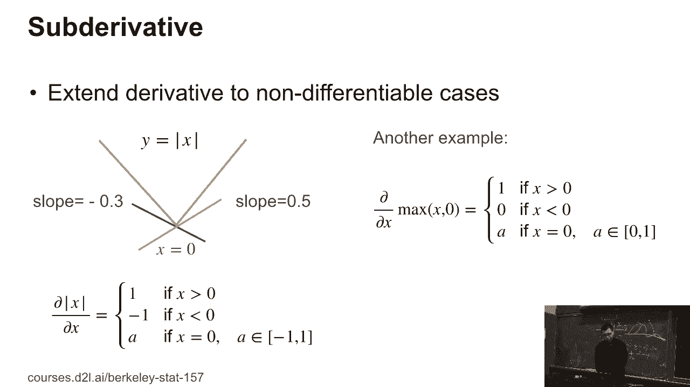
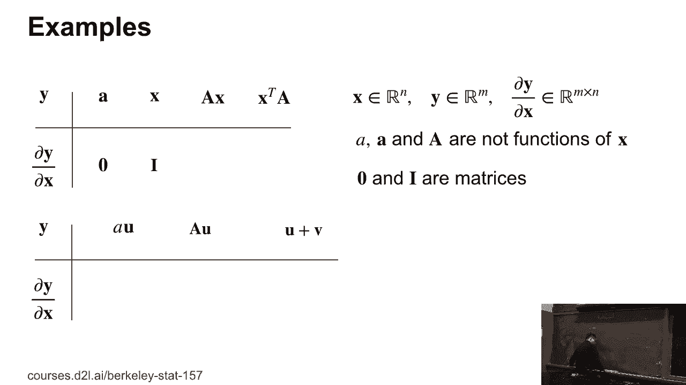

# P15：15. L3_4 自动微分 - Python小能 - BV1CB4y1U7P6

所以存储需求更少，一些基本的度量微积分。

那么有多少人之前学过度量微积分？好的，差不多20%的人。

但我想每个人应该都知道标量导数。所以在这里，y是标量，x也是标量。所以给定y是x的函数，我们要计算dy对dx。现在如果a不是x的函数，那结果是什么？0。0，好的。如果x的m次方，结果是什么？[听不清]，好。那么——每个人应该都知道exp的导数是dx，exp，log x的导数是1/x，sin的导数是cos。还有。

如果是u加v，我们将有du对dx加du对dx。如果是u乘v，我们将有du对dx乘以v，加上dv对dx乘以u。对于一般情况，如果y是u的函数，u是x的函数，我们可以写成dy对du，乘以du对dx。所以这是标量的情况。其实很简单。这里一个重要的概念是导数。

是切线的斜率。这里我画了一个x的平方图。这里有一条黄色的线。在x等于1的点，我们知道导数是2x，结果是2。所以切线的斜率是2。这个概念很重要，我们将在梯度下降中使用。另一个概念是并不是每个函数的。

不可微。同样地，在第一节课中，我们讨论了L1范数。它实际上是一个简单版本，它是x的绝对值。所以在x等于0时，这一点不可微。因此，每个夜晚，我们可以在曲线下画出每个夜晚。斜率可以是子导数。所以这是一个广义的导数概念。

这非常有用，因为我们在深度学习中有很多函数。实际上，它是不可微的。所以在这个特定的例子中，绝对值的子导数在x的绝对值上等于1，如果f大于0，x大于0时是-1。在x等于0时，它可以是-1到1之间的任何值。实际中。

我们可以选择一个特定的值。它可以是-1、1或0。另一个例子是最大值运算符。它也是一个重要的运算符。我们可以用于最大池化方法。所以给定最大值x为0，如果x大于0则为1。如果x大于0则为0。并且在x等于0的点，我们可以选择任何值，介于0和1之间。

通常，我们选择1或0。

现在，我们将标量推广到向量。这是一个关键点，因为所有的神经网络、机器学习中，我们不能不谈向量、矩阵和张量。所以让我们首先看看如何将x和y转化为向量。如果x和y都是标量，我们知道梯度是标量。所以梯度实际上。

如果是向量，我们称之为梯度。所以现在，如果x是一个向量，它是一个列向量，而y是一个标量，它是第一行。我们无法得到关于x的偏导数，但它仍然是一个向量。但现在它是一个行向量。同样，如果x是标量，而y是向量，那么梯度将是一个向量，具有与y相同的形状。更一般的情况。

x和y都是向量。现在，我们得到梯度的矩阵。现在，我们不能深入探讨它们是如何计算的。

现在，在第一个例子中，x是n维向量。它从x1到xn。这里有n个元素。然后，y是一个标量。然后，y关于x的偏导数是一个行向量。第i个元素是y关于xi的导数。所以这里我们应该使用偏导符号。这是向量的广义D-旋转。让我们看一个例子。

如果y等于x1的平方加上2倍x2的平方，那么梯度的第一个元素是关于x1的偏导数是2倍x1。第二个元素是关于x2的偏导数是4倍x2。现在，最重要的是，梯度是你改变值最多的方向。所以特别是在这个点，当x1等于1，x2等于1时，梯度是2和4。

所以这是一个垂直于反向线的方向点。如果我们沿着这些梯度移动该点，我们可以增加这个值。我们可以增加y的值。所以，如果我们减少这个值，我们只需沿着梯度的反方向移动。

所以这个概念是梯度下降法的基础，决定了我们如何解决新的问题。

然后，看看这里的一些例子。为什么是标量？现在x是无维向量。A是x的非函数，那么结果是什么？你按元素做0。它是一个0的行向量，0是一个n维向量的无维形式，但它是一个行向量。那么8倍u是x的函数呢？所以它实际上是8倍u的梯度。

关于x的。另一个，如果我们可以分配x的元素来得到一个标量。然后我们得到全1向量。它再次是一个行向量。最后一个是l2范数的平方。然后我们得到2倍的x的转置。我们仍然可以有这些规则。u加v，u乘v，类似于标量操作。这里唯一不同的是，在u和v的乘积中。

我们得到u转置乘以对v关于x的偏导数，再加上v的传递乘以u关于x的偏导数。所以我们知道u是一个行向量，偏导数v和偏导数x是一个矩阵。行向量乘矩阵，仍然得到一个行向量。所以结果是我们仍然得到一个行向量，这是梯度。

好的，现在如果我们可以切换--。

问题？[无法听清]，是的，所以我们不能谈论--。如果它们实际上是--如果两个都是向量。

我们称之为雅可比矩阵。所以现在我们交换。为什么是向量？x是标量。所以在这种情况下，我们不能得到列向量。所以向量的第i个元素是yi，相对于x的偏导数。所以y——我们改变了顺序。所以记住，如果x是向量，我们得到行向量。如果y是向量，我们得到列向量。

所以这叫做分子布局。我们也可以做转置。如果x是向量，我们得到列向量。如果y是向量，我们得到行向量。我们可以互换。然后我们可以得到分母布局。所以这就是我们将要做的作业。实际上，我们稍后会改变这个——我们稍后会稍微麻烦一点。

但是我们有一个作业要做。

在最后的情况中，y和x都是向量。所以我们称之为雅可比矩阵。我们可以深入了解。我们知道如果y是向量，我们得到列向量。所以这意味着我们有——每一行是我们求得偏导yi相对于x。而偏导yi相对于向量x将会是行矩阵。抱歉，是行向量。所以最后。

我们得到了这个矩阵。所以我们可以举一些例子，帮助更清楚地理解。

对于那个。所以现在我们有了y和x这两个向量。假设a是常数，a是常向量。那么现在的结果是什么？好的，全是零。所以它是一个矩阵，所有元素都是零。第二个问题是，如果y等于x，那么偏导x相对于x是什么？好的，单位矩阵。原因是——让我写一点。

所以我们知道第i行和第j列将是xi。所以如果i等于j，它等于1，如果y不等于j，它等于0。所以我们得到了单位矩阵。第二个问题是，如何做a，它是一个矩阵，a乘以x相对于x。让我再做一次。如果a x——现在我们知道这是一个向量，偏导。

所以我们知道它等于偏导a x。所以第i个元素相对于x。所以如果我们能把a写成a 0，a 1，它就是a的第i行。然后我们垂直堆叠，得到a n。然后这里，a x，第i个元素将是a i与x的内积。所以这意味着这里是a i与x的内积，等于a i。我们之前讨论过。

所以这意味着，实际上，这等于a i。我们将a i堆叠在一起。我们称之为a。所以答案是a。如果我们做转置，我们实际上可以做转置——我们可以做转置。这个也很简单。只有一个。因为对于向量，你可以转置向量。它是行向量。列向量无关紧要。所以实际上。

它等于——我们转置y等于a，转置x。所以我们得到转置a。就是这样。其他方面，我们有很多类似的矩阵和向量的东西。a乘以u是——如果a是常数，它是标量。我们有a乘以偏导u相对于x。如果是矩阵，我们把矩阵提出来。如果是u加v在之前的类似情况。

所以现在我们可以做一个更广泛的情况。如果 x 是矩阵，我们无法深入探讨细节。如何计算它们。但我们可以给你形状，你可以推断出实际计算的内容。让我们先看第一步，当 y 是标量时。如果 x 是标量，我们得到一个标量。如果 x 是向量，我们得到一个行向量。如果 x 是矩阵。

我们得到一个矩阵。但看看形状。X 是 u 行 k 列的矩阵。但现在，梯度就像 k 行 m 列的矩阵。我们在这里反转形状。我们在这里做转置。看第一列的第一行。如果 x 是标量，如果 y 是标量，你得到一个标量。如果 y 是向量，你得到一个向量。这是否有相同的形状？如果 y 是矩阵。

你得到一个具有相同形状的矩阵。那么现在，看看第二行。当 y 是向量时。一个有趣的情况是，如果 x 是矩阵，我们得到的形状是一个三维张量。张量形状，第一个是 m，来自 y 的向量。y 的长度是 m，n 维向量。第二个是 k 和 n。形状来自矩阵 A，但这里反转了矩阵。所以它是 m × k × n。最后一列。

在最后一行，如果 y 是矩阵，x 是向量。我们仍然得到——我们复制矩阵的形状。然后得到 x 的 n。最复杂的情况是，x 和 y 都是矩阵。我们得到一个三维张量，一个四维张量。前两个形状，m 和 l，是 y 的副本。而第三和第四个形状，不能复制 x，但要反转它。所以一般来说。

你可以得到任何任意的 y 和任意形状的 x。我们首先将 y 的形状放在前面，然后反转 x 的形状，最后是 n。所以这就是我们如何做张量计算的方式，实际上。好的。
