# P16：16. L4_1 线性回归 - Python小能 - BV1CB4y1U7P6

好的，这就是从零开始实现线性回归。所以首先，我们导入一些东西。我们不需要深入查看。这里的关键是，我们有自动求导，有NDRA，还有很多的处理和数字。

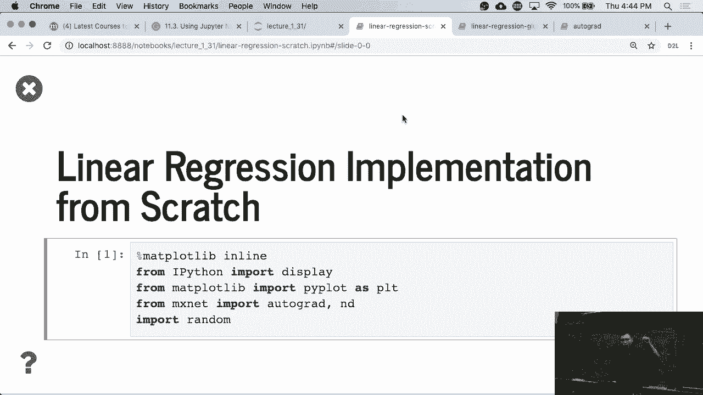

我们有随机数生成器。

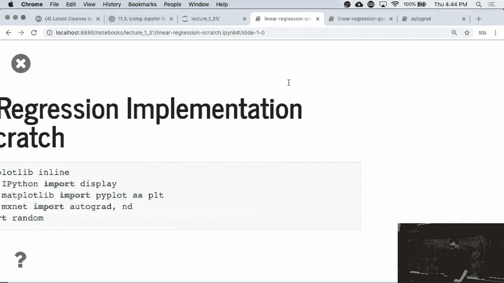

所以我们首先生成一个数据集。一个相当小的数据集，我们有100个、1000个例子，两个维度。所以x是一个1000×2的矩阵，它是一个随机矩阵。然后我们可以选择一个真实的权重，第一个元素是2，第二个是-3.4。偏差我们可以选择4.2，这就是我们选择的真实权重。用来生成标签。

我们只是做x乘以两个权重加b，再加上噪声。噪声是高斯噪声，因此它可以展示给你。

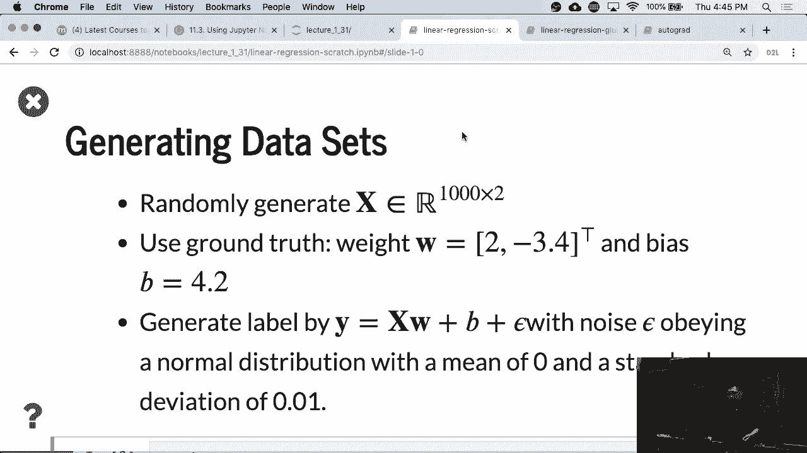

所以这段小代码在写NDRA，但它非常相似。只是生成数字并得到结果。所以这里的关键是，我们有特征，我们有标签。

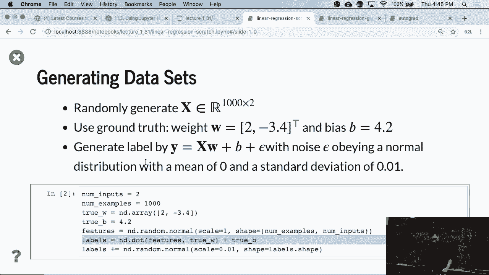

然后我们可以可视化，我们可以显示第二个特征和标签。因为线性回归中，特征和标签之间是相关的。但是我们这里有损失，所以实际上周围有很多噪声。

然后因为我们要使用小批量SGD，每次我们可以渲染，可以渲染数据中的样本来获取批次。

所以我们将展示这个东西的实际样子。

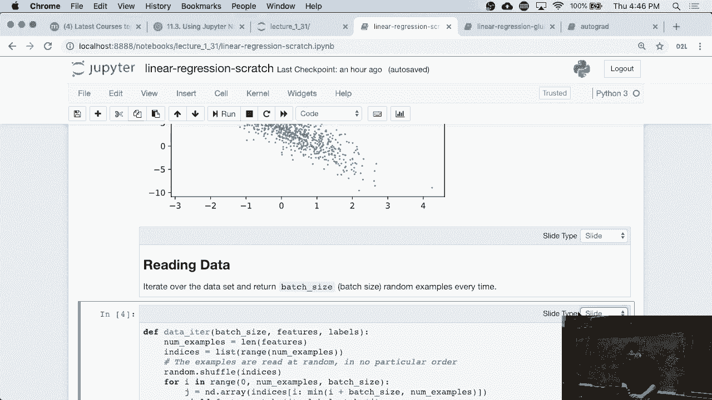

所以在这里，我们给它们特征，给它们标签，然后我们给它们批次大小。我们做的是，首先生成索引，然后渲染权重。我们可以生成渲染的索引。所以在这个时候我们将读取批次大小的索引，并获得称为J的索引。我们应该获取，获取意味着给定一组索引，我从矩阵中获取行列。

我将从矩阵中获取行元素。所以我们通常会像B批次大小那样生成J的随机索引，并选择数据和标签。我们在这里使用Python的生成器，它是一个生成迭代器。所以每次你不需要， 每次你都不需要，因此让我来展示如何使用它。

所以每次你都可以在这个迭代器中使用四个X和一个Y。每次你运行for循环，你会得到X和Y，然后再运行一次，你会得到另一个X和Y。所以我们将展示当批次大小等于10时，如何打印X和Y。X是二维的，包含10个例子，Y是另一个包含10个元素的向量。

它是一个包含10个实值的向量。

这里的数字。

这就是单个批次。

那么，如何选择初始化模型参数呢？在这里，我们可以使用双重初始化，随机地使用高斯分布初始化，均值为零，标准差为 0.01。嗯，你不希望使用太大的值，这会导致数值不稳定。

你不希望值太小，那么如何训练呢？这又是一个权衡。我们将在优化的详细内容中进一步讨论。在大多数情况下，使用随机数和这样的偏差，SGD 就足够好了。对于偏置，我们只需初始化为零。

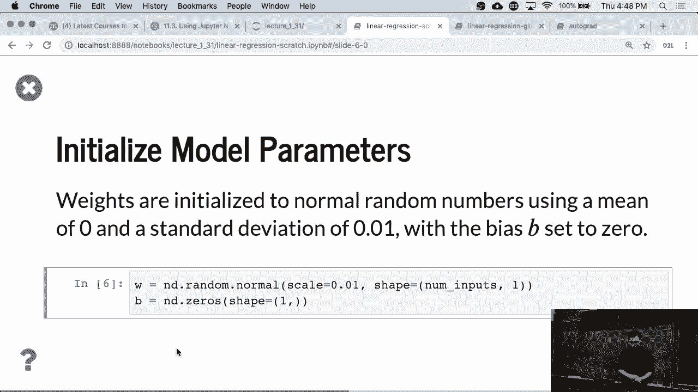

所以，好吧，我们选择了初始的 W 和 B。然后因为我们要计算梯度。

关于 W 和 B，我们在这里附加梯度。再说一次，我们在自动求导中讨论过这个问题。现在我们可以定义模型。在模型中，给定一批数据 X 和给定的权重和 B，我们只是使用点积和矩阵乘法来计算 X 乘以 W，然后通过广播加上偏置。这样我们就能得到预测结果。这是它的向量化版本。

所以我们将其保存在一个名为线性回归的函数中。现在给定的损失函数是 Ŷ，这个估计值是一个向量。给定真实标签，它是另一个 Y，也是一个向量。Ŷ 减去 Y。我们在这里做了 reshape，因为我们想要匹配。因为有时候你得到行向量，有时候你得到列向量。

我们在这里进行了一次 reshape，确保每个维度都一致。因为一个常见的错误是，如果你得到行向量，得到列向量，再用广播减去它，你会得到矩阵。然后得到矩阵，因为你运行自动求导，这就是损失函数。你运行自动求导，我们可以将这个矩阵一起赋值，得到一个标量。你不会得到警告。

所以实际上——我们在这里进行了一次 reshape，确保我们做的是逐元素的操作。减法，我们没有做广播。所以我们减去 Ŷ 减去 Y，平方后除以 2。所以这里实际上没有除以批量大小。

所以我们可以稍后再做。

接下来我们来谈谈 SGD。在这里，参数实际上是 W 和 B。它是一个参数列表。该段是学习率，这个标量我们之前讨论过。还有批量大小。我们在这里除以批量大小没有特别的原因。你也可以把批量大小放到损失函数中，那也可以。

但我们不希望损失函数增加另一个超参数。那么我们该怎么做呢？对于每个参数，我们只需减去学习率乘以梯度，然后除以批量大小。所以这就是 SGD，或者你可以称之为梯度下降法。到目前为止有什么问题吗？

好的，明白了。

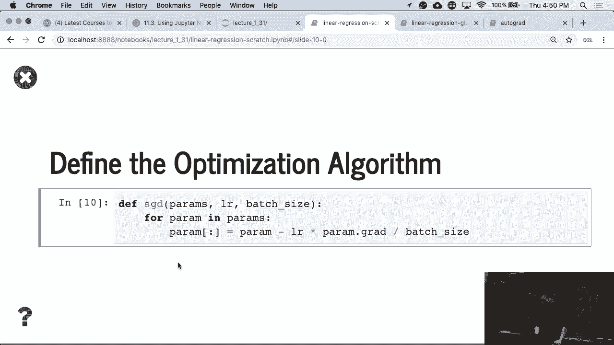

然后是训练循环，虽然会更长一些，但让我先展示一下代码。

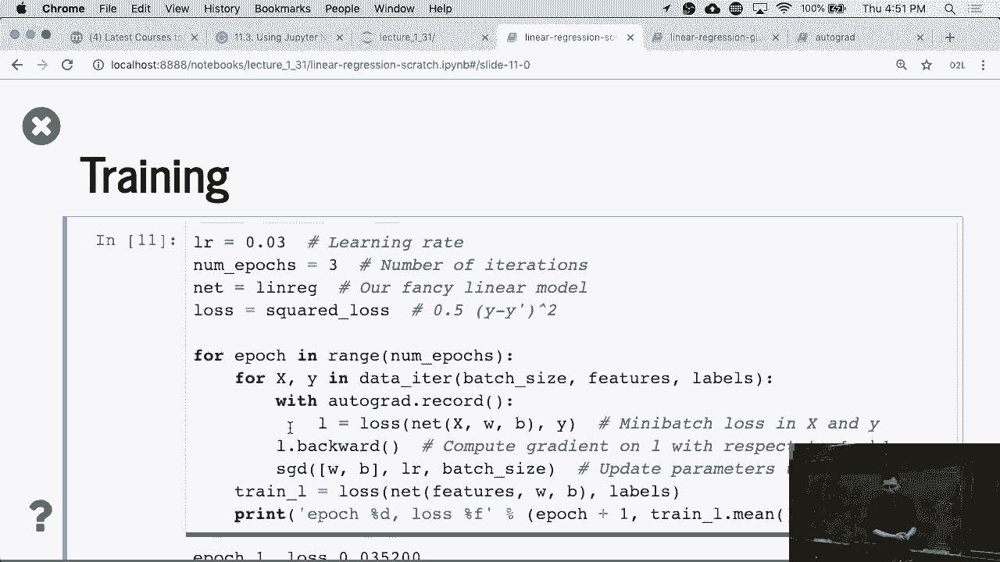

首先选择超参数。首先我选择学习率为 0.03，没什么特别的原因。然后选择数据的传递次数为 3，也没有特别的原因。我们选择的网络是线性回归。所以我直接调用网络和损失函数，这样后续的每次训练循环看起来都会很相似。

我们使用的损失函数是平方损失。训练循环就像第一个 for 循环，我们对数据进行迭代。这里我们将做三次数据传递。然后第二个 for 循环中，每次我读取一个数据批次 x 和 y。然后我们在 autograph 或记录中放入这个过程。我们首先把 x，x，w，b 输入到网络中计算估计值，然后与真实值进行比较。

通过 y 的值来计算损失函数。然后我们调用损失函数的 backward 方法来计算梯度。一旦得到了梯度，我们就用 SGD 更新参数。这里的参数是 w 和 b，因为我们之前已经计算过梯度。然后设置学习率，批量大小，并更新。每批次结束时，我们就计算整个训练数据的损失。

数据。好的，打印结果。所以我们会看到，在第一轮迭代中，损失较大，然后逐渐减小。直到最后一轮，损失非常小。好的，是的。

这是一个不错的选择。那么最后我们展示一下实际学习的结果，并与之前的值进行比较。因为我们有两个 w 和两个 b，我们可以评估一下。结果显示误差非常小，所以我可以打印出来。

w 和 b 打印出来。

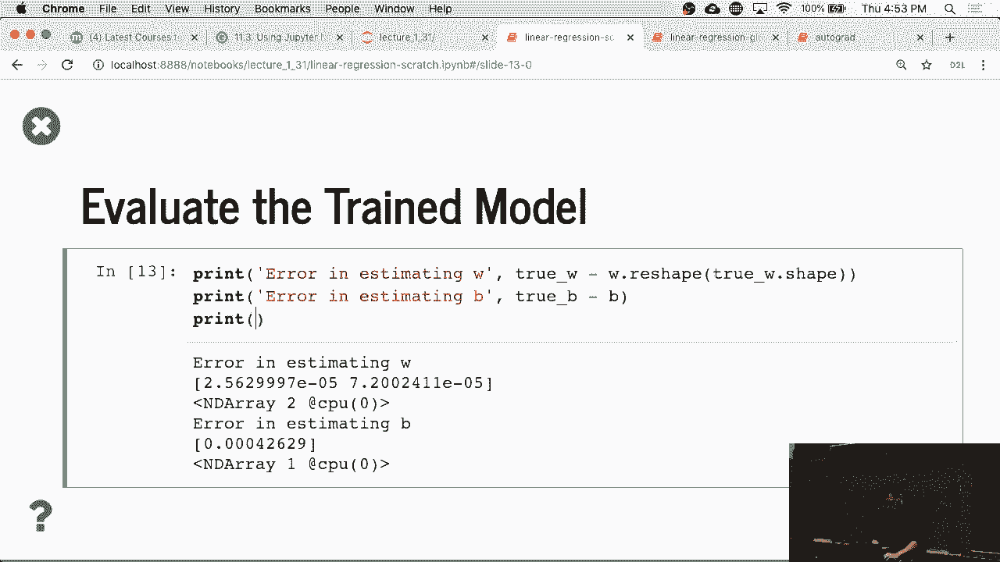

你可以看到，w 应该是 2，-3.4，b 是 4.0。

2。实际上，我们的估计值和实际值非常接近。

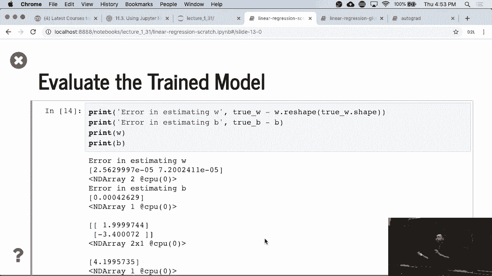

好的，因为我们之前提到过学习率和批量大小，我可以给你一些例子。让我选择一个非常小的学习率。选择一个更小的，然后记得在第三轮时，我们的损失会非常低。我们再进行对比。

好吧，哦，我们不能这样做，因为我们没有重新初始化 w，所以让我重新初始化 w 为 a。

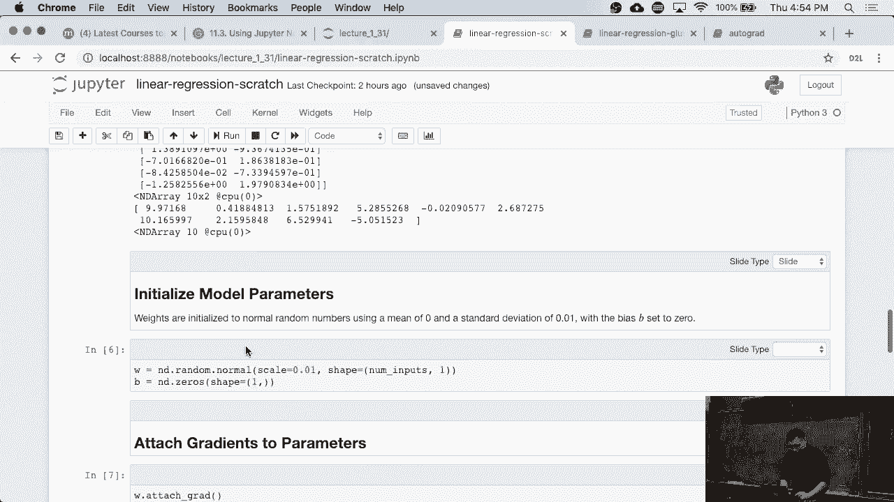

随机数，附加梯度。

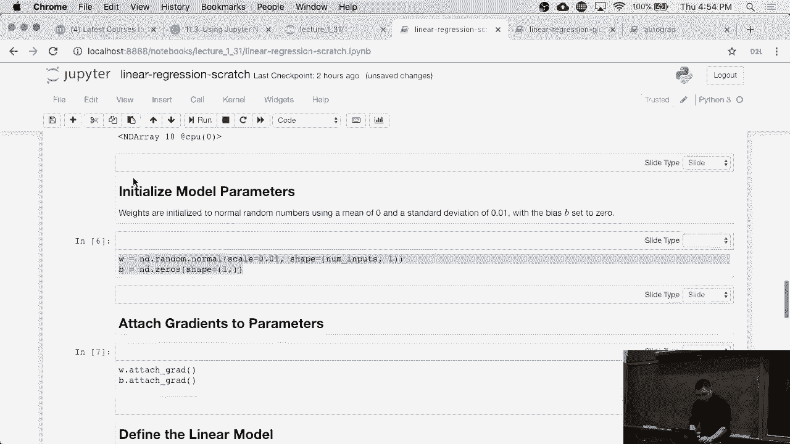

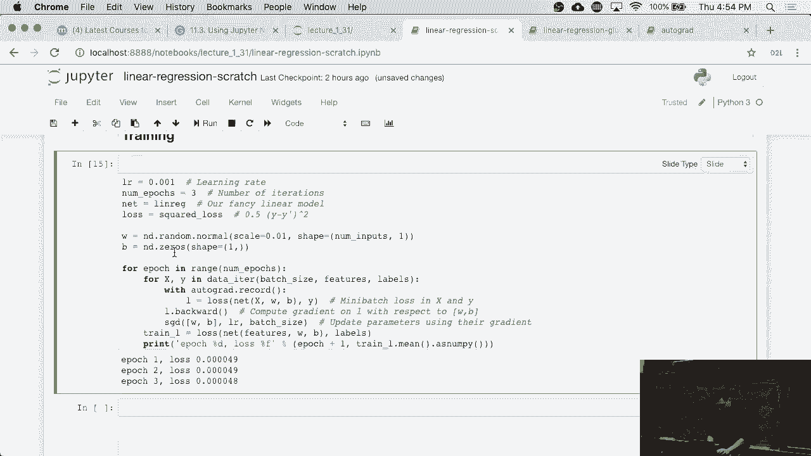

所以你会看到，如果选择一个非常小的学习率，实际上我们会得到非常大的损失。

损失。如果我能使用一个非常大的，那是1，嗯，它工作得很好。所以0.03太小了。让我们使用一个更大的。嗯，你会得到很多数字，因为太大了。所以通常选一个尽可能大的线性率来获得结果。接下来我要讲的是如何在Grun中使用它来实际改进。

感谢，但Grun并不是为了欠拟合。对于欠拟合，我们展示如何从头开始构建东西。现在做起来很容易，但如果我有成百上千的层，那就不行了。使用年化增长。因此，我将向你展示如何使用Grun来做这些事情。

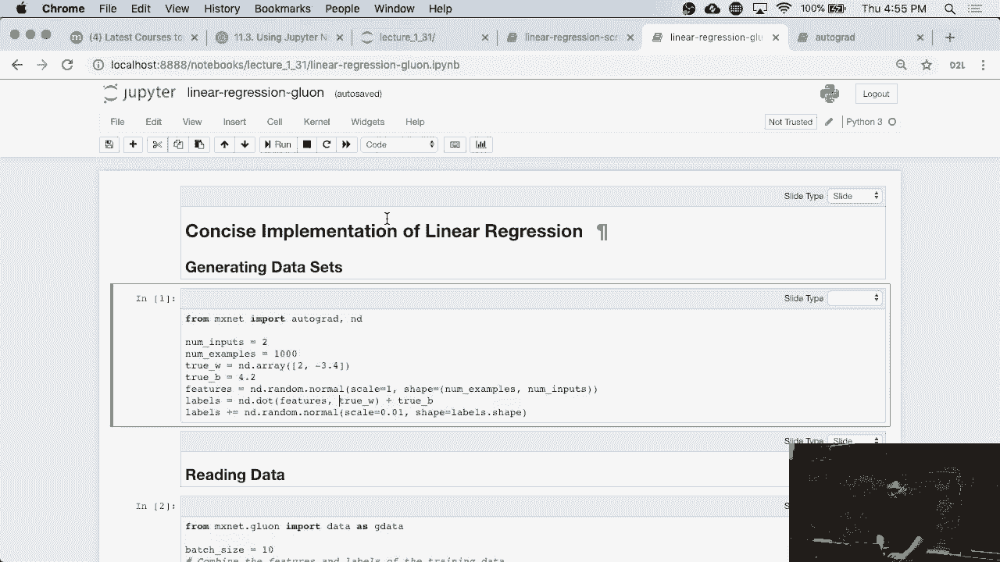

所以Grun实际上，这是一种类似的东西。

这些实际上生成的数据集与之前非常相似。让我重新开始。

所以Grun提供了两个非常有用的功能。实际上是三个。

如何加载数据？Grun有它的数据，更多的是Grun。我们将其导入为G数据。它不是Google数据，只是为了防止我们以后使用数据作为一个变量，前面加个字母作为批次大小。这是一个欠拟合问题，我们只需创建一个名为array data set的数据集。在数据集中，我们可以访问。

在数据集里，这就是你可以索引的类，任何示例都可以。然后给定数据集，我们可以把它放入数据加载器中，数据加载器给定一个批次大小，并且，shuffle设置为2，表示进行洗牌。每次你都可以返回一个数据迭代器，可以像之前一样使用。

时间我们可以为X和Y使用数据迭代器并获取一个数据批次。

第二个不同之处是，线性模型被称为稠密层或Fouc-Nell层在神经网络中。输出大小是1，因为它这里只有一个输出。所以在Grun中，神经网络模块，一个e模块已经定义了什么是稠密层。你只需计算，构造稠密层并将其放入一个叫做容器中的模块里。

顺序容器。这个容器让你堆叠多个，就像是一个列表。你可以堆叠多个层，构建一个新的网络。所以我们只构建一个容器，作为一个单一的层，它是一个单层神经网络。输出，输出大小是1。所以这里我们不需要指定输入的大小。

这对Grun来说是关键。你不需要，因为此时我们实际上不知道输入的大小。所以我们要么想出一个字母，向网络输入实际数据。

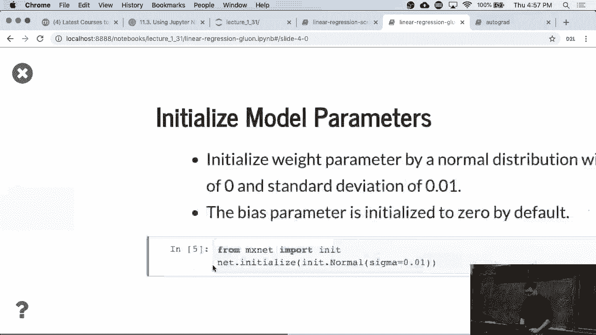

所以所有的MSN都有许多初始化方法。在这里我们可以初步使用正态分布并称之为C，它的值是0.01，然后我们调用网络进行初始化，并使用给定的初始化方法。

损失函数，Grun的损失，Grun有一个损失模块定义了许多损失函数。所以在这里我们只是导入L2损失。即平方损失，也叫做L2损失。

然后训练，我们只是告诉你，好吧，我们有一个Grun的训练器，我们将参数传给它。网络参数意味着将所有这些参数放到网络中，因为你可能有多个层，在那里面连接意味着你要把所有这些参数连接到网络上，并将参数传递给训练器，告诉它，好吧，我将在这里使用SGD。

SGD的分子将是0.03。所以我们不需要再实现SGD函数了。

训练过程与之前相似。所以我们再次选择3个epoch。每个epoch，我们读取数据，然后计算错误路径，给网络一个X的输入，比较与Y的损失，得到最终损失并进行反向传播。因为我们定义了训练器是SGD，我们调用步骤函数并传递批次。

将大小输入到训练器，我们按批次大小进行除法得到归一化的梯度，然后我们更新网络。最后，我们会打印出结果。正如你看到的，结果与我们之前的结果非常相似。

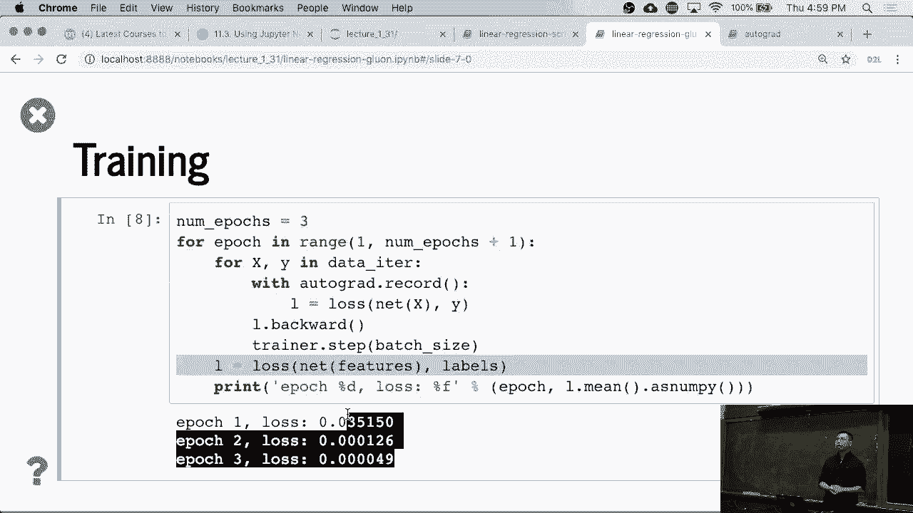

所以总体来说，这是一个相当临时的方法，我们将用来描述每个网络。我们将首先展示如何使用数组或简单的高层实现，从头开始，这样你就能理解它。另一方面，我们还可以展示我们实际上是如何使用Guru来实现这一点的，这样在大多数情况下，你构建应用程序时会使用Guru的预定义层。

这更加数值稳定且更快，但你可以根据你的项目需求进行调整。

好的，今天就到这里。
