# P16：16. L4_1 Linear Regression - Python小能 - BV1CB4y1U7P6

 Okay， so this is about implementing linear regression from scratch。 So first of all。 we import something。 We don't need to look into that。 The key thing here， we have autograph。 we have NDRA， and we have a lot of prodding and。

 we have random number generators。

 So we first generate a dataset。 The pretty small dataset， what we have is 100， 1，000 examples。 two dimensions。 So x is 1，000 by two matrix， it's a random matrix。 Then we can use a ground choose weight， which is the first element is 2， the second is minus， 3。4。 And the bias we can choose 4。2， this is the ground choose we have。 To generate the label。

 we just do x times the two weight plus b and plus the noise here。 The noise is a Gaussian noise here， so it can show you。

 And so this little bit of code here is writing NDRA but it's pretty similar。 Just generate numbers and get the results。 So the key thing here， we have features here。 we have labels here。

 Then we can visualize， we can show that the second feature at the label。 So because the linear regression there's correlation between features and the labels。 But we have loss here， so there's actually a lot of noise around。

 Then because we're going to use a mini-batch SGD， every time we can render， we can render。 the samples on our data to get the batch。

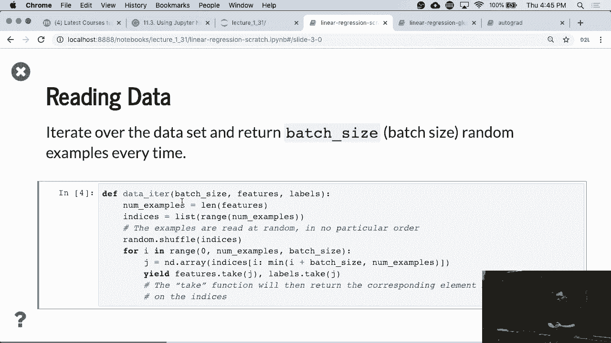

 So we're going to show actually how this thing looks like。

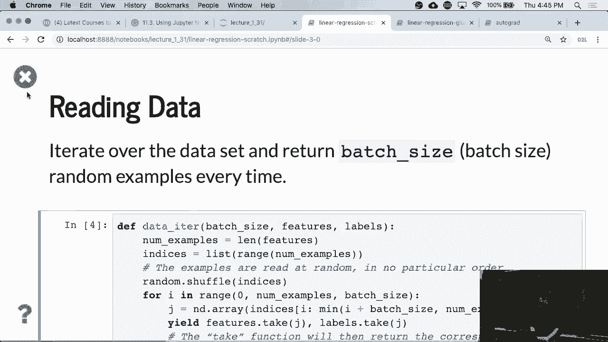

 So here we have， we give them features， we give them labels and then we give them batch， size。 What we do is like， we firstly generate the indices and we render the shaft weight so。 we can generate the render indices。 So at the time we're going to read batch size indices here and then to get the indices called。 J。 And we should take， take means given a set of indices， I take the row columns from， the matrix。

 I'll take the row element from the matrix。 So we generate J's usually like B batch size randomly indices and we pick up the data and。 pick up the labels。 We use the Python year here which is generate iterator。 So every time you don't。 every time you don't need to， so let me show how to use it。

 So every time you can using four X and a Y in this iterator。 So every time you run for loop。 you're going to get X and a Y and then run again， you get， another X on the Y。 So we're going to show you given batch size equal to 10， we're going to show you how。 to print X and a Y。 So X is two dimensions， 10 examples， Y is another 10 vector here。

 it's a 10 real value。

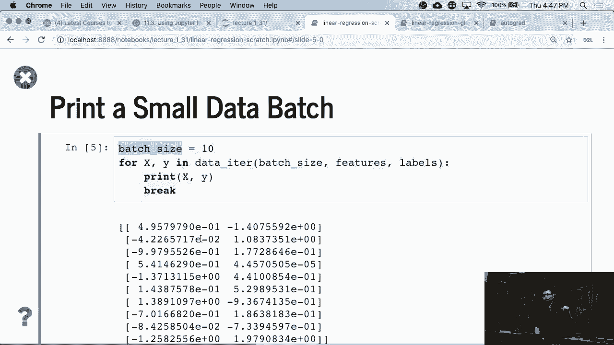

 number here。

 So that's a single batch。

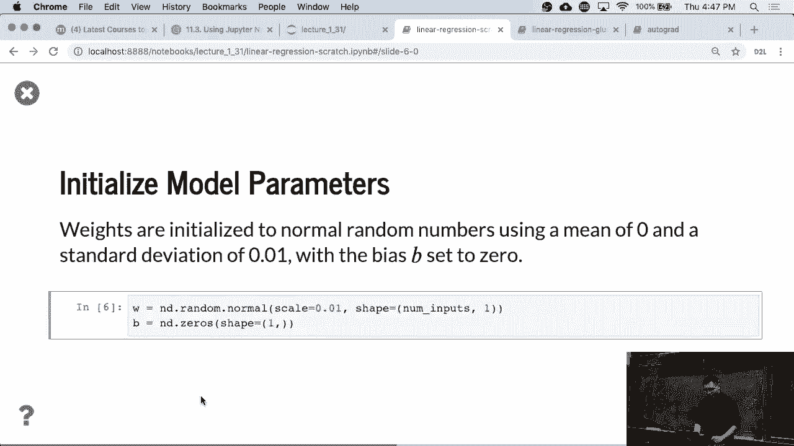

 Then how do you choose to initialize the model parameters？ Here we can use doubly。 randomly initialized by Gaussian distribution， it's zero min and。 scale equals to standard deviation equals to zero point zero one。 Well。 you don't want to use too large values， it's caused you numericals， instabilities。

 You don't want too small values， so how to train。 So that's another trade off。 We're going to talk about more in the optimization details。 So in most cases。 using random numbers and with such deviation， ISD is good enough。 For BIOS。 we just initialize to zero。

 So okay， we pick up the initial W and B。 Then because we're going to compute the gradients。

 with respect to W and B， we attach gradients here。 Again， we talk about that in autograd。 Now we can define the model。 In the model， given a batch of data X and a given weight and a B。 we're just using dot， matrix multiplication to compute X times W and plus the BIOS using broadcasting。 So we can get the prediction。 It is the vectorized version of it。

 So we save in the function called a linear regression。 Now the loss function that is given by hat。 this estimation is a vector。 So given the true label， it's another Y， it's a vector。 which is a hat minus Y。 And we do reshaping here because we want to match。 Sometimes you cannot get the row vector， sometimes you get the column vectors。

 We run a reshape here so that makes sure everybody has the same shape。 Because a common mistake。 if you get the row vector， if you get the column vector， if you， minus it by broadcasting。 you get the matrix。 And get the matrix because you run autograd， this is a loss function。 You run autograd and we can assign this matrix together to get a scalar。 You get a no warning here。

 So that's actually-- so we make a reshape here to guarantee that we do element-wise。 minus and we didn't do broadcasting。 So we minus Y hat minus Y and the power to 2 divided by 2。 So here we actually didn't divide by the batch size here。

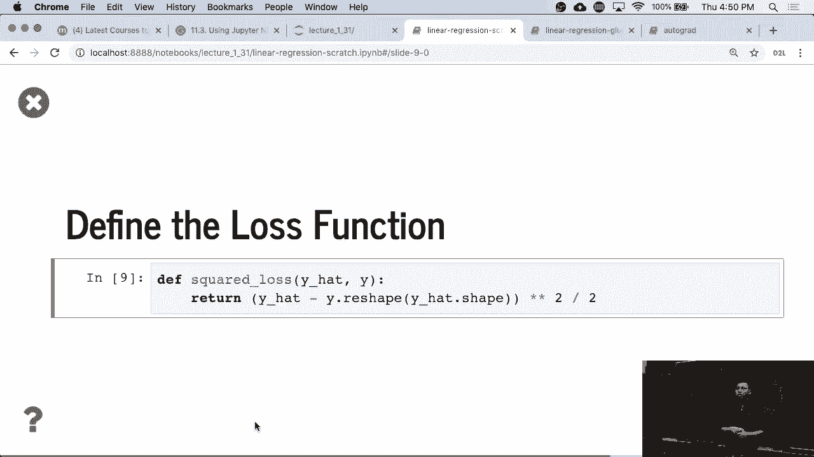

 So we can do that later。

 So then let's talk about SGD。 So SGD here， the parameters is actually W and the B。 It's a list of parameters。 The segment is for linear rate， this scalar we talked about later before。 And the batch size。 We divided by the batch size here for no reason。 You just can put the batch size in the loss function。 That's OK。

 But we just don't want the loss function to add another hyperparameter。 So then what do we do is like for every parameters， we just minus linear rate times the gradients。 and divide by batch size。 So that's just SGD or you just call a good descent。 Any questions so far？

 OK， good。

 Then the training loop， it'd be longer but let me just show the code。

 So we first pick the hyperparameters。 The first I choose linear rate equal to 0。03 by no reasons。 Then we choose a number of data passes to be 3， another 3 by no reasons。 The net we're going to choose is a linear regression。 So I just call the net and the loss function so that in later every training loop looks similar。

 The loss function we use as square loss。 And the training loop is like in the first or for loop we iterate over the data。 So we're going to do three pass of data here。 Then the second or for loop every time I read a data batch x and y。 Then we put the for the pass in the autograph or record here。 We first put x， x， w。 b into net to compute the estimation and then compared to the true。

 value of y to get the loss function here。 Now then we call the loss function the backward to compute the gradients。 Then once the gradients here we just write SGD。 The parameter here is just the w。 b because we already touched gradient before。 Put the linear rate。 put the batch size and then we update。 For each batch at the end of each batch we just compute the loss on the whole training。

 data。 Okay， and the print results。 So we're going to see that in the epoch one is we have a large loss then we decrease and。 the until last week at a small number。 Okay， so yes。

 That's a good choice。 So last let's show that what we actually learned and compared to what actually we have。 before because we have two w， we have two b then we can evaluate。 Then we show that actually the error thing is pretty small and so I can actually print。

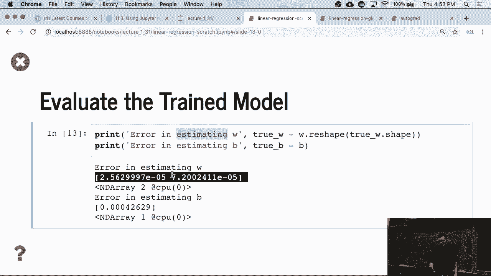

 w and print b。

 You can see that w should be two and minus three point four and b what is b is four point。

 two。 And actually what we estimate is pretty close to what we have in the ground choose。

 Okay， so because we mentioned that what is the linear rate and what the batch size I can。 show you some examples that let me choose a very small linear rate。 Choose a smaller one and then remember that in the third epoch we get a very low loss here。 Let's compare it again。

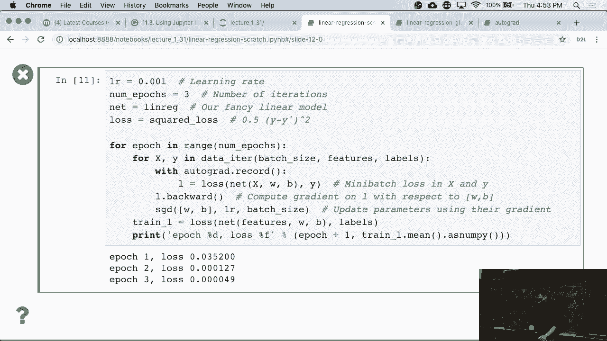

 Well， oh， we cannot do that because we didn't reinitialize w so let me reinitialize w to a。

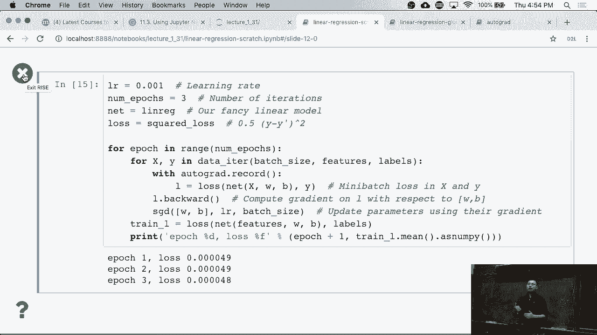

 random number， attach gradient。

 So you see that if you choose a very small linear rate that actually we have very large。

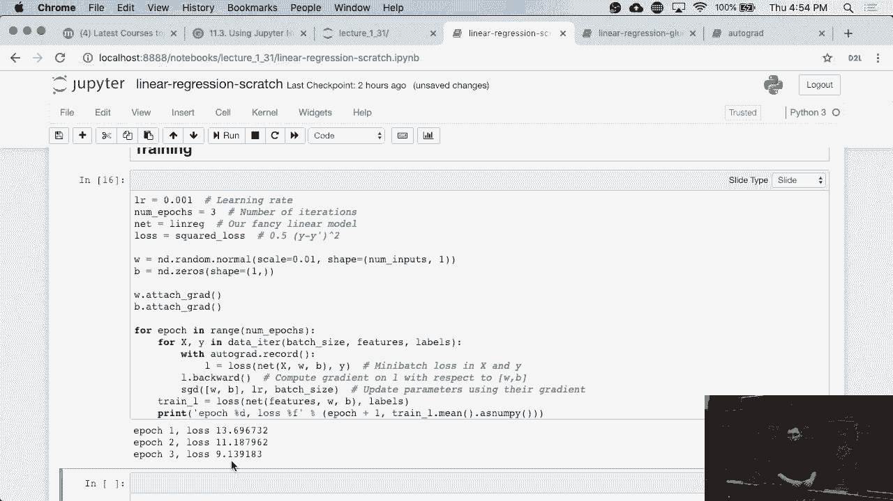

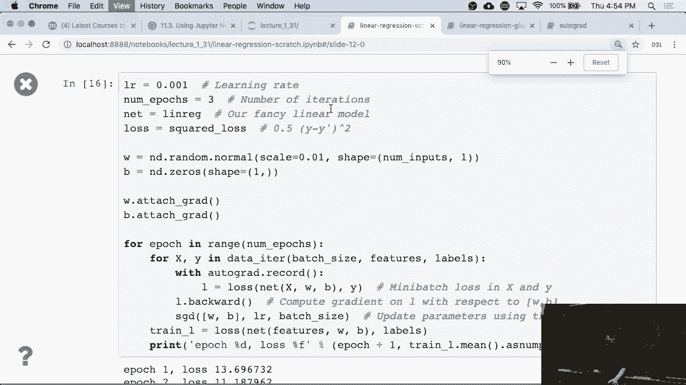

 loss。 So if I can use a very large one， it's one， well it works pretty well。 So 0。03 is too small。 let's do a larger one。 Well， you get a lot of number because too large。 So usually pick up the linear rate as large as possible to get the results。 And the last notebook I'm going to talk about how to use in Grun to actually improve the。

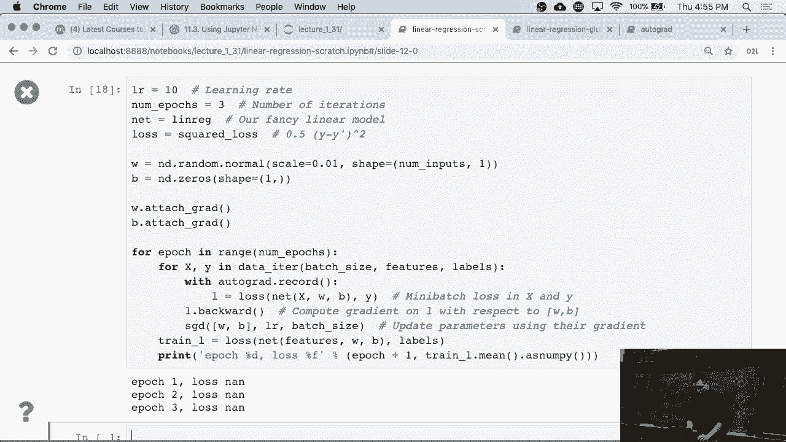

 thanksing but in Grun not for the under rate。 For under rate we show how to build things from scratch。 It's easy at this moment but let's only if I have hundreds of layers so you cannot do。 use a year raise。 So I'm going to show you how to use Grun to do the things。

 So Grun actually， so this is a similar thing。

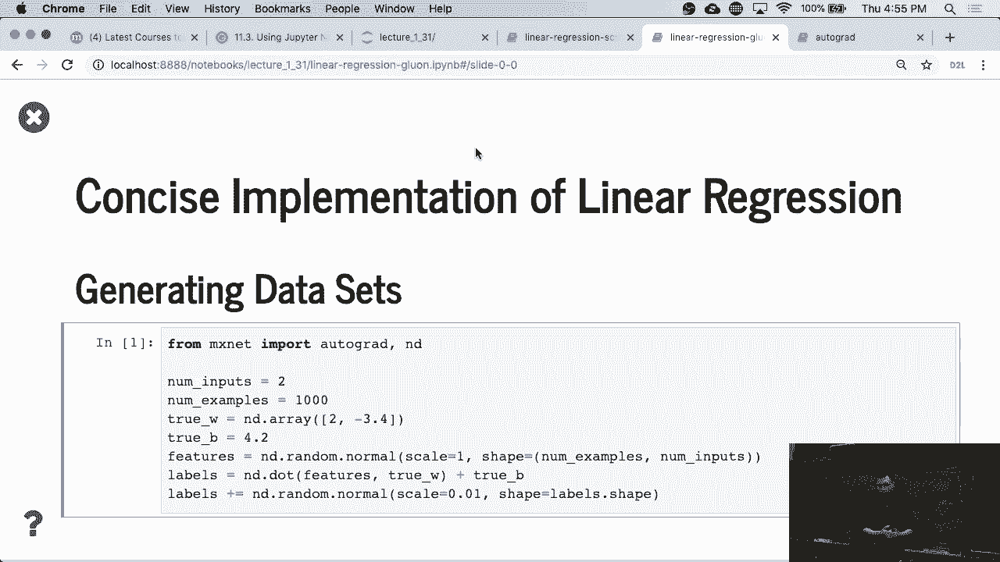

 These actually generate data set pretty similar to before。 Let me restart。

 So Grun provide two things， pretty useful。 So actually three things。

 What's how to load the data？ Grun have its data more Grun。 We'll import as G data。 it's not Google data but just put a G here in case we want to use。 data as a variable before a letter which is a back size。 This under a rate we just create the data set called array data set。 In the data set we can access。

 in the data set just that's a class you can index in any， examples。 Then given data set we can put in the data loader which is given a back size and the。 shuffle equals the two， written in the shuffle that they set。 Every time you can return a data iterator which can be used as exact as before that every。

 time we can for X and Y is data iterator and get a data batch。

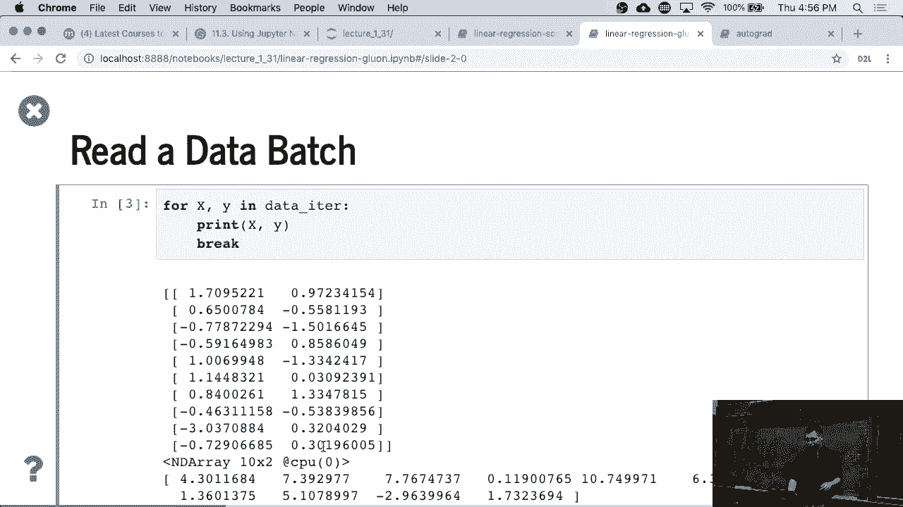

 The second different thing is that the linear model is called a dense layer or Fouc-Nell。 layer in neural network。 And the output size is one because they only have a single output here。 So in Grun is the neural network module， an e-module already defined what is a dense layer。 You just compute， you just construct the dense layer and put it into a container called。

 sequential container。 This container gonna let you stack multiple， it's like it's a list。 you can stack multiple， layers to get a new network。 So this we construct container only as a single layer， it's a single layer neural network。 and the output， the output size is one。 So here we don't need to specify what the input size。

 That's the key thing for Grun。 You don't need， because at this point we actually don't know what the input size。 So either we figure out a letter where we give actual data into the network。

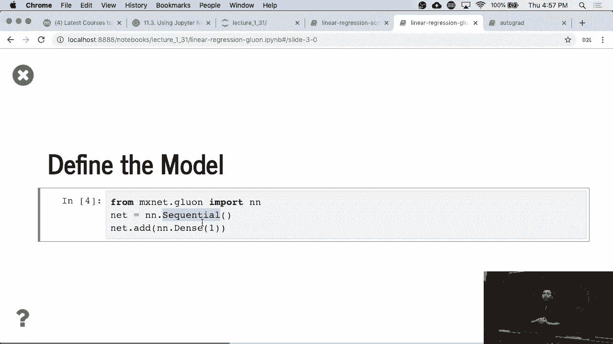

 So all the MSN have a bunch of initialization methods。 For here we can initially use a normal distribution and call it C， it's 0。01 and we call it。 the net， the network， the initialised and the given initialization methods。

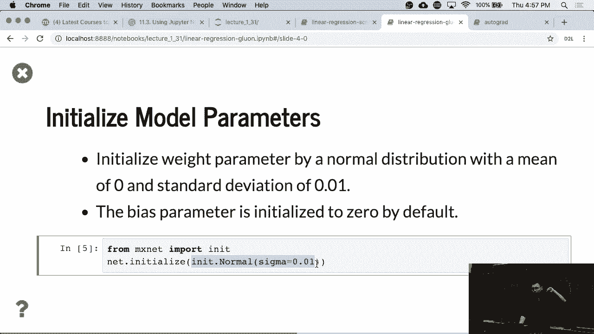

 The loss function， the Grun loss， Grun have a loss module defined a bunch of loss functions。 So here we just import the L2 loss。 So square loss also called L2 loss。

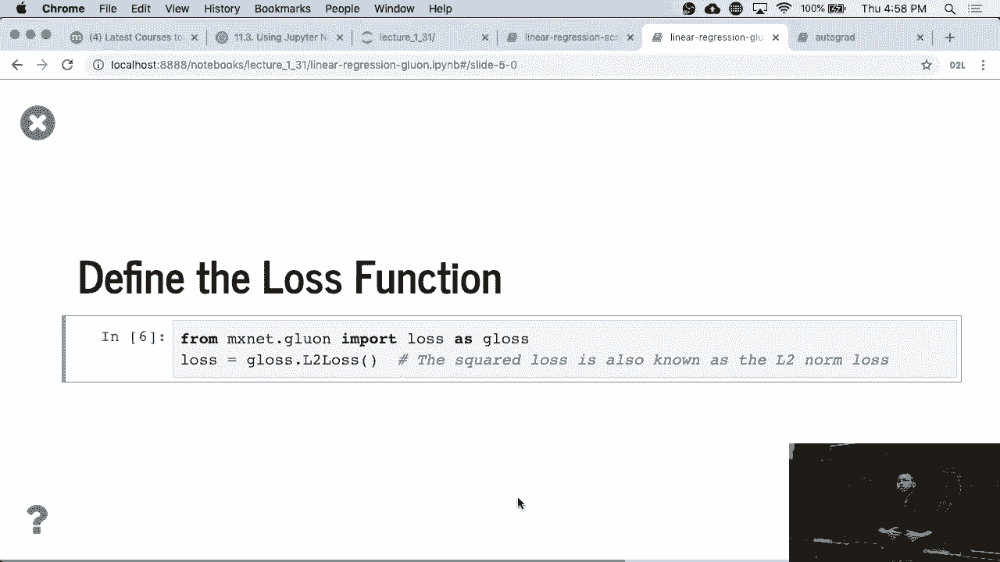

 Then training， we just tell you， okay， we have Grun have a trainer， we put the parameters。 the net parameter means put all these parameters on the network because you maybe have multiple。 layers in that， the connect means you're going to connect all these parameters on the。 networks and give the parameters to the trainer and tell them， okay， I'm going to use SGD here。

 SGD and the numerator will be 0。03。 So we don't need to implement the SGD function anymore。

 The training is pretty similar as before。 So we again pick a number of epoch equal to 3。 For every epoch we read the data and again we compute the fault path， give an X fitting。 to the network and compare the loss with the Y， get the final loss and the backward function。 Because we define the trainer which is SGD， we call the step function and we pass the batch。

 size into the trainer which we divide by the batch size to get the normalized gradients。 and then we update the networks。 Finally we're going to print the thing。 It's pretty。 as you see that the results are pretty similar to what we have previously。

 So in overall that's a pretty temporary we're going to use to describe every network。 We're going to first show how to use an array or just a lump high to implement things from。 a scratch so that you can understand it。 On the other hand we can show how we're actually using Guru on to implement the thing so that。 in most cases you build your applications and you're going to use a Guru on predefined， layers。

 It's more numerical stable and faster but you can for your projects。

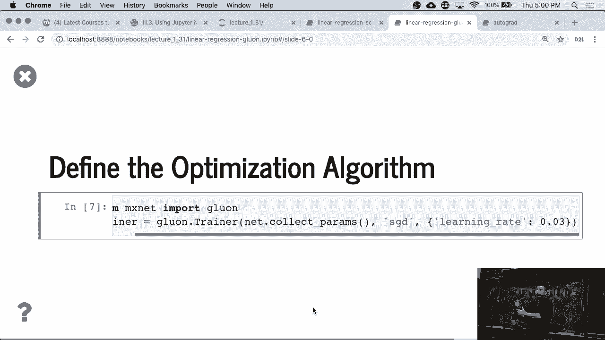

 Okay， so that's all for today。