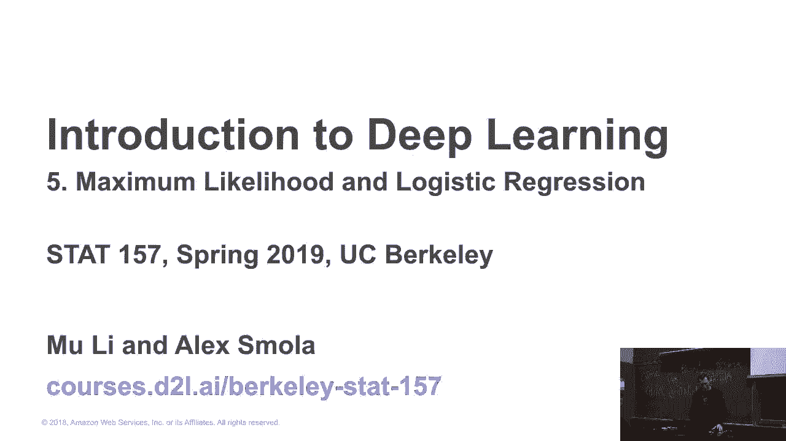
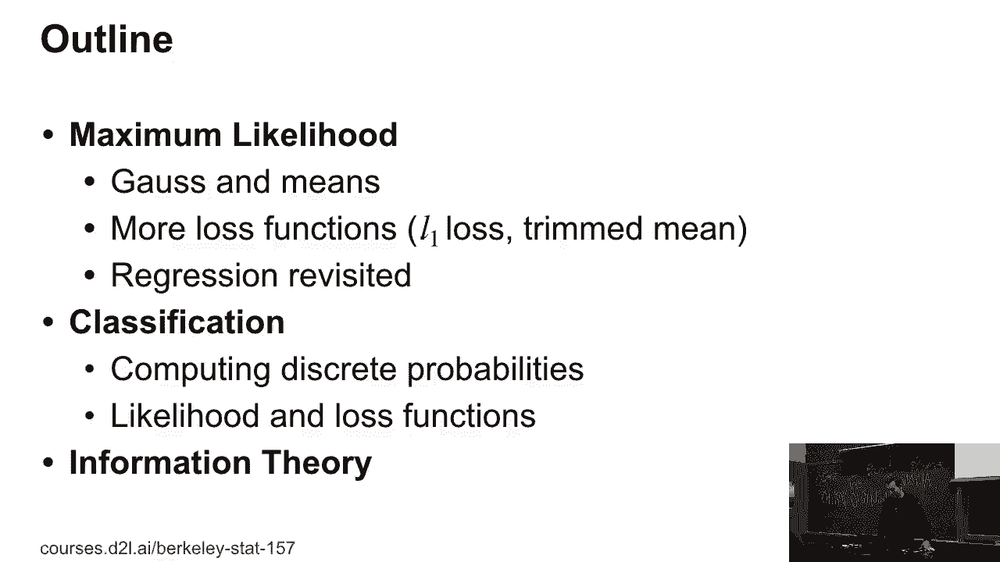
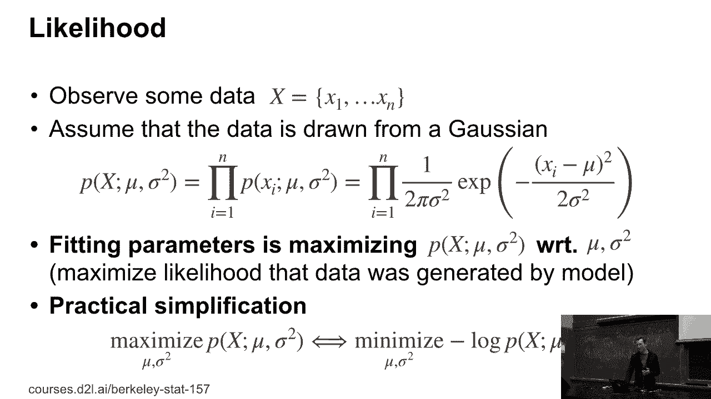
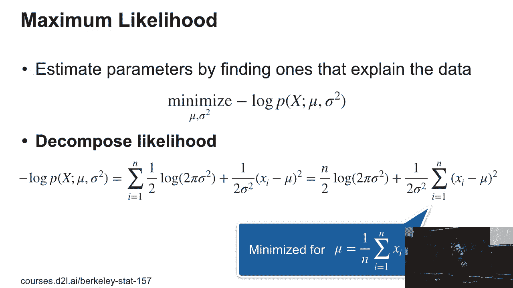
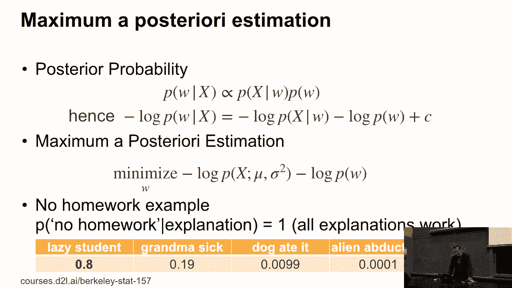
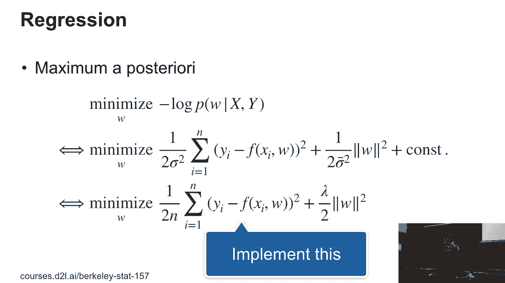

# P18：18. L5_2 最大似然估计和最大后验估计 - Python小能 - BV1CB4y1U7P6

所以，逻辑回归。首先我们要做的是，实际上我们要做的。

回到最大似然和最大后验等等。只是稍微激励一下，为什么我们会有这个奇怪的，知道的，最小二乘损失。于是，最大似然。

和最大后验。记住，这是我们的正态分布，对吧？所以，它是。P（X）是 1 除以 2π sigma 平方的平方根，e 的 X 减 mu 平方除以 2 sigma 平方，平方。对吧？这就是它看起来的样子。很无聊，对吧？然后大家都知道，嗯，你知道的，如果你想得到均值，嗯，你就把所有数字。

你把它们加起来然后除以 N。而且，你知道的，可能你知道的，在小学，孩子们或者你知道的，类似那样，他们可能已经知道了平均值，对吧？他们只是拿这些数字，加起来，除，像，嘿，大家把蛋糕分公平点，你知道，把所有的蛋糕块加起来，分成三份，如果可行。

他们可能不知道方差，但你知道的，每个人在某个时候都学过，嘿，好的方差估计是 1 除以 N，Σ（ri = 1 到 N）Xi - mu 带帽，平方。实际上，如果你想做对，稍微复杂一点，因为你需要，嗯，知道。无论如何，现在我们不会深入讨论这些细节。

但显而易见的问题是，为什么这其实是个好主意，对吧？我的意思是，这是你学习的第一件事，但为什么要那样做呢？然后你可以说，嗯，因为那是高斯分布的均值和方差，但是，嗯，你知道的，怎么做呢？

我们是怎么得出结论的呢？那么，让我们从最基本的原则推导这个。我们将通过查看一个叫做似然的东西来做到这一点。所以这个想法是，我们从一些数据 X 开始。也许是 X1 到 Xn。在这种情况下，我假设数据已经从高斯分布中抽取出来。所以我假设我有 P(X)，并由 mu 参数化。

和 sigma 平方。好吧。那么你注意到这里有一个非常奇怪的符号吗？我没有使用条件符号，而是用了一个分号？因为我只是把 mu 和 sigma 平方当作这个分布的参数，而不是条件在这些参数上。对吧？

所以这些只是我碰巧选择的参数。是吧？抱歉？

两种版本有实际的区别吗？嗯，从解释的角度来看，它们意味着不同的东西。所以在一种情况下，我在给 mu 和 sigma 平方赋予某种统计意义，可能是它们来自某种分布，或者其他什么的。而在另一种情况下，它们只是一些参数，就像事实一样。

我的涂层在泊松分布上，或者说，嗯，今天早上下雨了。所以它们现在只是，你知道的，事实。当然，我可以将其写出来，如我所做的那样。所以我得到从1到n的乘积，1/2泊松平方e的负(xi - μ)²/2σ²。如果我想找出参数。

这很适合数据，你知道，比如说，我可以在高斯分布和可能的指数分布之间进行选择，还有五个其他的分布。可能会有。但如果我选择高斯分布，那么我可能会去，知道吗，最大化P(x)，其参数化由μ和σ平方表示，相对于μ和σ平方进行优化。所以我在做的事情是。

目标是最大化数据由模型生成的可能性。这不是概率，因为你知道，我可以通过调整μ和σ平方来改变它，所以在这个时候它不再是概率。但唯一的事情是，如果我查看那些可能性，那些数字会变得非常非常小，随着我添加更多项。所以显然你。

这样做与其最大化趋近于零的东西，不如取其负对数。这样你又得到了一个行为相对良好的东西。所以你最小化的是负的log P(x | μ)，其参数化由μ和σ平方表示。好的，接下来。

现在真的只是化妆处理。所以让我们来实际做一下。于是我最小化负的log P(x)，其参数化由μ和σ平方表示，我可以分解它，因为每一个观测值都是从同一个分布中独立、同分布地抽取的。所以有时候统计学家会说，好吧，让我处理一下Onyate先生和印度村庄的事。好的，好的。

所以我可以去分解这个。好的。所以IID，独立同分布。这是你希望在你的真实数据中看到的假设。当事情真的很美好的时候，基本上，它意味着你可以为所有内容使用一个分布。它就像是所有两个元素的并行，等价的。无论如何，在我们的案例中。

因此，似然函数，负对数似然函数分解成了每一个单独的xi的项。所以你得到一个公共项，也就是1/2 log(2πσ²)。所以这就构成了n/2的项。然后我得到1/2σ²(xi - μ)²。所以我可以将求和提出来，所以我得到的基本上是一个不依赖于。

μ和某些东西。这时，如果你最小化与μ相关的部分，你会发现这个在μ等于1/n，Σri=1到n xi时最小化。我现在不会明确地做这个推导，因为你可能之前见过这个推导。但这现在显示了μ实际上是这个问题的最优解。

好的。如果我想对方差做同样的事情，我就取我上面提到的相同表达式，并对 sigma 求导数。现在，我要做点小聪明。我将对 sigma 的平方求导数，否则表达式就会变得冗长且繁琐。所以，现在，sigma 的平方是。

n 除以 2 sigma 平方减去 1 除以 2 sigma 的 4 次方，i 从 1 到 n 的 xi 减去 mu 的平方和。当然，为了最优化，这个需要消失。所以，如果我解 sigma，我会得到著名的方差。那么这一切和回归有什么关系呢？嗯，这正是我们要使用的，也是我们在做的事情，当我们。

正在执行最小二乘拟合。但是在此之前，让我们稍微看一下最大似然估计到底意味着什么。好吧，如果我有，假设，我的参数的似然，我刚好选择了高斯分布，但无论如何，那么最大似然估计就会去找到该分布的众数。好吧，在这个案例中，它看起来非常好。

是吗？[听不清]，所以因为 pi 并不真正依赖于任何东西，对吧？

既然我有 2 pi 的对数，sigma 平方，因为它是常数，它在这里的差异就会被消去——所以导数被消掉了。但好吧。如果我把这个作为我的似然参数，那么我只需选择该分布的众数，这没问题。但如果我把它作为我的似然轮廓。

我要挑选位于峰值的那个点。这可能不是我想要做的完全正确的事情。而在这里，我肯定不想这么做。所以，某些地方是有些不对劲的，对吧，和我们的最大似然估计有些不匹配。让我们选择一个离我们更近的东西。比如说你没做作业。那么——好吧。

所以这就是数据。现在我可以提出可能四种不同的参数化。好吧，它们都会完全解释这些数据，比如你没做作业。一个是狗把作业吃了。好吧，作业没了，对吧？完全可以解释。你被外星人绑架了。好吧，这也是一个完全合理的解释，为什么你。

没做作业，或者你可能太懒了，或者也许你的祖母生病了，没问题。你知道，所有这些参数完全可以解释数据。现在，当然，如果你去找助教，你可能去，但不一定首先提出外星人假设。为什么会这样？好吧，为什么你不会说，“嘿，我被外星人绑架了，这就是原因”？

为什么我不能做作业。“是吗？他们不会相信。因为没有人做得对。”好吧，他们为什么不相信呢？因为懒得做会导致最大似然。就像根据这些东西的函数那样。

所以我们来看看这个吧。让我们看看后验概率。对吧？所以现在我们将参数从单纯的参数转换成某种从未知分布中抽取的东西，来解释可能的情况。如果你想一想，懒学生、奶奶、狗和，嗯。

也许我们离51区有点太近了。那么我们来给外星绑架事件设置一个概率吧。好吧，设定为0.01%。这个概率已经挺高的了。而狗的概率，接近1%，奶奶的概率接近20%，而且，你知道的，80%的是懒惰。所以，接着使用贝叶斯法则，后验概率就可以由你知道的计算得出。

数据的似然性，所以下面是X的P，参数化为W，所以给定W，乘以你知道的先验。这个参数合理的概率是什么？结果是，你实际上是在标准最大似然问题中，对参数添加了一个惩罚项。所以有时候人们会谈论惩罚的最大似然，他们做的就是最大似然。

一个姐妹会的例子，顺便说一句，正则化的最大似然做的也是一样的事情。所以人们发明了很多相同的算法，使用了许多技巧和名字，实际上我们会在这门课中看到其中一些。所以在这类估计均值和方差的上下文中，我可能会有负对数P（X，均值，方差）减去负对数P。

其实在这种情况下，均值，方差。嗯，这里有点小错误。所以作业中的例子，尽管所有内容的对数似然完美无缺，但先验显然大不相同，因此TA会推断，嗯，你可能没有做作业。我们会看出谁太懒了。

那么，这和Mu上周五说的有什么关系呢？嗯，什么。

我们在回归分析中，基本上是将观测值YI与我们的模型F（XI，W）进行比较。然后我们有一个额外的惩罚项，即对应于-W的负对数P。所以这将确保我们不会选择不合理的参数。所以在我们的案例中，我们有这个非常简单的数据生成模型，YI = F（XI，W）加上εI。然后。

也许你把高斯先验加到了W上。要知道，如果你大约四五年前上过机器学习课的话，嗯，这是我在CMU教授博士课程时教授的内容。对于博士生来说，这会是一个相当先进的模型。你将在作业中做比这更复杂的内容。很容易。

可能只有几行。是吗？ >> 所以问题是，抱歉，能回到上一行吗？

我有个问题。

是吗？所以我们的意思是，如果我们假设所有先验选项相同，那么最大似然估计总是回避估计器吗？这是对的。如果我有一个均匀的先验，最大似然和最大概率将是相同的。如果你不知道外星人是怎样的，这将是一个合理的假设。

很少见的是懒惰却非常普遍，对吧？但是，一个好的工程师会选择一个先验，能够准确反映问题。所以，比如说，如果我要查看电压，只来自插座，我可能会选择一个先验，假设电压要么是零伏，要么是110伏左右，对吧？

或者，如果你是在美国以外长大的话，那么你很可能会看到220到240伏的电压。但这是一个好工程师会做的事情。他们会选择这个作为他们的先验，并且会用它来调整从测量设备读取的数值，当他们把设备插入插座时。你很少会看到比如50伏的电压。

插座中的60伏电压。那会非常奇怪。一个好的电工首先会做的事情就是用不同的电压表重新测量，因为他们不相信它。所以，这是一个非常好的问题。好的。现在我们来看看优化问题。

问题。这正是我们上周五所做的。我们看了，知道，1/n 或者1/2yi - f(xi) 和w的平方。然后是某个系数乘以，知道的，惩罚项和w。实际上，我们实现的并不是这个。我们实际上实现的是最大似然解。但这只是因为我们可以这样做。

我们有这么多数据，但参数非常少。好的。还有其他问题吗？有吗？[听不清]，好的。好。那么，从第一行到第二行是相当直接的，对吧？

因为我们有似然项。第二项只是高斯假设。我去掉了所有的，加法常数，对吧？我把它们都拿到右边了。现在，如果我有这个最小化问题，我总是可以通过某个数相乘或者相除，而问题本身并不会发生变化。所以，我做的就是除以n，好的？然后。

乘以σ平方。好的。那么，发生的情况是，这里第一个项，对吧？它就变成了 1/2n，求和。第二项现在会获得n倍的σ平方，抱歉，获得σ平方除以σ条形平方n。我把它重新命名了。然后我把它重新命名为lambda。请注意，这个非常，回头看是非常明显的转换，曾经让人们困惑。

大约15到20年前，当人们试图将高斯过程与支持向量机进行比较时，争论了很多。大约有一到两年时间，人们一直在争论哪个更好，直到有人意识到这只是一个重新参数化的问题。好吧，我在这里总是简化事情，但的确，这导致了许多毫无意义的可笑争论。

好的。那么。
