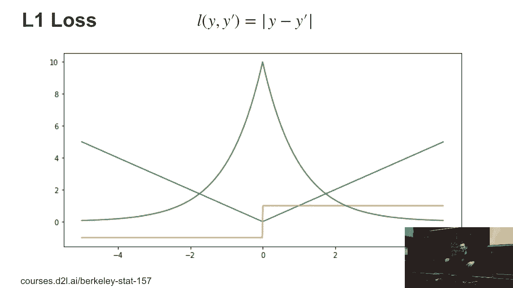
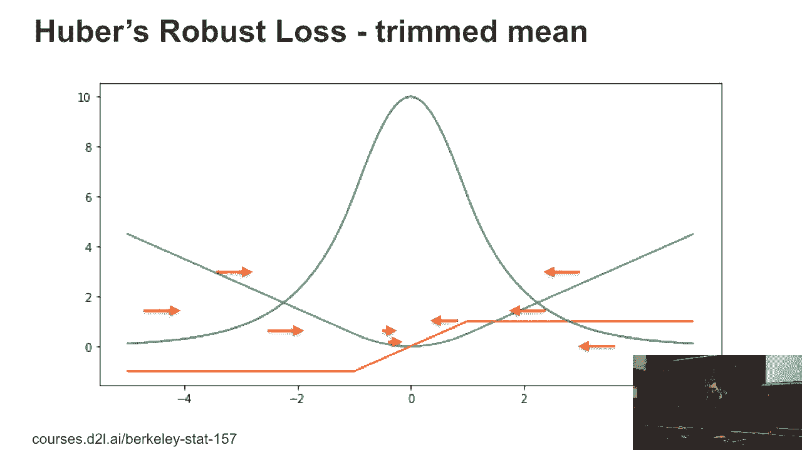

# P19：19. L5_3 损失函数 - Python小能 - BV1CB4y1U7P6

损失函数。是的，你知道，我们可以优化什么呢？这个是一个非常简单的损失函数。好吧，这正是我刚才描述的那个。它就是一个高斯分布。顺便说一下，这些图都是直接在蓝色平台上生成的。那么让我来解释一下你看到的是什么。蓝色函数就是这个。

我描述的函数是1/2 y减去y帽的平方。绿色函数是e的负该损失函数的指数。当然，在这种情况下，如你所见，我将y'选择为0。所有我做的，就是因为我懒，直接将绿色函数归一化，使其在区间内积分为1。

范围从-5到5，忽略所有在外的部分。但除此之外，这就是一个正态分布。红线是蓝线的导数，也是自动生成的。所以，作为你们的作业，你将使用autograph来自动完成这一步。好了，这里听起来可能有点无聊。

对吧？因为你知道，我们都可以写出y减去y'。但还有一些其他的损失函数，这实际上是一个很大的优势。好了，让我们看看发生了什么。我们之前看到的是，如果我最小化L2损失，我得到的恰好是均值，对吧？

所以我刚刚用那些红色箭头标出了梯度的大小，如果我有这些观测值，这将给我它们的均值。好了，现在我们来看L1损失。

再次，我做了完全相同的事情。我取了绝对值函数y减去y'，并绘制了这条蓝线。然后我对其进行了指数化，得到绿色线，同样将其归一化，使其在-5到5区间内积分为1。然后，橙色线是导数。再次，这个是自动生成的。

现在这个损失函数有一个相当有趣的特性，对吧？也就是说，它的梯度要么是-1，要么是1。

如果我通过优化，尝试找到梯度平衡点，我需要左右两边的点数相等。所以我们称之为中位数。如果点的数量是奇数，我会选择那个点，恰好是那个。否则，我可以选择区间中两个点之间的任何一个。灰先生，这个是不会变化的。

这就是中位数。好了。

现在，让我们选择一个稍微奇怪一点的东西。这被称为Hoobers-Robost损失。Hoobers-Robost损失之所以奇怪，是因为它在分支上看起来像绝对值函数。所以外侧的蓝线是直线，内侧则是一个抛物线。它的意思是，它其实就是一个抛物线，然后被延伸出来。

持续地用一条直线拟合。你需要仔细看才能弄清楚它到底在哪里交叉。现在，如果你画出导数，也就是橙色的曲线，你就能很容易看出来。再次强调，这些都是用Glue自动生成的。这样我就不需要做什么特别复杂的事情来得到它。

绿色线条又是对应的密度。那么鲁棒损失有什么特别之处？

好吧，实际上是很多的，因为这可以确保如果你有一个。

直线，如果你看那条线，你实际上是在执行修剪，去掉最大和最小的项。然后你在其间计算均值。最大和最小的项的梯度会相互抵消。中间的部分嘛，你就有了标准的高斯分布。

损失函数和其他的一切都会在那里平均化。是吗？ >> [听不清]，>> 好的。这是一个很好的问题，特别是关于异常值的关系。现在，一个修剪估计器有效地执行了鲁棒估计。现在我在这里没提到的小技巧，就是，某些东西。

我是说，好的统计学课程会讲到这一点。你不一定要选择一个和-1的阈值作为硬性约束，来确定交叉点。你可以动态调整它们，适应你所遇到的估计问题。你只是修剪掉最小和最大的一些项。这样就有效地进行了异常值移除。不过，当你进行回归时，它并不完全是这样。

去除异常值，你只是限制了单个观测值可能带来的梯度影响。所以这样做并不是忽视那些处于极端位置的点，你只是确保它们不能对结果产生过大的影响。

这实际上是一个在深度学习训练中非常常见的技术。它叫做梯度裁剪。现在梯度裁剪听起来比鲁棒损失要酷得多，但它实际上做的就是这个。所以我在这里讲解它，是为了让你在后续做梯度裁剪之类的操作时，能够理解到底发生了什么。

有些原因是你需要这么做，因为如果梯度太大，任何优化都可能发散，但它也意味着你不应该给个别观测值过多的权重。所以这在许多优化过程中会有很多变化。

这是稳定的，以下是它的统计学原理。还有其他问题吗？是吗？ >> 抱歉，我其实有点困惑。那我们在这里究竟是想做什么？

我们是在哪里开发不同的损失函数的？ >> 所以我们刚刚看了不同的损失函数。这是因为，除了最小均方误差损失，你可能最终会在你的优化问题中添加很多不同的损失函数，以执行不同类型的估计。

在这里，我们首先讨论的是非常简单的损失函数，主要是回归损失，因为在这里我可以画出很好的图像。而一旦你进入到结构化多分类损失等其他内容时，就很难直观地理解发生了什么。另一个原因是我想探讨一下梯度裁剪和其他方法之间的联系。

梯度裁剪和你通常采用的方法之间的联系，即你会限制损失的大小的上限。因此，如果你有一个很大的向量损失，你基本上会确保该向量的二范数不超过某个特定的值。

由于这是本科生课程，我们采取了一种稍微快速但有效的方法，通过给你更多的直觉而不是所有的数学推导。所以，我们面临一个矛盾，就是在我们能覆盖的内容量和我们能深入的程度之间做出平衡，这就是我们给你直觉的原因。

我们不能像研究生课程那样深入探讨所有的细节。好了，这基本就是我们关于回归分析所涉及的内容。

