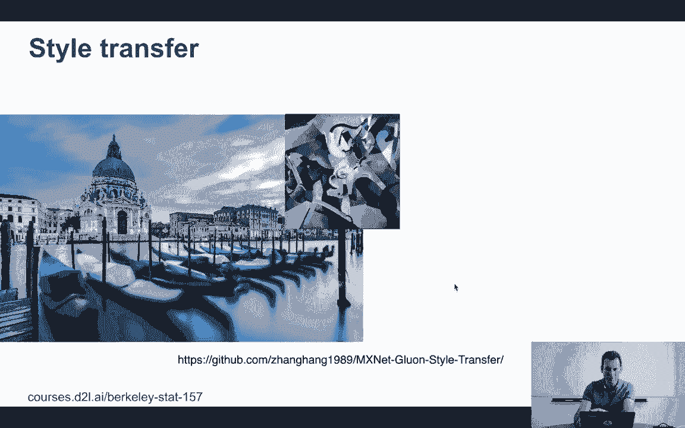
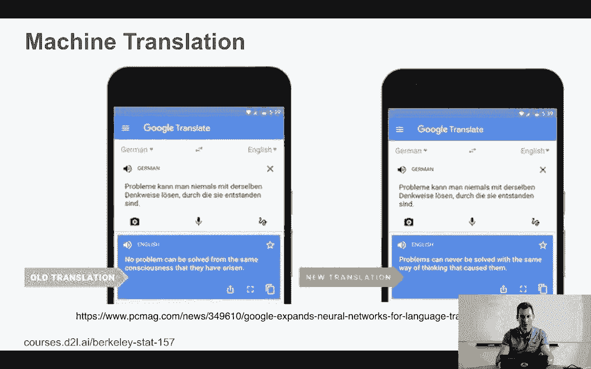

# P2：2. L1_2 Deep Learning Overview - Python小能 - BV1CB4y1U7P6

 Let's get started with deep learning。 Of course， this is just really a really quick overview。 but this is really to give you an idea of what you can do with deep learning。 at least to scratch the surface of the tip of the iceberg， if you will。 Okay。 So one of the obvious things you can do is you can classify images。

 An image net was probably the key example that demonstrated at first。 what you can do with computer vision deep learning。 If you look at this graph， in 2010。 when things started， basically the accuracy of the classifiers was quite mixed。 It went from， well。 quite horribly up to 75 to 80%， down to something that was around 30%。 In 2012， the first team。

 you know， that actually went below the 25% error mark， was the one that had deep learning。 and they were significantly better than all the other teams。 The following year。 almost everybody beat the 25% mark， and things actually improved quite rapidly， if you look along。 Basically， by now， the accuracy has improved， and this is 2017。

 so basically you can get accuracies depending on how you measure it。 in the 5 to 10% range quite nicely。 Now， of course。 object recognition isn't the only thing you can do is you can segment things。 and then annotate them。 For instance， Matterport has this Mask RCNN code on GitHub。

 You can find similar implementations in Glue and CV or in the detector on。 There's a lot of segmentation algorithms that use tools like the ones that we saw for images。 for object recognition， similar convolutional networks with other tricks to actually segment things。 Now you can do something entirely different like Style Transfer。 For instance。

 let's say you want to have a， you know， this is Venus on the left-hand side。 and now let's say you want to have something that looks a little bit more like maybe front-smart。

 Well， you get something like this， or you can have that style or that style and so on。 And the idea is actually quite straightforward。 Namely。 you want to have an image where the activations at the last layers look very similar to the ones that。 you know， would be recognizable as Venus， but you want to have something where the lower-level image statistics look very similar to the target image that you care about。

 And by now you can get that as filters on your cell phone。 You can also synthesize faces。 and they all look perfectly fine， those faces， and they are perfectly unnatural in the sense that they're all synthetically generated as paper from last year that had a very nice face synthesis algorithm based on celebrity photos。

 You can do entirely different things like analogies， so you can basically try to embed words。 Then you can play games like "Man is to woman like King is the Queen" or "Walking turns into Walk" or "Swimming to Swam" or。 you know， "Country Capital like Spain to Madrid is like Italy to Rome。"， Now， if you have that。 you can try to do math like Italy minus Rome plus Madrid equals Spain。

 At least that would be the idea。 And those things actually work quite well， so this， of course。 allows you to do things like encode knowledge， and queer is like "What's the capital of Turkey？"。 Well， you start with a country pair where you know the capital and then you encode it。 There are better ways than that how to do it， but it gives you a good idea that in this case。

 the embeddings actually learn something quite meaningful。 You can use it for machine translation。 and as it so happens， by now， pretty much every deployed machine translation tool uses deep learning in some form。

 You can synthesize text like "Two Dogs Play Buy a Tree。" but you want them to play happily in in love。 I'm not sure whether dogs can be in love。 but whatever。 So two dogs in love play happily buy a tree。 You can do that。

 Or you can ask "What's the mustache maze of？"， And if you look at that， well， you know。 it's clearly a woman and it's clearly a highly unnatural mustard。 Well。 at least I don't think bananas grow in such a way。 So what you therefore need to do is you need to understand what the query is and this query is clearly crazy because women don't tend to have beets。

 You then need to extract features from computer vision and then you need to have some mechanism of attending to the various parts in an image to。 for instance， recognize what is computer vision。 And then， of course。 once you know which part you're looking at， in the case for a banana， that's the easy part。 There are lots of different algorithms on how to do this。 This is one。

 It's a paper on archive from 2018。 That works quite well。

 You can caption images。 So here， a couple of pictures of dogs doing dog stuff， being rather happy。 Cute little dogs sitting in a heart-drawn on a sandy beach。 So these are captions that humans generated。 And then you can ask， well。 can you generate such a caption automatically？ And indeed， you can do that， for instance。

 this is a paper from 2016， where， you know， you have this nice caption of a dog sitting on the beach next to a dog。 Okay， I think this is something that a human would also possibly create as a caption。 Now。 this is pretty much it for giving you a very， very brief overview of， you know。 some of the things that you can do with deep learning。 We'll get into this in a lot much detail。

 We'll look at the algorithms on how to do it。 You will actually go and implement those algorithms。 But for now， this is really just to whet your appetite and get you excited to take this class。