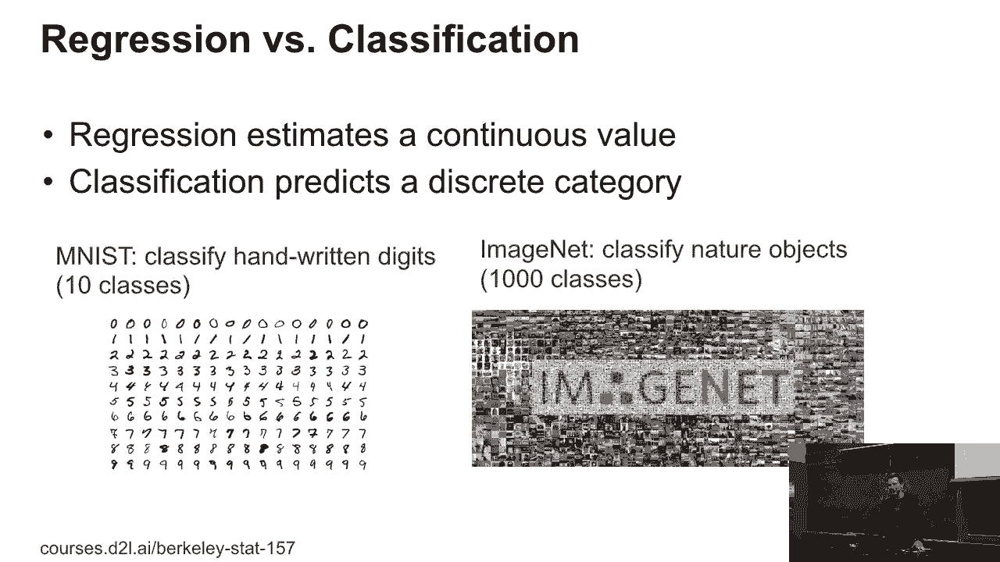
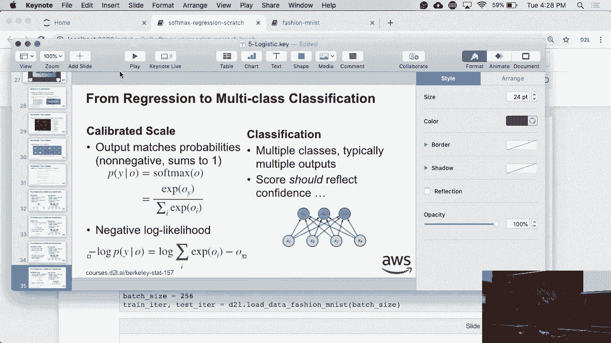
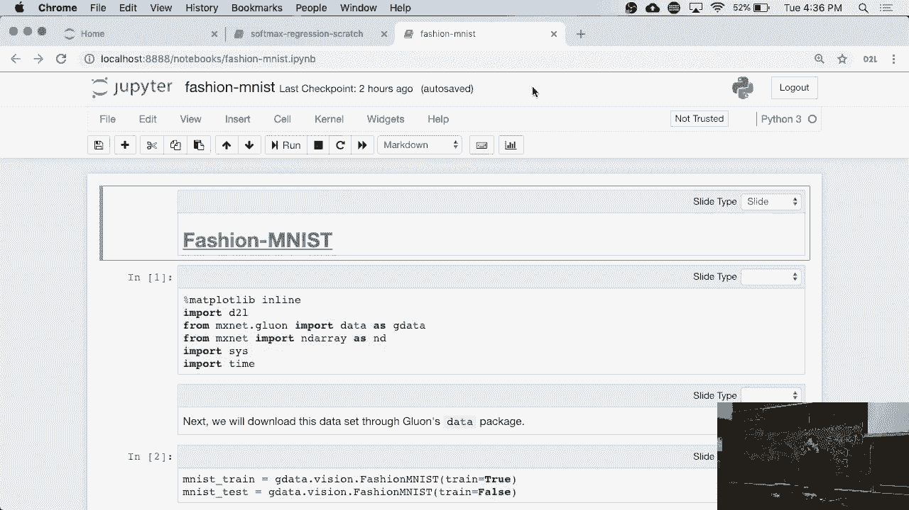

# P20：20. L5_4 逻辑回归 - Python小能 - BV1CB4y1U7P6

所以如果你考虑一下逻辑回归，它会做一些事情，它需要解决一个非常重要的问题。如果我们有回归，可能是单维度也可能是多维度，那么我们基本上是在尝试为一个连续值做估计，对吧？比如房价，或者一个人的身高体重，或者我不知道，也许是别的。

每天的阳光时长和温度，你知道，这将是两个变量，或者可能是每日股票市场上十种不同证券的价值。所以这些都是很好的回归问题。对于分类，你需要预测一个离散的类别，比如它是猫还是狗，或者是什么数字？

你知道，如果你使用 ImageNet，那么你可能会得到一千个类别。而且实际上，原始的 ImageNet 数据集有超过一千个类别，可能超过一万个，但基本上你将会得到一个类别性的离散输出。

还有很多其他不同的例子。例如，在 Kaggle 上，你可以尝试根据蛋白质的特性和功能来进行分类，或者你可以找出你正在处理的恶意软件的类型。

或者，你知道，哪些是有毒的 Wikipedia 命令，按它们属于哪种类别来划分。显然，有一些原型，比如，嘿，我并不是想开始一场编辑战争，但当然现在我就是了，对吧？

那么为了让这个更具象，回归中，我们通常有一个自然的尺度，通常是以实际的数值形式表示，然后损失通常是以 Y 和 F(X) 之间的差异来给出的。但这并不总是正确的损失。例如，如果我看看股市。

我关注的可能是对数的差异。因为无论我是交易亚马逊（其交易价格为 $1,600）还是交易，我不知道，Facebook（大概是 $100 左右）。但这并不重要。如果我，假设，或者我买了一只可能仅值 $1 的便士股票，而且它快被退市了。

对于那只便士股票，如果它的价值增加了 50 美分，那就是一个巨大的 50% 的涨幅，对吧？而且由于我可能会买很多这样的股票，那么我就发财了，反过来，如果亚马逊涨了 50 美分，那其实并没有发生什么特别的事情，对吧？

因为基础价格很高。所以你关注的是相对变化。在这种情况下，你不会看数值之间的差异，而是可能会看一下损失后比值的对数。在分类中，通常有许多类别，分数应该以某种方式反映我们对结果的信心。这其实是非常模糊的，那么我们该怎么办呢？嗯。

我们可以做的第一件事就是使用平方损失，对吧？所以我只是对类进行编码，你知道，使用一个由所有 0 和 1、1 组成的向量，对吧？然后对每个梯度进行处理。这听起来非常奇怪，但人们已经这么做过了。如果你不在乎特别做得好，实际上这样也能起作用。

所以有几种实现方式，比如，VW 曾经一段时间使用过它，比如 WAPL、WABL。所以有很多原因为什么你可能会这么做，并且它也不算太坏。你甚至可以从统计学的角度证明它并不太坏。然后你只需选择最大的输出，那个输出就获胜。但我强烈建议不要这么做。

但人们还是这样做了，好吗？你可以选择一个未校准的尺度。顺便说一句，这正是支持向量机所做的事情。所以你选择最大的输出，但你希望确保正确的输出远大于所有错误的输出。

所以你得到的条件是，OY减去OY大于等于某个Delta Y和I之间的差值。这个Delta告诉我出错有多严重。假设你开车在一条路上，右边是悬崖，左边可能是草坪或者其他什么东西。那么当你开车在这条路上时。

你可能会稍微往左偏一点。因为如果你开到草坪上还不算太坏，但如果你掉下悬崖，那就对你来说很糟糕，对吧？

所以，你会保持一个相对较大的间隔，针对那些会产生大损失的输出。在适当的情况下，你可以设计这个损失函数和这个优化问题，使得你可以高效地解决它。大约在2002年、2003年左右，这一切都非常流行。所以大概有三种方法。

四百篇论文提出了许多巧妙的技巧，讲述了如何解决这个问题，如何通过内部的一些数学编程以及优美的数学来解决这个问题。我们都玩过这个游戏，嗯，是的，那个时候做这个是对的。好吧，不是的。我们在这里不会这么做。

相反，我们将使用类似于校准损失尺度的东西。这只是一个非常简单的 softmax，没错。 >> 输出是什么？ >> 哦，它只是输出。所以如果你看看右边的图表，我们有 X1 到 X4，然后我们有 O1 到 O3。这些就是输出。 >> 类别？ >> 不，这些只是网络的输出，对吧？

这些只是三个神经元的输出神经元，它们产生的值。但它们必须以某种方式命名变量，所以就这样。别担心，它和大 O 符号没有关系。顺便说一下，你不需要复杂性理论来通过这门课。有人对此非常担心。

你不需要复杂性理论来上这门课，这会显得过于复杂。但在这里，实际上它只是一个变量名。所以输出的softmax就是通过对每个系数分别做指数运算得到的。这样可以确保所有这些值都是非负的。这很好，因为我们需要概率。然后再将它们除以所有项的总和。

所以说实话，如果你必须给工程师一个映射向量到概率的东西，你可能也会做类似的事情。也许你不会选E，而是选择OY平方，除以所有O的总和，你也可以这么做。但这个方法在计算导数等方面实际上具有一些更好的性质。

好消息是，负对数似然，这个是下面的项。这个公式你绝对应该记住。它将伴随你整个职业生涯以及统计学。它是你能想象的最简单的指数族分布。你以后还会看到这个。好了，嗯，所以在逻辑回归和我们现在做的事情方面，一切是否有点清晰了？

所以这是一个概率包络。好。>> [INAUDIBLE]，>> 完全正确。所以那就是。对，拼写错误是我不在课前发布幻灯片的原因之一。我希望课后拼写错误会少一些。

你必须是对的。嗯，我现在就可以修正这个问题。[BLANK_AUDIO]。

然后就这样。好，挺好。

所以现在如果我们有这个，嗯，这个是一个不错的损失函数，我们可以将它代入。而且好消息是，每个合格的深度学习工具包都会提供这个的高效实现。我认为这也在解释为什么我们大约一周前谈到数值稳定性，以及所有那些问题，对吧？因为如果这些输出中有任何一个特别大，那么……

事情可能会变得不稳定。现在，很多时候人们并不直接引用这个损失，而是引用一个叫做交叉熵损失的东西。这个交叉熵损失看起来就像我们之前的损失。只是它不像之前是一个单一的Y，而是可能有一个标签的完整概率分布。

现在我就有了Y转置O。所以如果Y只是通过所有序列编码，并且对于正确的类别是1 1，我就能得到上面的那个公式。但更一般地，对于概率，我现在可以将目标概率与我估计的概率进行比较。我们实际上会讲一些信息理论来解释为什么我们得到这个。

但是我们今天可能没有时间讲这些。那么接下来我们来看梯度。所以这个梯度恰好是，我将推导这个公式。这是一些基础的推导，会对你有所帮助。所以请记住，我们的损失函数是对所有i求和的对数，减去oi，然后在这个情况下，是oi。好。

所以d o将是，嗯，我们这里有一个对数。因此，在分母上我们得到对所有i求和的e的oi次方。而且这里，这个是在坐标处，让我们称它为坐标Y'。e的oi'次方减去delta Y'。那么，这里这个表达式是什么呢？其实这就是给定整体Y的概率p(Y|0)。

p(Y'|0)，这是经验概率。所以如果我代入交叉熵损失，也就是说，如果我们这里有o转置Y，我会得到Y。从这里我就可以得到p(Y|0)。好，我知道，当然，现在我需要实际代入，让我称这个为概率，减去p。

所以我的梯度现在只是我估计的概率与我应该看到的概率之间的差异。所以我们基本上回到了回归设定，我们比较的是我们估计的内容和我们应该看到的内容。以及我们实际看到的内容。而在这里，再次地，我们在估计和我们应该看到的内容之间做差异。

以我们所看到的内容来考虑梯度。仅仅是这种方式比较复杂罢了。现在，这听起来像是巧合，对吧？我们在实际值和期望之间得到了差异。而这并非巧合。事实上，任何指数族分布都会为你做到这一点，甚至更好。

这个的二阶导数会给你任何指数族的方差。所以这是指数族在统计学中如此受欢迎的原因之一，因为数学结果非常简洁。是的？>> 那我们可以再次表征它的属性吗？

>> 好的，大家到目前为止都理解了吗？因为我接下来要提高难度了。好的，明白了。那么，指数族，其实这只是一个绕道。我有p(x)，由theta参数化，或者实际上让我用w来参数化，它由某个phi(x)给出，嗯，phi(x)转置w减去g(w)。好的。这个看起来与我们之前看到的有点不同。

这个phi(x)，在我们的情况下，它保持向量不变。然后w只是修正这一事物的对应方式。g(w)是归一化项。就是这个奇怪的对数求和指数项。它基本上确保这是一个合法的概率分布。

所以g(w)由所有x给出。好了。令人高兴的是，导数g(w)给了我phi(x)的期望。而且，二阶导数给了我方差。现在，这个东西正是为什么这里的第一个项是概率的原因。

因为我的充分统计量只是指示量，对吧？

所以，那个指示函数的期望值，对于特定的类别而言，它的值为1。否则，如果我对它取期望值，那就给我概率向量。所以我们在这里看到的是你能想到的最简单的指数族，但它是一个非常通用的族。这个其实只是题外话。如果这看起来对你来说太混乱的话。

就忽略它吧。接下来的课程中你不会需要它。还有其他问题吗？好。

好的。现在，在我们开始信息论之前，这当然是香农本人。我们先来看一下如何进行回归。我认为，这就是今天我们能做的所有内容。所以。

[BLANK_AUDIO]。
