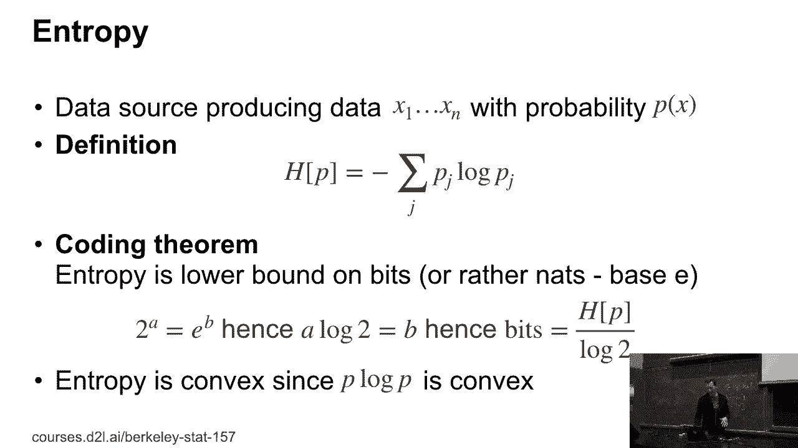
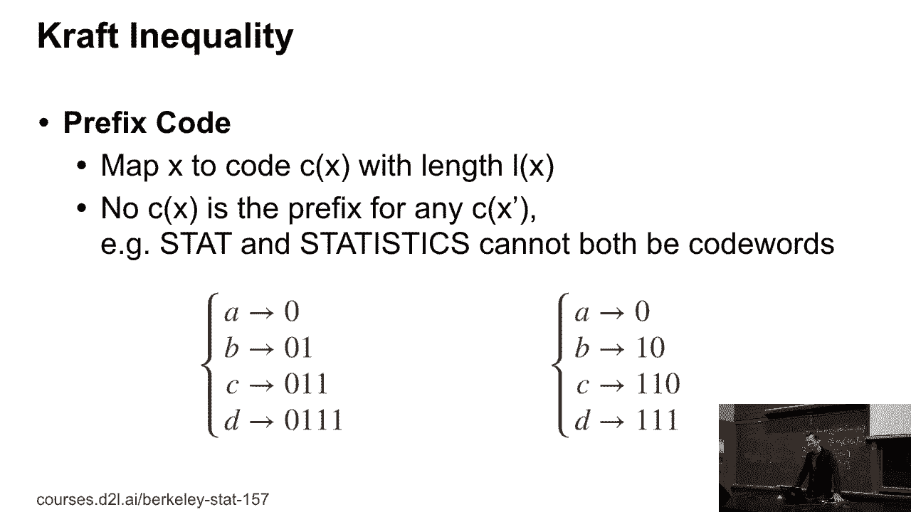

# P22：22. L5_6 信息论 - Python小能 - BV1CB4y1U7P6

所以，好吧。记住之前我们有一些术语，比如交叉熵损失等等。那么问题是，你知道，那些到底是什么意思？这实际上是我将要讲解的信息论的超轻版，真的只是足够让你理解我们所做的其他事情。所以熵的问题是。

香农开始时考虑的事情是，假设我有一个数据源，它产生了从X1到Xn的观测数据。那么，这个源中包含了多少信息呢？我们能否以某种有意义的方式量化这个？例如，如果我有一个公平的硬币，每一步，你知道，所带来的惊讶是，无论是正面还是反面。现在。

如果我掷一个公平的骰子，你知道，我得到六种可能的结果，显然，在这方面应该比掷硬币包含更多的信息。然后，或许，你知道，也许掷两个硬币比掷一个骰子包含更多的信息，或者可能不是，然后你可以对此进行辩论。这有点棘手。或者如果你考虑一下，你知道，我可以拿。

一张白墙的照片与这间讲座厅的照片对比，显然，如果我拍下你们所有人的照片，这比拍一张白墙的照片包含了更多的信息。香农（Shannon）提出的一个很好的方式是，他说，熵是存储这些信息所需的最少位数。好吗？现在。

我们如何正式化这个呢？这是香农名字下的巧妙定义。即，他定义了P的熵H为所有可能结果J的总和：PJ乘以PJ的对数的负值。换句话说，它是负对数P的期望值。然后有一个非常著名的编码定理。即，熵是所需位数的下界，或者在这种情况下，恰好是。

所以，我需要的是基于E的东西。我们将在这节课中证明这个。它可能是我们所做的更复杂的证明之一。但之后你会发现，熵的概念比其他情况要清晰得多。一些不错的东西。熵本身是凸的，因为P log P是凸的，对吧？所以线性函数P。

所以log P不是凸的，但P log P是凸的，因为它比线性函数更加弯曲。但在我们做这个之前，让我们先看一下几件事情。让我们拿一个公平的。

硬币。如果我有一个公平的硬币，那么它的熵就是，一半乘以以二为底的对数一半，再加上一半乘以以二为底的对数一半，所以总共是1位。确实，如果我想在计算机上编码十次掷硬币的结果，我可以通过一个位序列来实现。现在，如果我有一个偏硬币，它的概率是90%。

如果正面朝上否则就是反面朝上，那么如果你算一下这些数字，0.9乘以log2(0.9)加上对应的0.1的部分，我得到大约0.41位。所以你可以直观地看到，一个大多数是反面，比如说反面朝上的硬币，应该比一个随机掷出的硬币更容易作为一个序列来存储。现在。

如果你玩过《龙与地下城》，你就会知道，虽然他们不使用普通的骰子，但他们使用的是一个20面骰子。而这个20面骰子需要你存储大约4.3位信息。所以，每次掷骰子传递的信息量比你在普通的抛硬币中要多得多。好的。为了证明那个定理，我们需要稍微看看前缀码是什么，以及一个叫做Craft不等式的东西。明白了吗？那接下来就是。

看一下前缀码是什么，以及一个叫做Craft不等式的东西。明白了吗？然后就是。

对的。是的。因为。对，绝对正确。谢谢。那么，现在让我们看一些东西。

叫做Craft不等式。所以有一个码。码就是所谓的前缀码。如果我能够将每个符号映射到一个码上，假设，你知道的，0和1组成，长度为L的码，并且没有一个序列是另一个码字的前缀。比如说，我不能将“dog”作为一个码字，将“dog house”作为另一个码字。这是不行的，因为。

dog会是dog house的前缀。而前缀码非常好，因为它们非常容易解码。我只需要，你知道的，去查找，然后，我就能找到某个东西，然后，你知道，我再选择下一个项。那么，举个例子，你知道的，我可以，如果我查看第一个项，那么，这就不是前缀码，对吧？因为这个码。

A的码会是B的前缀。B的码会是C的前缀。C的码会是D的前缀。所以，这就很糟糕。另一方面，在右边，我将A编码为0。那么，现在，我剩下的唯一选择是，我为B选择1，然后是0。好了，在这种情况下，我也会消耗掉1 0。所以，我只能做1 1，然后可能是0，然后是D。

我只剩下1 1了。好了，这就是一个前缀码。现在。

这里有一个非常酷的不等式，一个所谓的Craft不等式，它说，如果且仅当你知道我们有一个前缀码时，以下条件成立，一个大于或等于所有x的和，2的负代码长度的总和。好了。所以这是一个非常强大的不等式。所以，要证明它，实际上并不那么难。所以首先。

我们想证明这个和式实际上，如果我们有一个前缀码，是被1所限制的。所以我们可以做的是，查看所有的碰撞。基本上，我去生成一个随机字符串。然后看这个随机字符串发生的概率是否恰好是一个码字。现在，如果我对所有这些概率求和，对吧，它必须是有限制的。

通过1，因为我最多只能命中一个码字。所以1大于等于与某个码字碰撞的概率。所以我可以因此对x实际发生碰撞的概率进行求和。所以在任何时候，只有一个会是活动的。现在，由于我生成了随机字符串，它命中的概率由2的负某次方决定。

那个字符串的长度。它是一个随机二进制字符串吗？好的。因为我只有0和1，所以概率是1/2。如果我有，知道，0，0，那么，知道，概率是1/4，因为我现在有两个符号，依此类推。由于在这个字符串的最左边，我们有一个上界是1，我们刚刚证明了如果。

如果我们有一个前缀码，那么不等式成立。好的。现在是证明更困难的部分。如果不等式成立，那么我们实际上可以构造前缀码。这是我能想到的最简单的证明。有很多其他稍微复杂的证明。例如，实际上维基百科上有一个，但那可能不是最简单的。无论如何。

这是我能想到的最简单的方式。所以我们实际上将明确地递归构造前缀码。所以我要做的是，挑选出那些具有最短序列的x集合，也就是具有最小L(x)的那些。好的。所以我知道对于这些，因为，知道，那个和式的左侧是1，对吧？

所以我知道对于这些，我可以找到相应的，知道的，二进制字符串。并且很容易让它们都是唯一的。然后我还有一些剩余的概率。现在我做的是，假设例如字符串的长度是3，那么我得到2的负3次方，对吧？所以我得到1/8。也许我有5个这样的项。所以我还剩下3个。现在。

我取剩余的概率，它们必须小于3/8，然后把它们分成每组1/8。我为它们找到相应的对应。现在我将一切都乘以2的负三次方，然后我只需要递归我的前缀生成算法。基本上是给所有剩余的概率块分配独特的前缀，然后剩下的就是，知道的。

再次应用到剩余部分。换句话说，我所做的就是，从我数字集合的头部、尾部开始工作。每当我找到下一个最短项时，我就生成前缀，然后，知道，再次对子集应用相同的机制。这样，最终，我会耗尽我需要编码的东西。

由于每次我都没有用完我的总预算加总到1，我完成了。只有一次可能会有无限数量的符号，而这个证明不适用于无限数量的符号。但对于有限的1，它会成立。好。那我们为什么需要这些呢？嗯，其实有一个非常简单的原因。因为。

现在我们要用它来证明编码定理。即熵是比特数的下界。我想这差不多就是我们要结束的地方。第一步是我们要生成前缀码，链接 L 的 X 是封顶的对数，嗯。负对数底数2的 P 的 X。所以我为每个。

事件，它只是四舍五入到下一个整数。那么，每个负数必须加总，嗯。抱歉，2的负次方的加总，所有字符串的加总必须小于等于1。因为我所做的就是，否则，如果我有2的对数，你知道，这只是。加总，等等，让我写出来。这样更容易解释。所以，P 的 X 的加总，X 为1。

对吗？这无非就是加总 X 的 2 的负对数底数为2的 P 的 X，对吗？

没有什么特别的事情发生。这个，当然，大于等于。X 的加总，2 的负封顶的负对数底数2的 P 的 X。好。现在正是。可以启用克拉夫廷不等式的地方。如果克拉夫廷不等式说，如果我有这个。那我总是可以找到一个前缀码。好。这表明，当然，我们知道。

事实上，你知道，这个本身大于等于1/2。为什么上界成立？下界成立吗？是的。那么，发生了什么呢？如果我从负对数 P。X 转到对数的封顶，负对数 P 的 X，那么这两个数之间的差异永远不会超过1，对吗？它们只是四舍五入到下一个整数。那么如果我四舍五入到下一个整数，嗯。

难度偏差最多不能超过1/2。因此，这个数永远不能小于1/2那个数。既然这是成立的，而且我知道这是1，这必须是。1/2。这就是所谓的说，嗯，这在最优编码的一个比特之内，对吧？因为定理声明你知道，它是精确的，嗯，对数底数，2的 Pj。

不是下一个整数，对吗？好。现在我们如何从对数底数为2的 Pj 转到精确地使其成立？嗯，我们可以做的是将数据合并成 k 元组，对吗？这样可以把所有概率降到一个更小的数值。但现在因为我在合并，你知道，k 元组，最多1的四舍五入误差将会。

分割成k个概率。所以这使得我的四舍五入误差变为1/k，而不是1。如果我让这些k元组足够长，那么一切都会顺利进行。现在，最优性，意思是没有更好的编码，这一点通过一个有趣的块库散度来证明，我们将在星期四进行讲解。再插一句话。你可能会想，好吧，这实际上是。

真不错，对吧？我的意思是，编码理论很简单，对吧？那为什么我们没有最优的编码呢？对吧？因为毕竟，你知道，我可以去设计一些编码算法。好吧，问题是，为了让事情真正顺利进行，我需要非常长的序列。而非常长的序列会导致解码器变得非常昂贵。而这就是例如涡轮码（turbo）发挥作用的地方。

编码出现的地方。所以，如果你有兴趣上研究生级别的信息论课程，它们会更详细地讲解涡轮码、低密度奇偶校验码等内容。好的，今天就到这里。作业会在今晚稍后发布，包括两周前的解答。好了，祝你好运。星期四见。

