# P24：24. L5_8 Softmax Classification in Python - Python小能 - BV1CB4y1U7P6

 So remember， last time fashion MNIST didn't quite download in the right way。 Okay， this was fixed。 So let's say we executed here。 And the good thing is， for a lot of data sets， we already have。 Preconfigured data loaders。 This is also going to give you an idea of how those data loaders are。 supposed to look like in practice。

 And it just looks like standard MNIST。 You know， 60，000 observations for training and 10。000 for testing。 And then you can look at the shape and it's 28 by 28 pixels。

 And that's that。 So these are just some convenience routines。 They can be used to get the labels。 And we'll be using those routines later on over and over。 And so it's a good idea to introduce them once。 And all they do is just。 if you give it some label ID， it'll spit out the， corresponding text。 And then for plotting things。

 it'll do the nice thing of actually， you， Know， plotting for the various images what they look like。 So for instance， if I want to get the first 10 images， these are the， ones。 And if I go from 10 to 19， you get some other pretty images about。

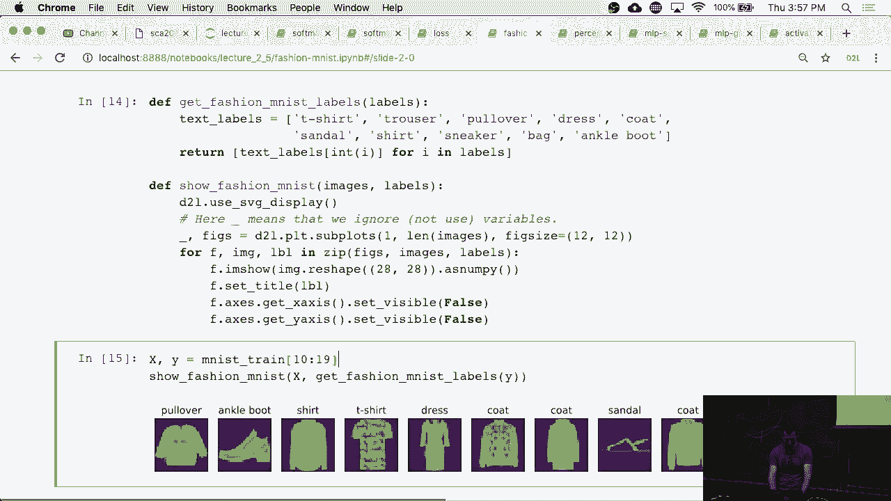

 T-shirts and bags and so on。 And this is a little bit harder to recognize in handwritten digits。 which is why we're going to use it for this class。 Because you can actually tell whether your algorithm， but your model is， better。 Because if you're just looking at about half a percent error rate。

 then it's no longer so interesting。

 And so if I want to load this， it's a very simple data loader。 So all it does is it takes it into tensor representation。 So basically it moves it into in the array。 And I can do all sorts of pre-processing。 Here those data loaders don't actually do anything terribly， interesting。

 It just maps into a tensor。 Later on， we'll look at pre-processing operators that actually do。 interesting things with images。 Once we do that， we will need GPUs。 Right now。 it's not so important。

 And so if you wanted to run this， it takes about two and， half， well。 almost three seconds to iterate to the data once。 Okay。 So that's really straightforward。

 Now， let's look at how to do regression as a softmax regression。

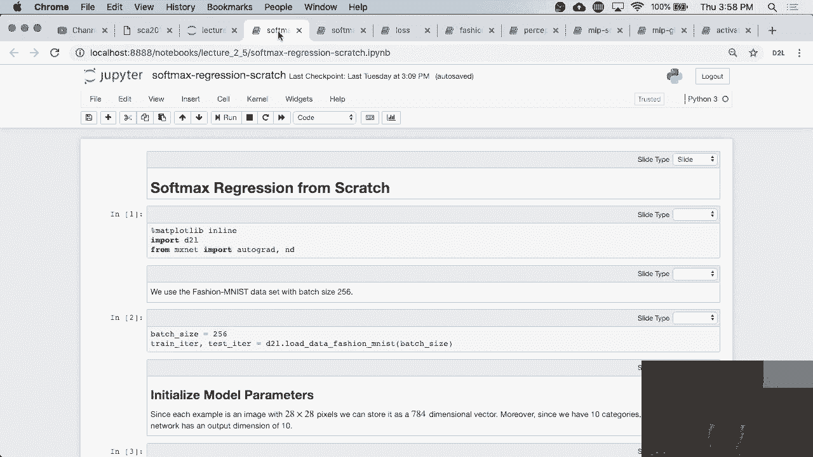

 All right。 Let's just go back。

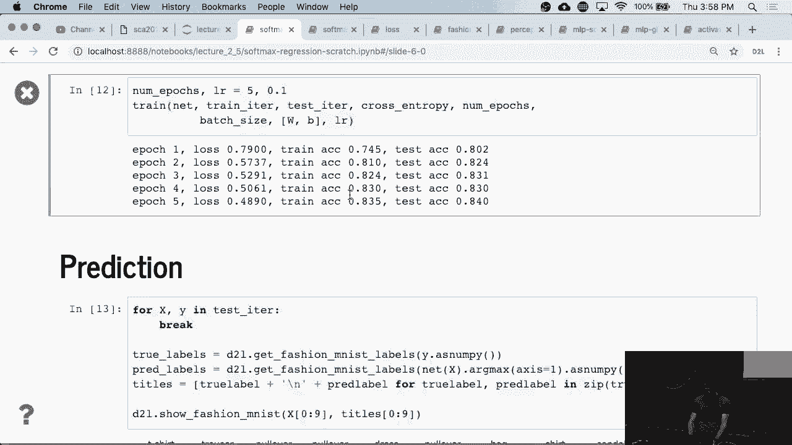

 So any questions so far？ Yes？ Oh， because it's the soft version of Maxwell。 Right？

 So remember what we did is we mapped the outputs， which are just， in Rd。 Right。 they are just some scalars。 We want to map them into some numbers that go between zero and。 one and that sum up to one。 Right？ So what we did is we therefore mapped O going into E to the OI。 divided by some over all the J's， E to the OJ。 Right。

 And so this would now be the probability that I have class I， given this O。 Okay。 Now。 if I take the log of this， negative logarithm of this。 Right。 Actually。 if I take the logarithm of this， right？ So log of O is， well， actually negative log of O。 Okay。 Well， sorry。 Negative log of P of I given O is sum over J， log of sum over J， E to the OJ minus OI。

 Right？ Now， this is exactly the softmax operation。 Right。 This will compute something that's。 you know， larger than the， largest of those terms， of all of those terms， but only slightly， larger。 So let's work that through with two numbers。 And without loss of generality。 I'm going to pick zero as one of， those two numbers。 So I have log of E to the x plus E to the zero。

 So that's nothing else in one。 Right？ And I can plot this function。 So， well。 what happens for x equals zero？ I get log two。 And， okay， what happens for very small x's？

 It goes to zero。 And as part of the homework， you're going to prove that it goes。 to zero like E to the minus x。 That's the rate at which it'll go to zero。 The proof is fairly elementary。 So， lopitase rule will help you。 Now， for large x。 what's going to happen？ Exactly。 So this is going to grow linearly because then this term here。

 becomes dominant。 This is essentially then negligible。 So I get log of E to the x。 which is essentially x。 So it goes like x。 So this is， of course。 an upper bound on that function here， which is the max of zero and x。 So this is a softened version of the max， which is why it's called， the soft max。 Yeah？

 Sometimes the English language is very convenient for coming up。 with terms that make a lot of sense with the benefit of hindsight。 Yeah。 Good question， though。 Any other questions？ Okay。 Good。 So then let's try soft max regression from scratch。 So we go ahead and import some stuff。 We need to get our data。

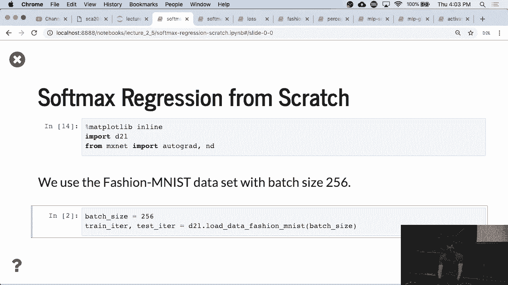

 Okay。 And now， well， we need to initialize our parameters。 So remember， our data is， you know。 784 dimensional because it's， 28 by 28。 And we have 10 output categories。 So we need a 784 by 10 dimensional matrix。 And we need a 10 dimensional bias。 Okay。 So I'm going to allocate this， and this is going to be WMP， just as you would。

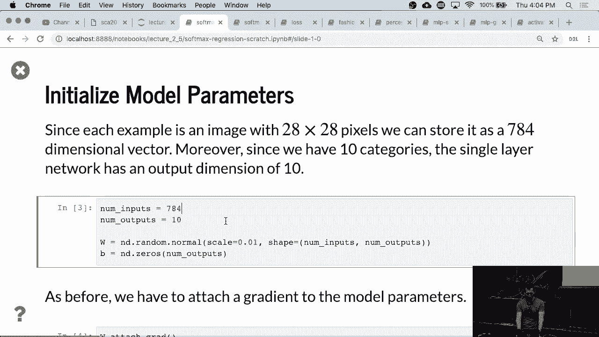

 And we also need to attach a gradient to this。 Okay。 The reason why I need to attach a gradient to this is because， Glue on needs to know， hey。 I might want to compute the gradient for anything that， depends on those variables。 And so if nothing else， it at least needs to allocate the memory for this。 Well。

 actually it needs to start allocating， creating some data structures to， keep tracking it。 But yeah。 that's a different story。

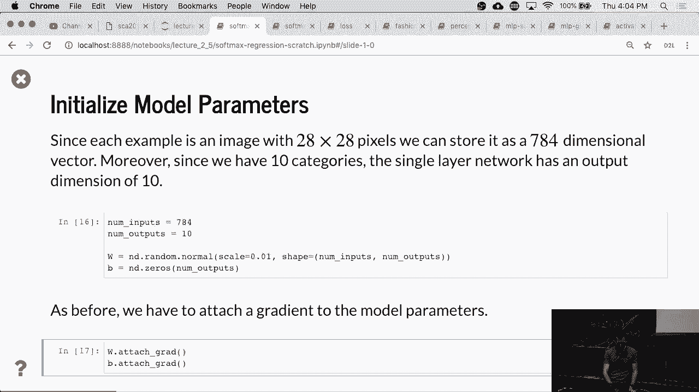

 So， okay， fine。 So we implement the softmax。 And yeah。 this is not how you want to implement the softmax， mind you。 Because that's numerically unstable。

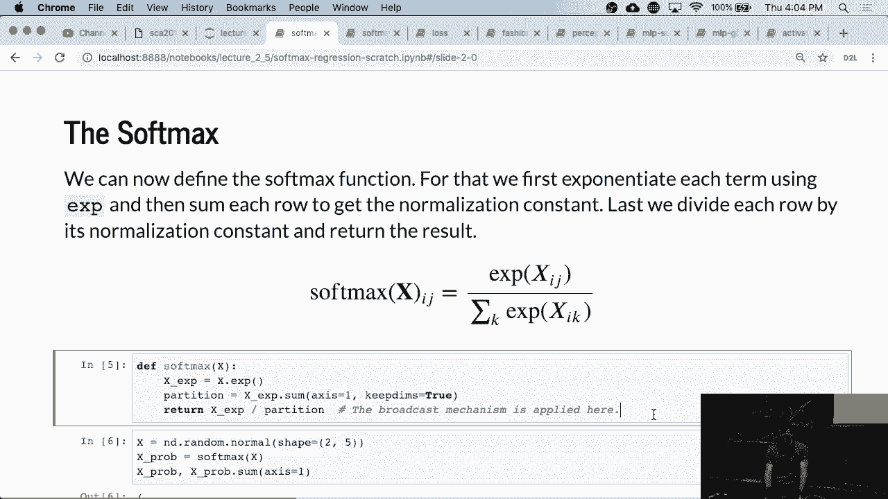

 So don't do it。 The way I say。 Don't do it the way I do it。 Do it the way I say， right？

 But since this is just for illustration purposes and this is a small example。 things aren't going to go wrong。 But in general， don't do this。 It's the equivalent of driving without the seat belt。 So let's actually see what happens， right？

 And this is really just， you know， I exponentiate all the terms in the night。 divided by the corresponding sum。 And the broadcast mechanism ensures that I normalize every term separately。 Okay。 So let's， you know， construct some x's and then I can compute the softmax。 And then I can check whether everything works out properly。

 So let's look at that。 And yes， these are probabilities。 And they sum up to one。 which is whatever you expect。

 Okay。 So this is softmax。 The neural network model itself is going to be fairly trivial as well。 right？ All I'm doing is I'm returning the softmax of， well， w。x plus b。 Okay。 And then I need to define the cross entropy。 And that doesn't do anything else but just picks out。 you know， the， corresponding， you know， yi。 So actually calling it cross entropy is a little bit flaky。

 And I'm taking the log。 So this is really just minus log of p of y given o。 Okay。 Fine。 So we have that。 And then， okay， need a few more things。

 I need to define the accuracy。 So I'm basically doing is I'm looking at the number of times where the。 labels that I output， namely to an argmax， and the labels that I should have gotten， match。 and I take the average of them。 So I get this binary matrix of zero and ones one with the labels match zero if。 they don't。 And I just compute that number。 And then， you know， to compute the accuracy， I mean。

 you need to iterate through the， data， you go and really compute， you know。 the function for everything and that's it。 Now， initially。 because I used some garbage initialization， well， I can't really。 expect anything particularly good out of that。 We have 10 classes。 So random guessing is 10%。

 and in this case， I'm able to slightly better than。 random guessing for whatever reason I just got lucky。 Okay。 Any questions so far？ So to recap。 we define our network。 Right？ That's net。 We defined a loss function。 We defined a measure of the accuracy。 Those two things need not be the same。

 So this loss function is the thing that we optimize over。 The accuracy is the thing that we actually care about in the end。 But since it may not have any derivatives in a meaningful way， I'm much better off。 just taking something that's differentiable and a good proxy。

 And there's a lot of really beautiful theory about surrogate losses and so on。 So if you're interested in that， take a class of Peter Bartlett's。 He'll probably cover that in his classes。

 He's here in the stats department。 Anyway， so then he is a training function。 And just because we're going to use that over and over and also in the context of。 Glue on and later on for other examples， we just define it as a function。 So let's pick that function apart。 So this training function takes a couple of things as an argument。

 So this would be like your Keras fit function， if you will。 It takes a network as an argument。 The number of iterations for training， since we also want to output the test error， okay。 so we'll find。 We also have number of test iterations there。 You care about a loss function。 Well。 sorry， train iterative and test iterative are the iterators over the data。 Sorry， I apologize。

 Number of epochs is the number of times you actually go to the data set。 Batch size is the mini batch size， so how many observations you pick in one block。 And if you pick a larger mini batch size within reason， the algorithm goes faster。 but it may not always converge quite as rapidly。 Number of。

 then there's some additional parameters that you can feed into your， optimization algorithm。 Right now， there are none of those。 Because we haven't actually discussed learning algorithms as optimization algorithms yet。 We'll do that quite a bit later。 Then I need a learning rate and an optimizer。 Right。 So then。 what it does is it just goes over the data as many times as you want。 Right。

 that's number of epochs。 Okay， it initializes all the errors to zero。 And then for all the data in the training iterator， what it does is it now starts recording。 for autograph， it computes the output of the network， computes the loss， and then。 takes the gradient with regard to the parameters of the loss。 So that's the thing here。

 That's the heart of the algorithm。 If you didn't specify an optimization algorithm。 we pick one for you。 Right。 If you did， well， we'll use the one that is specified。 So then。 we check the accuracy。 And we report that。 Right。 Right。 And then we， in case it's needed。 we also evaluate the test accuracy。 Then we log this。 So it's fairly straightforward code。

 Any questions so far？

 Okay。 Let me zoom in a bit。 Okay。

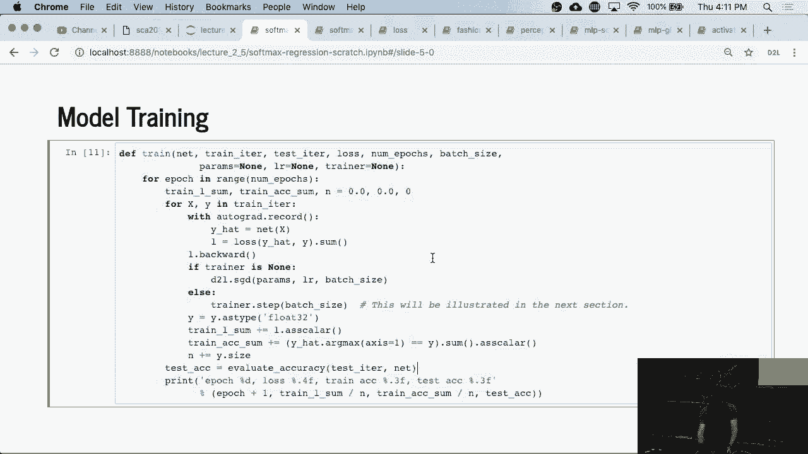

 Good。 So then let's actually train it and see what happens。

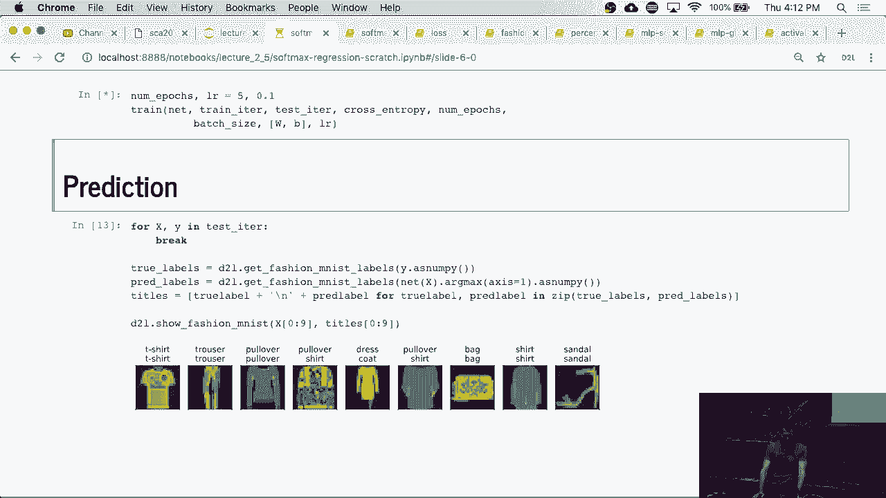

 And now just invoking it with a learning rate of 。1 and 5 epochs。

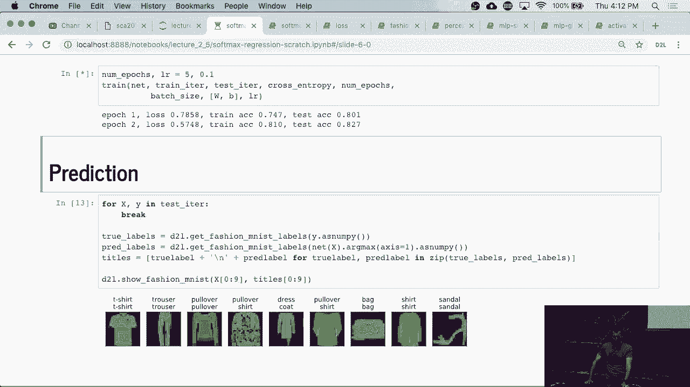

 And we can see that， you know， the loss is decreasing。

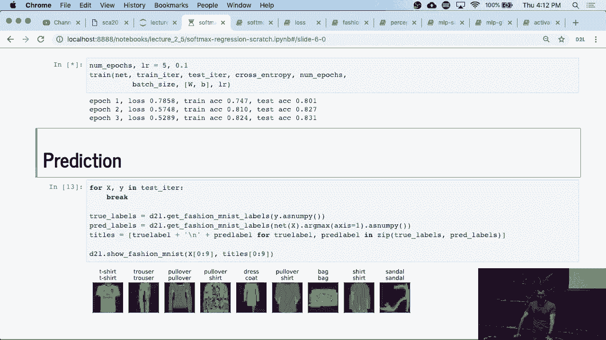

 That's good。 Training accuracy。 So that's the loss function that I minimize。 And the training accuracy keeps on increasing。 And the test accuracy is also increasing。 And it actually turns out that in this case， here after five iterations， my test accuracy。 is ever so slightly higher than the training accuracy。 It's good。 So I didn't know of it。

 We could actually increase that to ten。 Let's see what happens now。

 By the way， we end up starting at a good value already because we are restarting from the。

 point where we optimized before。 So otherwise， I would have had to go and re-inertilize w and b。

 And yeah， it keeps on getting a little bit better， but there isn't really much to do anymore。

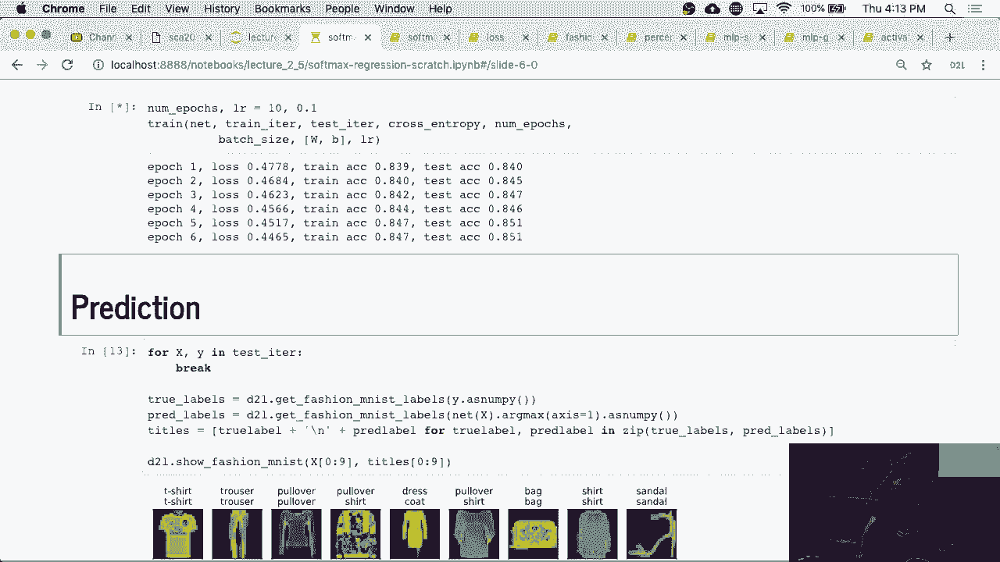

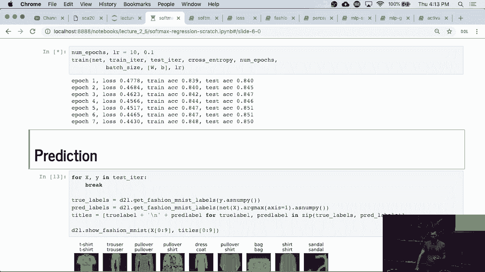

 And it's pretty much plateaued。 The reason why I'm not overfitting here。 does anybody have any idea why I might not be。

 overfitting here？ Yes？ Is it using a fitting batch？ Not so much。 Not the mini batch。 It's just that we're using a ridiculously dumb model。 It's just a linear model of 756 times ten dimensions。 So it's basically not very many parameters relative to the amount of data that I have。

 And at this point， there isn't really much that's happening anymore。 So actually。 I ended up overfitting a little bit in the NC。 You can see that the test accuracy diminished ever so slightly。 but that's pretty much， within the noise。 So let's see how well that works in practice afterwards。

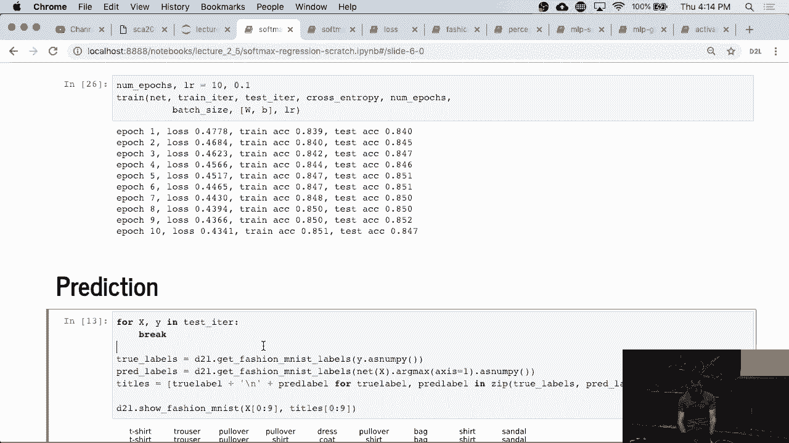

 So let's actually go and display this。 And if you look at the very bottom。 you can see that it mostly gets things right。 So it confuses swatters and shirts and dresses and coats。 But at least for the really obvious ones like bags or sandals， it gets it right。 So this is softmax regression completely from scratch。

 So all you need is just a linear algebra library and automatic differentiation。 And that's it。 Now。

