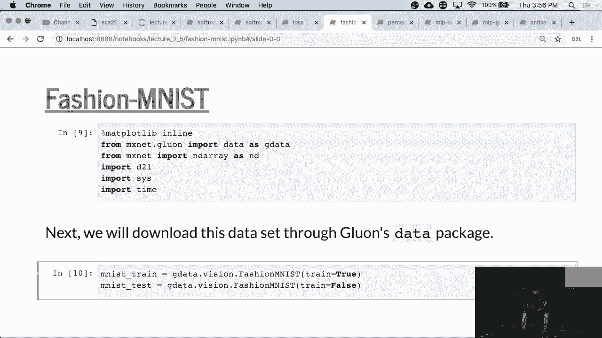
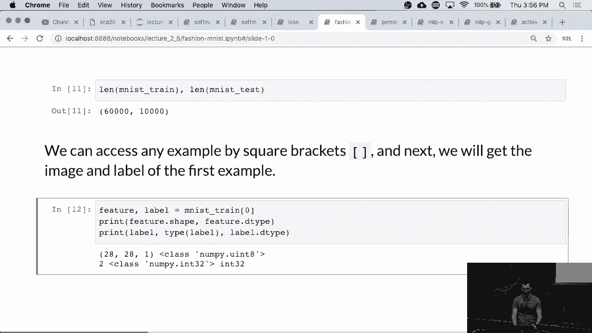
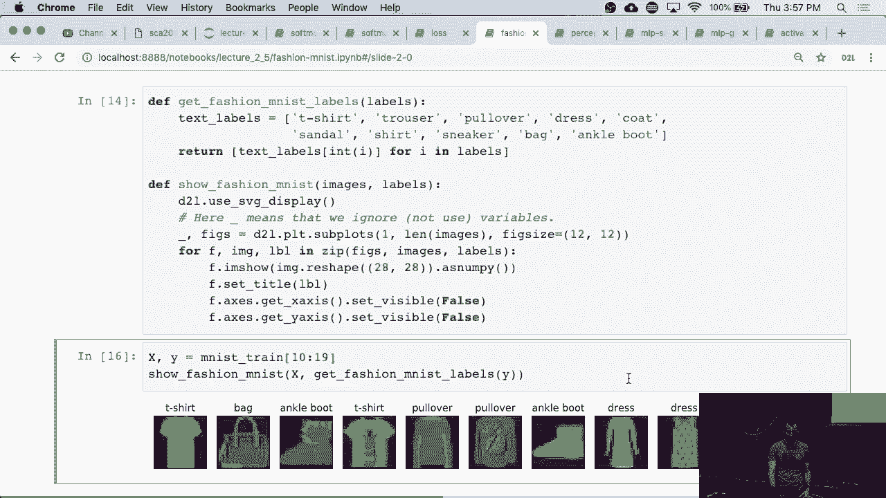
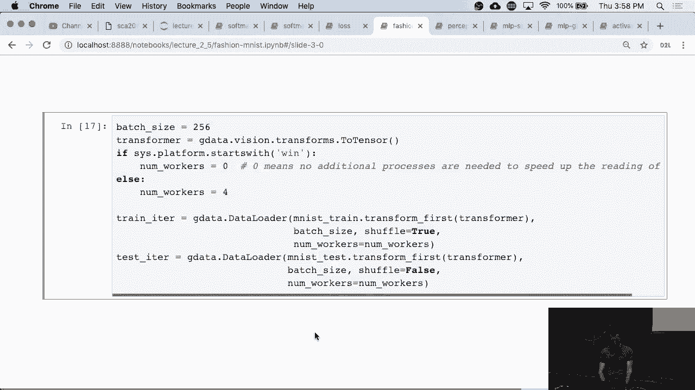
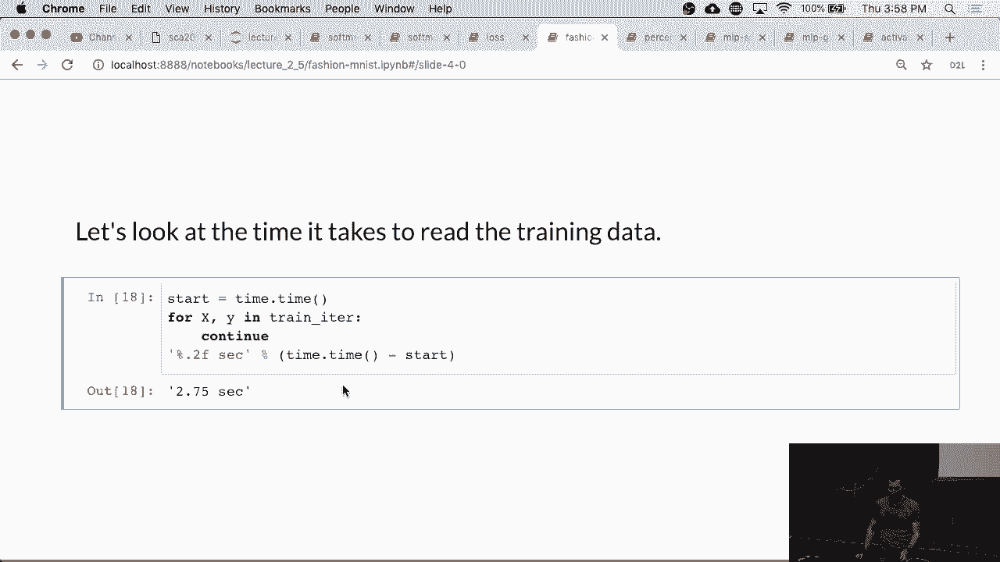
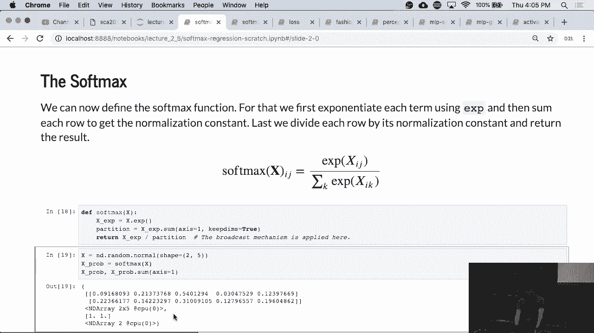
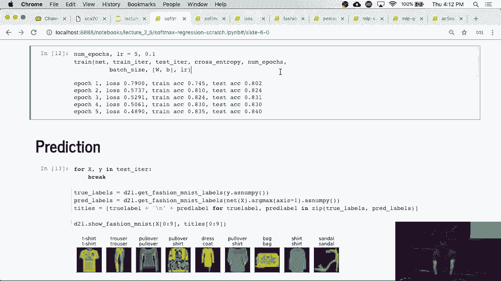
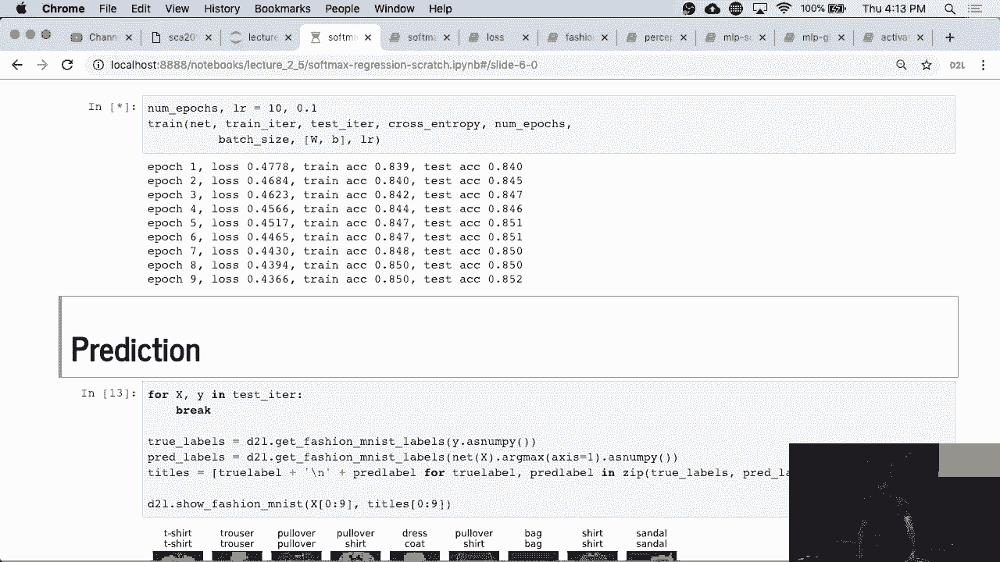
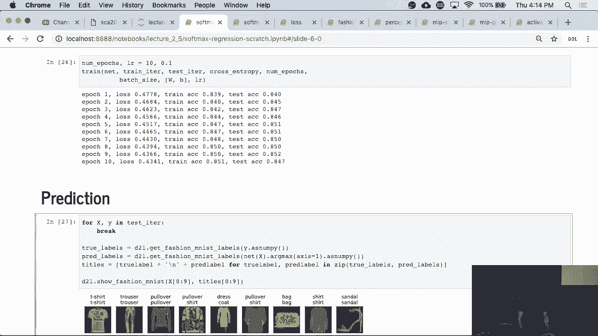

# P24：24. L5_8 Python中的Softmax分类 - Python小能 - BV1CB4y1U7P6

所以记住，上次fashion MNIST没有正确下载。好吧，现在已经修复了。假设我们在这里执行了。好消息是，对于许多数据集，我们已经有了预配置的数据加载器。这也能让你了解这些数据加载器在实践中应该是什么样子的。

它看起来就像标准的MNIST数据集。你知道，训练集有60,000个观测值，测试集有10,000个。然后你可以查看它的形状，它是28x28像素。

就这样了。所以这些只是一些便捷的例程。它们可以用来获取标签。我们以后会一遍又一遍地使用这些例程。所以一次性介绍它们是个好主意。它们做的就是，如果你给它一些标签ID，它会输出对应的文本。然后用于绘图。

它会做一件很好的事情，那就是实际绘制不同图像的样子。例如，如果我想获取前10张图像，这些就是图像。如果我从第10张到第19张，你会看到一些其他不错的图像。

T恤、包等物品。而手写数字的识别稍微难一些，这也是我们将在本课程中使用它的原因。因为你实际上可以判断你的算法是否更好。如果你只看大约半个百分点的错误率。

然后它就不再那么有趣了。

所以如果我想加载这个数据，它是一个非常简单的数据加载器。它做的就是把数据转换成张量表示。所以基本上，它将数据转换为数组。然后我可以做各种预处理。在这里，这些数据加载器实际上没有做任何特别有趣的事情。

它只是映射到一个张量。稍后我们将看到一些预处理操作符，它们实际上会对图像做一些有趣的事情。一旦我们做到这一点，我们将需要GPU。现在，这还不是特别重要。

所以如果你想运行这个，它大约需要两秒半，几乎三秒才能迭代一次数据。好吧，这真的很简单。

现在，让我们看看如何做回归，作为一个softmax回归。

好的，我们回到原点吧。

到目前为止有什么问题吗？是吗？哦，因为它是Maxwell的软版本。对吧？

所以记住，我们做的是将输出映射，这些输出只是Rd空间中的一些标量。我们想要把它们映射到一些在0到1之间的数字，并且它们的总和为1。对吧？所以我们做的是将O映射到E的OI，然后除以所有J的E的OJ。对吧。

所以这现在将是给定 O 时，我属于类 I 的概率。好吧。现在，如果我取它的对数，取这个负对数。对吧。实际上，如果我取它的对数，对吧？所以 O 的对数是，嗯，实际上是 O 的负对数。好吧，抱歉。负对数 P（I 给定 O）是对 J 求和，求 J 上的对数，E 的 OJ 减去 OI。

对吧？现在，这正是 softmax 操作。对。这将计算出某个值，它比所有这些项中最大的那个值稍大一些。所以我们可以通过两个数字来演示这个过程。为了不失一般性，我选取零作为其中的一个数字。所以我有 E 的 x 次方加 E 的零次方的对数。

所以这不就是一吗？对吧？然后我可以绘制这个函数。那么，嗯。对于 x 等于零的情况，结果是对数二。那么，非常小的 x 会怎么样呢？

它趋近于零。作为作业的一部分，你将证明它是如何趋近于零的，类似于 E 的负 x 次方。那就是它趋近零的速度。证明相当简单。所以，洛必达法则会帮助你。现在，对于大的 x，接下来会发生什么？没错。所以这将线性增长，因为这个项。

变得占主导地位。这基本上是可以忽略的。所以我得到的是 E 的 x 次方的对数，实际上就是 x。所以它的变化就像 x 一样。所以这是，当然是。这个函数的上界，就是零和 x 的最大值。所以这是最大值的一个软化版本，这也是为什么它被称为 soft max。对吧？

有时候，英语确实很方便，能够提出一些回顾来看非常有道理的术语。嗯。好的问题，不过。还有其他问题吗？好，没问题。那么让我们从零开始尝试 softmax 回归。所以我们先导入一些内容。我们需要获取我们的数据。

好的。现在，嗯，我们需要初始化我们的参数。记住，我们的数据是，嗯，784 维的，因为它是 28 乘 28。而且我们有 10 个输出类别。所以我们需要一个 784 乘 10 的矩阵。还需要一个 10 维的偏置项。好吧。所以我要分配这个，这就是 WMP，就像你会做的那样。

我们还需要为此添加梯度。好吧。之所以需要为此添加梯度，是因为，Glue on 需要知道，嘿。我可能想要计算依赖于这些变量的任何东西的梯度。所以，如果没有别的，至少它需要为此分配内存。嗯。

事实上，它需要开始分配，创建一些数据结构来跟踪它。但这是另一个话题。

所以，好的，明白了。所以我们实现 softmax。对。嗯，记住，这不是你应该实现 softmax 的方式，因为它在数值上不稳定。

所以不要这么做。不要按照我说的做。按照我教你的方式做，明白吗？

但由于这只是为了演示目的，并且这是一个小示例，事情不会出错。但一般来说，不要这么做。这相当于开车不系安全带。所以让我们实际看看会发生什么，好吗？

这实际上就是，你知道的，我将所有的项指数化，然后除以对应的和。广播机制确保我对每一项进行单独的归一化。好的。所以让我们构造一些x，然后我可以计算softmax。然后我可以检查一切是否正常运行。

那么我们来看一下。是的，这些是概率。它们的总和为1，这正是你所期望的。

好的。这是softmax。神经网络模型本身也会相当简单，对吧？我做的只是返回softmax，即w.x加b的结果。好的。然后我需要定义交叉熵。它没有做别的，只是选出对应的，嗯，yi。所以实际上叫它交叉熵有点不太准确。

然后我取对数。所以这实际上就是y给定o的概率p的负对数。好的，明白了。我们有了这个。然后，好的，还需要做一些其他的事情。

我需要定义准确率。其实我做的是查看输出标签，即通过argmax得到的标签，和我应该得到的标签是否匹配。我取它们的平均值。所以我得到了一个由零和一组成的二进制矩阵，标签匹配时是1，不匹配时是0。然后我计算这个数值。然后，你知道的，计算准确率，就是这样。

你需要迭代数据，真的去计算所有的函数，就这些。现在，最初，由于我使用了一些糟糕的初始化，嗯，我不能指望得到什么特别好的结果。我们有10个类。所以随机猜测的准确率是10%。

在这种情况下，我比随机猜测稍微好一点，不知道为什么，我可能只是运气好。好的，到目前为止有问题吗？那么总结一下。我们定义了我们的网络，对吧？那就是net。我们定义了损失函数。我们定义了准确率的衡量标准。那两者不一定相同。

所以这个损失函数是我们优化的目标。准确率是我们最终关心的事情。但由于它可能没有任何有意义的导数，我最好只是采取一些可微分的、好的代理函数。

而且关于替代损失等方面有很多非常美丽的理论。如果你对这些感兴趣，可以参加Peter Bartlett的课程。他在课堂上可能会讲到这些内容。

他在统计学系。总之，他是一个训练函数。因为我们会反复使用它，而且还会在后面的例子中使用它，所以我们将其定义为一个函数。那么我们来逐步分析这个函数。这个训练函数接受一些参数。

这就像你的 Keras `fit` 函数。它将网络作为一个参数，训练的迭代次数，因为我们还希望输出测试误差。所以我们找到了那个。我们还设定了测试迭代次数。你关心的是损失函数。抱歉，训练迭代器和测试迭代器是数据的迭代器。抱歉，我道歉。

迭代次数是指你实际访问数据集的次数。批量大小是指小批量的大小，即每次从数据中选取多少个观察值。如果你选择较大的小批量大小，在合理范围内，算法会运行得更快，但可能不会那么迅速收敛。次数。

然后你可以为优化算法提供一些附加参数。现在没有这些参数，因为我们还没有讨论学习算法作为优化算法的内容。稍后我们会详细讲解。然后我需要一个学习率和一个优化器。对吧？然后它会根据你指定的次数，遍历数据。

这是迭代次数。好了，它会将所有的错误初始化为零。然后，对于训练迭代器中的所有数据，它会开始记录。对于自动求导，它计算网络的输出，计算损失，然后根据损失的参数计算梯度。所以这就是这里的工作原理。

这就是算法的核心。如果你没有指定优化算法，我们会为你选择一个。对吧？如果你指定了，那么我们会使用你指定的那个。那么我们接下来检查准确率，并报告它。对吧？然后，如果需要的话，我们还会评估测试准确率。然后我们记录这些结果。所以这段代码相当直接。

到目前为止有任何问题吗？

好的，让我放大一下。好了。

好的。那么接下来我们就训练一下，看看会发生什么。

现在我们使用学习率为0.1，迭代5次来调用它。

我们可以看到，损失在不断减少。

很好。训练准确率。所以这是我需要最小化的损失函数。训练准确率持续上升，测试准确率也在增加。事实上，在这种情况下，经过五次迭代后，我的测试准确率略微高于训练准确率。这很好。所以我之前并不知道这一点。

我们实际上可以将这个值增加到十。让我们看看现在会发生什么。

顺便提一下，我们已经从一个不错的值开始了，因为我们从之前优化过的点重新开始。

从我们之前优化过的点开始。所以否则的话，我就得重新初始化w和b。

嗯，是的，它会不断变得稍微更好一点，但实际上已经没有什么可做的了。

它基本上已经达到了平台期。我为什么没有过拟合，大家有什么想法吗？

为什么这里没有过拟合？是的？它是不是用了一个合适的批量？其实不是。不是小批量训练。只是我们使用了一个非常愚蠢的模型。它只是一个 756 乘以 10 维的线性模型。所以相对于我拥有的数据量，它的参数并不多。

到目前为止，实际上已经没有什么事情再发生了。所以其实，我在NC中稍微过拟合了一下。你可以看到测试精度稍微下降了一点，但这基本上是噪声范围之内的。所以接下来我们来看看它在实践中的表现如何。

所以我们实际去展示一下。如果你看看最底部，你会发现它大多能正确识别。所以它会把羽毛球拍、衬衫、裙子和外套弄混。但至少对于一些非常明显的物品，比如包包或凉鞋，它能准确识别。所以这就是完全从零开始的Softmax回归。

所以你只需要一个线性代数库和自动求导。就这么简单。

