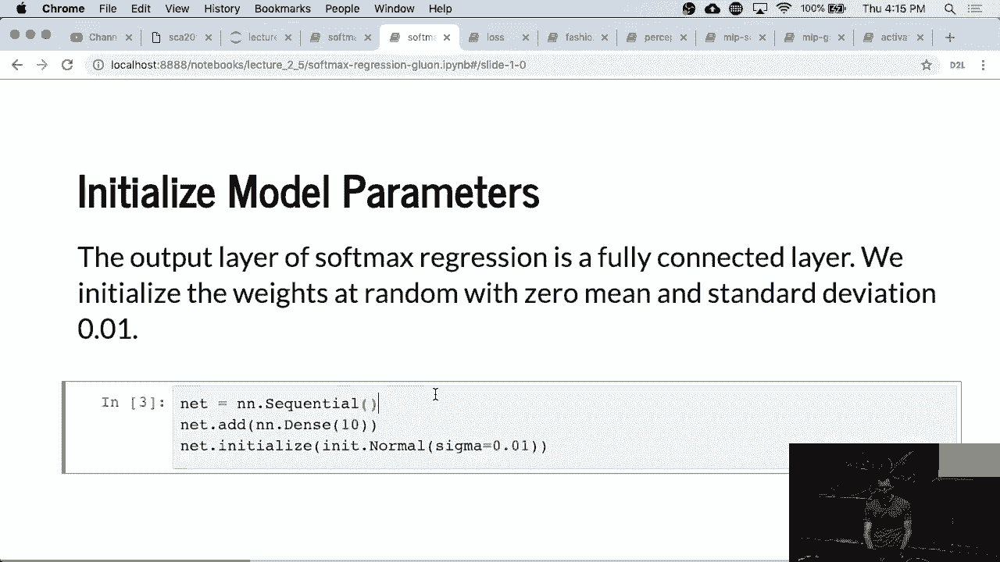
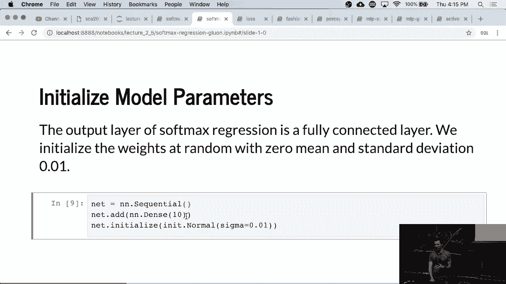
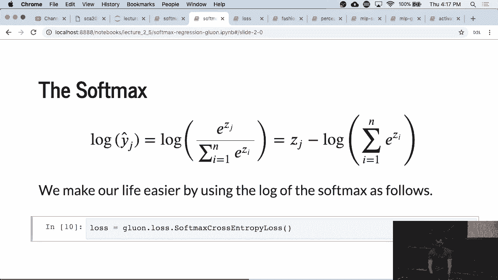
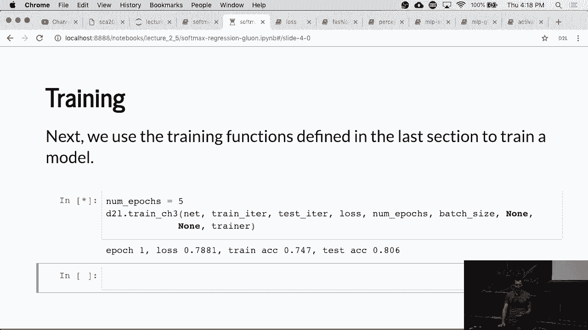
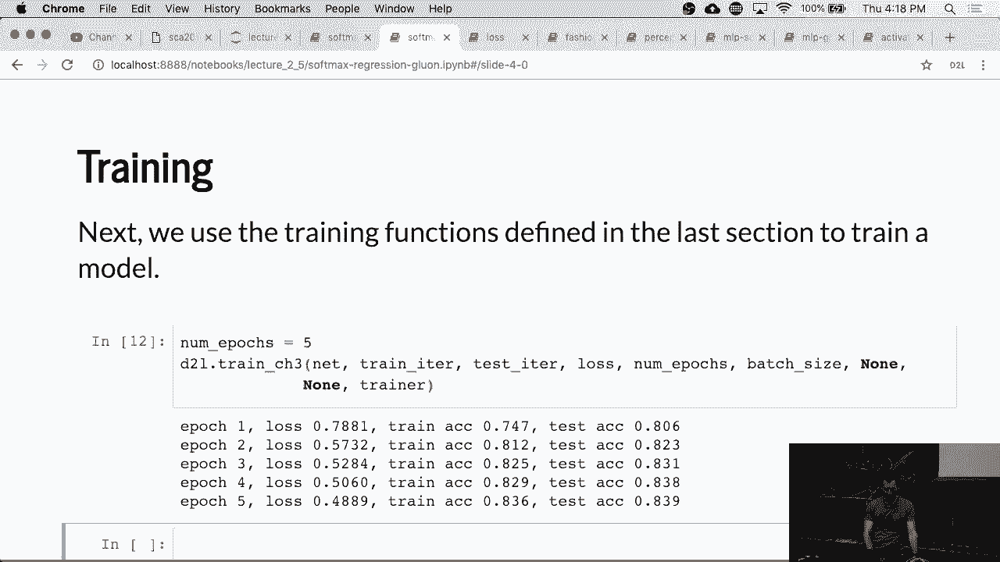

# P25：25. L5_8b Python中的Softmax分类（Gluon版本） - Python小能 - BV1CB4y1U7P6

>> 好的。

所以它看起来与之前完全相同。我们只需去导入数据，对吧？

所以这与之前的代码完全相同。

唯一的区别是，现在我可以轻松地处理我的生活。

很简单。我只需通过声明我的网络是一个顺序的层组合来定义它。并且我总共只有一层。我希望这些参数的初始化采用均值为 0，方差为 0.01 的分布。就这样。

有趣的是，我不再需要指定输入维度了。网络已经足够智能，能够自动处理。

自动配置参数的数量和大小，以及所有基于输入大小的内容。所以这非常方便。所以如果我将 28x28 改为 30x30 像素，它仍然能够很好地工作。顺便说一下，这种灵活性在实际应用中有一个严重的缺点。所以某些客户将无法处理。

Named 使用了我们曾经训练过的计算机视觉模型，模型是在 224x224 像素的图像上训练的。所以是相对较小的 ImageNet 尺寸。然后他们将其应用到 4K 图像上。

图像。好的。所以这些 4K 图像产生了大量的中间内存。

我们稍后会讲到卷积网络等内容。

但基本上，系统几乎耗尽了内存，而且速度非常慢。我的意思是，数学上是正确的。

但这并不是一个特别明智的做法。然后我们收到报告说我们的网络无法工作。所以当你让事情自动化时要小心。你几乎可以肯定用户会滥用它们。

以一些有趣的方式进行交互。

好的。但是显然我们在这里不会这么做。好的。这里是 Softmax。现在这是它的数值稳定版本。所以 Gluon 损失，softmax 交叉熵损失。好的。我们本可以取一个更短的名字，但你不需要多次使用它。

这是一个优化算法。一个非常简单的算法是随机梯度下降。它实际上做了一些比随机梯度下降稍微聪明的事情。它执行了动量和权重剪切等操作，除非你关闭它。所以它是一个非常智能的版本，S.G.D.，但就所有目的而言，这个就可以了。

就使用那个。

好的。那么我们可以开始训练了。这个调用签名和我们之前的一模一样。

和之前一样。所以除了它运行。

略微更快一点，你可能无法察觉太多差异。这里因为整体操作还是非常。

很直接。一旦我们进入更复杂的网络，我们实际上会看到它运行得更快。好的。无论如何，这就是训练，网络的连接部分。看起来非常相似。到目前为止有任何问题吗？好的。

