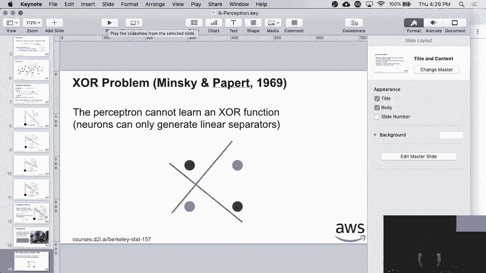

# P26：26. L6_1 感知机算法 - Python小能 - BV1CB4y1U7P6

好的，到目前为止我们处理了一些非常枯燥的内容，实际上这些都是1950年到1960年之间的最前沿技术。所以我们需要慢慢进入70年代，希望到今天结束时，我们能达到70年代。所以为了做到这一点，我们首先需要看看50年代人们是如何利用神经网络的。所以，为此我们需要看看感知机以及Mr.。

罗斯恩布拉特做的这一切。

然后我们会处理多层感知机。所以这是Mark I感知机，1960年。它是一个不错的空间加热器。

嗯，虽然比特币矿工相对较小。但不管怎样，这就是感知机，对吧？

我们已经看过这个好几次了，所以我的输出是内积的某个非线性函数，假设是W和X，然后我有一个常数，假设它是正数时为1，否则为0。所以这没什么特别的。请注意，我的意思是，这就像是有三种不同的方式来看待这个问题。

所以二分类问题的输出只是0和1。但你也可以有一个实际值的标量项用于回归，或者你可以有概率。我把那两条线弄错了。所以稍后会在幻灯片中修正。但是，如果你看看用这个线性函数能得到什么样的决策边界，嗯。如果我有一个平面的法线方程，而这实际上就是平面，如果我要求W⋅X。

加上B等于零，他们得到任何一条直线。所以我可以，举个例子，通过一个简单的线性函数来进行垃圾邮件过滤，判断火腿与垃圾邮件。如果我想分类，这就是简单的线性函数。快速提问，在所有这些分类器中，你最喜欢哪一个？

谁最喜欢红色的那个？嘿，它是一个不错的颜色，对吧？好吧，没人喜欢红色。嘿，紫色怎么样？好吧，黑色呢？好吧，绿色怎么样？好吧。那么你们为什么都举手表示喜欢绿色呢？因为我最后问的嘛。那么，为什么你们喜欢绿色呢？是的？它最大化了两个类别之间的分隔边界。

如果你是在90年代做的博士学位研究，那么这将会导致支持向量机以及各种各样的东西。基本上，让这个变成非线性的方式是将整个数据映射到某个非线性表示空间。但因为现在是2019年了，所以你会通过找到一个好的数据嵌入来做，这其实是一样的事情。

就像是将数据映射到这个非线性空间一样，唯一的不同是你是在时间上学习这一点。所以如果你想要了解核方法和神经网络之间的区别，在一种情况下，工程师发明了嵌入，而在神经网络中，我们则是学习这个嵌入。不管怎样，这是一种很好的数据分离方式，效果也相当不错。

那么你如何训练这样的东西呢？这就是一个算法。这可能是有史以来第一个深度学习算法。好了。那么这是一个Frank-Rosenblatt的感知器算法。具体如下。初始化w和b等于0。然后对数据进行迭代。每当你做错时。

所以w·x + b乘以yi小于等于0。这意味着我处于分隔器的错误一侧。然后将yi乘以xi加到权重向量中，并将yi加到偏差中。你一直这样做，直到所有的分类都正确为止。所以这与以批次大小为1执行随机梯度下降是一样的。

损失函数。让我为你写一下。这是我使用的损失函数。嗯，实际上，准确来说，这是损失函数。所以这里我画的是yi乘以f(xi)。这是损失。所以如果y乘以f大于等于0，这意味着我预测的是类别1，并且标签也是1，那么一切都很好。如果我在这里。

这意味着标签和预测不匹配。然后我会遭遇一个损失，这个损失与我错得有多严重成正比。当然，这个损失的导数就是这里的这个函数。换句话说，你通过观察到的结果来更新，或者根本不做任何更新。好了，大家对这个算法都没问题吧？这个算法无耻地来自于维基百科。

假设我想区分猫和狗，我有一个分隔器，我获得新的观察数据。我改变分类器，继续这样做，最终我就得到了这个。所以实际上有一个定理。这个定理正是关于分隔的间隔。因此，我有一个大间隔的猫狗分隔器，宽度正好是这个。

基本上，定理说如果我能把我的数据限制在某个半径r内，并且对于单位向量w，w的平方范数加上b的平方小于等于1。如果我能找到一个权重向量和偏差组合，其长度总和小于等于1，那么我就能保证感知器在r平方之后会收敛。

加上1除以ρ平方的更新步骤。不是观察的数量，而是更新的步骤。那么为什么是更新步骤而不是观察的数量呢？

你有没有上过一节非常无聊的讲座？如果你曾经上过一节非常无聊的讲座，你什么都没学到，因此你没有学到任何新东西，也没有更新内部模型。另一方面，如果你在一场有趣且激动人心的讲座中，那么你将很常更新自己对世界如何运作的模型。你会更新你的参数。

所以我希望当我进入这个后者类别时，你将快速收敛。但嘿，我们在尝试。所以现在让我们看看这个在实践中是如何运作的。

顺便说一句，在我们做这个之前插入一点内容。这个游戏叫做黑白棋。你们可能不记得它了，而这个游戏实际上让你在玩后被迫做出选择。所以我告诉你这个是因为这是机器学习在计算机游戏中的最早应用之一。事情是这样的，你基本上扮演上帝，拥有一个虚拟人物，这个虚拟人物会。

尝试去做并模仿你们刚才做的事情。你的目标是教会虚拟人物如何做出仁慈的行为，如果你想做一个仁慈的上帝，或者做邪恶的事情，如果你想做一个邪恶的上帝。那么你可以击败村民，或者喂养他们，对吧？

像这样。所以他们使用了感知机算法，根据上下文参数学习虚拟人物应该做什么。现在，如果人类行为一致的话，这个方法会非常有效。结果证明，人类并不是总是一致的，至少在游戏设计者选择的表示空间中并不一致。因此，发生的事情是，基本上这个算法本应该收敛到。

一个经过精美训练的虚拟人物没有收敛到那个目标，游戏变得越来越难玩。这可能就是你们没有听说过这个游戏的原因之一。糟糕的机器学习实际上毁了整个游戏工作室。所以不要那样做。那么现在在我们进入 XOR 问题之前，我会先给你们留一些思考时间。

然后我们来看这些例子。所以在70年代初期曾经有过一次 AI 寒冬，主要是由于那两位学者，明斯基和帕帕德。他们证明了，如果我有一个简单的 XOR 问题，我的感知机是无法学习的。基本上，把红点和绿点分开，我无法找到一条能够愉快地将它们分开成红点和绿点的直线。

所以这听起来像是神经网络的一个根本性缺陷，几乎使得机器学习倒退了大约 5 到 10 年。

当然，这有一个很好的解决方案，否则我们就无法进行教学了。

现在讲的是机器学习。但是让我们实际上看看感知机是如何工作的。其实这就是，好的，让我们导入数据，就像我之前做的一样。为了让事情变得有趣，我需要创建一些可分离的训练问题。我将创建一些随机数据。所以现在为了让这个问题变得可分离，首先好吧，我创建一个随机权重。

向量 W 假和 B 假，然后我确保重新缩放它，好吧，这本质上没有权重和偏置。然后我去创建随机数据，这些数据存在于 Y 的集合中。我遍历所有数据，检查这些数据是否可以根据 W 被准确分类为 1 或 -1，如果不能，我就把它丢掉，否则，我就保留它。

所以我基本上给它分配一个标签1或-1，如果它离边界太近，我就把它丢掉。所以这基本上就是我所做的，这就是这个epsilon的作用。这里的边距是一个大于epsilon的尺度。边距基本上是一个内积，我们来做缩放。

如果我不能自信地分开它，我就把它丢掉，否则我就把它加入到我的训练集。所以这是我的数据生成器，它生成假数据。然后，嗯，我需要一些绘图例程，我需要得到轮廓图，因为否则我无法准确地判断自己收敛得有多好，因为好吧。嗯，就这些，我觉得没什么特别有趣的地方。

在这里我们需要覆盖的内容，如果我现在想要运行这个，结果不好，基本上它只生成了一类的数据。所以这里我们有一些用蓝点表示的数据，这些数据可以被合理地分开。所以现在让我们实际实现感知机算法，这个感知机算法做的正是我刚才描述的。如果y乘以w和x的内积加上b小于等于零，就执行一次更新。

然后说我犯了一个错误，否则返回零什么都不做。好的，我从w和b都设置为零开始，遍历数据。所以基本上我只执行一次感知机更新，如果遇到错误，我就打印出我的参数，然后继续更新。

现在，为了做到这一点，让我快速切换回正常模式，因为否则它显示得不好。好的，那么我们来运行这段代码。最开始它并没有做太多，这是我的分类器，这个绿色的点就是我误分类的点，所以我得到了分隔线。当然这并不特别有趣，所以让我们看看在我得到另一个观测数据后会发生什么。好的，这是另一个绿色点。那么现在它是正类，所以我的分类器现在看起来已经有点接近了。

我应该得到的结果。好的，在下一个错误后，这个地方开始很好地分开数据了，所以我们差不多完成了，除了偏置值不对。好的，这里又有一个新的观测值，好的，更新这一次。又一个，好的，我已经完成了遍历数据。如果我再走一遍的话。

它最终会收敛。所以这是感知机算法的实际应用，我基本上展示了每次通过数据时它所犯的所有错误。到目前为止有什么问题吗？

好的，所以现在有一件有趣的事情，就是检查一下我给问题设定的难度，是否对需要多少次更新有影响。所以我做的是，基本上选择一个范围，在0.25和0.025之间，0.025作为边界的参数范围，大的边距意味着容易解决的问题，小的边距意味着困难的问题。

这意味着困难问题，对吧？然后我就开始生成随机数据，做几次，运行感知机算法，计算需要多少次才能完成，然后我绘制出这条曲线。所以我现在不会运行这段代码，因为它会花一些时间，因为它写得非常高效。但如果你运行它并等待一段时间，你将得到这条曲线。

所以记得我们之前讨论的感知机收敛定理，我们基本上没有一个半径的*边界*，对吧？这实际上就是那个界限，九实践。但当然，现实中它比最坏情况的界限稍微好一些，不过你依然能看到相同的行为，也就是说，你可以看到随着边界的增宽，所需的次数。

更新次数减少，因此对于一个非常简单的问题，我可能只需要四五次更新就能收敛。而对于一个非常困难的问题，我可能需要20、30、40次更新。好的，还有关于感知机的其他问题吗？好的，没问题。

