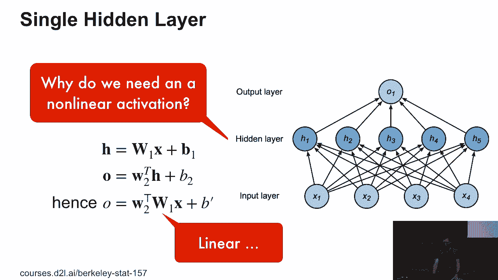
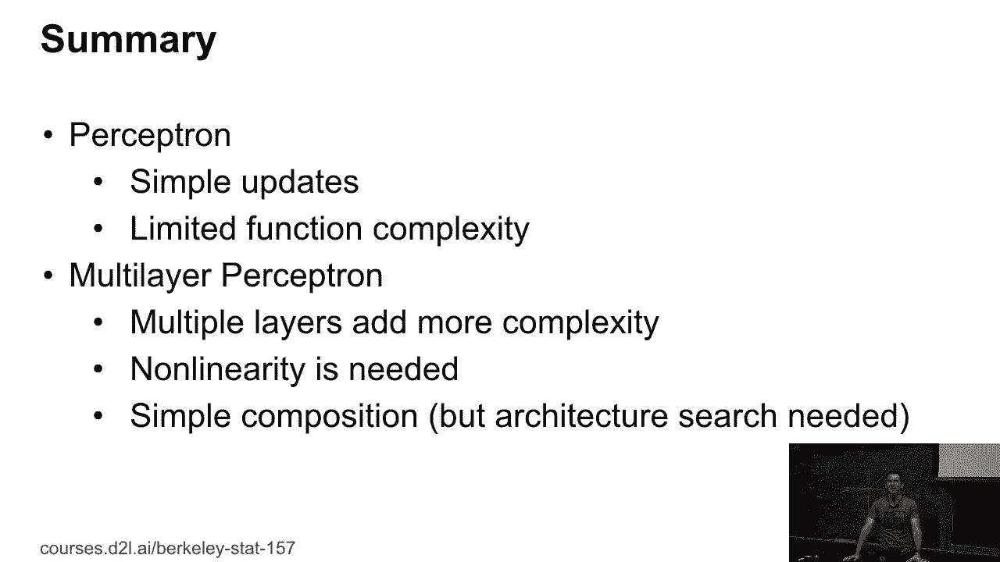

# P27：27. L6_2 多层感知机 - Python小能 - BV1CB4y1U7P6

在 XOR 问题中，我们遇到的问题是线性分割器无法分割。好吧，一些非常非常简单的数据。现在，事后看来，显然的解决方案是使用多层。值得注意的是，大脑也做了同样的事情，所以下面是大脑的漂亮图像，以及它的连接结构。

好吧，那么这一切与 XOR 有什么关系呢？让我们看看这两个分类器。所以一个是简单的分割结果，一个是垂直分割。这两者实际上都没有帮助，但我可以轻松地将它们每一个都实现为线性分类器。所以我有蓝色的和橙色的，它们分割其他点，1，2，3，4。

根据这些加号和减号。但现在真正酷的地方在于，如果我取这两个分类器的乘积，我就得到了 XOR 问题的解。这个结果并不令人惊讶，因为我实际上可以通过这种方式将 XOR 写成乘法。所以这应该让任何人都不会感到惊讶，但从逻辑上讲。

这非常简洁，因为这实际上只是一个深度网络，带有一个隐藏层。所以我首先取输出，第二个输出，将它们相乘，然后进入下一层就完成了。好吧，看起来不错。让我们看看是否可以做得更多。所以这是一个单隐藏层。如果我有一个分类问题，那么输出就是这个。

我要称输出为 O，隐藏层为 H。现在，在这种情况下，我有一些自由度，除了选择哪些参数之外。我可以选择有多少个隐藏单元。如果我选很多，我可能能够建模更复杂的函数类。如果我选得很少，我就做不了太多。

有一个非常好的基本工作，它说，我几乎可以通过添加足够的隐藏单元来逼近任何有趣的函数。问题在于，这是一个美丽的理论结果，但在实践中完全没有用。因为没人会这样做，因为这样做会给你带来非常不愉快的结果。

与函数类一起工作并不容易。但至少你知道如果你真的想做的话，是可以做到的。那么这里是数学模型。我们有一些输入 x。我们有一些输出。我们有隐藏层（hidden layers）。所以我们有一些参数 w1 和偏置 b1。对于输出，我们有一些向量 w2 和偏置 b2。这样就是标量。所以对于隐藏层，我有一些非线性函数，w1 乘以 x 加上 b1。

然后对于输出，我有 w2 转置 H 加上 b2。σ 是一个激活函数。那么为什么我需要激活函数呢？有任何想法吗？是吗？否则就没有激活函数，不管你加多少层。完全正确。所以否则我最终会得到一个线性函数。

因为我可以一个接一个地应用它们。一个矩阵乘以下一个矩阵。它永远不会是非线性的。事实上，我通过增加更多的层，可能会把事情搞得更糟。为什么我会把事情搞得更糟？为什么这是一个可怕的主意？过拟合？其实不完全是，因为，最终，它只是一个线性函数，尽管你有一个非常奇怪的参数化。

但你似乎抓住了要点。还有其他建议吗？是吗？[听不清]，不。那和过拟合是一样的。这并不会真正帮助我们。但有一些非常实际的问题。[听不清]，所以，确切地说，有两点。第一点是，它可能需要永远才能收敛。

因为我有一个非常大的等效网络集。所以我可能无法很好地收敛，它会在那个空间里徘徊。第二个问题，且这是更具数学意义的一个问题，就是我可能会得到一个表达能力更弱的网络。假设我有一个10维的输入，和一个10维的输出。在中间。

我可能有五个隐藏单元。然后我自动强制我的网络，在矩阵的基本秩上，将维度限制为5。这大大限制了我能做的事情。所以，不仅仅是我失去了表达能力，我实际上可能会使简单线性模型变得更糟。因此，这就是为什么我们需要激活函数的原因。

这是一些激活函数。这是其中一个比较简单的函数。它是1除以1加e的负x次方。这曾经是一个非常流行的激活函数，很久以前。现在似乎没有人再用了。有人知道为什么这实际上是一个非常糟糕的主意吗？

所以Jan LeCah甚至曾经有一个停止标志，上面是sigmoid，并且有一个划线。那么为什么这是一个糟糕的主意呢？是吗？[听不清]，正是如此。所以对于非常负的输入和非常正的输入，梯度会变为零。并且在某个地方有一个非常小的黄金区间，也许是-2到2之间。

这是一些有趣的事情会发生的地方。如果由于某种不幸，你的输入尺度超出了范围，结果落入了那两个平坦的区域之一，那么你的优化算法基本上会卡住。你将再也得不到有意义的梯度，一切都会消失。

它只需要永远才能收敛。所以还有一个，正切函数。然后另一个一样糟糕，因为它和之前的情况是一样的，只是尺度不同。所以你实际上可以证明，这两个函数在重新缩放后是等效的。现在大家都用什么呢？大家现在都使用这个叫做relu的东西。修正线性单元。

但relu听起来更花哨。它只是x和0的最大值。对吗？

所以如果你谈论 relu，大家都会想，“哦，你知道的，深度学习术语。”所以记住你可以让人印象深刻。现在，实际上它不再有这个问题那么严重了，至少它只剩下一半的问题。因此，至少有一半的空间，你的梯度不会消失。

事实上，对于那个半空间，你的梯度将是 1。对于另一个半空间，它仍然是零。但好吧，至少它好多了。所以考虑到这一点，在某个时刻，一些人提出了一个想法，嗯，让我们固定左边的 pro 并使用一种叫做 prelude 的东西。prelude 本质上就是 relu。

但常数零的位置稍微偏移了一点，可能在上面或下面。那实际上也是可以在某种程度上学习的。换句话说，与你这里的函数不同，你可以使用，也许是那个。然后你有一个系数 alpha，且你可以学习它。在某些情况下。

这会让事情稍微变得更好一些。所以除非你真的知道自己遇到了这个问题，否则不要去烦它。这些是所有的激活函数。所以现在我们可以进行多类分类。我们需要做的唯一事情就是我们有输入层、隐藏层、输出层。然后我在其上运行一个 softmax。数学上讲，隐藏层是 w1 的 sigma。

times x 加 b。输出是 w2 乘以 h 加 b。然后 y 是 o 的 softmax。然后我应该在这里面对 o。既然我们这么喜欢这个，我们可以有更多的层。如果你只使用图形，那很容易。但在某个时刻，它真的很难以这种方式来指定。因此，这就是在代码中指定网络的地方。

会容易得多。一旦你有了这个，你将拥有更多的设计自由度，更多的设计参数，对吧？你可以添加更多的层。你可以让它更深。你可以增加更多的隐藏单元。根据你怎么做，例如，你可以创建一个直线型网络，然后再。

它转到输出，或者在中间变窄，之后又变宽。这实际上是你可能想要为特定数据集微调的地方。所以这些就是关于多层感知机的内容。你现在将有足够的时间来实际尝试这个。

在实践中。到目前为止，理论上有任何问题吗？

没有问题？很好，太棒了。[BLANK_AUDIO]。

