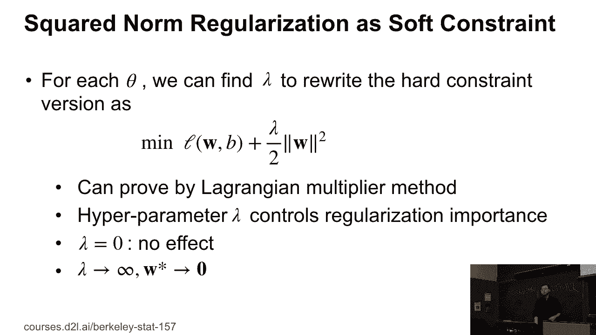

# P30：30. L7_2 平方 L2 正则化 - Python小能 - BV1CB4y1U7P6

好的。

然后在硬约束版本中，优化起来相当困难。所以我们通常使用软约束版本，这意味着对于每一个θ，我们实际上可以找到这个数值--。

根据数值--我们可以将硬约束版本重写如下。

所以我们最小化损失的 w 和 b，加上 lambda 2，除以 2 和平方根的 L2 和 w。

所以这实际上是 L2 正则化或者平方 L2 正则化。你可以通过拉格朗日乘子证明这两种形式是等价的。

所以这里的 lambda 是超参数。如果我们选择 0，那么它对模型能力没有影响。

如果我们选择一个更大的值，比如。

如果我们选择无穷大，那么我们就强制所有的 w 为 0。到目前为止有问题吗？

然后我们可以可视化它是如何工作的。

绿色圆圈是损失函数，最优点是 t 或 w star。所以我们可以通过最小化损失函数来解决它，针对训练数据和权重。然后如果我们加上正则化项，这就是原始曲线。所以如果我们靠近原始点，小的值，得到的，如果我们找到一个接近 t 或 w star 的权重。

那么你会得到一个更大的值。然后最优位置就在原始 x 和 y 等于 0 之间，也在原始损失上的最优位置之间。因为 L2 长度，我们将 t 或 w star 向原始点推动。所以如果我们有一个更大的数值，这个作用力就更大。如果我们有一个小的数值，那么我们实际上会定义位置。

到目前为止有问题吗？

好的。那么为什么它叫做权重衰减？因为--机器学习中它被称为 t-正则化。所以对于权重衰减，因为让我们计算梯度。完整的梯度。损失加正则化，是一个加法。我们可以重新写损失的梯度加上 lambda 乘以 w。使用 SGT，我们知道每次我们都会。

更新 w t-1 为 w t-η，这是一种线性速率乘以梯度。然后我们进行去位变换。我们知道第一个是 1 - η 乘以 w 乘以 w t。减去损失函数的原始梯度。所以通常，我们选择一个非常小的数值。比如 1，1e-3，或者 1e-6。而线性速率通常是一个小于 1 的数值。

1 减去 eta 乘以--，一个比 1 小的漂亮数字。所以这意味着每次我们将原始的，前一个点 w t 乘以这个小数字，然后减去我们拥有的原始梯度，我们称之为衰减权重。因此，神经网络领域的人们称之为所谓的权重衰减。实际上。

它只是我们拥有的 L2 正则化。[BLANK_AUDIO]。

