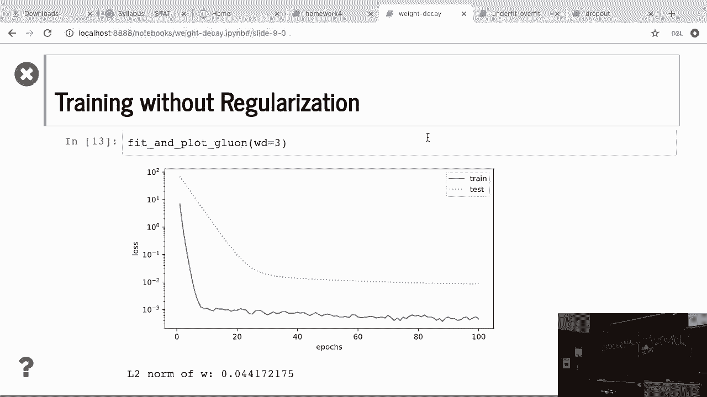
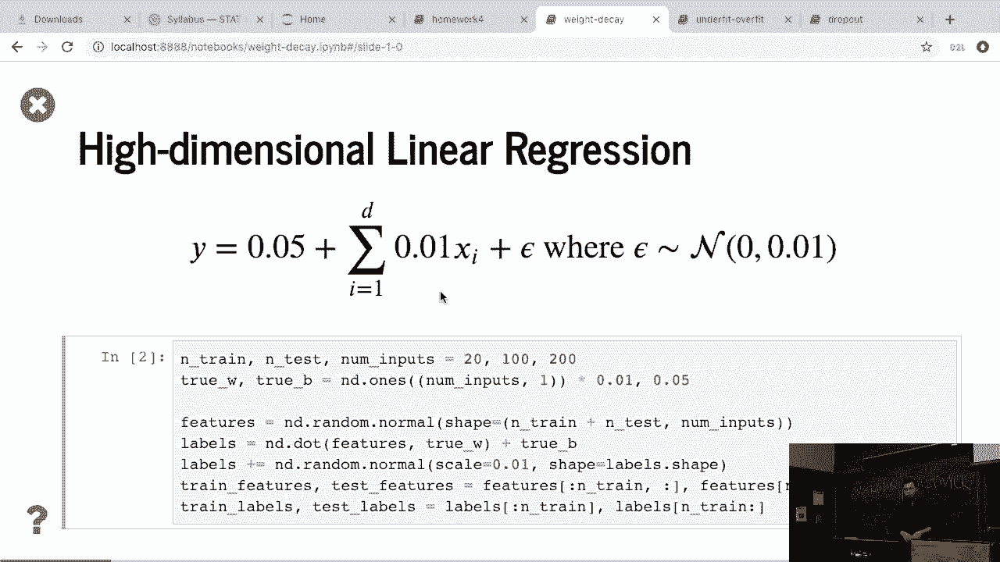
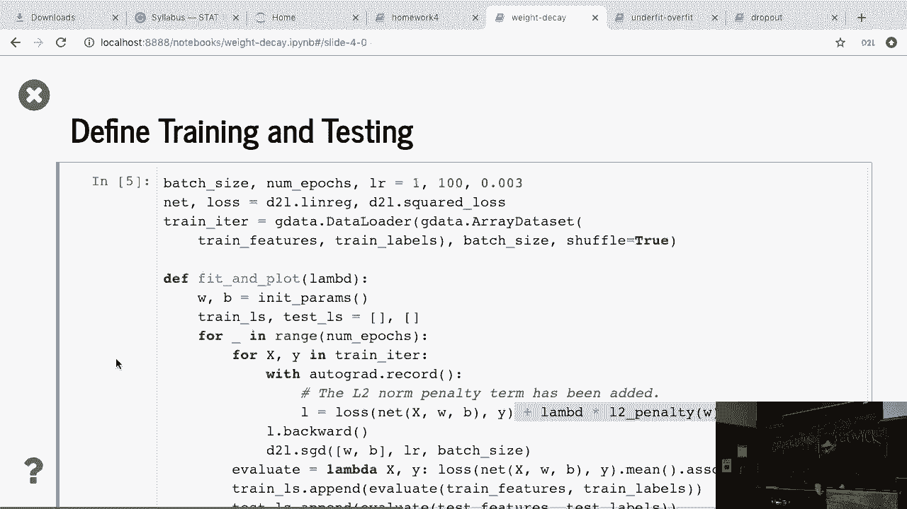
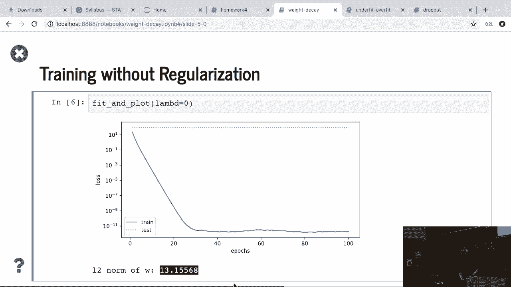
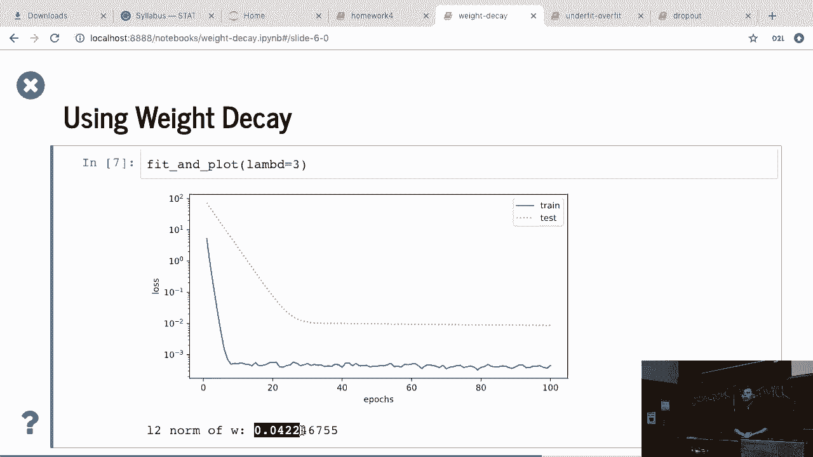

# P31：31. L7_3 在 Jupyter 中的平方 L2 正则化 - Python小能 - BV1CB4y1U7P6

我们还像导入某些东西一样使用了权重衰减，可以忽略这一点。在这里我们可以拟合一个高维数据。 

线性回归中的维度。d 是我们拥有的维度数。权重。

这个过程相当简单，全部初始化为 0 减去 0，1，并加上噪声。我们可以知道我们实际上是怎么做的。

获取这些数据。然后像之前一样，我们构造线性回归并进行初始化。

权重，附加梯度。然后定义平方 L2 长度惩罚或。

正则化。所以实际上是给定 W，平方并求和元素，除以 2。这就是 L2 正则化。训练过程实际上和之前非常相似。

唯一的区别是损失函数，抱歉，它是很多，原始损失。你不能负担并比较损失，跟 Y 加上 lambda 乘以 L2 正则化的 W 相比。所以这是我们这里唯一有的不同。其他的都和之前类似。好吗？他们忽略了。网络第一次拟合的数字等于 0，意味着。

这里没有正则化。你可以看到类似的情况，蓝色线是训练误差，虚线是验证误差。你可以看到训练曲线下降，但验证准确率实际上上升了。它没有变化太多。原因是因为我们使用了 100 个维度，但我们只用了非常少的样本。

所以即使是线性模型也会严重过拟合这个数据集。我们可以计算最终的 W2，长为 13。现在让我们试试看如果我使用权重衰减。我们使用 lambda 等于 3。你可以看到。

我们仍然有一点过拟合，但是情况好多了。我们实际上大幅度降低了测试误差。但是鉴于我们仍然只有少数几个样本用于这个高维数据集，模型仍然在过拟合数据，但增加的样本数实际上大大减少了测试误差。而且我们还可以看到有两个长的 W。

相比之前，它非常小。所以如果从头开始实现我们所做的，我们就直接。

更改了损失函数，如果你要使用一个库或任何深度学习库。

我们通常只是告诉SGD函数应用权重衰减，我们直接将其应用于SGD函数。例如，在Gruell中，你可以说在获取线性率时，除了线性率外，你可以指定权重衰减Wd，并为其指定一个具体的数值。所以这里我们做了更复杂的操作。我们只应用于权重。

不能详细讨论这个API的具体工作原理。实际上，我们也会连接到权重并应用。对于偏置项，我们没有应用任何权重衰减。这与我们在公式中讨论的非常相似。然后，因为我们已经在优化方法中应用了权重衰减，所以这里不需要更改损失函数。因此在实际操作中，你…

不需要做那些，你只需要指定权重衰减。是否应用于偏置在大多数情况下并不重要。

我们可以看到测试准确度与训练准确度之间存在很大的差距，如果应用了权重衰减…

当等于三时，你也会看到测试准确度下降。因此，W的L2范数也减少了。到目前为止有什么问题吗？好的。

