# P33：33. L7_5 Dropout in Jupyter - Python小能 - BV1CB4y1U7P6

 Again， we impose on libraries。

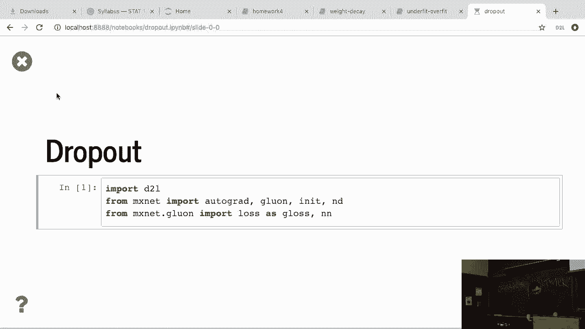

 The key thing is here。 We define dropout function。 They input this x。 and we specify the drop probability。 So we know that this should be larger than 0， or less than 0。 not larger than 1。 Then if dropout is equal to 1， we just return 0s， because。 we drop out everything。 The reason we cannot do a special case is because it's。

 hard to normalize it。 Then， otherwise， we sample some uniform results between 0， and 1。 given the same shape of x。 And get the 1 is larger than the dropout probability。 This is a mask。 Then we return x tends the mask， and rescale by the 1 minus， dropout probability。 So that is。 we reimplement the dropout definition。 Then， some examples here。

 Let's just do gender x。 If you do dropout probability equal to 0， we keep， everything here。 If drop half of the results is like every time， should we， give you different results？ Well。 it's still training， so it's still training on that， letter。 But if we specify probability equal to 1， we drop， everything we have。 So again。

 we implement a three layer， two multilayer。

 perceptron with two hidden layers。 So again， we using the fashion M list， the set， which is。 the input is 784。 Now， put these 10 classes。 The only thing here。 we choose the first hidden layer output， 256 output。 The second hidden layer， actually， output more。 like， 512。 So that's it to have a reminder we choose。

 The lib is over complex models to train fashion M list。

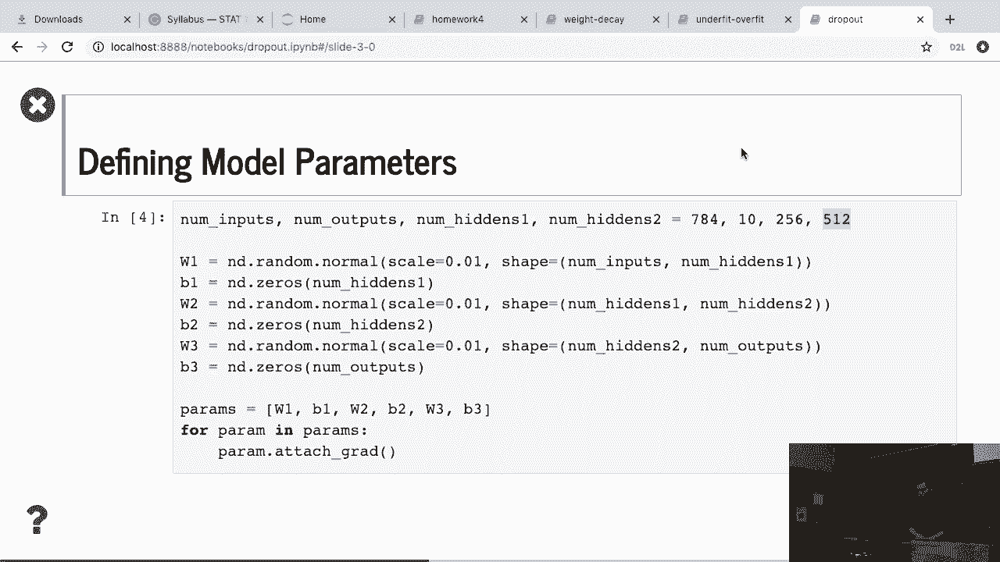

 So here's the thing， how to apply dropout to the networks。 We define two probabilities。 We drop different probability for different layer。 Because the first hidden layer is lib is simple。 The second one is lib is complex。 We use a small probability job for the first layer， and is a。 high probability for the last layer。 But that's the hyperparameter you can choose。 Usually。

 here we use small models。 If you use complex models， usually choices you can choice， like 0。5， 0。9。 or 0。9 sometimes。 It's very complex models。 Then we do-- this is the input we reshape。

 Let me do a little bit。 This compute does the first hidden layer， that's as usual。 Then here's the thing。 When we are on the training model， we apply dropout to， the H1。 When it is an inference model， it doesn't apply dropout。 Similar thing for the second one。 the second of， hidden layers， we only apply dropout to the output of this。

 layer if it's during training。 And we give different probabilities here。 Last。 we return the last of the Flichen layer。 So we usually don't apply dropout to the last output layer。 Because last output layer is used to predict each category， you don't want to-- OK， this time。 half of the category， is gone， and then you have a large loss。

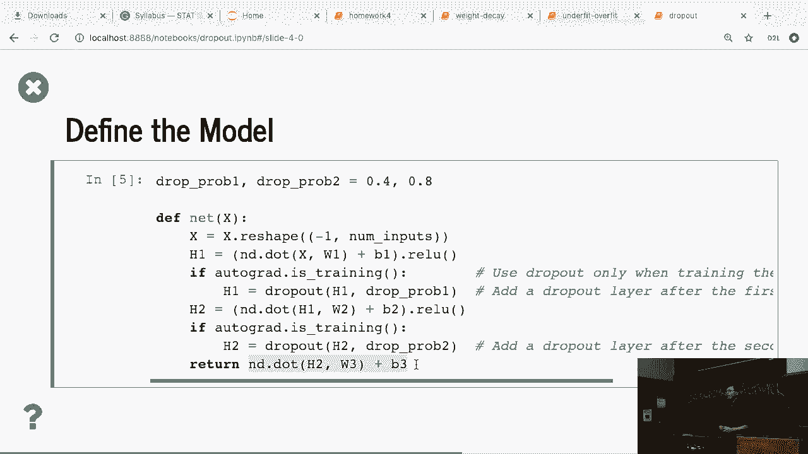

 So now we can train。 Training is no different to before。 Don't need to think that we dropout this slide here。 So we can see that the gap between the training accuracy。

 and the test accuracy is a little bit smaller。 It's actually very close to each other。

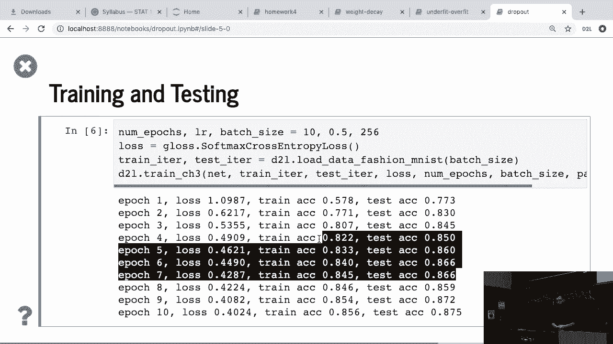

 Sometimes the validation accuracy-- actually， the。 validation accuracy is even higher than the training accuracy。

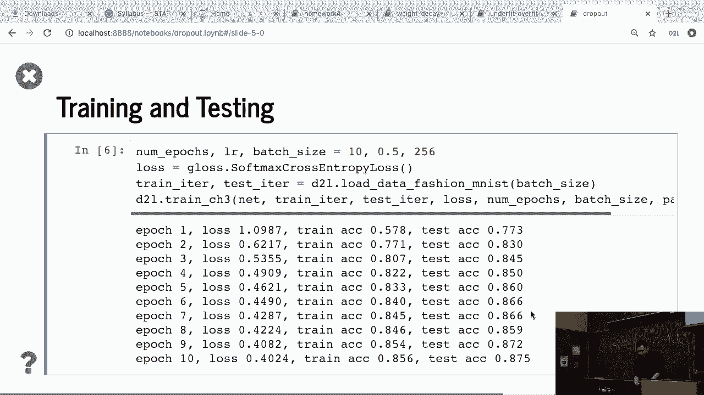

 So then this is like-- it happens a lot of time。

 You see that testing accuracy is higher than the training， accuracy。 because you're adding a lot of noise during training。 Actually。 this noise is making your training accuracy smaller。

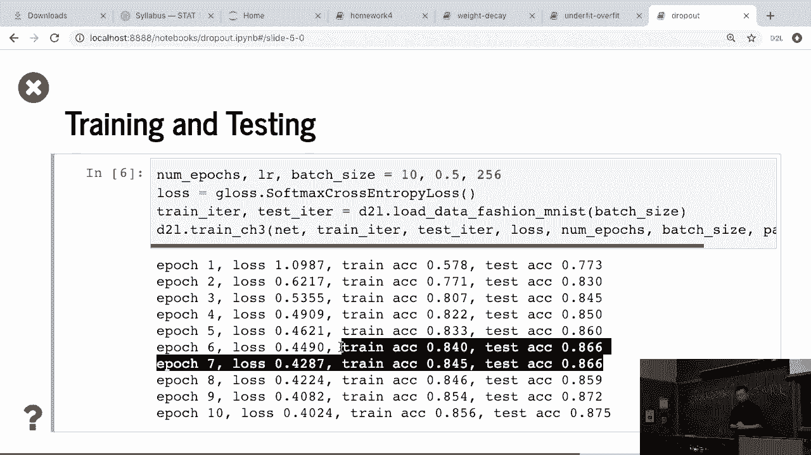

 To implement dropout in Grun is pretty simple。 We have a layer called dropout。 Then you add in this layer into a network， as a normal layer in the network。 It's a behavior as the same thing as we defined before。 This layer performs dropout when in the autograd scope， it does nothing in the inference model。

 And you can specify the dropout probabilities here。

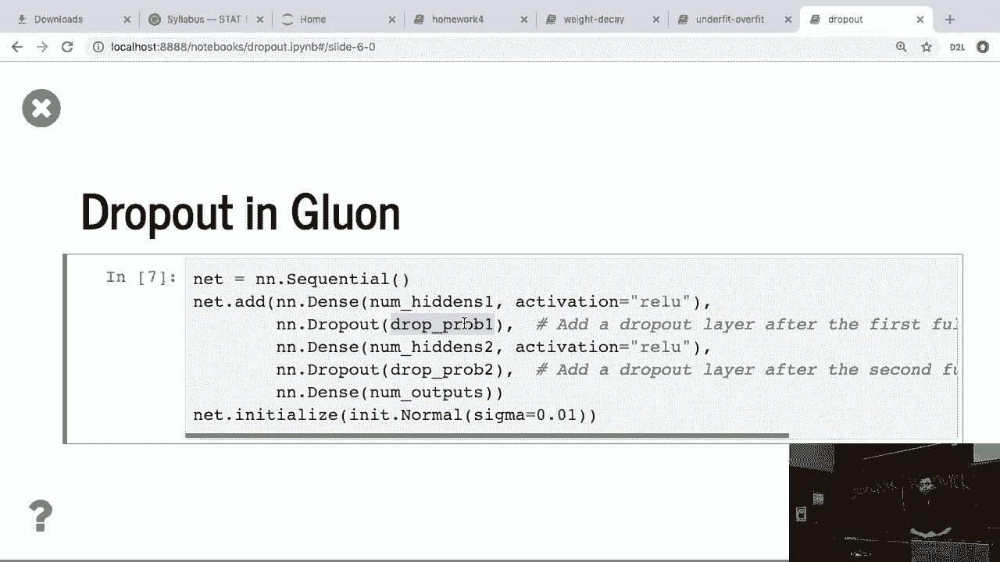

 You also can train that。 Also， similarly， you can see that the test accuracy actually。 is higher than the training accuracy。 That is because we give a very strong， recognition here。 The last thing you're going to try that without dropout。

 whatever will be happened。 So leave me a slow。

 Let me try that。 So let's change dropout to be 0 and 0。

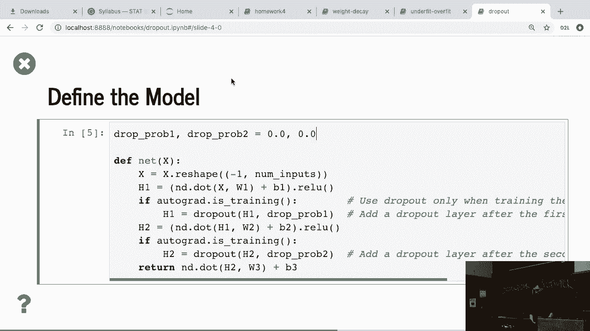

 So without dropout。 Because we need to re-initialize the weight， if we don't do that。 we just train from the last time we have。

 So let's re-initialize the random values。 And defined。

 You may guess what will be happen。

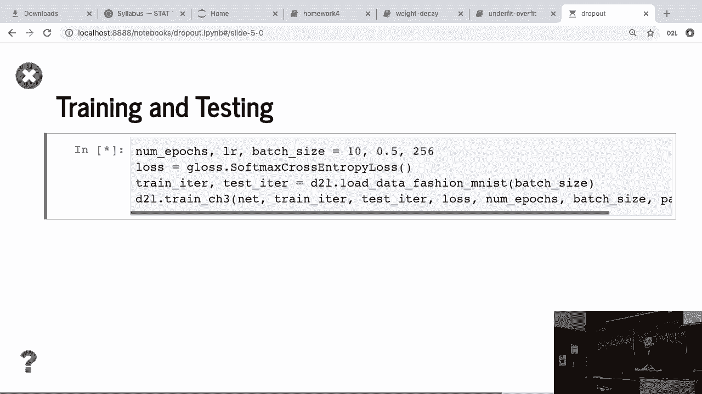

 Any guess？ We'll be a different。 [INAUDIBLE]， Actually， we are not seeing too much difference here。 The reason is because we use tiny models here。 So we have 16，000 images on the training dataset。 And this is a fashion list as it actually is more complex， than the amless dataset we have。 So it's pretty complex dataset。 We construct pretty actually pretty similar models。

 The whole feeling is actually small。 Adding regularizations or dropout here。 doesn't make sense too much。 So let's see。

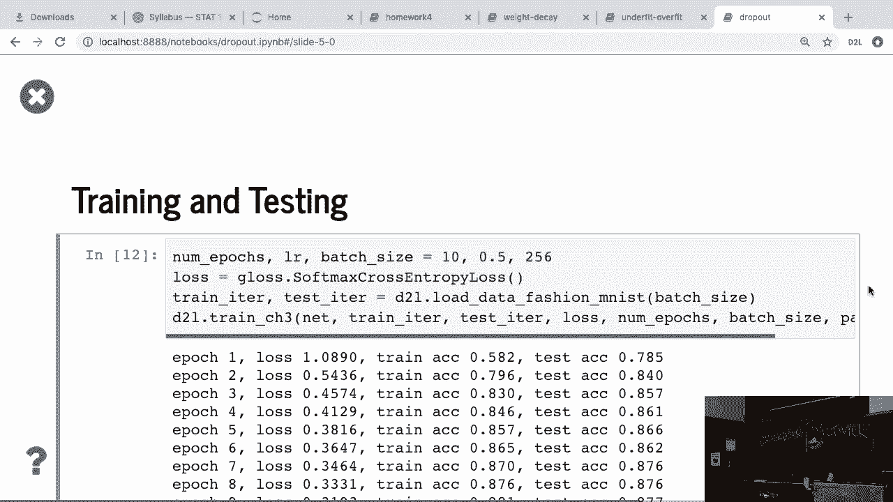

 So comparing to the last one we have。

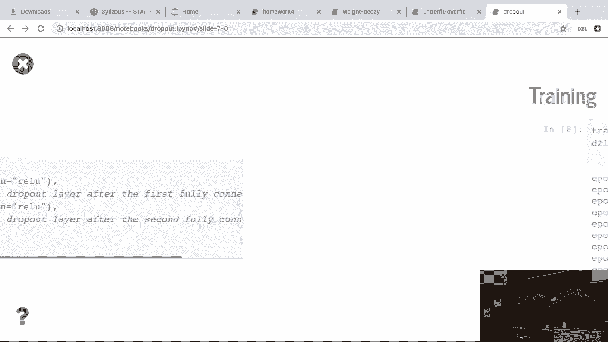

 actually you don't see much difference。 You can do that。 But the only thing you see is that the training accuracy， is much higher than before。 So here。 the training accuracy here is almost like before smaller。

 By the end， these training accuracy pretty high。 And then with dropout。 the training accuracy is a little bit， slower here。 Because it's regularization。 actually make the training。

 accuracy lower。

 If you want to see the really the benefits of dropout。

 what you can do is you can increase the number of hidden， layers here。 You can change to 1，024。 Because I run the Mac is pretty slow。 I won't do that。 You change to a very large number。 Usually you can do a very large number， then dropout， we have more effect on that。 In practice。 well， if the data set is a relative simple， and you want to build complex models， for example。

 you construct a new and I will have four hidden layers。 And each hidden layer is pretty a lot of hidden units。 You can apply dropout。 So from practice。 maybe for the homework four， what you can do is you can see the training error。 and the validation error。 You can see the validation across validation accuracy。

 If you think the training loss is too small， the training loss too high， then you。 can increase the number of layers you can have。 You can increase the hidden units you can have。 But if you see the gap is large， you have two approaches here。 One that you can apply away decay。 The other one that you can apply dropout。 You can apply insert dropout to the output of the hidden layer。

 You can specify the dropout probabilities。 You can try either 0。5 or 0。9 that are popular choice。 Otherwise， you don't need to add a dropout。

 [BLANK_AUDIO]。