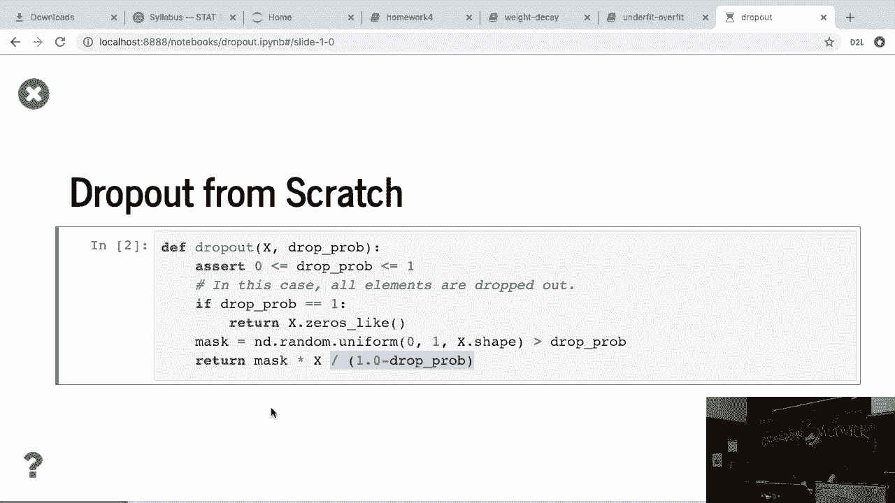
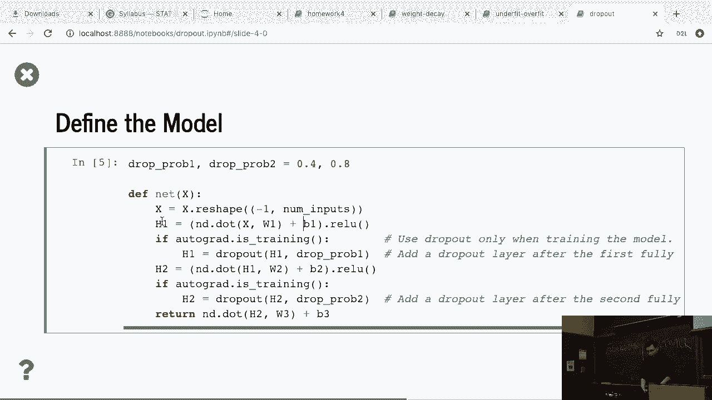
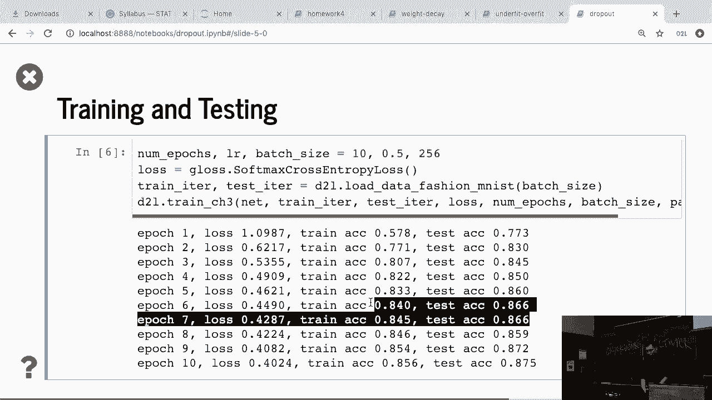
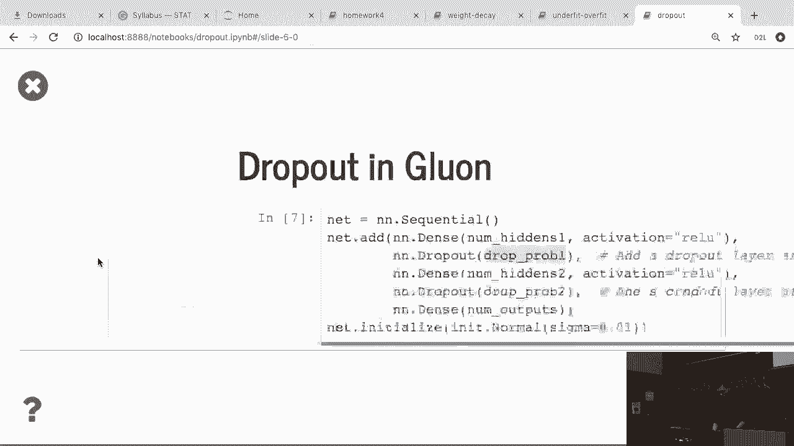
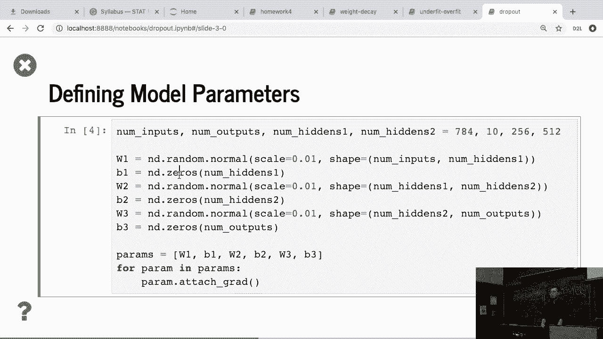
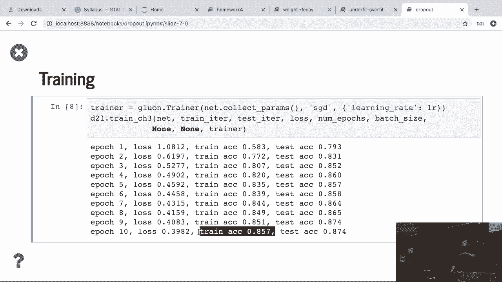
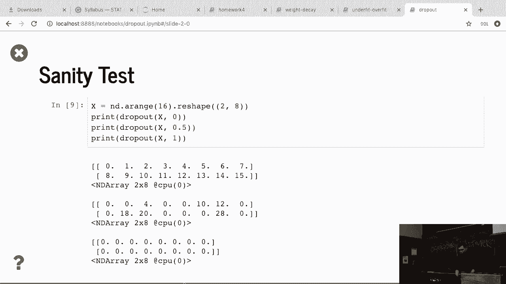
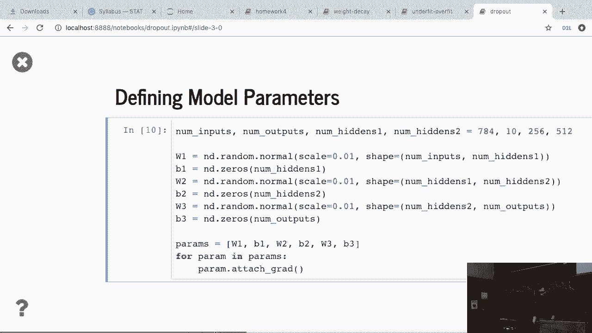

# P33：33. L7_5 在Jupyter中使用丢弃 - Python小能 - BV1CB4y1U7P6

再次，我们对库进行了约束。

关键点在这里。我们定义了丢弃函数。它接收输入x，并指定丢弃概率。所以我们知道，这个值应该大于0，小于1。如果丢弃概率为1，我们就返回0，因为我们丢弃了所有内容。我们不能做特殊情况的原因是因为它。

很难将其规范化。那么，除此之外，我们在0和1之间采样一些均匀的结果。给定相同形状的x。然后得到1大于丢弃概率。这是一个掩码。然后我们返回x与掩码的乘积，并通过1减去丢弃概率进行重新缩放。这样做就是重新实现了丢弃的定义。接下来是一些示例。

让我们简单做一下性别分类。如果你设置丢弃概率为0，我们会保持所有内容。如果每次丢弃一半的结果，应该会给你不同的结果吗？嗯，训练仍然在继续，所以它仍然在训练这个模型。但如果我们指定丢弃概率为1，我们会丢弃所有内容。再一次。

我们实现了三层，其中有两层是多层的。

带有两层隐藏层的感知机。所以我们再次使用了fashion M列表，输入是784。现在，设置这10个类别。这里只是选择了第一隐藏层的输出为256，第二隐藏层实际上输出更多，像是512。所以这是我们选择的一个提醒。

这个库用于训练过于复杂的模型。

那么问题来了，如何将丢弃应用于网络中。我们定义两个概率。我们为不同的层使用不同的丢弃概率。因为第一隐藏层的库比较简单。第二层的库比较复杂。我们对第一层使用较小的丢弃概率，对最后一层使用较大的丢弃概率。但这是一个超参数，你可以选择。通常是这样。

这里我们使用小型模型。如果使用复杂模型，通常你可以选择像0.5、0.9或者有时是0.9的概率。它们是非常复杂的模型。然后我们做——这是输入，我们重新调整形状。

让我稍微做一下。这段计算是第一隐藏层，和往常一样。然后问题来了。当我们训练模型时，我们对H1应用丢弃。当它是推断模型时，就不应用丢弃。第二层也是类似的，第二层的隐藏层我们只对其输出应用丢弃，前提是它处于训练过程中。

如果是在训练过程中，我们给出不同的概率。最后，我们返回最后一层的输出。所以通常我们不会对最后的输出层应用丢弃。因为最后的输出层用于预测每个类别，你不希望——好吧，这次一半的类别丢失，然后你会有很大的损失。

所以现在我们可以开始训练了。训练和之前没有什么不同。不要以为我们在这里放弃了这张幻灯片。所以我们可以看到训练精度之间的差距。

测试精度稍微低一些。其实它们非常接近。

有时验证精度实际上会高于训练精度。

所以这就像是——这种情况发生得很多。

你会看到测试精度高于训练精度，因为在训练过程中你加入了很多噪声。实际上，这些噪声使得训练精度变得更低。

在 Grun 中实现 dropout 非常简单。我们有一层叫做 dropout。然后你将这一层添加到网络中，就像网络中的普通层一样。它的行为和我们之前定义的一样。在 autograd 范围内，这一层会执行 dropout，而在推理模型中则什么也不做。

你可以在这里指定 dropout 的概率。

你也可以进行训练。同样地，你会看到测试精度实际上高于训练精度。这是因为我们在这里提供了非常强的识别能力。接下来，你将尝试不使用 dropout 的情况。

不管发生什么情况。那就让我慢慢来。

让我来试试这个。所以我们将 dropout 改为 0 和 0。

所以在没有 dropout 的情况下，因为我们需要重新初始化权重，如果不这样做，我们将继续使用上次训练的结果。

所以让我们重新初始化随机值并定义它们。

你可能猜到会发生什么。

有什么猜测吗？我们会看到不同的结果。[听不清]，实际上，我们这里没有看到太大差异。原因是因为我们使用了非常小的模型。所以我们的训练数据集包含了16,000张图片。而且这个时尚数据集实际上比我们之前使用的图像数据集要复杂。所以这是一个相当复杂的数据集。我们构建了相当相似的模型。

整体感觉其实很小。在这里添加正则化或 dropout 并没有太大意义。所以让我们看看。

所以与我们之前的结果相比。

实际上你不会看到太大区别。你可以这样做。但你唯一看到的区别是训练准确率，明显高于之前。所以在这里，训练准确率几乎和之前的相比较小。

到最后，训练准确率相当高。然后使用丢弃层时，训练准确率会稍微变慢。因为这是一种正则化方法，实际上会让训练过程更稳定。

准确率较低。

如果你想看到丢弃层的真正好处，

你可以增加隐藏层的数量。你可以把它改成1,024。因为我的电脑运行比较慢，我不打算这么做。你可以改成一个很大的数值。通常来说，你可以尝试更大的数值，这样丢弃层对结果会有更大的影响。在实践中，如果数据集相对简单，你又想构建复杂的模型，比如，

你构建一个新的模型，可能有四个隐藏层，每个隐藏层都有大量的隐藏单元。你可以应用丢弃层。所以在实践中，可能对于作业四，你可以观察训练误差和验证误差，看看验证集的交叉验证准确率。

如果你认为训练损失过小或者训练损失过高，那么你可以增加层数，增加隐藏单元数量。如果你看到差距很大，你可以有两种方法。一种是使用权重衰减，另一种是使用丢弃层。你可以在隐藏层的输出上插入丢弃层。

你可以指定丢弃率。你可以尝试0.5或0.9，这些是常用的选择。否则，你不需要添加丢弃层。

[BLANK_AUDIO]。
