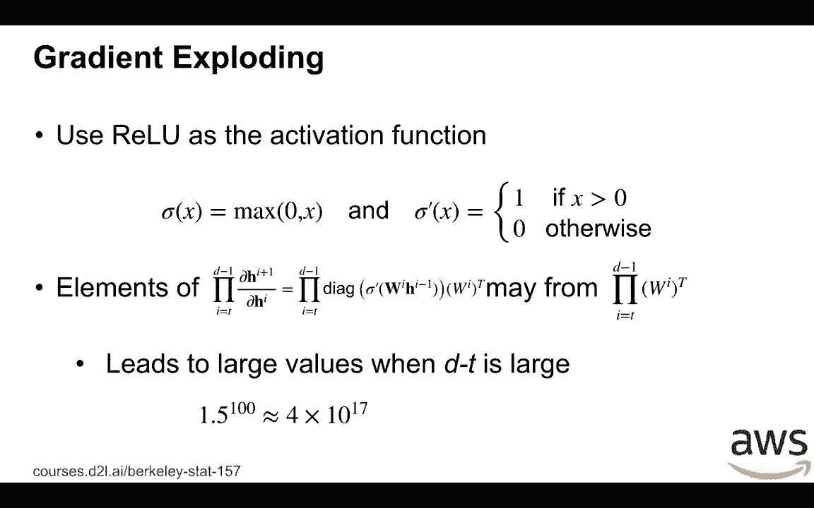
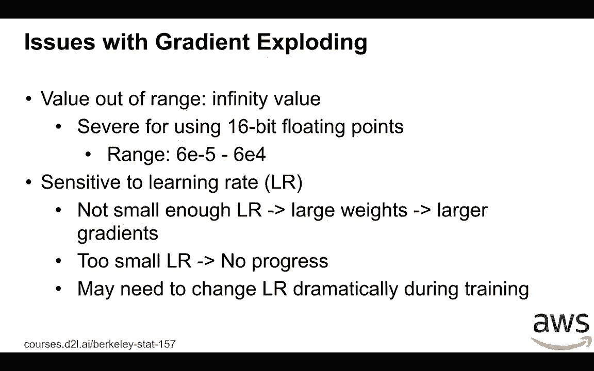
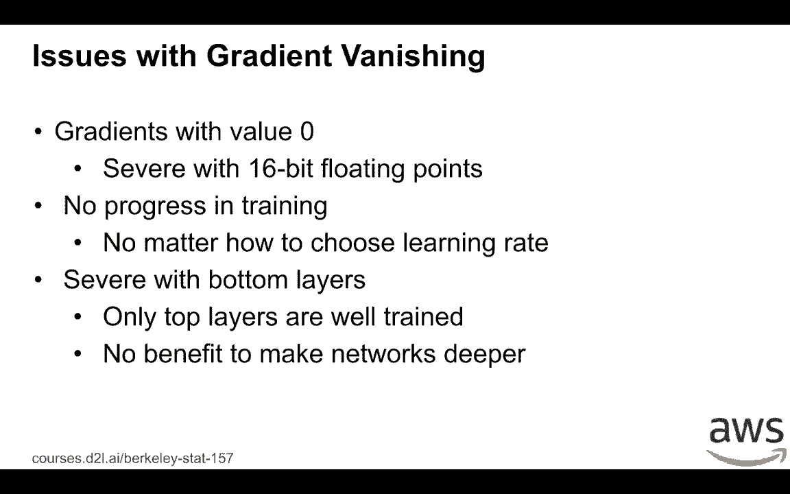

# P34：34. L8_1 梯度爆炸与消失 - Python小能 - BV1CB4y1U7P6

这是Nx8的重新录制。

让我们从数值稳定性开始。

考虑一个简单的神经网络。我们有D层。T层的输入叫做hT减1，输出是hT。该层有一个函数ft，将输入hT减1转化为输出hT。给定输入x到网络，最终输出y，我们首先将x输入到第一层f1中。

一直到最后一层fd，然后输入最后一个函数l。这里我们要考虑的是计算最后l相对于wt的梯度。t层的第一层是t层的偏导数。记住链式法则，我们有偏l对偏wt的导数，首先是偏l对t层最后输出的偏导数。

这是hD。然后我们逐层计算梯度。首先计算最后一层的梯度，即hD对hD减1的偏导数。hD是d层的输出，hD减1是该层的输入。所以我们按照d减t次应用，直到得到hT加1对hT的偏导数。最后，

我们得到d层t层相对于参数的输出，即hT对wt的偏导数。关键点在于，考虑这些方程中间的部分，我们在d减t矩阵上进行乘法。

这可能会引发问题。问题之一叫做梯度爆炸。所以当我们在这里使用大于1的数时，比如1.5并且指数达到100时，我们得到一个非常大的数字。第二个问题叫做梯度消失。也就是说，我们使用小于1的数字并且指数达到很大时。

然后我们得到一个非常小的数值。所以这两个问题导致了训练问题。

让我们考虑一个具体的例子。假设我们有一个多层感知机。为了简化起见，我们去除偏置项。由于是mlp，因此我们知道，给定输入hT加1，它是t层的输入，我们知道函数等于wt乘以hT减1。

wt是参数，hT加1是输入。然后我们将其输入到激活函数sigma中。为了计算这一层的梯度，我们知道，通常情况下我们先计算相对于激活函数的梯度。其输出是一个向量，输入不是一个向量。我们知道梯度是一个矩阵。所以这里实际上是一个对角矩阵。它是sigma的导数的对角线。

乘上sigma的梯度函数，并将其输入wt加hT加1。然后我们计算稠密层函数的梯度，实际上就是wt的转置。因此，应用链式法则，我们知道我们需要进行d减1次乘法。也就是d减t的对角矩阵与一堆权重矩阵的乘积。

那么我们该怎么办？例如，假设我们使用一个值作为激活函数。也就是说，sigma x就是0和x的最大值。所以我们知道sigma的梯度函数是，如果x大于0，则梯度为1，否则为0。那么现在这个d加t的乘积元素，可能就是所有这些参数的乘积。

因为对角矩阵可以是0或1。所以，如果wi包含大于1的数字，而d加t又非常大，这意味着长度要么会急剧增大，要么我们会使用接近输入层的底层，这样它就很小，那么这些乘积的元素可能会聚集成非常大的数字。这就导致了梯度爆炸。

那么梯度爆炸是什么问题呢？在流式处理的情况下，我们可能会超出范围，得到无限大的值。所以当我们得到无限大的值时，什么都得不到正确的数值。如果我们使用的是60位浮点数，这种情况尤其如此。因为该点的范围非常小，很容易就超出范围。即使我们还在范围内，情况也会如此。

也就是说，我们并没有得到无限大的值，但这些大值可能对学习率非常敏感。如果我们没有选择足够小的学习率，那么SGD在下一次应用时会对权重做出非常大的修改。然后，接下来的较大权重会导致更大的梯度，从而可能进入无限大。但如果我们选择的学习率过小。

然后我们可能没有任何进展，因为每次我们将小值应用到权重上。而且由于这个值可以在非常宽的范围内变化，所以在训练过程中它可能非常大，也可能非常小。因此，我们需要根据实际值在训练过程中大幅调整学习率。

这就造成了很多问题，正如你所看到的，它在训练过程中造成了不稳定。

第二个问题是梯度消失。再一次，我们使用之前的多层感知器例子。但这里我们将激活函数改为sigmoid。我们知道sigmoid的定义是1/（1+e^(2-x)）。而sigmoid的梯度函数就是sigmoid函数乘以1减去sigmoid输出。

所以我们画了一个sigmoid函数的图。x轴是输入x，y轴是函数值。这里的重要点是原点i是sigmoid的梯度函数。我们可以看到，即使x的值很小，也不会太大。

例如，稍微大于4或稍微小于-4时，我们会得到非常小的梯度。而这里的问题在于，梯度是这些对角矩阵的乘积，而这些对角矩阵可能包含非常小的数字。然后梯度就是这些非常小值的乘积。

因此，元素的代价可能非常小。

那么，梯度消失的问题是什么呢？在极端情况下，梯度为零。因为它太小，特别是如果我们使用16-4位浮点数时，如果值大于1e-6，那么所有这些值都会变为零。如果我们得到零梯度，无论我们如何改变或生成，梯度更新仍然为零。

所以这意味着没有训练进展，尤其是在接近输入的底层。也就是说，当t很小时，底层的梯度相较于顶层较小，而顶层接近损失函数。因此，只有顶层我们才能感知到趋势，因为它们的梯度较大，而其他底层则有较小的梯度。

所以在考虑字符串的情况下，我们有100层，顶层的前20层得到较大的梯度，而底部80层几乎没有梯度。那几乎等于只连接一个包含20层的纳米网络。这意味着，构建一个更深的网络变得相当困难。

而且这还会带来许多其他麻烦，稍后我们将讨论。[BLANK_AUDIO]。

