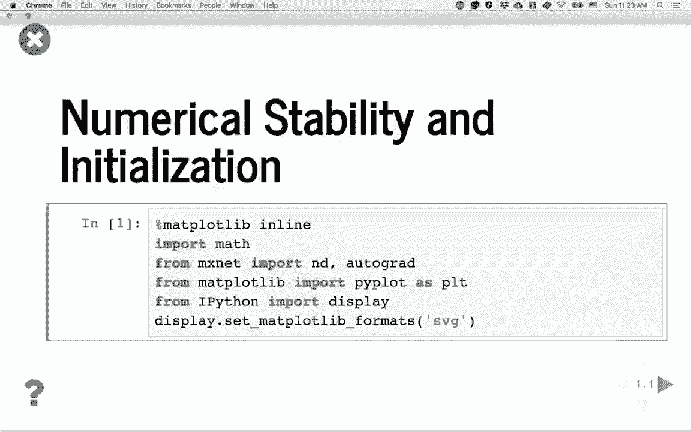
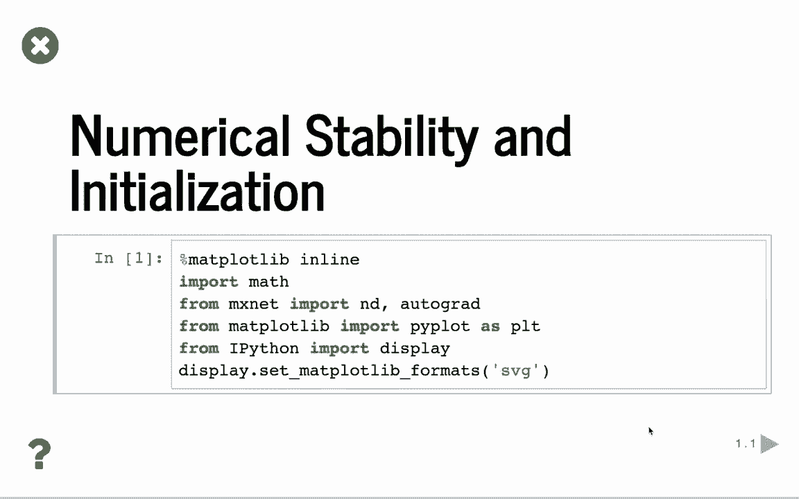
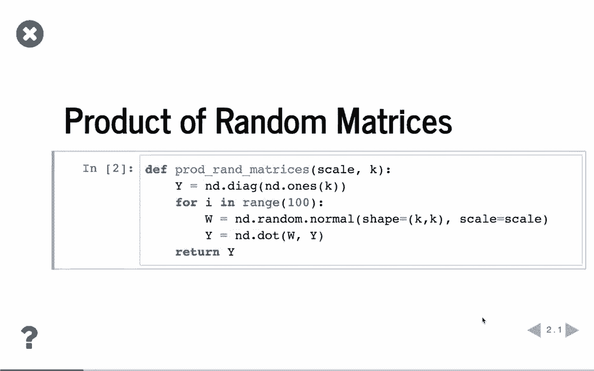
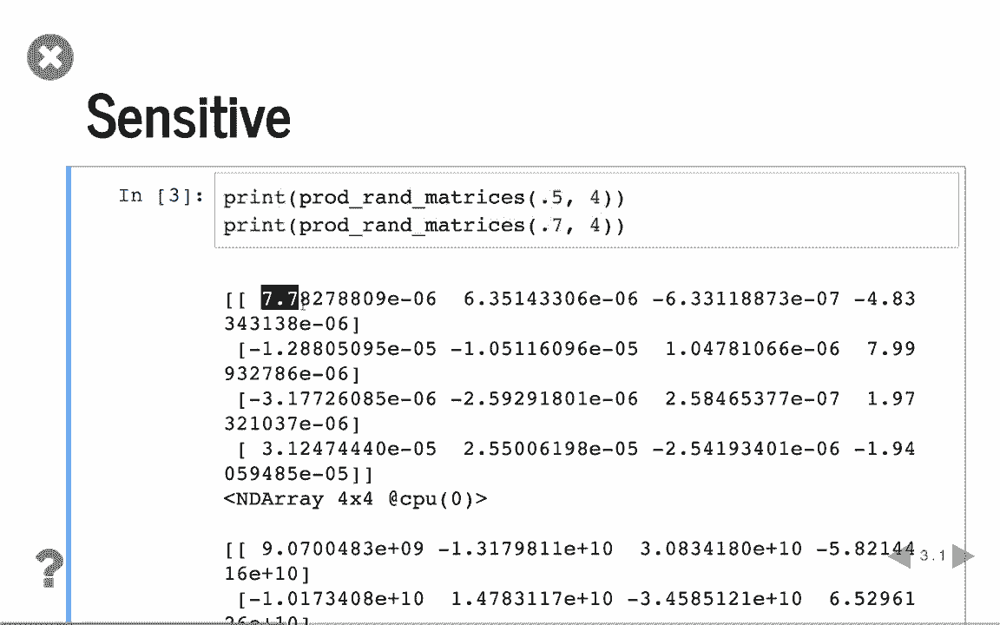
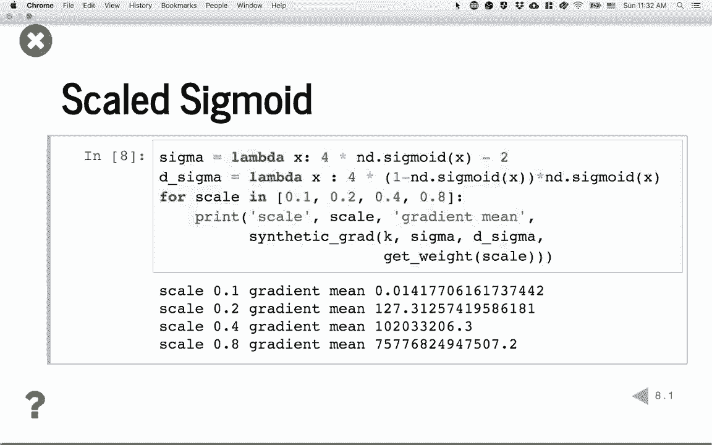

# P36：36. L8_4 数值稳定性笔记本 - Python小能 - BV1CB4y1U7P6

到目前为止，我们讨论了多种方法来确保数值稳定性。

现在让我们看看一些结果来验证这些方法。我们首先导入 HAMP 的网络和其他库来生成图形。

我们将在这里做的第一个实验是生成一堆随机矩阵并进行相乘。

这里我们定义了一个叫做 prod random matrices 的函数，接受两个参数。第一个是 scale，控制随机矩阵的方差，第二个是 K，表示形状。现在我们首先生成一个 Y，它是输入的单位矩阵。接着我们进行 100 次矩阵相乘，每次我们使用正态分布生成随机矩阵。

其形状为 K×K，方差由 scale 控制。我们进行 W 和 Y 之间的矩阵相乘，并将结果保存到 Y 中。返回 Y，这就是 100 次随机矩阵相乘。现在我们来看一些结果。

首先，我们使用的缩放比例是 0.5，且这是一个 4x4 的矩阵。接着我们选择了一个缩放比例为 0.7。你可以看到，即便这两个比例相差不大，第一个结果是预处理的，所有的值都很小，都是 1 E-6。

但对于第二个矩阵，让我来操作一下，然后会得到非常大的数字。

结果接近 1 E+10，这表明如果我们进行大量的矩阵相乘，输出值对方差非常敏感。因此，我们需要小心选择它们。

然后我们定义了一个函数来计算 MLP（多层感知机）的合成梯度。所以输入是 K，依然是形状，sigma 是激活函数。这个 sigma 是 sigma prime，即激活函数的梯度函数。然后获取权重，表示如何获取初始化的权重矩阵。

这是一个函数句柄。因为这非常随机，我们可以重复执行 10 次并计算平均值。在每次重复中，我们首先生成一个随机的 x，它的形状是 K×1 的向量。然后 h，这个输出目前全是 1，y，依然是单位矩阵。假设这个 MLP 有 50 层。每一层。

我们首先通过 coin 获取初始化的权重。然后执行输入函数句柄。接着我们做 w 乘以 h 来得到激活函数的输入。然后将其传入 sigma 的梯度函数。再通过链式法则与 wt 相乘。再次通过输入和 y，我们可以计算该输出的梯度。

这是该层的输出。然后我们更新w，更新h，这就是第四个函数以适应下一层。所以我们重复50次，最后得到输出，这就是y，这就是梯度。我们计算最小追踪值并报告结果。最后。

我们通过对这10次重复结果进行平均来处理。

现在我们来配合定义。我们首先选择层，大小设为100，意味着输出大小为100。然后我们使用的激活函数是RELU。我们只是在undi命名空间中使用RELU来获得那个梯度函数，函数很简单，如果x大于0，则返回1，否则返回0。

我们使用的权重初始化是可配置的。实际上它是使用均值为零的正态分布。通过给定方差，我们有一个配置文件，形状实际上是k x k的形状。接下来我们尝试不同的规模，即不同的方差，从0.1到0.2到0.4到0。

然后我们可以通过调用我们之前定义的合成梯度函数来打印方差和梯度的均值。我们可以看到结果。你可以看到，使用稍微大一点的规模，梯度最小值相当小。

对于0.1，结果为1e-9，对于0.2是合理的。

这是一个合理的值。但如果我们再将规模加倍，梯度就变得很大，达到1e-20。如果我们再选择其他值，那么我们会得到一个较小的数值。在这种情况下，只有0.2是合理的值。我们不能太小，也不能太大。如果我们改变为x-vere，定义规模为使用均匀分布。

我们可以得到的规模等于6，其中输入是k。对立的是k。这是一个简单的案例，输入和输出的形状相同，然后计算平方根。然后是x-vere，它计算了即使是规模，也就是均匀分布的最小阈值和最大阈值。我们可以再次进行计算。结果不完美，约为1e-9。

但考虑到这些相对较小的应用，有时练习效果更好。但再次强调，至少它能为你提供一个合理的范围。

由于包含sigmoid函数，我们知道sigmoid会导致梯度消失。我们首先从undi命名空间定义sigmoid函数，然后是sigmoid函数的梯度，我们知道它是1减去sigmoid值，再乘以sigmoid值本身。类似地，我们从0.1到0.8选择不同的规模并计算梯度的平均值。

现在你可以看到，选择从0.1到0.8的值时，结果都差不多，所有这些值都非常小，达到1e-33，甚至在非常大的规模下，我们仍然得到5e-5。所以在使用sigmoid之前，容易出现梯度爆炸，而使用RELU时，实际上是在这里发生梯度消失。

我们提到过，我们可以通过缩放来修正 sigmoid。因此，在这里我们定义了激活函数，即 4 倍 sigmoid，减去 2。然后 sigma 的梯度函数只是简单地加上一个缩放因子。现在再做一次，我们可以看到，当使用 0.1 的缩放时，梯度实际上非常合理。这是一个非常好的值，0.01。

再次加倍，它不会变得太大，0.4 或 0.8 是一个合理的值。即使是 0.8 稍微大一点，但在前几次迭代中看起来还可以。这表明，如果我们固定并重新缩放 sigmoid，我们实际上可以使梯度更加稳定。[BLANK_AUDIO]。

