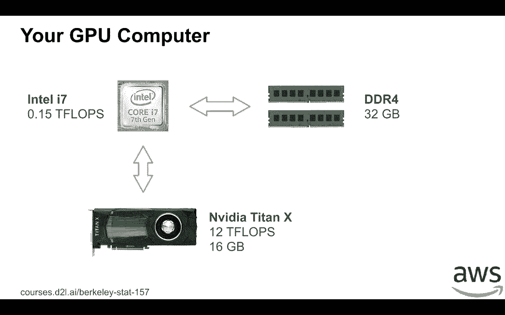

# P37：37. L8_5 深度学习硬件 - Python小能 - BV1CB4y1U7P6

在我们的办公时间里，我们会收到一些问题，"嗯，我的笔记本电脑上有一个GPU。

为什么我不能使用它？"，所以也许我们可以讨论一下移动硬件，以及什么样的硬件适合深度学习，以及如何从这些硬件中充分利用。

所以让我们从你自己可以买到的GPU机器开始。你可以购买一台合理的Intel i7 CPU，它提供0.15 TFLOPS。你可以为你的机器配备32GB的TDL4内存，最重要的是，你可以购买一块媒体GPU。在这里我们使用的是媒体TetraX，这是一款两年前的GPU。

它提供12 TFLOPS和16GB内存。你可以看到，它提供的计算能力几乎是你拥有的CPU的10倍。

让我们深入了解CPU。这是Intel i7 CPU的芯片区域。你可以看到，在右边和左边，有一个叫做Intel处理器图形的大区域。它实际上是一个GPU，这个地方集成了一个GPU，但这个GPU相当弱，内存也较少，我们通常不使用它来训练深度学习。但确实存在。

我们可以在推理中使用它，这是一个不同的话题，我们今天可能不会讲到。所以在右侧，你可以看到蓝色区域，我们有四个GPU核心。这些是物理CPU核心。它们之间有一个共享的最后级缓存，叫做L3缓存。然后在每个物理CPU内，我们有64GB的L1缓存和256GB的L3缓存。

共享的最后级缓存，或称为L3缓存是8MB。在右侧的蓝色区域下方和顶部，这是与内存的接口。这里我们有每秒30GB的内存带宽。现在这是CPU的设计。接下来让我们谈谈如何充分利用CPU。举个例子。

我们要计算A+B，其中A都是在CPU上的标量。在实际计算之前，我们需要做一堆工作。假设A和B都在主内存中。然后我们把A和B都移动到CPU的寄存器中进行计算。通常我们移动数据的方式是，首先将A和B移动到L3缓存中，再到L2、L1缓存中。

然后到寄存器。从L1缓存中访问数据非常快，几乎和你的计算一样快。但访问L2缓存中的数据会慢一些，慢了14倍。访问内存会更慢，和访问L1相比，慢了200倍。那么提升CPU性能的一个技巧就是尽量减少数据的移动。

所以我们可以称之为内存局部性，通常有两种内存局部性，一种是时间局部性，另一种是空间局部性。时间局部性意味着我们可以从现在起重新使用数据，这样就不需要将数据从缓存中移除。空间局部性意味着，如果我们使用某个特定位置的内存数据，下次我们可以使用附近的内存数据，以便CPU可以为我们预取数据。

让我们在这里做一个案例研究。假设我们有一个矩阵，矩阵是按行主序存储的，这意味着每一行的元素是按顺序存储的，然后逐行存储。在这种情况下，访问列通常比访问行要慢。原因是每次CPU读取64字节时，称为缓存行。

因此，要读取一个值时，实际上我们会读取周围位置的许多其他值。因此，对于每一行，我们可能只需要读取几个缓存行，而不是一一读取。还可以看看是否能智能地提前读取下一个缓存行，即使你还不确定是否会使用它。这样，我们可以流水线化数据读取和数据处理，从而减少访问。

读取性能。实际上，如果你可以通过调用者访问，因为我们不知道行的长度，CPU可以缓存行，但它无法预测第二个元素的位置。因此，在这里我们需要发起完整的请求，每次请求数据时，准备计算并进行另一个请求。这就是如何流水线化所有的读取和计算。

这就是为什么这里的调用读取较慢的原因。提高性能的第二种方式是使用模式读取。我们看到i7有四个调用。但是服务器CPU有更多的调用。例如，我们的最大p3配置有四个物理CPU，共有33个物理核心。因此，为了充分利用资源，我们需要使用至少33个线程。

然后，使用模式读取称为并行化。也就是说，我们可以并行执行任务。这里的一个技巧是Intel有一种叫做超线程的技术。如果你检查系统中的CPU信息，它可能会告诉你，“好吧，我有8个核心。”实际上你只有4个物理核心，另外的版本只是虚拟化的核心。

所以，如果你只有4个物理核心并使用一个线程，可能效果不明显。因为每个核心只有一个共享的寄存器。因此，这些寄存器是计算密集型的，两个线程在相同的物理核心上会争夺这些寄存器。因此，如果你在Intel CPU上使用模式读取，你可以为密集计算进行优化。

你只希望使用的线程数等于物理核心数。所以让我们在这儿做一个案例研究。我们展示，如果我能计算a+b且a和b都是向量，那就更简单了。直接写`c = a + b`比写Python循环要快得多。

使用迭代器遍历a的长度并进行1.1操作。左边的代码会导致每次工作时都进入后端。你需要传递给Python虚拟机进行计算，每个核心都会有一定的开销。但是右边的代码我们只需要做一次操作，然后只有一个开销。

另一方面，右边的代码通过编写一个C++操作符更容易实现并行化。例如，在C++中使用modulus read时，我只需在for循环前加一个提示。这样就可以使用OpenMP自动并行化代码。因为每次读取a和b的元素并将其写入c的相应元素。

它们彼此独立。所以在这里我们可以并行运行任务。所以我们曾提到过两种提升CPU性能的技巧，一种是内存局部性，另一种是并行化的其他技巧。我们来看看GPU。

这是我们之前提到的NVIDIA 10X CPU芯片区域示意图。它与CPU的区别在于每个绿色的点都是真正的核心。Titan X有超过2000个核心，每个核心都比CPU核心小得多。所以它有非常好的计算单元，但没有那么多的控制流。

所以我们只能执行简单的算术操作。它有一个共享的L2缓存，大小为3MB。与我们常见的CPU缓存相比，它的缓存要小得多。但不同的是，它有更大的GPU内存带宽，内存带宽为480GB/s。

鉴于这种不同的架构，提升GPU的利用率与GPU本身类似，但也有所不同。首先，我们每次需要使用成千上万的线程，而不是几十个线程。这意味着我们推送到GPU的每个工作负载应该足够大。例如，如果我们要对一个最多包含100个元素的向量求和，那么我们可以使用100个线程。

要使用至少一千个线程，我们需要确保向量包含成千上万个元素。对于矩阵乘法，如果我们得到一个10x10的矩阵，那么几乎什么都做不了。你至少需要有一个百行百列的矩阵。另一方面，GPU的缓存架构较少，缓存大小也更小。

这意味着内存局部性对GPU来说更为重要。因为GPU的每个核心都小得多，且GPU对控制流的支持较差。这意味着我们不能在GPU上运行Web服务器系统，因为它们有大量的控制流，而且如果网络本身有太多控制流，它可能无法运行。

在GPU上高效运行。然后因为GPU种类繁多，这里的CPU是相同的，但型号不同。它们的性能几乎相似。因此，我们为您提供了购买GPU的简单指南。x轴是GFLOPS，这是GPU的计算能力，y轴是价格。根据维基百科，实际上并不非常准确。所以我们列出了许多GPU，并且有两种类型的蓝色周期和红色周期。

蓝色的是媒体系列GPU，红色的是更新的10系列，但最新的是20系列，性能更强，虽然我们还没有显示。你可以看到，在同一系列内，计算能力几乎与价格成线性关系。

这意味着这是一个好事，因为如果我有更多的预算，就可以购买更多的GPU计算能力。几乎就像是线性增长一样。但新系列的性能远好于旧系列。几乎在相同价格下，10系列的计算能力是9系列的两倍。因此，对于媒体GPU，你应该购买新的型号。

即使在10系列中，你也可以看到1080 Ti在相同价格下提供更高的计算能力，因为1080 Ti是该系列的更新型号。因此，简单总结一下，在购买新型号时，根据你的预算，你可以尝试从GPU中获得所需的计算能力。

让我们简单比较一下CPU和GPU。右边显示了两种配置。左边是典型的CPU或GPU配置，右边是高端配置。对于CPU，核心数从6到64不等。

对于GPU，它的计算能力远高于CPU，从2000到4000。但是，相应地，CPU的TFLOPS可以从0.2到1，而GPU的TFLOPS通常高出100倍。但CPU的内存大小可以更大，最多可达1TB，而GPU目前最多只有32GB。这意味着我们需要非常小心GPU内存的使用情况。

CPU的内存带宽可能较小，最多为100GB，但对于GPU，因为计算能力非常强，我们需要使用更高的内存带宽，从400GB到1TB不等。CPU的控制流性能相当强，设计上就是为了这一点，但GPU在复杂的计算上较弱。

我们已经在第一页看到了CPU内存和GPU的连接。现在我们可以看到，CPU连接的内存带宽为32GB，而GPU有自己的内存，速度相当快。但这里的难点是，GPU与CPU连接时，你需要购买PCIe，最新的PCIe可以提供每秒最多16GB的带宽。

这意味着你不想频繁地复制数据，尤其是 GPU 和 CPU 之间的数据复制，因为带宽是一个限制。因此，从 GPU 中复制数据需要一定的同步，这会带来额外的开销。所以，如果你尝试运行一个新的网络，并且你有 GPU，你就应该尽量将工作负载放入 GPU 中，以避免频繁地将数据从 GPU 复制到 CPU。

尽量将工作负载尽可能多地放入 GPU 中，避免频繁地从 GPU 复制数据到 CPU。

这会毁掉你的性能。我们这里只讨论英特尔 CPU 和 Nvidia GPU，但还有更多的 CPU 和 GPU。例如，CPU 上我们有 MD CPU 和 H，在手机上流行的选择是 ARM。对于 GPU，有桌面服务器 GPU，所以我们也有 MD GPU，以及英特尔 GPU，我们已经在第一张幻灯片中展示过了。在 H 上的手机上，我们有一堆 GPU 厂商，包括 ARM。

高通和一堆其他厂商。

其他方面，CPU 和 GPU 的编程有一些不同。对于 CPU，几乎是相似的，我们可以使用 C++ 或其他任何高性能语言。而且无论你使用什么 CPU，我们通常都有成熟的编译器，可以保证你获得好的性能。但对于 GPU，它稍有不同。

在 VDA GPU 上，我们向你展示了 CUDA 编程。它嵌入在 C 接口中，具有很多特性，编译器成熟，Java 质量很好，这意味着你通常可以为 MDDA GPU 获得非常好的性能。对于其他 GPU，我们可以选择使用 OpenCL，它与 CUDA 类似，但更为广泛可用。

针对不同的 GPU 厂商，质量差异很大。我们有时会遇到一个 GPU，驱动程序质量不高，这意味着无论程序有多好，运行速度可能都会较慢。而且它没有完整的工具链来支持所有深度学习框架。

这意味着在 GPU 上运行深度计算工作负载，而不是在 VDA GPU 旁边，有时会更困难。但人们越来越擅长解决这个问题。

[BLANK_AUDIO]。
