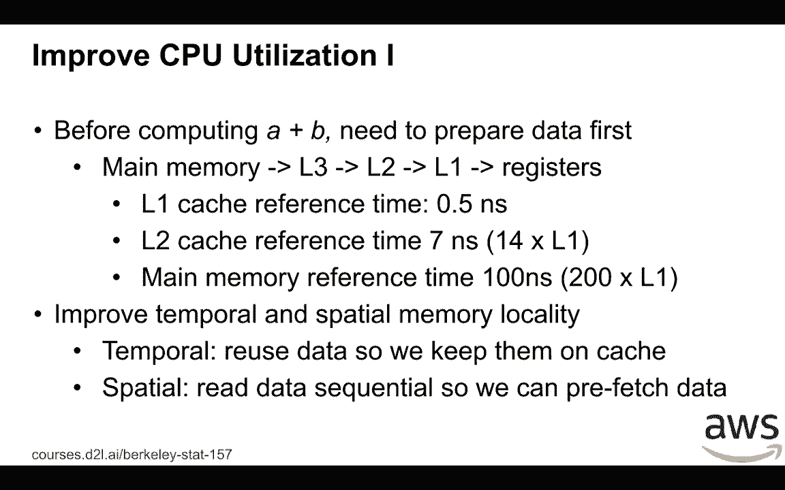
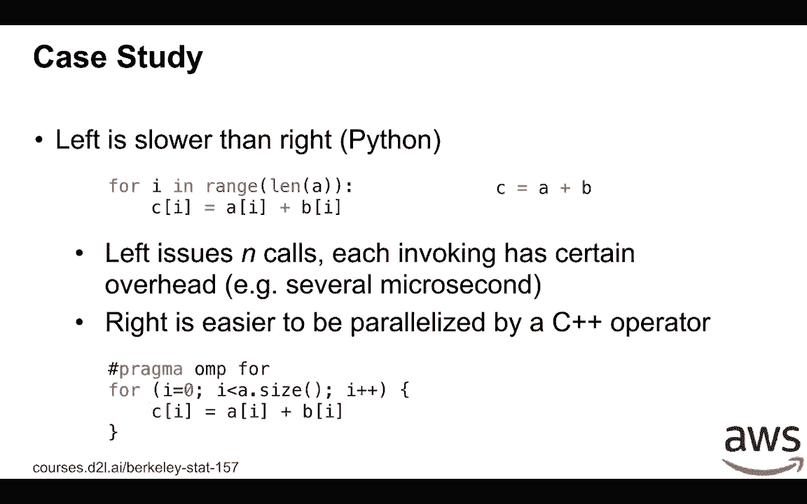
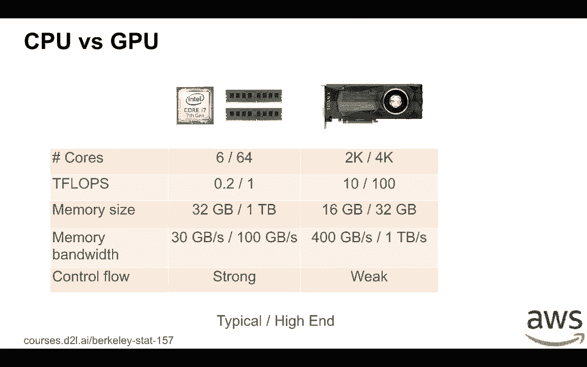
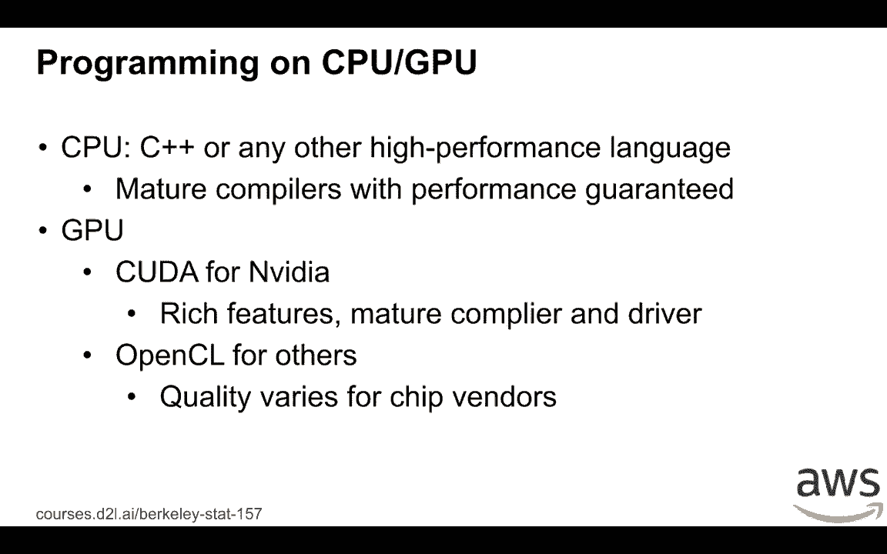

# P37：37. L8_5 Deep Learning Hardware - Python小能 - BV1CB4y1U7P6

 During our office hour， we get a few questions about， "Well， I have a GPU on the laptop。

 why I cannot use it？"， So maybe it's a good idea to talk about mobile hardware and what kind of hardware for deep。 learning and how to get fully utilization from this hardware。

 So let's start with the GPU machine you can get by your own。 You can buy a reasonable Intel CPU as i7， it gives you 0。15 TFLOPS。 You can put a reasonable number of 32GB TDL4 memories for your machine and most importantly。 you can buy a media GPU here。 Here we are using a media tetraX。 This is a recent GPU two years ago。

 it gives you 12 TFLOPS and 16GB memory。 You can see that it gives almost a 10 times more TFLOPS which is the computational power。 can point the CPU you have。

 Let's dive deeper into the CPU。 So this is the chip area of the Intel i7 CPU。 You can see that on the right hand， on the left hand， there's a large area called Intel。 processor graphics。 It's actually a GPU， it's integrated a GPU for this place but this GPU is pretty weak。 and has less memory， we usually don't use that for training deep learning。 But yes。

 we can do it for inference， that's a different topic we may not cover today。 So on the right hand。 you can see that the blue area， we have four GPU cores。 This is a physical CPU cores。 And between them， there's a shared last level cache， it's called L3 cache。 Then within each physical CPU， we have 64GB L1 cache and 256GB L3 cache。

 The shared last level cache or called L3 cache is 8MB。 Under the blue area on the right and on the top， this is the interface to memory memory。 Here we have 30GB per second to the memory。 Now this is the design of the CPU。 now let's talk about how to fully utilize the CPUs。 So for example。

 we're going to compute A+B both A are just the scalars on the CPU。 We need to do a bunch of work before we actually do the computation。 Assume both A and B are on the main memory。 Then we move both A and B into the register on the CPU before computation。 The usual way we move the data， we first move A and B into L3 cache， then to L2 to L1 and。

 then to registers。 Access the data in L1 cache pretty fast。 It's almost as fast as your computation。 but to access data in L2 cache， it's nearly， slower， it's 14 times slower than access for L1。 Access the memory is even slower， it's 200 times slower than comparing to access L1。 Then one trick to improve the CPU performance is that we want to move data as less as possible。

 So we can call it called memory locality， usually there's two kinds of memory locality， one。 score temporal， one score spatial。 For temporal， which means we can reuse data later from now on so that we don't need to。 remove the data out from cache。 For spatial， which means if we use data in a particular location at memory。 the next time， we can use the data nearby memory so that CPU can prefetch data for me。

 So let's make a case study here。 So soon we have a matrix and matrix is stored in a row major。 which means each element in， a row is stored in a sequential way and then row by row here。 So in this situation accessing a column is usually much slower than accessing a row。 The reason is because every time CPU reads 64 bytes， it's called cache line。

 So then to read one value， we actually read a bunch of other values in the nearby position。 So then for each row， we maybe only need a few cache lines read instead of read one by one。 Also see if you can smartly try to reduce to read the next cache line ahead when it even。 don't know if you can use it or not。 So that we can pipeline the data read and data processing so to reduce the access the。

 read performs。 By effect， if you can access by callers because we don't know how long the row it is。 the， CPU can both cache line and the CPU cannot predict where the second element is。 So then here we need to make a full request and every time we make a request with the data。 ready compute and do another request。 So it's how to pipeline all this read and the computations。

 That's why reading a call is slower here。 The second way to improve is that the modus read。 So we saw that the i7 has four calls。 But server CPU has more calls。 For example。 the largest p3 we have four physics CPUs there and 33 physical cores in total。 So to fully utilize the resources we need using at least 33 threads。

 Then to use modus read is called parallelization。 That is we can run things in parallel。 One trick here is that Intel can't tell you something called hyper-threading。 Which means if you check the CPU info in your system， it may tell you， "OK， I have 8 cores。"。 Actually you have only 4 physical cores and the other version is just to virtualize the， cores。

 So if you only have 4 physical cores using a thread， maybe it doesn't have too much。 Because each core only has a shared same register。 So the registers。 because it's computational intensive， the two threads on the same physical。 cores we are fired for these registers。 So that is if you're using modus read for Intel CPUs and you can optimize for dense computations。

 you only want to use the number of threads equals to the physical cores。 So let's do another case study here on the homework。 We show that if I can compute a+b both a and b are vector， it's much easier。 It's much faster to just write c equals to a+b instead of writing a Python loop that。

 is using iterator over the length of a and do 1。1。 The results both。 Firstly the left-hand code makes a course。 Every time it's in working the back end。 you need to pass the Python virtual machines to， do the computation and every core you have a certain amount of overhead。 But on the right hand， we only have a single time and then we have only single overhead。

 On the other hand， the right hand is much easier to be parallelized by writing a c++ operator。 For example， in c++ to use the modus read， I just want to hint before the for loop that。 is causing using openMP to automatically parallelize the code。 And because every time read i's element of a and b and write to the i's element of c。

 they are independent to each other。 So here we can run things in parallel。 So we mentioned two tricks to improve the CPU performance once but memory locality， the。 other things for parallelization。 Let's look at GPU。

 So this is the chip area kind of the CPU diagram for NVIDIA 10X we mentioned before。 It's pretty different to CPU here that every green dot is actual core。 And for Titan X we have over 2000 cores。 Every core is much smaller compared to CPU core。 So it have very good asmestic units but doesn't have so many control flows。

 So we can only do simple arithmetic operations。 And it have a shared L2 cache， a 3 megabyte。 It's pretty smaller compared to the CPU caches we have。 But differently it has on GPU memory。 The memory bandwidth is pretty large。 It's 480 gigabyte memory bandwidth into the memory and thus GPU。

 So given this different architecture， improving the GPU utilization is similar to GPU but also。 different。 Firstly we need to use thousands of threads every time instead of tens threads。 Which means each workload we push into the GPU should be large enough。 For example if we gonna sum a vector of tens of 100 at most we can use 100 threads。

 To use a thousand threads at least we need the vector to behave thousands of elements。 on the vector。 Similar thing for matrix-mature multiplication if we got a 10x10 matrix then well nothing。 you can do。 You need at least have hundreds by hundreds matrix size。 On the other hand GPU have less cache architecture and much smaller cache size。

 Which means memory locality is more important for GPUs。 Because GPU each course much smaller GPU doesn't have control flows supported well。 Which means we cannot have web serving system running on GPU because they have a lot of。 control flows and if the network itself have too much control flows it maybe doesn't run。

 efficiently on GPUs。 Then because GPU is so many different kinds of GPUs here CPU is same but different model。 gives you almost a similar performance。 So we have a simple guideline for you to buy GPUs。 So the x axis is the GFLOPS。 This is a computational power of a GPU and the y axis is the price。 From Wikipedia it's not actually pretty accurate。 So we put a bunch of GPUs there and there's two kinds of blue cycles and the red cycles。

 The blue one is the line series media GPUs。 And the red one is the newer one called 10 series but the latest one is called 20。 It's even higher we didn't have that here yet。 So what you can see that within a series the computational power is almost linear to。

 the price。 So which means it's a good thing because if I have more budget you can buy more power。 for GPUs。 And almost like that's linear。 But the new series is much better than the other one。 Almost like given the same price the 10 series can get two times more computational power。 than the 9 series。 So which means for a media GPUs you want to buy new models。

 And even within the 10 series you can see that 1080 Ti is even given the same price。 It gives even higher computation power because 1080 Ti is a newer model on this theory。 So a quick summary here is that while you want to buy a new model and depending on the budget。 you have you can try then you can get the calling computation power from the GPU。

 So let's do a simple comparison for CPU and over GPUs。 And we show two kinds of configuration here on the right hand。 On the left hand is the typical way you can use a typical CPU or GPU you can get on the。 right hand is a high end。 So for CPUs the number of courses range from 6 to 64。

 For GPUs it is much higher from 2000 to 4000。 But accordingly the TFLOPs from CPUs can be from 0。2 to 1 but for GPUs you should return， to 100 times higher。 But the memory size for CPU could be much higher up to 1TB but for GPUs you only get 32GB at。 most currently。 So which means we want to be very careful about GPU memory utilizations。

 The memory bandwidth for CPUs may be smaller up to 100GB but for GPUs because the computation。 power is so strong we should use much higher memory bandwidths for from 400GB to 1TB。 For control flows CPU is pretty strong， it is designed for that but GPUs only for simple。 mass computations is pretty weak。

 We should we already see that on the first slide how CPU memory and GPU connected。 Now we can see that CPU connected memory with 32GB bandwidth and GPU has its own memory。 is pretty fast。 But the tricky thing here is that GPU connected to CPU you should buy PCIe and the latest PCIe。 we have is give you at most 16GB per second bandwidth。

 Which means you don't want to copy frequently data， you don't want to copy data frequently。 between GPU and CPUs because the bandwidth is an imitation。 So copy data out from GPU need a little bit synchronization which give you another overhead。 So that is if you try to run a new network you want to if you have a GPU you want to put。

 a workload into GPU as much as possible to avoid copy data frequently from GPU to CPU。

 That will destroy your performance。 Well we only talk about Intel CPU and Nvidia GPUs but there are more CPU and GPUs。 For example for CPUs we have MD CPUs and H at mobile phones a popular choice is ARM。 For GPUs it is desktop server GPU so we have MD GPUs as well and Intel GPUs we already showed。 that on the first slide。 On the H on mobile phones we have a bunch of GPU vendors， ARM。

 Qualcomm and a bunch of。

 others。 Well programming on CPU and GPUs are a little bit different。 For CPU almost as similar to each other we can use C++ or any other high performance， language。 And no matter what CPU you have we usually have a mature compilers which can give you。 performance guaranteed。 But for GPU it is a little bit different。

 On VDA GPUs we show you the CUDA to program。 It is embedded in the C interface。 It has a lot of features and the compilers mature the Java quality is good which means。 you usually can get very good performance for MDDA GPUs。 For other GPUs one choice we can use OpenCL similar to CUDA but it is widely available。

 to a bunch of GPUs。 The tricky thing here is that for different GPU vendors the quality varies。 Sometimes we sometimes that a GPU you don't have so much driver so much good quality driver。 which means no matter how good the program you run it may be run slower。 And also it doesn't have the full tool to a chain to support all the deep running frameworks。

 which means running deep running workload on GPUs instead of besides a VDA GPU sometimes， harder。 But people are getting better and better to fix it。

 [BLANK_AUDIO]。