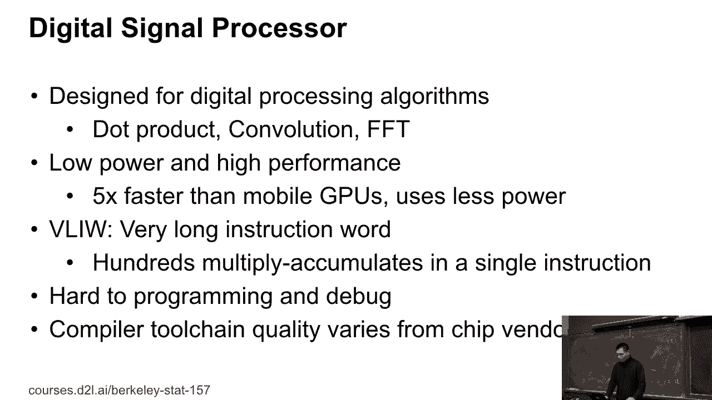
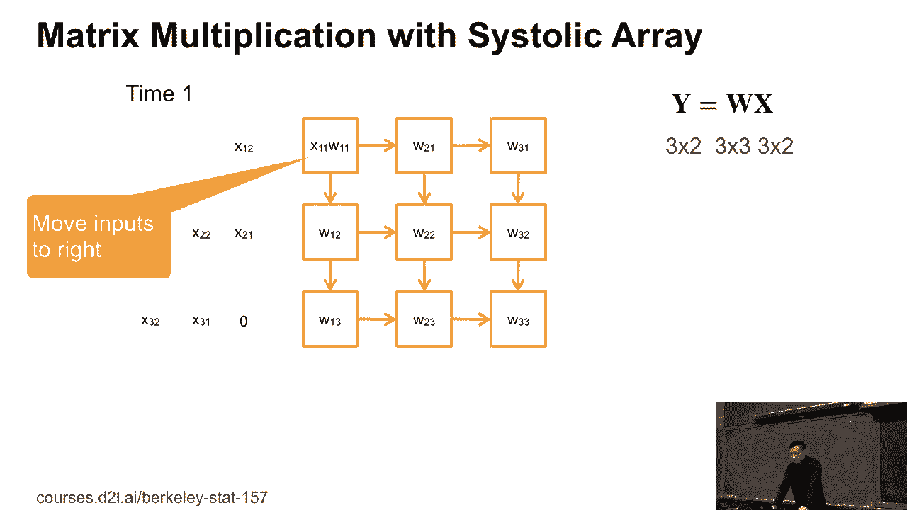
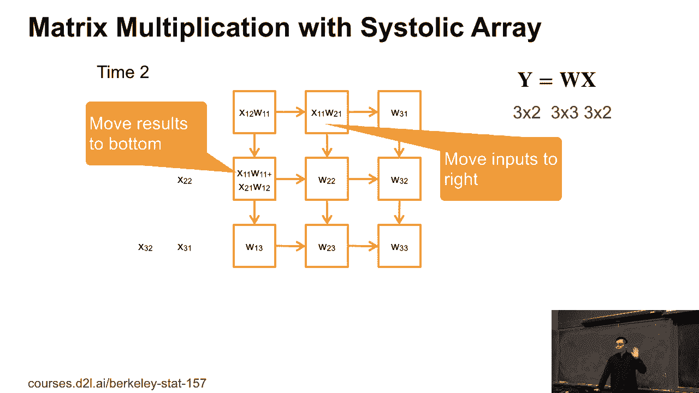
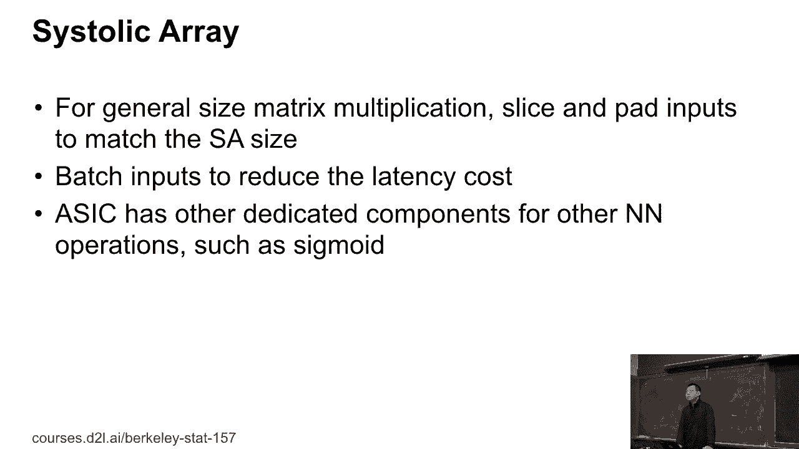
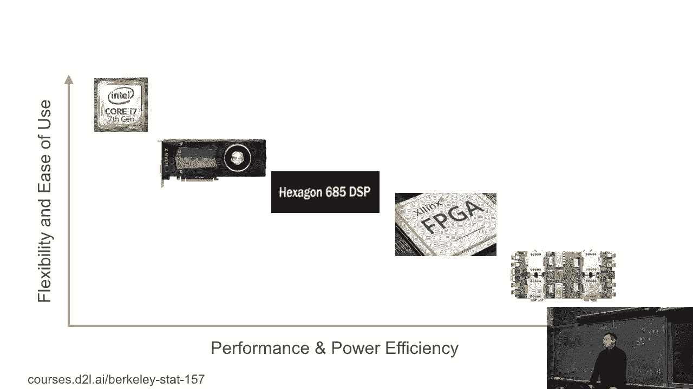

# P38：38. L8_6 高级深度学习硬件 - Python小能 - BV1CB4y1U7P6

还有更多硬件。

所以我们提到，除了CPU和GPU，还有更多硬件。例如，这里是高通的SLAP Dragon 845芯片。你可能在你的安卓手机上找到这个芯片。你可以看看这个芯片，上面有多个组件。在右上角，这是一个GPU。接近右下角，这是一个CPU。在GPU和CPU之间，有一个叫做ISP的东西。

这被称为图像信号处理（Image Signal Processing）。在ISP的左侧，有一个叫做DSP的东西。这是数字信号处理（Digital Signal Processing）。你可以看到DSP和ISP都占用了大量的芯片区域。实际上，它们非常强大，我们可以用于深度规划。例如，DSP是数字信号处理器，专门用于数字处理算法。

例如，我们可以高效地进行矩阵点乘、卷积、快速傅里叶变换（FFT）。前两个与深度规划密切相关。DSP的设计目的是有时它的精度表现要高得多。它的性能可能是GPU的五倍，甚至更多。

其中一个优点是它消耗的功率较少，这意味着如果你在手机上运行某些任务，你不希望手机变得过热。所以你需要节省电力，这意味着如果你在DSP上运行深度规划算法，而不是使用GPU或CPU，你就能在电池模式下运行更多的任务。

这架构的飞跃，架构被称为非常长指令字（VLIW）。在CPU上，对于每条指令，你可能只能计算几十次浮点乘法。但在DSP上，对于每条指令，你可以计算大量的浮点乘法。所以，实际上即使是低频率，DSP的性能也能超过CPU。

但是，DSP可能比CPU强大10倍。优点就是如此。缺点是，DSP的编程相对较难，尤其是在编程和调试方面，尤其是编译工具链的质量，实际上各个手机芯片厂商的质量也各不相同。这是一个缺点。

好的，DSP的优点是，它通常比GPU更快，并且更节能。缺点是，它们的编程较为复杂。如果你不熟悉DSP的工作方式，调试和进程的操作会很困难。此外，还要根据不同的芯片厂商来决定。 

工具链的质量各异。还有一种叫做FPGA的东西，你可能以前听说过。它与DSP和我们常用的程序有很大不同。FPGA拥有大量可编程逻辑块，我们可以重新配置这些逻辑块之间的不同交互。所以通常来说，

在CPU和GPU上，我们编写程序，并在上面执行。但FPGA则不同。你编写一个程序来描述硬件的外观。在编译过程中，你实际上是在改变FPGA，使其能够枚举你可能使用的硬件。所以每次编译，可能需要几个小时，甚至几天。然后，一旦编译完成，

你就可以获得新的硬件，并在其上运行你的程序。所以，你可以使用一种叫做VHDL或Verilog的硬件描述语言来完成这项工作。你需要学习很多东西。你有时听到的FPGA，其实能提供比通用硬件更高的效率。因为你可以仅仅配置硬件。

这个设计是针对你的应用定制的。你可以去除那些你不需要的部分。所以你可以获得更高的效率。但再说一次，它并不是非常常见的。比如2HM或某些病毒质量问题。所以有时候你会遇到非常好的编译器，你可以很快完成编译；而有时候编译过程会非常慢。而且编译可能需要几个小时。

这非常难以调试。

另一个芯片叫做AI-6或AIA芯片。你可能以前听说过。这个话题在深度学习领域相当困难。因此，每个主要公司，像英特尔、Qualcomm，都会做芯片设计，或者IT公司像Google、Facebook和Amazon，也都在打造自己的AI芯片。在这些公司中，Google的TPU是最早且最成功的一款。

所以，Google TPU能够匹配高端、即时TPU的性能，这意味着它们可以提供100 TFLOPS的浮点运算能力。但这里有一个问题，如果你购买一个高端、即时TPU，可能需要花费约$10,000。但是如果你自己生产一个TPU，成本可能只有$500。这是20倍的差距。所以这是一个主要的优势。因此，Google部署TPU的原因就在于此。

人们可以使用TPU进行研究。实际上，大多数Google的研究人员，如果你阅读相关论文，会发现很多研究是基于TPU，而不是TPUs。TPU的核心叫做心脏阵列。

所以，我们不能对“心脏阵列”做一个非常简短的介绍，也不能直接展示为什么TPU适合深度学习。心脏阵列是一种……你有一个处理单元（PE）的阵列。每个PE，你可以认为它可以进行浮点运算。你可以进行乘法运算。

这是一个简化版。接下来是“心脏阵列”，我们将处理单元（PE）排列成一个二维网格，并通过行和列连接。此外，我们还配有输入缓冲区和输出缓冲区。可以看出，这个设计相当简单。你可以配置行数和列数。

你可以配置输入和输出缓冲区的大小。然后，这个设计是为了矩阵乘法运算而设计的。我们来举个例子。

我们将计算 y 等于 w 乘以 x。W 是一个 3x3 的矩阵，x 是一个 3x2 的矩阵。所以 y，依然，我们知道 y 是一个 3x2 的矩阵。那么我们要做什么呢？在计算之前，我们将 w 的每个元素放入单独的 PE 中。我们在这里对齐 w。同时，我们也以特定的形状对齐 x 到输入缓冲区中。这就是数据配对阶段。

在时间点一，我们做的是将输入缓冲区向左移动一步。这样你可以看到 x1。x1，1 现在位于左上角的 PE。所以根据输入，PE 进行权重 w1 和输入 x1 的乘法运算。因为其他两行全是零，所以没有发生任何事情。现在，时间点二。

时间点二，我们做两件事。首先，我们将输入进一步向左移动一步。这样你可以看到 x1，1 现在位于第二列，第一列是 x1，2，第二行是 x2，x2，1。所以我们将输入再向左移动一步。我们在这里做的第二件事是，我们将结果从 PE 移动到底部。

所以你可以看到 x1，1 乘以 w1，1。这是我们在之前的时间点得到的左上角 PE 结果。现在我们将其移动到底部。所以有两件事：一，二，左移；一，二，向下移动。

输入向左移，结果向下移。时间点二，类似的事情。我们进一步将输入向左移动。所以 x1，1 现在位于第三列。我们在时间点一得到的结果，x1，1 乘以 w1，1，已经位于第三行。同样地，我们也将其他结果移至左边和底部。

我们继续进行。现在我们需要将底部的 PE 输出这些结果。它实际上等于 1，1。或者说是 y1，1。所以如果我们再做一次，就会得到另一个结果，y1，2，y2，1。然后继续，继续，直到时间点七，我们实际上得到了所有的 y 结果。所以这里是一个示例，展示了我们如何首先将权重放入 PEs，并根据不同的输入进行计算。

我们可以计算一个 y。这就是 systoptical ray 的工作原理。假设通常在深度学习中，w 是权重矩阵或卷积核，我们将在下周介绍。然后我们放入不同的 x，通常我们可以计算 x。x 的行数通常代表样本数量。

你拥有的可能会非常长，但效率较低。

systoptical rays 通常具有非常高的效率。一般来说，如果我们要进行一般尺寸的矩阵乘法，取决于 ray 的大小，我们只需要填充零并将矩阵切成固定大小，然后将数据相应地放入 systoptical ray 中。我们现在看到的是 3x3 矩阵，延迟为 7。

这意味着如果你有很多输入，可以批量处理，那么我们就能减少延迟。所以，systoptical ray 实际上有很好的吞吐量。现在这只适用于矩阵乘法，如果你想做其他事情，比如 sigmoid，你也需要专门的芯片来处理。问题。

使用系统光学射线也有一些好处，适用于稀疏代数？但并不多。很遗憾，如果你做稀疏计算——比如AI-6做稀疏处理。对于稀疏计算，通常人们不太关心性能，他们更关心功耗。如果我知道这个输入是零，我就不想获取数据，我可以跳过计算。

这节省了大量功耗。目前，我们没有硬件，没有这些功能。稀疏计算芯片通常与密集型芯片的性能相似，但它可以将功耗降低大约10倍，这对于像h设备这样的设备来说非常受欢迎。好的，还有其他问题吗？还有其他问题吗？

这是对所有硬件的简要介绍。

你有。所以我们可以将其分类，X轴表示性能，左侧是功耗最高的，右侧是功耗较低的，慢速的则在左侧。Y轴表示灵活性，如何使用它进行编程，如何调试，以及如何部署。我们可以看到，CPU是最容易使用的。

所以，Nomad支持Intel CPU、MD CPU、ARM CPU，几乎可以编写相同的编译器来进行编译。每个程序在GPU上运行类似。GPU比CPU更快，但编程会更难。你需要为媒体GPU运行CUDA。对于MD和Intel的GPU来说，难度更大，需要使用OpenCL。而DSP通常只用于手机。

对于小型设备，比如ACOL，小型家庭，DSP的效率可以高于手机GPU，但仍低于视频桌面GPU。但与更难编程的FPGA相比，你需要准确了解我们使用的架构。你需要了解大量硬件知识。ACK，我们在这里提到的ACK仍然处于早期阶段。

这项工作专门致力于一些算法，而不是所有算法。你需要知道有些地方出了问题，然后你需要真正了解发生了什么。但是，我们认为可能在接下来的一年中，会有很多ACK的进展。Nomad已经在云端，Nomad也已经在手机上。我们无法看到在接下来的一年中会有很多ACK的进展。

所以，如果你要进行深度学习架构或任何无线领域的研究，你可能需要考虑理解ACK。如果你想进入工业界，将深度学习模型部署到硬件中，你可能会考虑，使用DSP，可能不会考虑FPGA，也可能会考虑ACK。

好的。
