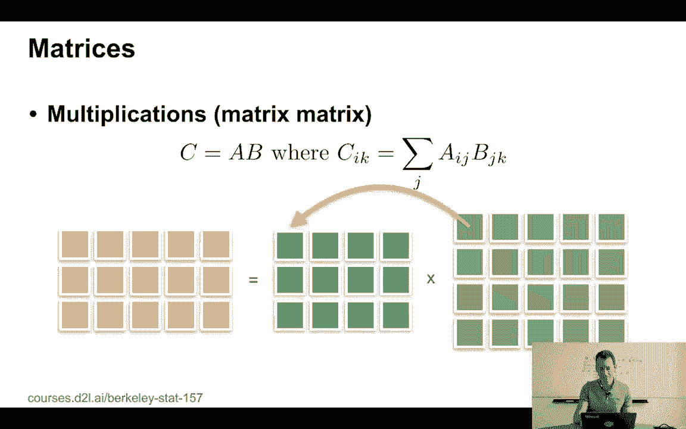
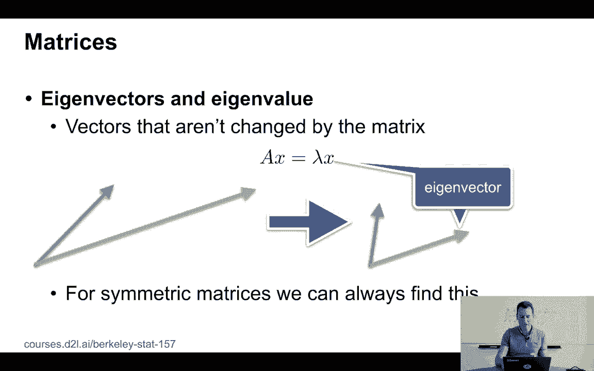

# P4：4. L1_4 线性代数 - Python小能 - BV1CB4y1U7P6

当我们想要进行深度学习时，第一个需要覆盖的工具是线性代数。嗯，原因很简单，因为深度学习中需要的大量工具，都涉及大量的计算。而线性代数非常擅长表示这些计算。它也非常擅长表示我们将要使用的许多函数。

所以我们需要开始了。现在，这显然不能替代一堂正规的线性代数课程。但我们会尽量覆盖你至少需要的所有基本知识，剩下的可能会通过实践来学习。所以让我们从一些非常简单的东西开始。首先是标量。标量是我们都知道的东西。

你可以用它们做简单的事情。你可以加它们。你可以乘它们。你可以计算像正弦或余弦这样的函数。你还可以做类似的事情，嗯，a 的长度是多少？如果 a 大于零，就是 a，否则是负 a。所以它就是绝对值。这做了几件很不错的事。

它满足三角不等式。所以 a 加 b 的范数小于等于 a 的范数加 b 的范数。而 a 乘以 b 的绝对值就是 a 的绝对值乘以 b 的绝对值。这里没有什么特别的惊讶。现在，让我们来看向量。再一次，我可以做非常简单的事情。我可以加它们。所以 c 是 a 加 b。在这种情况下，我有 ci 是 ai 加 bi。

我也可以将 alpha 和 b 相乘。在这种情况下，你已经注意到，我并不是在乘 a 和 b。我所做的是，我基本上是逐坐标地将 b 的每个元素与系数 alpha 相乘，从而得到 ci。我也可以做类似 a 的符号这样的事情，在这种情况下，我只是逐元素地应用它。现在。

有趣的是，在度量长度时，嗯，你知道。我有一点自由度。但我们最常做的事情可能就是将向量 a 的长度定义为它的欧几里得长度。所以对 i 从 1 到 m 求和，ai 的平方然后开根号。我的意思是，对于二维，这是一个毕达哥拉斯定理。一般来说，嗯。

这就是你如何定义长度，对吧？现在，链接或范数作为数学家所称的一个非常有用的概念是，a 的范数大于或等于 0 对所有 a 都成立。而且 a 加 b 的范数小于等于 a 的范数加上 b 的范数。所以这就是我们的三角不等式。进一步来说，如果我用 b 来缩放 a，那么我得到的是。

你知道，a 的绝对值乘以 b 的长度。为什么是 a 的绝对值？嗯，因为否则我可能会得到一个负数。现在，我们刚才看的范数不是唯一的。还有很多其他的。例如，想象一下你在曼哈顿，你想从第二大道第五街到第四大道第十街。

嗯，你基本上必须沿着大街走，你必须沿着街道走。你不能斜着走，除非有一个废弃的街区或者你穿过一个建筑工地。但通常情况下，你基本上只能选择东西走向或者南北走向。因此，距离实际上是街道上的距离加上大街上的距离。

这也是为什么这种定义的距离有时被称为曼哈顿距离。长话短说，它基本上是系数间距离的绝对值之和。换句话说，它也是L1距离。现在，如果你看图的话，好吧，向量加法。假设我们将蓝色和橙色的向量相加，那么我们得到的是绿色向量。

你所做的就是将一个向量与另一个向量拼接在一起，然后你得到一个组合了它们的对角线向量。同样，缩放向量很容易，所以我可以，例如，设C的一半等于α乘B。我的操作就是将原始向量拉长。现在，为什么数学家喜欢这样做？因为这本质上是他们写“所有做”并行的方法。

现在，后者也是音乐，因为这正是GPU擅长的领域。它也很容易编写代码。因此，这有时被称为一种平行化事物的简单方式。当我们的GPU能够高效地并行工作时，我们都喜欢这样，这也是为什么人们喜欢用图形或者像我们很快将看到的矩阵来表示事物的原因。

一个相当重要的属性是点积。点积是系数间乘积的和。换句话说，A转置B是I从1到n的AI BI之和。现在我们称两个向量正交。如果A转置B等于零。那么你可能会问，嗯，这有特别之处吗？是的。事实上，事实证明，如果我们有两个向量，它们都与第三个向量正交。

所以它们的线性组合也正交。那么，让我们在白板上快速证明这一点。

我们有向量，假设是A、B，其中A转置C等于零，B转置C等于零。那么当然，α乘A加β乘B转置C，嗯，这不过是α乘A转置C加β乘B转置C。我们已经知道这一项为零，那一项也是零。所以这当然等于零。

所以我们刚刚证明了这两个向量的任何线性组合也必须与C正交。这种线性特性是非常便利的，我们将在未来加以利用。现在，矩阵做的事情非常相似。比如说，我可以将它们加在一起。我可以将它们相乘。事实证明，矩阵也形成了一个向量空间。从这个意义上讲。

它们与之前的没什么太大区别。我可以，你知道，按元素相加它们。你可以整体缩放它们。你可以逐点应用像正弦和余弦这样的操作。但我也能够对它们做其他事情。也就是说。

我可以对它们进行乘法运算，这实际上是所有魔法发生的地方。现在，泛函分析进一步将这一概念扩展，从有限维度的对象，到无限维度的对象。所以这通常会复杂一些。这里的所有目的就是，假设我们在任何地方遇到向量。

你可以将其替换为一个函数。无论我们遇到矩阵，都可以将其替换为线性算子。大多数定理在无限维空间中也以类似的方式工作，唯一的不同是，嗯，你可能会有无限个项的求和。这增加了一些数学上的复杂性。很多有趣的事情会发生。

你可以证明很多激动人心的新定理，证明变得更复杂了。但直觉基本上是一样的。有一点需要注意，当我们对矩阵应用函数时，我们是按元素来应用的。在某些情况下，数学家们可能实际上意味着我们将函数作为整体应用于矩阵。

比如，你可能会有类似于矩阵指数的东西。即对某个矩阵取指数，当然，你知道，这就是单位矩阵加上，矩阵加上矩阵的平方乘以一半，再加上，矩阵的三次方乘以六分之一，依此类推，类似于尾级展开，但我们在这里不做这个。

所以假设对矩阵的正弦或余弦的定义是最简单、最基础的，除非我们明确指出其他情况。

现在，乘法，你可以做非常简单的事情。例如，你可以将一个矩阵乘以一个向量。它所做的，仅仅是，进行矩阵与向量之间的内积，矩阵的第一列和向量的内积，矩阵的第二列和向量的内积，依此类推。因此。

如果我有一个三行四列的矩阵与一个四维向量相乘，我会得到一个三维向量。换句话说，C 等于 A 乘以 B。所以在这种情况下，我得到，C_i 等于，求和 j，aij B_j。好的。实际上，这意味着那些矩阵会有效地扭曲空间。

它们对一组向量执行剪切变换，得到一些新的向量。

现在，我可以做这些乘法，不仅仅是矩阵与向量之间的乘法，也可以是矩阵对之间的乘法。例如，如果我不只拥有一个单独的向量，而是像之前绿色例子中的那样。

但如果我有多个这样的矩阵，我就将它们的结果堆叠起来。这样，如果我把一个3×4的矩阵乘以一个4×5的矩阵，那么我得到的是一个3×5的矩阵。很不意外地，我得到的C_i_k现在是对j求和的aij B_jk。

范数在这种情况下是非常有用的。范数是以这样的方式定义的，以确保不等式成立。如果我有C等于a乘以b，那么不等式必须成立，即C的范数必须小于等于a的范数乘以b的范数。现在，具体取决于你如何定义C和B上的范数。

你会得到不同的范数定义。而其中一种更常见的定义是，如果你假设C和B满足欧几里得范数，即L2范数，那么a的范数有时也被称为该矩阵的最大特征值。现在，这确实可能会把你带入一个深不见底的洞，而且这是一片美丽的泛函分析和算子理论领域。我强烈建议你去参加相关的课程。

如果你对这些内容感兴趣，为了本课程的目的，我们只关心两件事。第一是最大特征值，我们稍后会讨论。另一件事就是对矩阵中所有条目的平方求和。换句话说，我把矩阵当作向量来处理，只是通过对矩阵进行处理。

将其展开为一个长向量并对所有项求和。这也被称为弗罗贝尼乌斯范数。

好的。现在，我简要提到了一下特征向量和特征值。嗯，特征向量是那些不会被矩阵改变的向量。所以我得到的基本上是A乘以X等于lambda乘以X，当然这在一般情况下不成立，但对于特征向量，矩阵所做的只是让它变长或变短。

它实际上不会改变方向。现在，对于对称矩阵，我总是可以找到矩阵的完全分解。一般情况下，这并不成立。所以就是这样。

现在，对称矩阵和特殊矩阵，除此之外，嗯，让我们快速看看它们的样子。左边是一个完全通用的矩阵。矩阵是对称的，如果aij等于aji。换句话说，如果我翻转条目，我得到的就是相同的东西。中间的矩阵实际上做到了这一点，如果你看颜色，它们代表的是数值条目。

你可以看到，我可以将矩阵沿主对角线翻转，然后得到相同的矩阵。如果我有一个反对称矩阵，即aij等于-aji，那么，好吧。我试着用右边的矩阵来说明这一点。由于很难用图形表示负数或相反的符号。

我只是改变了边框颜色和颜色的颜色。蓝色和蓝白色部分意味着是彼此的逆，或者说是负数。现在，一个显而易见的结果是 aij 等于 -aji，这意味着反对称矩阵的对角线必须全为零。因为在这种情况下，我有 aii 等于 -aii，这只能通过零来满足。

在这个背景下，最后一点是正定矩阵，它们推广了计算向量长度的概念。记住，范数平方在等价式中是 x 平方等于 x 转置 x。所以这可以推广到 x 转置 A x 大于等于零。因此，满足这个性质的矩阵 A 对于所有 x 都是半正定矩阵，对于所有非零向量严格满足这个性质的矩阵是正定矩阵。

现在，再说几件事。所以正交矩阵。矩阵的所有行彼此正交。在这种情况下，我们称这个矩阵为正交矩阵。这意味着，如果我对一行和另一行进行内积，比如 uij 和 ukj，这些是不同的行。如果我对所有的 j 进行求和。

所以这就像是这两行的点积，然后我得到 delta ik。换句话说，如果行不匹配则为零，如果行匹配则为一。所以我知道所有的向量都有单位长度。单位长度意味着长度为一。并且它们彼此正交。现在，作为作业。

你可以证明，如果 u u 转置等于一，那么 u 转置 u 也等于一。现在，后者只是将前者写成矩阵形式。特殊矩阵是置换矩阵。所以置换矩阵是 pij 等于一，当且仅当 j 是 i 的置换。pi 是我选择的某些置换。然后这个置换定义了一个矩阵。现在。

为什么我们在深度学习中关心这样的事情？例如，如果我们有一个词的嵌入或其他什么，我们可能会有一些词的 ID，然后我们得到一些映射到我们真正关心的维度。是的，这就是我们关心的原因之一。还有一个快速的作业给你。

尝试证明 p 是正交的。这个矩阵 pij，我刚定义的这个置换矩阵是一个正交矩阵。

最后，为什么我们真的关心它？好吧，这是 Nvidia 的 Turing GPU 的图片。如果你仔细看，你会看到很多重复的模式。你看到那些小单元格，它们本质上是核心。GPU 有很多很多个核心，这意味着它们能够并行同时处理许多操作。

所以在视频处理中，GPU大约有2000个处理单元，AMD的GPU有一些不同的数量。这在某种程度上是一个架构上的选择，决定了你选择多少个处理单元以及它们的强大程度。但基本上可以说，它们能够并行处理许多操作，*同时进行*，这使得你能够高效地执行像矩阵向量乘法这样的任务。好吧。好吧。
