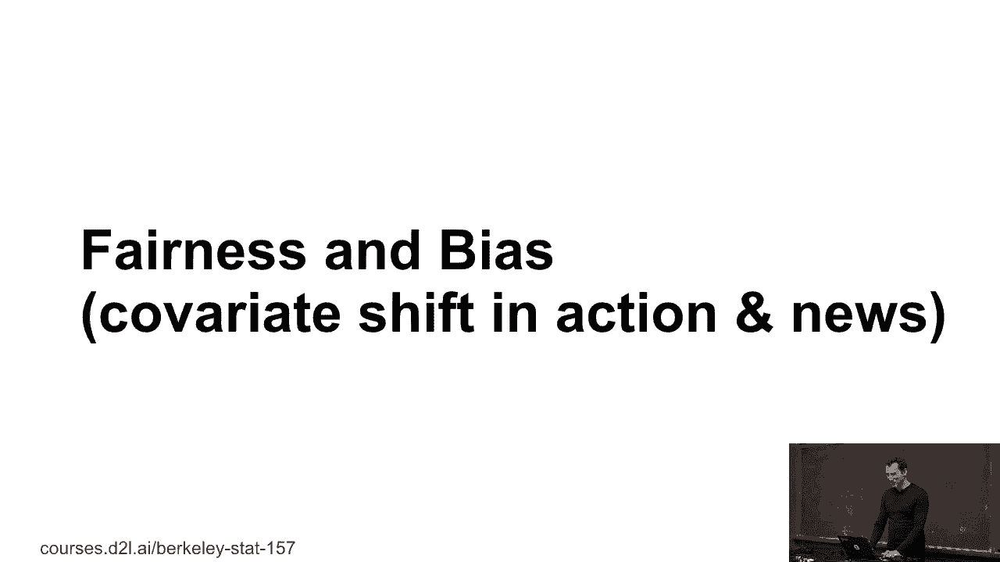
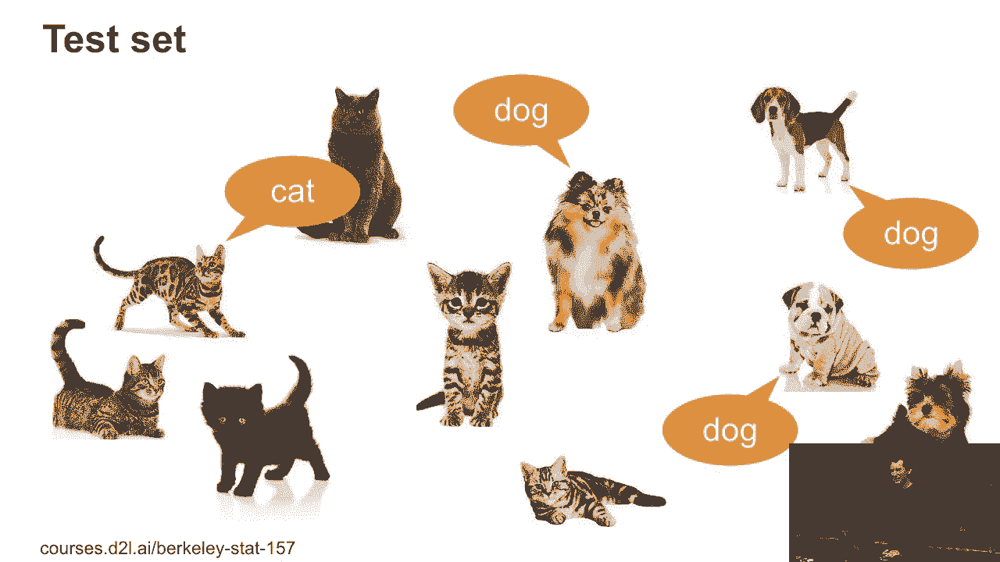

# P41：41. L9_3 协变量偏移和偏差 - Python小能 - BV1CB4y1U7P6

让我们谈谈新闻中的公平性和偏差。你可能听说过一些关于某个姐妹或另一个姐妹极度偏见的事。这与那些邪恶的工程师们有关，例如他们都是白人男性，或者其他什么。但是让我们深入探讨一下其中的数学原理，对吧？假设这是我的训练集。

好吧，没有猫狗的问题。我的测试集怎么样？所以这个测试集里有更多的灰色动物。它还包含了更多的猫，而且它们看起来有点不同。所以在这种情况下，我不指望系统能表现得特别好。

对吧？好，接下来我们总结一下分类器的底线。

在测试时可能表现得更差。那么，究竟发生了什么呢？

让我们来看一个非常简单的问题。这至少有两个原因，为什么它可能表现得更差。假设我有三种可能的观测值，然后我在评估时有两个，在训练时有一个和两个。这些黑色的十字是我的数据点。在这种情况下，一切都进行得很顺利。

我在训练集上训练，得到这个线性函数，并且在评估时表现得非常好。所以我可能会很幸运，对吧？我怎么得到这个结果？这两者之间唯一的区别是现在黑色的十字出现在上面。所以现在，在评估时，我真正应该做的是……嗯，我应该得到像这样的结果。

如果我训练的是类似于评估分布的数据，我可能会得到另一条下降的实线。换句话说，如果我只有很少的数据，在测试时我得到的最佳估算结果可能会有很大不同。

而且比我在训练时得到的结果还要差。这是一个简单的反例。

另一种情况是这样的，对吧？所以这是你的训练数据集。是的，我可以向你保证，右边的图片没有使用过 Photoshop。这只是纯粹的镜头畸变。那么可能发生的情况是，训练数据集可能只包含了非常美丽的面孔，对吧？例如在 IMDB 上。然后，不幸的是……

测试时，情况可能会变得稍微糟糕一些。那么现在我们实际上来用数学方式量化一下这个问题。这里有一个非常简单的小定理，我会给你一点解释，说明发生了什么。我称之为“没有偏差保护定理”。本质上，它告诉你，如果我有一个估算器，平均能够达到某个准确度μ。

一些性能mu，但我在准确度上有一些方差。所以这基本上只是关于期望值分布p的方差，即它在期望损失下的表现如何。然后，我总是能找到其他的分布q，使得在这个q分布下的表现比方差除以均值还要差。

这里有个错别字。底部不应该有方框。

让我赶紧修正一下，因为这个，实在不行。换句话说，方差除以均值是——。

而实际上，这是——。

嗯，这仍然是错误的，因为我需要在其中加上mu。抱歉。是的。是的。所以基本上。事情——我总是能让事情变得更糟。

如果我在数据集上的表现有一定的差异，那实际上意味着，我总是可以选择一些图像、一些面孔、一些人口统计特征，可能是更多的黑猫，可能是更多的灰猫，可能是高个子的狗，可能是矮个子的狗。这样它的表现可能会变得更差。而且你根本无法做任何防范。

你可以把它变成一个优化问题，敬请关注将从中发布的论文。但基本上，没什么保护措施。

那么，为什么我要这么说呢？因为有时候人们在构建机器学习服务时会感到有些惊讶。然后他们发现他们的服务在某些数据上表现得比其他数据好。如果某个子集的数据量不多，性能可能会差异很大。嗯，没错，这基本上就是这里的大警告。

所以，如果你在实践中部署机器学习产品，然后要应对那些不理解数学的人，他们可能会提出抱怨，甚至会推断出，即便是在那些仅仅是纯数学的产品中也会出现问题。好的，关于偏差和协方差校正问题就是这样。

是相关的。
