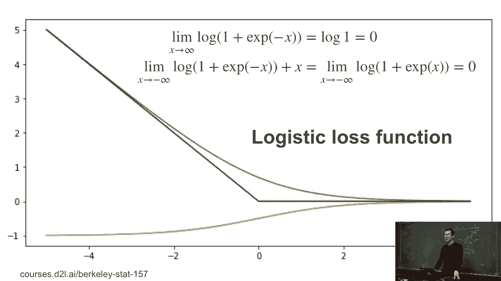
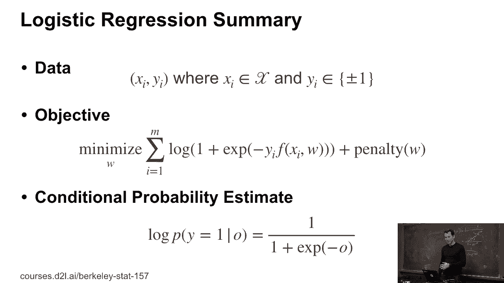

# P42：42. L9_4 Logistic Regression - Python小能 - BV1CB4y1U7P6

 Okay， so now let's see how we can actually fix this。 So for that。 I need to introduce something called logistic regression。 which is actually a special case of something that we've already done before when we looked at multi-class。 So remember multi-class classification。 So this is a slide from like two weeks ago。

 where we basically said， well， we want to have calibrated probabilities。 So you use sum over all the classes， OY， E to the OY， sum over E to the OY。 And that quantity。 the softmax， is a proper probability distribution， sums up to one， everything's well behaved。 And the negative log likelihood then would be something like， looks like the type of。

 persisted sum over the E to the OY minus OY。 So that's nice。 Now what if we only have two classes？

 Well actually， if we only have two classes， as you， I guess， discovered， you have shift invariance。 So you can add a constant to all the outputs， and they get the same probabilities。 OK。 so let's say I have classes 1 and minus 1。 So P of Y equals 1 given O is E to the OY divided by E to the minus O minus 1。 and E to the OY。 Now I could just add a constant to O1 and O minus 1。

 And so I get the same expression as before， but just now with the C's added。 and obviously I can pull those C's out again by just dividing by all of that。 they get the original expression。 In other words， I have shift invariance under additions。 OK。 now this is good if I have that， because I can actually go and maybe simplify things。

 So what I could do is I could set O minus 1 to be 0。 Why would I do that？ Well， why not， right？

 So I get of P of Y equals 1 given O， E to the OY divided by E to the 0， so that's 1。 plus E to the O。 Now I go and divide by E to the O， and I get 1 over 1 plus E to the minus O。 That's the logistic。 Now， the last thing that you may want to do is work out what P of Y equals minus 1 is。 OK， let's actually do this explicitly on the whiteboard。 So P of Y equals minus 1 given O。

 that's 1 minus 1 over 1 plus E to the minus O， right？ Which is 1 plus E to the minus O。 and here I have E to the minus O。 Because I have 1 plus E to the minus O， minus 1。 so that's what I get。 In which case， I can kill this。 So divide by this。 So I get 1 here。 and I get E to the O here， so in other words， I get this。

 Which is now something that I can simplify。 P of Y given O is 1 over 1 plus E to the minus YO。 Which is exactly what we had here。 And that's just a very convenient simplification because now I don't need an ifton else。 condition when I evaluate the loss， but I can just take care of that with a simple multiplication。 And here's the logistic loss function。 So the blue function is the logistic loss。

 That's minus log P of Y given X。 The orange function is the condition， class probability。 That's right， it's not。 It's actually the slope， sorry。 But it also so happens to be the conditional class probability， but will not delve into that。 The interesting thing is， so this orange curve is computed by using luan。

 I didn't actually take the derivative， I just ran autograd。 Because I'm lazy。 and it's just so much easier to have one line of code rather than using my brain。 Now。 the last thing that we probably want is get the asymptotes。 And so if I have the asymptote for X going to infinity。

 this should look extremely familiar from past homework。 So I get， of course， X going to infinity。 E to the minus X goes to 0， so I get a lot of 1， which is 0。 So that just proves that the asymptote for X going to infinity is the constant function 0。 And for X going to minus infinity， I'm going to subtract the function minus X from it。

 So I get log of 1 plus E to the minus X plus X。 Pulling that into the exponential gives me the log of 1 plus E to the X。 Now， again， for X going to minus infinity， the second term vanishes， so I get 0 again。 So with that。 I've just proven that this green function gives me the asymptotes for both plus and minus infinity appropriately。 And yet the orange function is the slope。 Any questions so far？

 So to just quickly wrap this up and don't worry， we'll actually need this quite a bit in what follows。 namely when we look at covariative correction。 So I have some data and conveniently people pick classes 1 and minus 1。 I have some objective， which is log of 1 plus E to the minus this term。

 And actually， I screwed up here。 There needs to be a minus there。 Let me just quickly fix this。 And I might have some penalty on the parameters。

 And the conditional probability is just 1 over 1 plus E to the minus O。 which just happens to also give me the derivative。 This is not a coincidence and has a lot to do with how exponential families work。 If you like that。 take a stats class on exponential families。 There's a lot of really beautiful math that simplifies a lot of things if you just realize that they all follow the same mathematical underpinnings。

