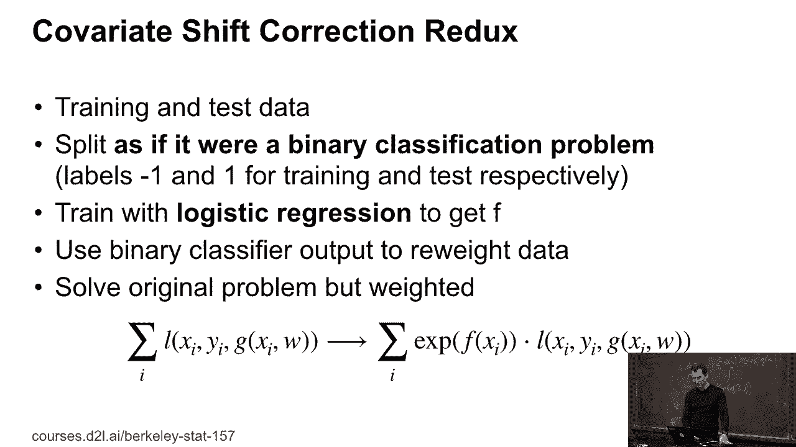

# P43：43. L9_5 协变量偏移校正 - Python小能 - BV1CB4y1U7P6

那么现在我们来谈谈协变量校正。

所以让我们回到之前的情况。记住我们有这个倾向得分。如果我只是有这个函数 DQDP，即两个密度的比率，这个函数 alpha，那么我们就会处于非常有利的状态。我可以用许多非常复杂的统计技术来处理它，这样我就可以轻松地完成工作。

并且使用我之前已经构建的工具。事实上，作为你们作业的一部分，你们将实现一个逻辑回归问题，并且将同时用于协变量校正，随后也会用来解决实际的分类问题。那么让我们选择一个分类器。我将要做的是，我。

并且假设我的训练数据和测试数据的大小相同。我只是挑选了你知道的，训练集的权重为一半，测试集的权重也为一半。只是给训练集类标为 1，给测试集类标为 -1。好吧。这里没什么特别的，只是把所有数据都放在一起了。

现在我的目标是看看，我能不能区分训练集和测试集？

直觉是，如果我无法区分它，那么实际上这两组数据可能来自相同的分布。所以这是一个双样本检验。如果我能区分它，或者至少有一定的概率，那么这可能会告诉我某个观察值的可能性。

来自一个或另一个，我可以用它来加权。因此，使用分类器这一技巧是人们在生成对抗网络（GAN）中也常用的。所以在 GAN 中，他们使用双样本检验，然后调用整个机制来生成看起来像真实数据的假数据。这里我们只是用它来找出我该如何。

重新加权一个数据集，使其看起来像另一个数据集。所以如果你愿意的话，这也是一个 GAN。只不过它不是生成数据，它只是重新加权数据。好的。那么接下来有一些非常优雅的东西。让我们看看条件类概率。也就是条件类概率。

P(y) 等于 1。所以记住我们已经在 P 和 Q 之间进行了等量混合，它只是 P 除以 P 加 Q。所以如果我查看 alpha，即 Q 和 P 之间的比率，那么我所需要做的就是查看对应的条件类概率的比率。所以你取条件类概率对于 -1 和 1 的比率。

1，取比率。实际上，如果你通过代数推导，我们可以在这里进行，我得到的 e 的 f(x) 就是我得到的结果。那么我们来计算一下，好的？

那么让我擦掉一些东西。[BLANK_AUDIO]，所以我们有 1 除以 1 加 e 的 -f 次方。你要用 1 加 e 的 -f 次方来做。这里我们有 e 的 -f 次方，对吧？

所以这就抵消了。而且，当然这个项就变成了 e 的 f，正是黄色框中的方程。所以现在这意味着，与其走一条非常复杂的绕路，通过密度估计和其他一切，我可以直接调用任何现成的分类器，只要它能给我条件的类别概率。

某些东西会给我一个协变量校正器。总结一下，我做的事情是，我一旦有了那些权重，我就拿训练数据，训练这个二分类器。然后现在我有了加权数据，所以，我可以用 e 的 f of xi 来加权我的训练数据，从而解决我真正应该做的问题。

有几件事情可能会出错。有人能告诉我在最后一个方程中看起来有点不对劲的地方吗？好的，大家都明白对某个函数进行指数运算了吗？这些数字可能会很大，对吧？

所以在这里事情可能会出错，f(x) 可能非常大，也可能非常小。如果它非常大，这仅仅意味着它会给该特定观察值分配一个极高的权重。如果它非常小，意味着我们会把起始点丢掉。在这两种情况下，这可能有点过于草率了。

所以解决这个问题的一种方法是，例如你直接对函数 f 进行裁剪。你可以说，看看，如果它大于某个阈值 c 或者小于某个阈值，-c。我要使用这些阈值来代替本应该估计的函数。这限制了单个观察值的影响，使其处于一个相对容易接受的范围内。

但是它还可以确保你永远不会完全丢弃数据，因为它可能仍然有用。当然，这引入了一些偏差，但它可以大大减少方差。好了，有问题吗？是吗？ >> 为什么要等待指数来衡量这个？ >> 哦，好吧。记住我们做过这个对吧？所以我们有这个 alpha 函数。如果我-。

>> Alpha 是指数。 >> 所以那个 alpha 就是指数，嗯，是的，没错。那么让我再写一遍。基本上如果我从 p 中抽样，我就必须计算 alpha of xi，l of xi，yi，f of xi，对吧？

我需要计算类似这样的东西。某些损失，对吧？基本上是这样的。所以没有 alpha 的时候，i 从 1 到 m，这就是你要最小化的东西。现在，如果我有协变量偏移，我需要对那些看起来像是我在测试集上真正关心的观察值进行过度加权，而对那些我不太关心的则进行减权。

现在这个 alpha of xi，嗯，实际上让我重命名一下这里的东西，因为当然，另外的我们有 fs 和 gs 会冲突。记住，这个是我们用来估计的东西。协变量偏移是 e 的 f of xi。你通常会做的是使用类似于裁剪的操作，它基本上会对你这里的任何函数进行裁剪。

它将值从上方裁剪到某个值，再从下方裁剪到另一个值。这样你既不会丢失数据，也不会过度加权。因为当然，这个函数f只是一个估计。所以你真的不应该完全信任它，对吧？它可能是错误的。在这种情况下。

这样会引入很大的方差，从而导致我们在这里得到一个不准确的估计。好吧，实际上有很多更复杂的方法可以处理这个问题，其中之一叫做W-Robos估计法。让我快速写一下。[SOUND]，所以你可以在谷歌搜索W-Robos的保守修正，你会找到一大堆相关的算法。总体而言，W-Robos估计器。

所以通常这是一个非常好的统计技术组合，其中你以两种独立的方式纠正偏差，如果其中任何一种成功，你就算幸运了。好吧，这就是收敛性偏移。

