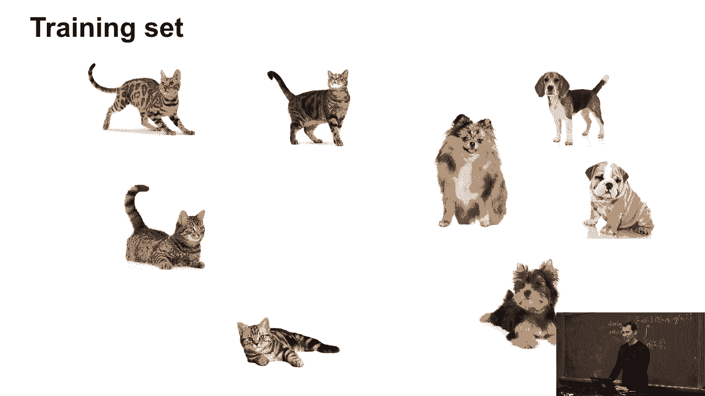
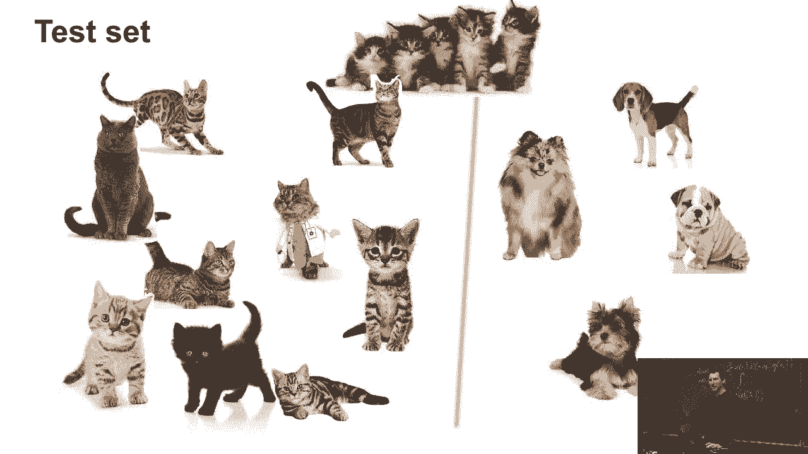
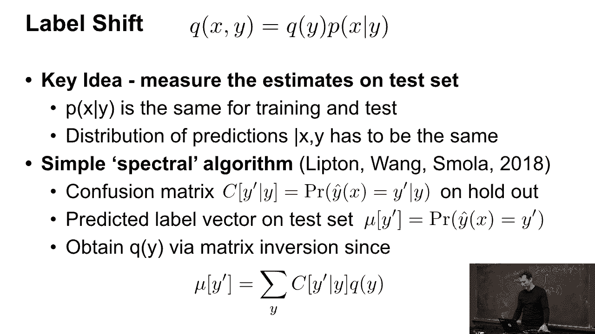

# P44：44. L9_6 标签偏移 - Python小能 - BV1CB4y1U7P6

好的。

那么，让我们看一下标签偏移。标签偏移是这种情况的简化版。假设这是我们的训练集。

而我们的测试集看起来是这样的。结果发现，我们的测试集中有更多的病例，而训练集中较少。这与简单的协变量偏移略有不同，而且实际上这种情况更为常见。

那么，为什么你会做这种事呢？

假设我使用一些医疗诊断工具，并在一些生病的病人身上训练。假设我有大约50%的病人和50%的健康病人，然后我将其应用到实际工作中。假设我有一个乳腺癌测试，训练集是50/50的比例，然后应用到实践中。结果发现，幸运的是，乳腺癌比我原本想象的要少得多。

所以，实际上很少有人真的生病。然后，你需要直观地调整权重，使其得到修正。或者，我可以在流感季节测试，因为流感在这个时候更常见，那么我的测试应该会考虑到这一点。或者，例如，在语音识别中。

这是一个非常常见的情况。假设我构建了一个语音识别器，然后可能在选举前构建，之后进行选举。突然间，有了新的人物、新的话题和讨论。人们还是讲相同的语言，但突然之间他们开始谈论墙壁，而不是医疗保健。

而且人们有一些奇怪的名字和奇怪的发型。所以你的语音识别器——好吧，忘掉发型，剩下的部分，它可能就不太好用了，因为现在你有了不同的分布，翻译出来的内容也不同了。或者你有一个名字很奇怪的电影明星，突然间他变得很流行。

所以，你的语音识别器需要做出调整。否则，你会一直错误地识别。而且，如果你看一下数学上的表现。

你有一个稍微不同的设置。所以，不再假设在给定x的情况下y的概率相同，而是假设在给定y的情况下x的概率相同，但你不再使用y的概率，而是使用q的概率。所以，类似的事情会发生，比如你假设y实际上是x的因果因素。如果流感引起症状，而不是症状引起流感。

然后如果突然之间你有更多的流感，那就发生了。所以现在你需要根据标签的比例重新加权。之前，对于协变量修正，我们是相当幸运的，对吧？意思是我们实际上有现成的数据集。但你现在可能没有现成的测试标签了。

所以，这就很不方便了。你可以做的是，你想要估算——。

你想要衡量的是估算在测试集上的表现。事实证明，所有你需要做的就是假设你的错误混淆矩阵保持不变。这是一个稍微高级的话题。我的意思是，你可以阅读相关的论文。不过背后的代数其实相当简单。

你去查看错误混淆矩阵。然后你基本上看一下训练集上的预测结果。你查看测试集上相应的标签预测。这些不是正确的标签，但它们是预测结果。现在假设在训练集中，我预测10%的人有流感，90%是健康的。在测试集中。

我预测40%是流感，60%是健康。我可以从中推测可能发生了某些事情。现在，如果我使用我的错误混淆矩阵，那么我必须假设它是可逆的。这基本上意味着，如果我有流感，那么，我有多大概率会说我有流感或我健康？然后你可以反转那个矩阵，精确地计算出基于此的概率。

你基本上处于良好状态。所以这实际上只是一个更快的侧面。

不用担心那些细节，但这只是让你知道，除了协方差，还有其他看起来和感觉很相似但其实不完全相同的问题。

是的，当然你尝试了一下，它有效，反正就是这样。

没关系。

