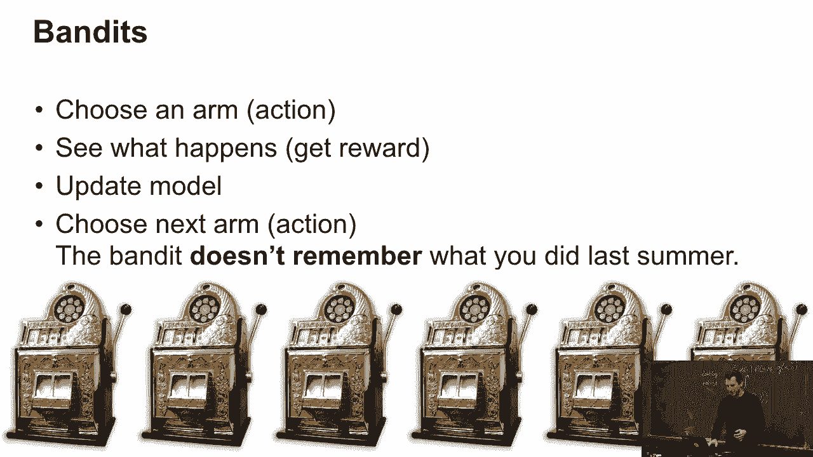
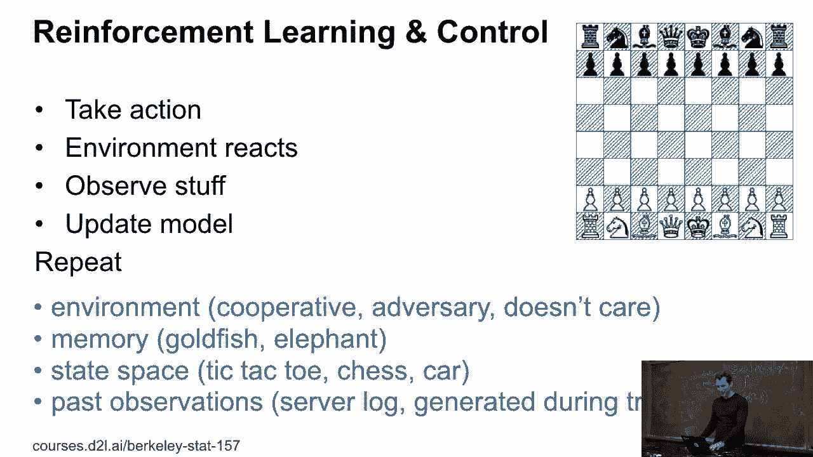
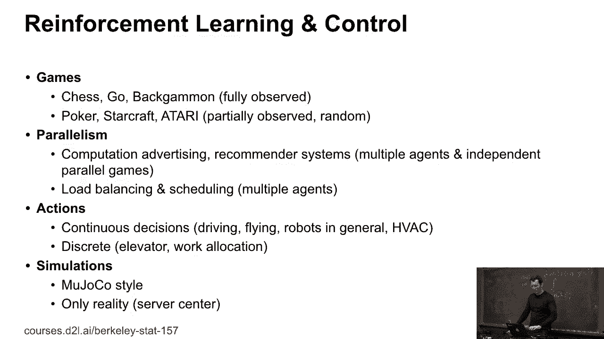

# P46：46. L9_8 非平稳环境 - Python小能 - BV1CB4y1U7P6

所以最后一部分是非平稳环境。当你在部署机器学习系统时，

你可以以不同的方式与环境互动。例如，你可能只有一批数据。这是我们到目前为止几乎做过的方式。我们对这一批数据进行训练，并生成一个分类器。然后我们将其提交到广阔的范围或笔记本上，或者其他任何地方，然后说，“嘿，

这是我的分类器。" 好的。你可能会遇到一种情况，你有一些数据，你预测一个标签，实际上观察到标签后，你更新你的分类器。你一直这样做，一直进行下去。例如，如果你想预测股市，实际上，每天更新你的模型是非常重要的，因为你会看到新的数据。或者例如，

对于作业，我希望当你看到一个新作业并完成它时，你对机器学习的数学模型会继续成长和扩展。这样你会在机器学习者的道路上变得更聪明。现在还有主动学习。在这种情况下，它就像，你知道，你可以提出查询。

你可以提出只针对给定图像的查询，或者你可以生成图像并针对这些图像提出查询。所以相当于你在课堂上提问，毫不奇怪，如果你这样做，至少在机器学习中，你的算法会显著更快地收敛，我可以

我向你保证，如果你在这里提问，你对机器学习所做的数学模型也会收敛得更快。所以提问是很有帮助的。接着是，嗯，带状算法。你选择一个臂，获得一个奖励。你选择另一个臂，可能会有一些上下文。最后是强化学习。

而这实际上是所有这些中最复杂的，因为在这种情况下，你的行为会产生后果。让我们稍微更详细地看一下。

所以在批处理设置中，当你有一些训练数据时，你可以构建一个模型，然后有一些测试数据并部署它。

站起来。在线上，嗯，也许我看到的是四，我已经拿到了我的模型，我看到的是八。我预测是八，我拿到我的模型，CS3，可能我再预测是八，但实际上是三，我拿到我的模型。是的，继续做这个。这实际上是任何有意义的大型场景中更常见的情况。

这是一个正在部署的现实世界问题。例如，如果你在运营广告服务，你应该使用在线更新，因为如果不这样做，你会失去一些收入。

强盗问题，嗯，你在这里有一定程度的探索，对吧？你可以拉动一个臂，看看会发生什么，然后你更新模型，好吧。这是六臂强盗问题，它们是计算机引入之前的老式强盗问题。所以现在，如果你去 Zwegas。

不要假设不同的强盗中的回报以任何方式都在你的控制之下，对吧？

但在老式的情况下，也许有一些机械容差，可能一个比另一个磨损得更严重。所以，实际上，弄清楚该玩哪个强盗变得有趣。好的一点是强盗实际上并不记得你之前做了什么，对吧？

所以你只想找到最好的臂。对此有高效的算法。

然后是有状态系统。所以，如果我有一个有状态的系统，那就取决于他们如何操作这个有状态的系统，对吧？比如这只犀牛，它可能会因为我而感到高兴或不高兴，我可能会生还，也可能不会生还。另一方面，如果我从这个有状态系统中移除记忆，对吧，比如我给那只犀牛打麻醉针。

我可以戳它，做任何事，它也不会在下一个时刻对我不满。所以，这真正意味着强化学习和控制。我采取一个行动，环境作出反应，我观察到一些东西，更新我的模型，然后有很多不同的做法。

所以我可以拥有一个实际上是合作的环境，也可以有一个敌对的环境，比如如果我和你下棋。我在许多情况下拥有一个不在乎的环境。所以，例如，如果我试图控制一个服务器中心并尝试控制 HVAC。

HVAC系统并不是要对我不好，特别恶意，也不试图帮助我。它只是不在乎。它只是对我做的事情做出反应，但它不会对我的成功或失败有任何特别的看法。我可能记忆非常短，或者记忆非常长，对吧。

我的状态空间可能非常简单，或者像在车里那样复杂。然后，我可能有也可能没有访问大量的过去观察数据。例如，我可能有一个目标是改进一个数据库系统，而且我有过去五年的服务器日志。这些日志可能是在考虑部署强化学习之前就已经获得的。

但我仍然想能够使用这个方法。在这种情况下，我有大量的数据。但这可能需要做很多巧妙的事情，使用脱政策和在政策强化学习来处理它。

然后还有其他事情，比如我的系统有多并行，能执行什么样的操作，对吧。所以我可能能够执行离散的操作，比如我把这颗棋子移动到那里，或者我按电梯按钮，或者不按，或者我把电梯送到某个地方。我们也可能有连续的操作，像在 Ujoko 中那样，对吧。

所以你可能见过这些，主要是深度学习中那种虚拟环境中走动的摇摆小人。那就是Ujoko，它们通常会因为移动的优雅程度不同而有所差异。但你也可能会看到一些商业上更为重要的东西，其中涉及现实世界。

举个例子，在Ujoko的模拟中，没有人关心小人跌倒摔断了腿。我重启。如果我在服务器中心运行这个，结果把一排服务器烧坏了，那就意味着我的模拟结束了，对吧。我可能会被解雇。但至少那就是实验的终结。

所以这些事情都非常重要。一旦你进入稍微复杂一些的机器学习环境，这些其实只是表面工作，这只是让你对当你开始在实际中部署这些东西时所需要担心的事情有一点了解。无论是在你的研究中，还是你做实习，或者你做工作，或者其他什么。

你会在乎这些的。好了，今天就讲到这里。

所以我希望我能让你相信，训练和测试是完全不同的事情，它们是有状态的环境，我可以用一堆工具来缓解这个问题，但这并不是完全能解决的。而且，是的，我的意思是，如果你这么做了，之后有人试图构造不愉快的情况，那也没关系，好的，没问题。

你可以找到它们，因为有数学基础可以解释为什么这总是可能发生。好了，今天就到这里，谢谢大家。周四见。

