# P49：49. L10_2 Blocks and Layers - Python小能 - BV1CB4y1U7P6

好的，我们首先来看一下如何构建新的网络。我们已经在前面的讲座中看到如何构建多层感知器。在这里，我们定义一个顺序网络，这是一个容器，并将密集层添加进去。第一个密集层有256个输出，并且它们使用ReLU作为激活函数。

这是密集层的输出，输出维度是10。

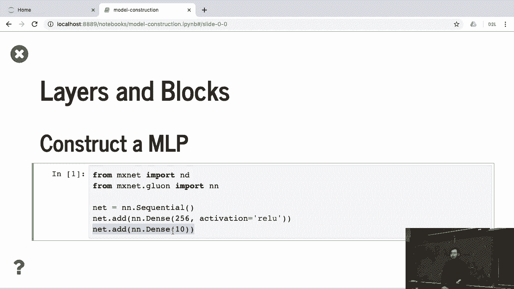

好吗？在前向传播中，我们生成随机变量x。我们这里有两个示例，输入维度是20。每个示例有20个特征。我们为网络初始化参数并输入x，得到输出y。我们可以在这里打印输出。因为最后一个密集层有10个特征，我们将输出到wb2，这代表示例的数量。

或者批处理大小和10。这是网络的特征数量。好吧，这就是我们已经看到的内容。

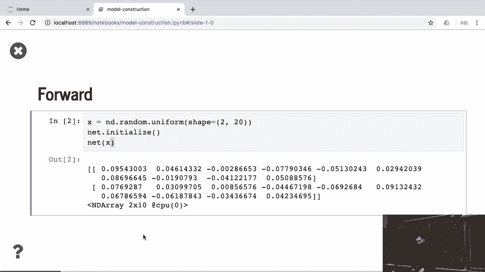

现在让我们重新实现相同的多层感知器，使用用户自定义的块。

如果我之前使用过PyTorch，实际上是非常相似的。让我做一下。那么我们在这里做什么？

我们创建了一个自定义类MLP，它是一个名为block的类的子类。然后这个类有两个函数，一个是`__init__`，另一个是`forward`。`__init__`函数对于代码非常有用。第一个函数我们调用父类的构造函数，即`unblock`，名为unblock初始化。

函数是初始化由Groun使用的数据结构，我们可以，Groun让Haun可以让你正确初始化。

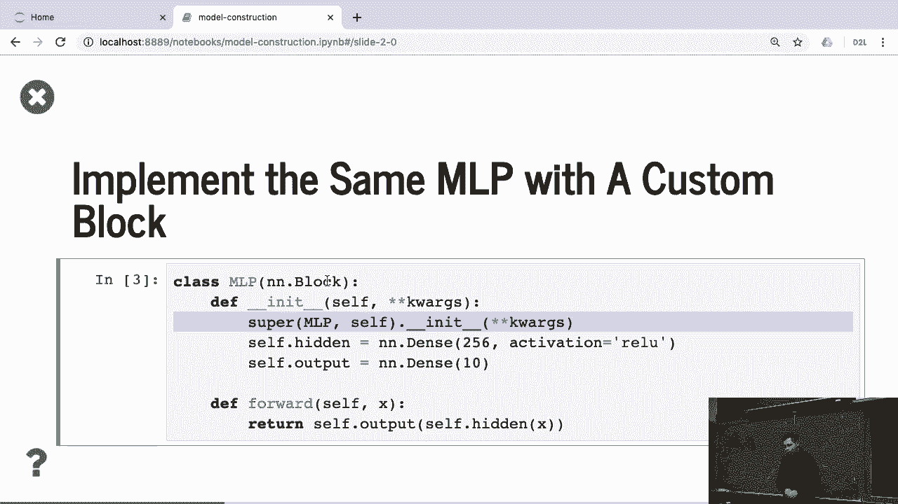

然后，任何函数的主要目的是定义并创建所有这些层，我们可以使用后者。所以在这里，我们创建一个隐藏层，类似于之前的层，并且我们创建另一个。输出层不是一个密集层。因此，第四个函数我们定义如何计算网络。给定输入X，这是未定义的数组，我们首先将其传递给隐藏层以获得。

隐藏层的输出，然后得到输出，再传入最后的密集层。得到输出并返回结果。有两个函数，它们定义了参数。前向函数定义了前向函数。

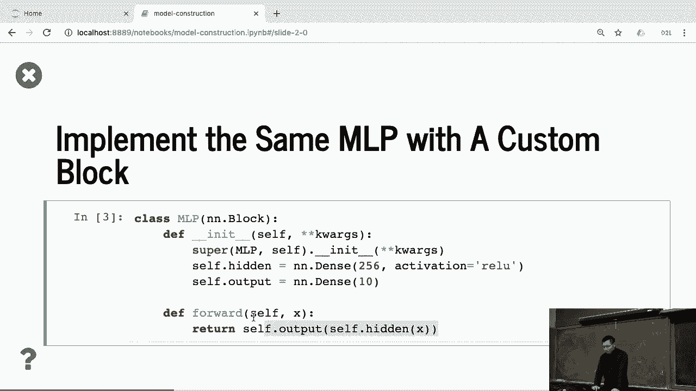

所以使用起来非常相似，我们从MLP创建实例，然后初始化参数并拟合X，我们得到结果。所以这与之前的顺序模型非常相似。如果你运行这个，我们可以运行网络的前向函数。

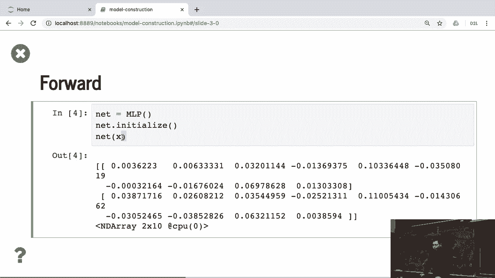

现在使用unblock我们可以实现一个非常类似于之前的un sequential。这里我们称之为my sequential。所以my sequential函数是unblock的一个子类，在初始化时我们没有任何层，我们定义了add函数，每次都可以添加层或block。我们称之为block。那么我们在这里做什么？unblock函数有一个叫charge的东西，它是一个字典，用来存储所有的层。

这些层我们有的。所以对于任何给定的block，它是一个层，也可能是另一个网络，我们假设它有一个名字，是一个字符串名称，我们将这个字符串名称存储在字典中，给定一个字符串名称并将其存储到charger中。那么在forward函数中，我们在这里做什么？

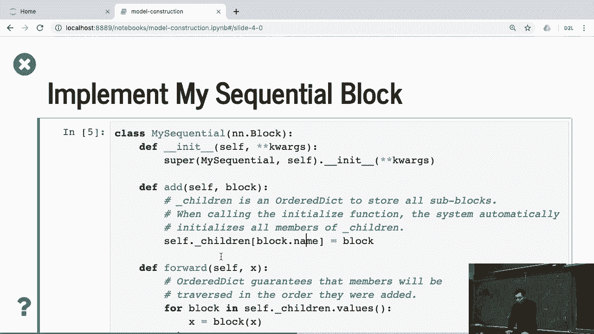

我们遍历整个字典，对于每个block，给定X我们只需评估它，因为子类都是Python中的字典，这意味着遍历顺序将与添加到字典中的顺序相同。所以根据你如何在这里添加每一层，我可以一个一个地调用这些层并得到结果。然后返回X。

所以使用它非常类似于之前的unsequential。

我们首先在这里创建一个实例，然后添加一个隐藏的dense层，添加上层。初始化它并运行forward函数。所以基本上我们使用unblock只是为了重新实现unsequential。

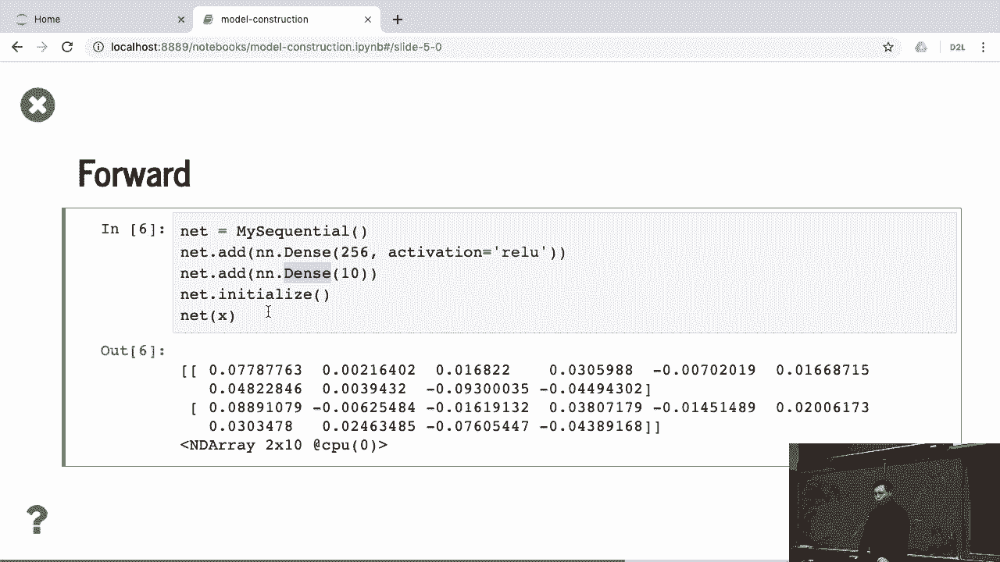

我们不能使用unblock的原因是，它提供了很多灵活性来定义网络。例如，这里我们做一个复杂的MLP，如果我不知道它是否能训练出任何有意义的结果，但我只是想展示你可以在unblock中编写树状代码。所以在函数的最后我做了两件事。首先，我创建了随机变量。

随机参数，但我不想更新这些参数。那么我在这里做什么？unblock有一个父类，我们可以显示父类字母，一个父类来存储参数，我们可以得到一个常量，意味着这些参数将不会被更新。所以它会在训练过程中固定。所以我们不会计算梯度。

然后它是一个名字，我们可以稍后讨论，给定随机均匀分布为20×20。所以这是随机权重。否则像普通的dense层一样。输出是20，红色作为激活函数。现在有趣的事情是在forward函数中。

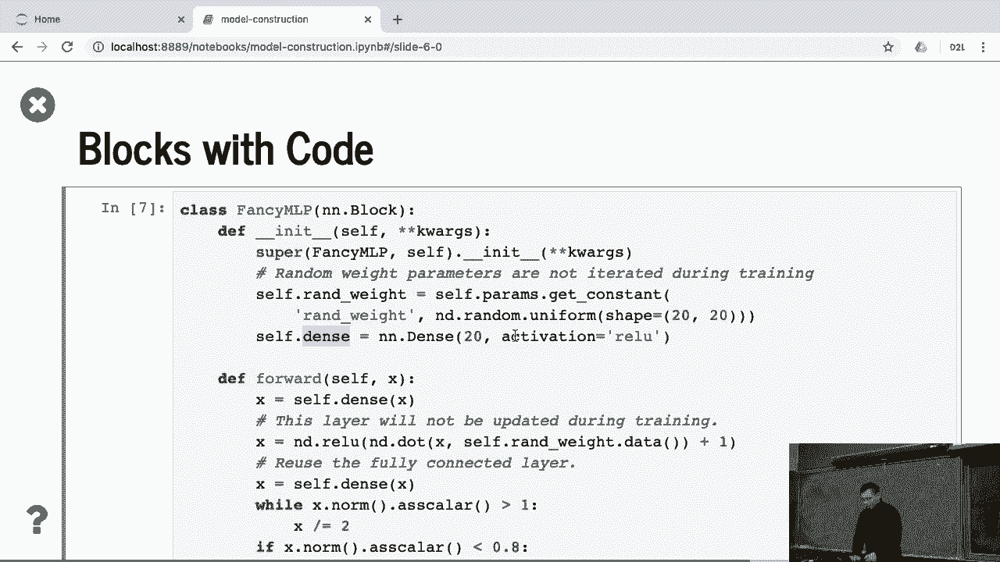

所以给定x，我们首先像往常一样输入到dense层。然后这里是另一个dense层。我们在这里做什么？给定x，我们得到随机权重和点点点数据，然后获取数据和。偏置为1。它只是一个常数，红色的表现会在这里。所以基本上这是一个带有参数的dense层，带有随机参数，我们通常。

之前和一个偏置层。所以我们只是这个密集层。在训练过程中它不会被更新。问题？没有。接下来是另一个有趣的事情。第三层，它只是复用了密集层。这意味着第一层密集层和第三层密集层共享相同的参数。所以当你计算梯度时，我们首先计算相对于第三层的梯度，然后是相对于第一层的梯度，这些梯度会在这两层之间共享。

然后也有一些 y，如果我在这里问条件，y 在这里已经在笔记本中展示了。y 如果大于 1，我就减小它；如果它太小，我就把它乘大一些。

所以这个完整的功能可以在这里编写。对于顺序接口来说，这很难实现。问题？

为什么你现在不想在需要的地方更新脚本？只是为了展示，你可以这么做。有时候如果你做微调，我们可以展示一个字母，表示你从前面获取了一个网络，尝试另一个数据集。我只想尝试几个顶层。我打算固定底层的参数，因为我的数据集太小了，我不打算更新。

不想让网络过拟合。所以我可以固定一大堆层。你还想做多模块训练，拥有一个非常复杂的网络。每个数据集，多个数据集，命令，每个数据集只尝试一部分网络。你可以做很多花哨的事情。通常我们不会这样做。

为什么我们的模块没有携带像容器或训练历史那样的信息？

所以原因是因为块只定义了网络和参数，仅此而已。训练器是我们将在网络中使用的输入，并进行更新。这只是设计决策。块只包含参数和网络的定义。原因是因为如果你做推理，你只会有一个块。你不会有其他的训练器。

然后，华丽的 MLP 和之前类似，你可以创建实例，运行初始化并进行前向传播。

和之前一样。最后，就像我们可以把所有东西混合在一起。所以无论是层，还是自定义模块，或者自定义操作，还是顺序结构，所有这些都是块的子类。所以我们可以把它们全部混合在一起。在这里我们定义了 MLP 而不是 MLP。它有一个顺序网络，两个密集层。

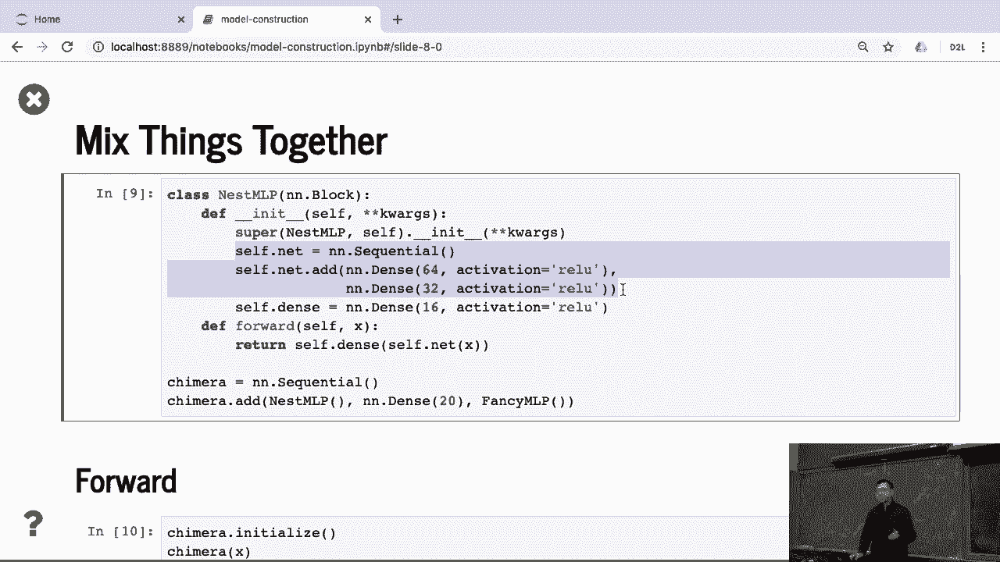

另一个是仅仅是一个密集层。对于前向函数，给定 x，我们将其输入到网络中并传入密集层。所以这个 MLP 包含了非顺序结构，并且也是单一层。然后我们也可以像创建网络一样操作。它是顺序的。我们将最后的 MLP 放入第一个模块，然后在第二个模块中加入另一个密集层。

最后，我们可以初始化另一个华丽的 MLP 作为最后一层。这个 MLP 仍然可以像之前一样初始化并获取 x 来计算结果。

好的，实际上，你可以使用unsequential，它会让你只需要把层次放进去，系统会为你完成所有的工作。但如果你有逻辑，要在前向函数中做很多复杂的操作，实际上，你可以使用unblock来自己实现。而且这样做的好处是你可以轻松调试。

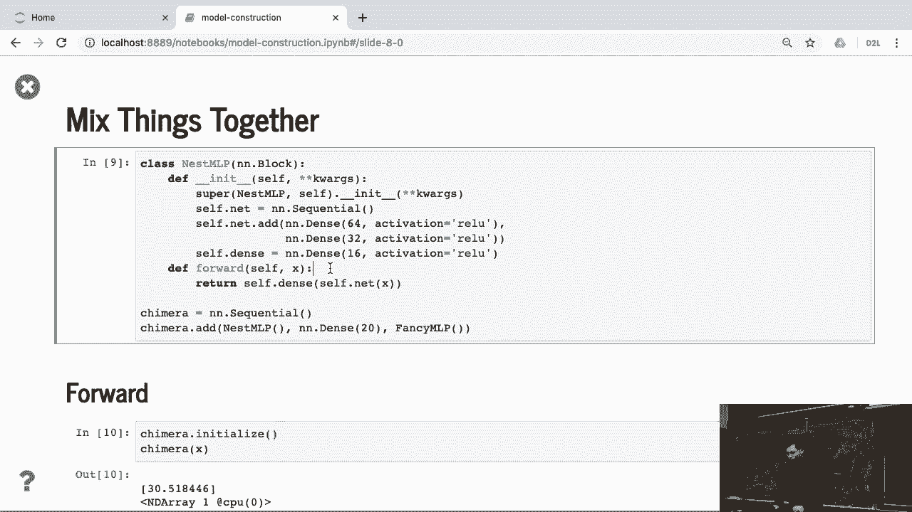

比如说，我可以使用y等于，我想获取内部结果，我可以让self来。

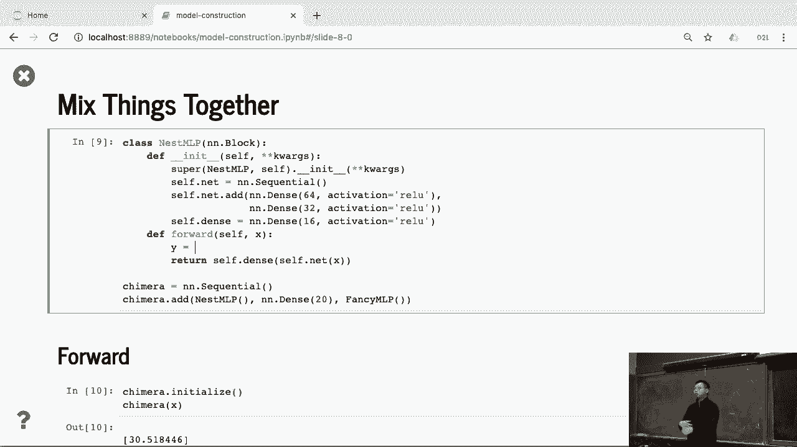

x，然后我可以打印内部结果并返回self dense。所以这意味着你可以调试内部结果。这更灵活，你可以在这里做很多事情。好的。

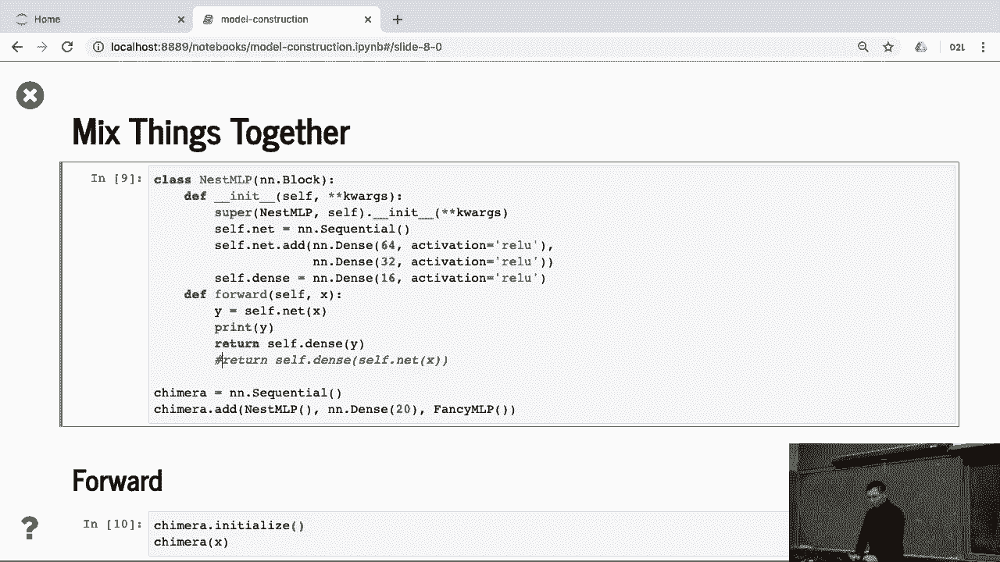

[BLANK_AUDIO]。
