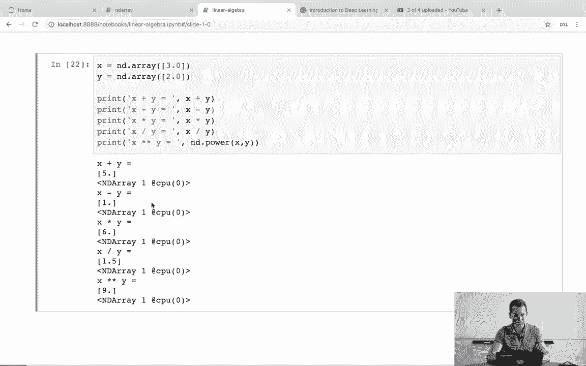
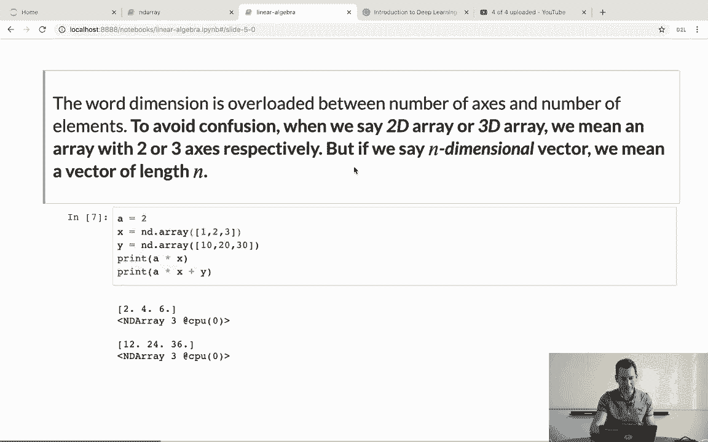
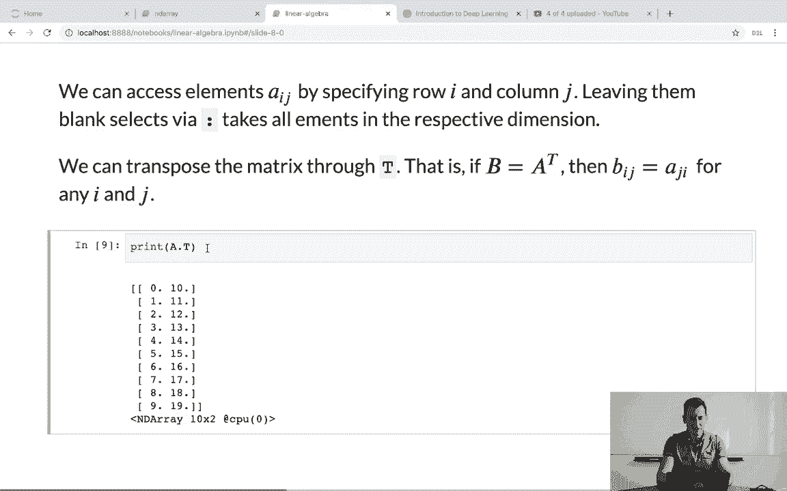
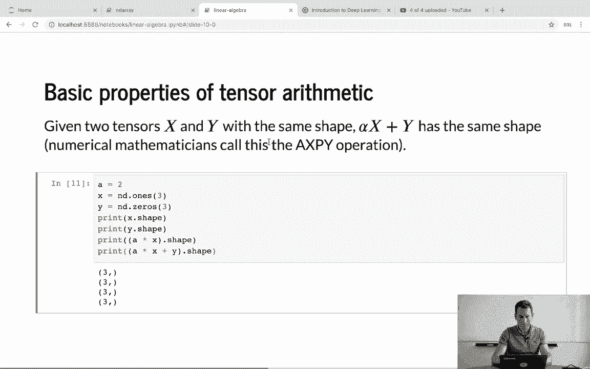
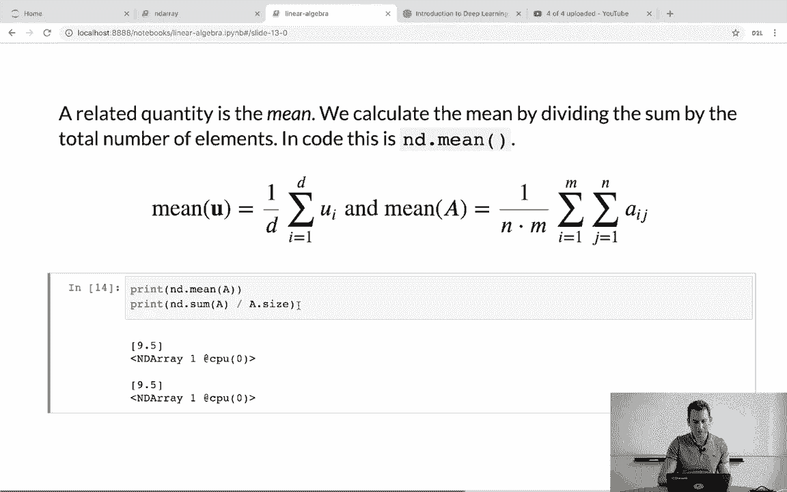
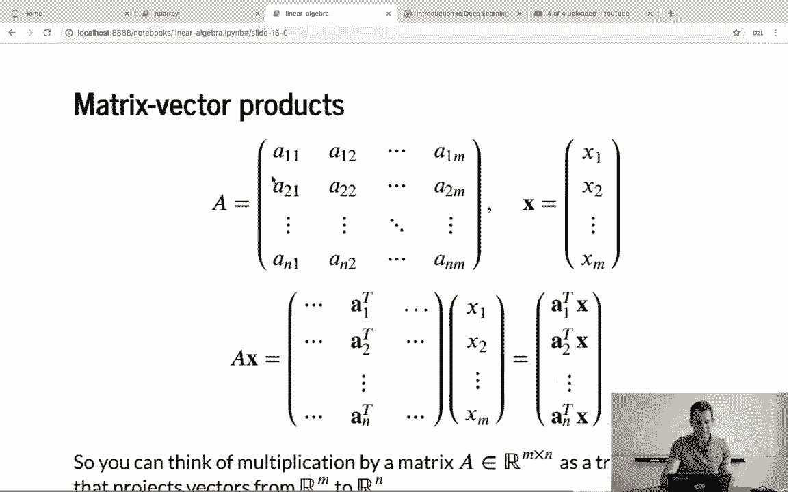
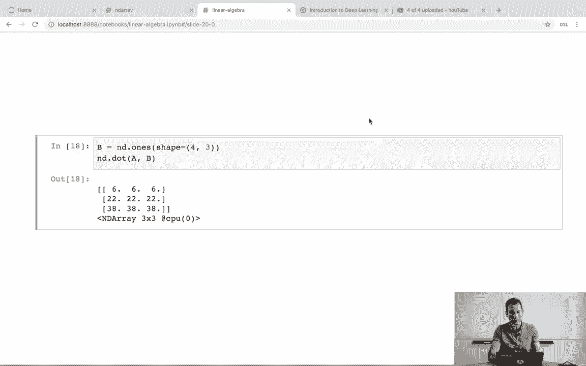
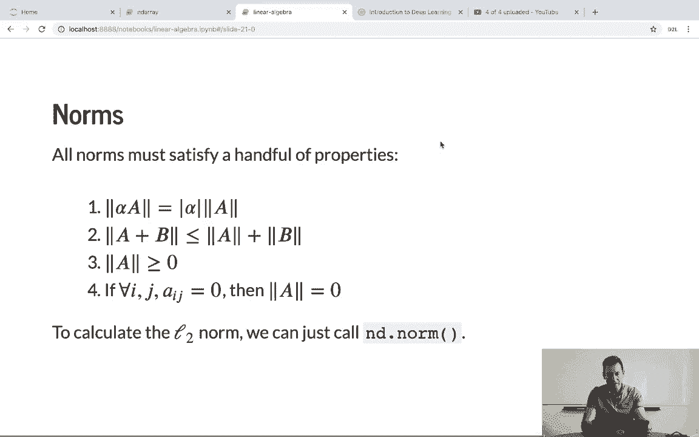

# P5：5. L1_5 线性代数与 Jupyter - Python小能 - BV1CB4y1U7P6

好的，在所有这些理论之后，让我们实际上看看它是如何在实践中工作的。让我们在一些线性代数上玩得开心一点。这些是 Jupyter 笔记本。你可以下载它们，并且按照幻灯片的形式一一演示。你也可以直接查看它们作为笔记本。如果你想以幻灯片的形式查看它们。

你需要使用 reveal 插件。不管怎样，首先我们需要做的就是导入并解数组。也就是 MXNet 的数组数据类型。

所以从 MXNet 中导入并解数组——这就是你所需要做的。好了，现在我们已经做了这些，让我们来实际创建一些最基本的数组。也就是说，我可以直接创建一个包含 3 个元素的数组。如果我这么做，我就可以将它们相加，或者相乘，或者相除。

或者我可以对它们进行指数运算，或者做其他任何操作。我可以将它们相互相减。假设我们这么做。好的，假设打印出 X 减去 Y 等于 X 减去 Y。现在我得到 X 减去 Y，瞧，结果是 1。

所以它的表现完全符合预期。我可以打印它们，或者我可以将它们转换回标量，再回到 Python。现在，如果我这么做，那么我就可以继续在 Python 环境中处理它们。如果你需要这么做，那也没问题。只是有一个警告，这适用于几乎所有的深度学习框架。

一旦你从框架转换到 Python 或反方向转换，你需要至少在一段时间内将控制权交给 Python。现在，Python 在多线程和多任务处理方面尤其糟糕。这导致的结果是，代码可能会在你进行的任何操作上卡住。

也许某些 GPU 在运行 Python 代码时会停止工作。只有到那时，你才能重新开始在框架中进行并行操作。所以不要过于频繁地做这件事，偶尔做一下就好。换句话说，如果你有一个大的 for 循环，里面有很多、很多成千上万次的循环。

你会写出非常低效的代码。所以不要这么做。

现在，向量是，正如你所预期的那样，只是序列，在这种情况下是标量。例如，如果我们想生成一个从 1 到 5，1 到 0 到 4 的向量，我们就使用一个 range。我可以，举例来说，设置不同的步长。这些都可以很容易地调整。但在这里，它是 x 等于 indeed dot a range。就这样。

我可以像 x 的第 3 个元素一样对单个条目进行索引。

它完全按照你预期的方式执行。现在，有一件重要的事情是，你可能想看看向量的维度和形状。例如，一个向量的形状，你可以有一个矩阵。可能是一个2乘3的矩阵。那么那个矩阵的形状将是2和3。但是长度，或者也许是6和1，但长度只是非零项的数量。所以如果我调用x的形状。

它只会告诉我形状。在这种情况下，它是一个具有一个维度的向量，这里有五个元素。

现在，另外一件事是你可以去做乘法。你可以把它们加在一起。顺便说一下，在未来当我们谈论数组与维度时，我们会说如果数组有不同的轴，那么它们具有不同的维度。但如果我们只有一个n维向量，那么我们指的是长度为n的向量。嗯，没错。

记住，你可以把东西加在一起。例如，我们有一个数组1，2，3，另一个数组1，10，20，30。如果我将它们相加或相乘，结果就像我们预期的那样。

现在矩阵只是二维对象。

好的，就是这样。我可以去创建这样的对象。比如说，我可能会创建一个长度为10的向量，或者创建一个长度为20的向量。然后我们将它的形状设置为2和10，然后就得到了这个。非常简单，对吧？

现在你可以看这个的转置。那就是t。如果我有一个10维的单一向量，那么它将只是一个行向量。列向量适当地转置，但否则它就是这样。好吧。

现在张量嘛，我们可以进入三维。假设我们有一个对象，它的大小分别是2，3和4，即2乘3乘4。那么我们得到24。所以如果我创建24个整数，从0到23，然后以这种方式排列它们，我就得到这个三维张量。这并不算太罕见。例如，如果我处理图像，我会得到张量。

因为在图像中，我有宽度和高度，除非图像是黑白的，否则我还有RGB。所以我有三个颜色通道。或者，如果你有一些高端卫星，可能会有多光谱传感器，这样每个像素可能就有一个完整的光谱图。在这种情况下，我不仅仅有RGB的三个维度，可能有20个，30个，甚至100个维度。

现在你可以用它做一些简单的事情，比如创建，你知道的，一系列的1，我可以把它们相加。我可以把它们相乘，记住，这样A是一个标量。 这实际上只是把A中的每个元素乘以1，在名称中，y到8。对吧？

所以这非常直接，维度仍然是相同的。

我可以求和，也可以计算。所以例如，如果我有一个全是1的向量，没错，x全是1，1，1，1，很不意外地，如果我计算x的总和，我得到3。现在，如果我有一个二维或三维的对象，可能我只想在某些维度上求和。在这种情况下，让我们试试看x在A范围内的值，嗯，看看，12。所以如果我这么做，嗯。

所以它仍然会给我66，并且只会做加法。

但现在，如果我想计算沿着行或列的和，看看这里，你会得到行和。基本上，如果选择1，就表示沿维度1求和。如果我选择0，那就会得到其他结果，对吧？所以我可以定义适当的求和方式。

这正是我们之前得到的结果。现在，我可以做一些有趣的事情，比如计算均值。

假设有一个矩阵，那么均值当然就是总和除以条目数。而均值其实没有做什么特别的垂直操作，但在幕后它只是调用总和并除以大小。由于每次都写这个很麻烦，直接这样写看起来更漂亮。

数组会为你处理这一切。

现在，没有点积，生活就不完整了。所以如果我有x和y，我想计算内积，嗯，我可以通过调用`nd.dot`来实现。它实际上做的就是逐点相乘并求和。所以如果我想知道这是什么样子，我可以执行`print x times y`。

我会得到相同的答案，对吧？这是x和yi之间的元素按位相乘后求和，我得到10。这与点积的结果完全相同。

这正是幻灯片上的内容。

现在，点积只是一个非常简单的情况。

矩阵向量积是事情变得更有趣的地方。所以如果我有矩阵向量，那实际上就是x向量与a的相应行之间的内积。

所以如果我将a乘以x，嗯，我会得到这个。并不令人惊讶，因为，嗯。现在，一个重要的警告。如果你习惯了MATLAB，你可能会认为`a times x`意味着a和x的矩阵向量乘法。但情况并非如此。那么在MATLAB表示法中，`a times x`的意思是点积星运算（dot star）。你可能会想知道，嗯。

为什么这个计算能进行呢？因为毕竟，a是一个3x4的矩阵，而x是一个4维向量。那么我怎么能从中得到有意义的结果呢？其实很简单，通过一种叫做广播的技术，你可以重复元素。 

直到你遍历完所有的a的条目为止，x的条目才会被处理。但这是逐点相乘。所以要小心，因为如果你不习惯，这可能会导致很可怕的bug。我们这里遵循的是NumPy的约定，所以如果你熟悉NumPy的话，应该不会感到惊讶。

但如果你是从MATLAB直接过来的，要小心，因为这对初学者来说是一个很常见的bug来源。

好的，矩阵乘法。这正是我们之前做的事情。

现在我们有了两个对象。如果你仔细想想，这实际上就像是在遍历a的所有行和b的所有列，计算它们的内积，并把结果写成表格。

所以这里是nd.dot(a, b)。因为一个是3x4矩阵，另一个是4x3矩阵。所以不出所料，如果我将它们相乘，我得到的是一个3x3的矩阵。

最后是范数。这正是我们之前讨论过的内容。所以它们需要满足训练和等式等条件。如果我们想调用L2范数，我只需调用nd.dot.norm。

所以nd.dot.norm(x)，就这样。如果我想计算L1范数，我可以这样做。我可以调用nd.dot.sum，nd.dot.apps。或者我可以使用不同的幂来调用norm，这样也能得到结果。所以apps是绝对值，正如你已经猜到的那样，nd.dot.sum是我们之前做的操作。这也就是我们所做的。

简要介绍了线性代数。在MXNet中，我们将在接下来的课程中详细讨论数据类型。但是目前，希望这能让你对如何在MXNet中进行线性代数有个基本的了解，看到它其实是相当直接并不复杂的。好的，非常感谢。

