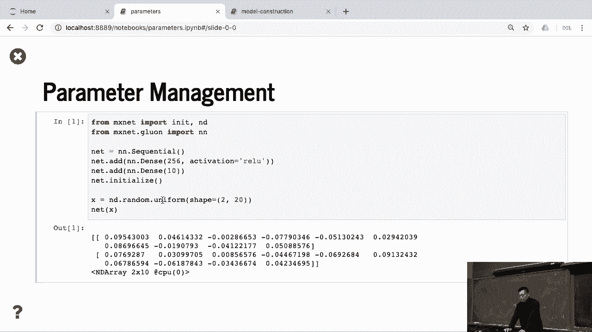
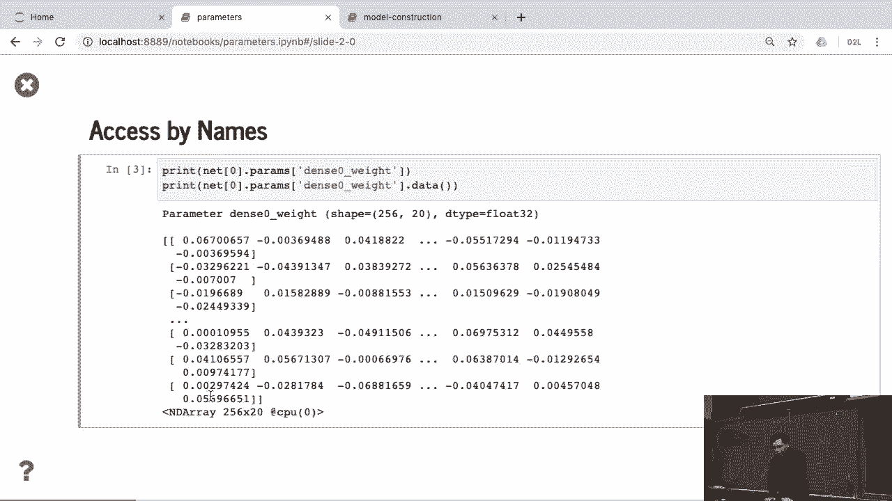
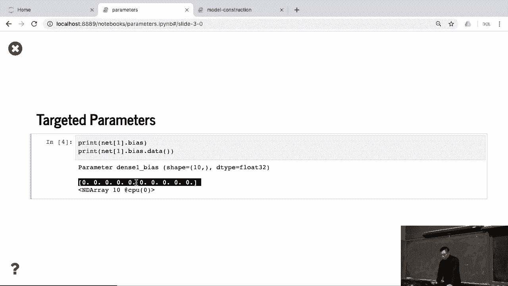
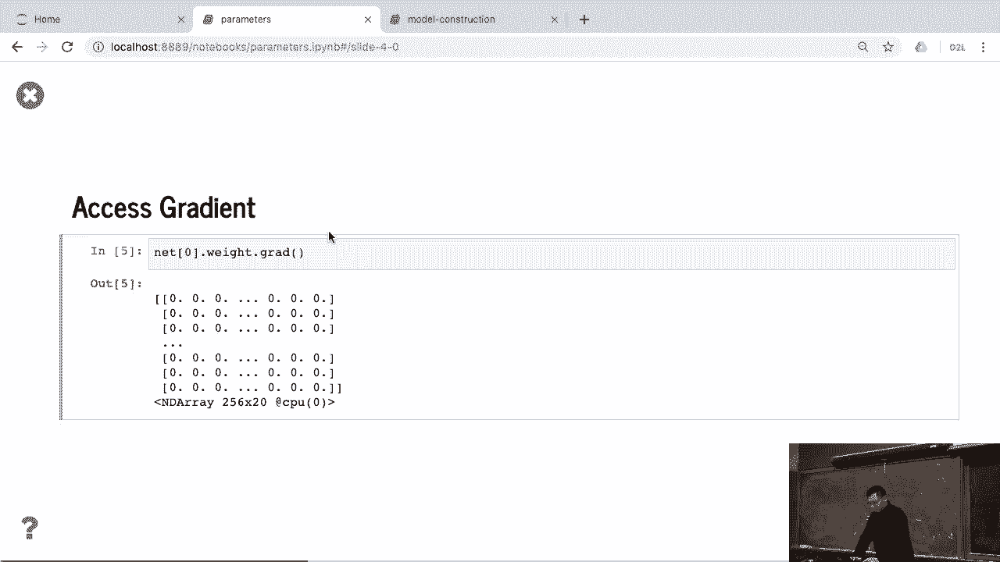
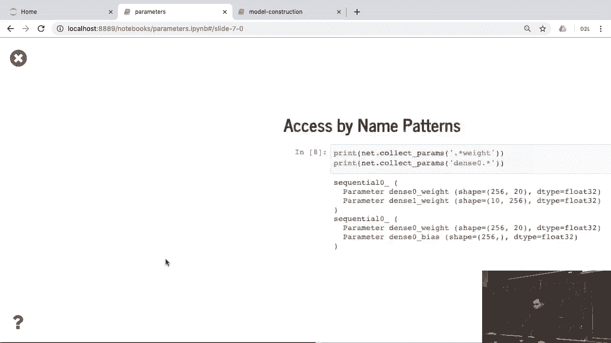
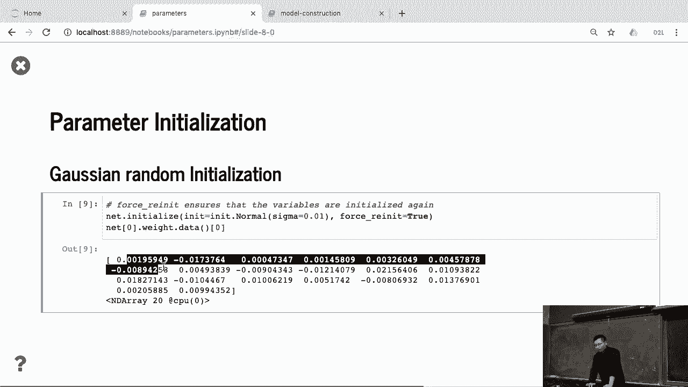
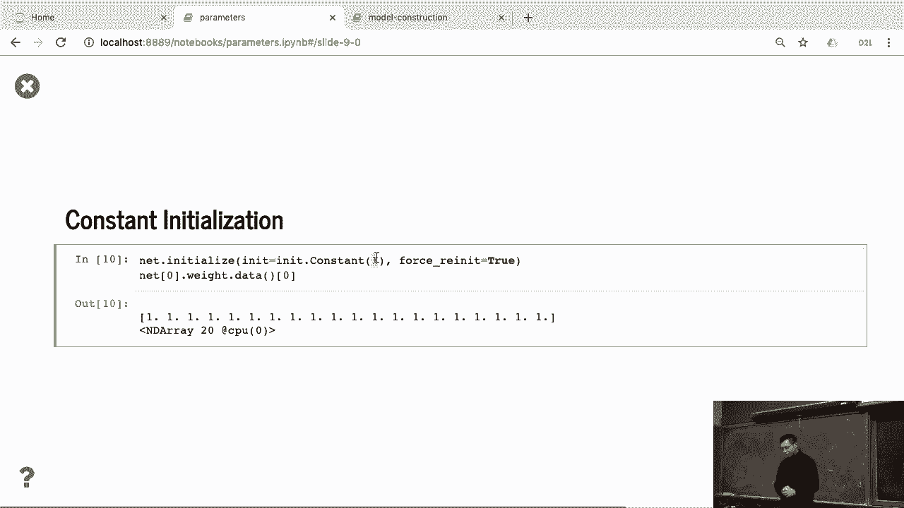
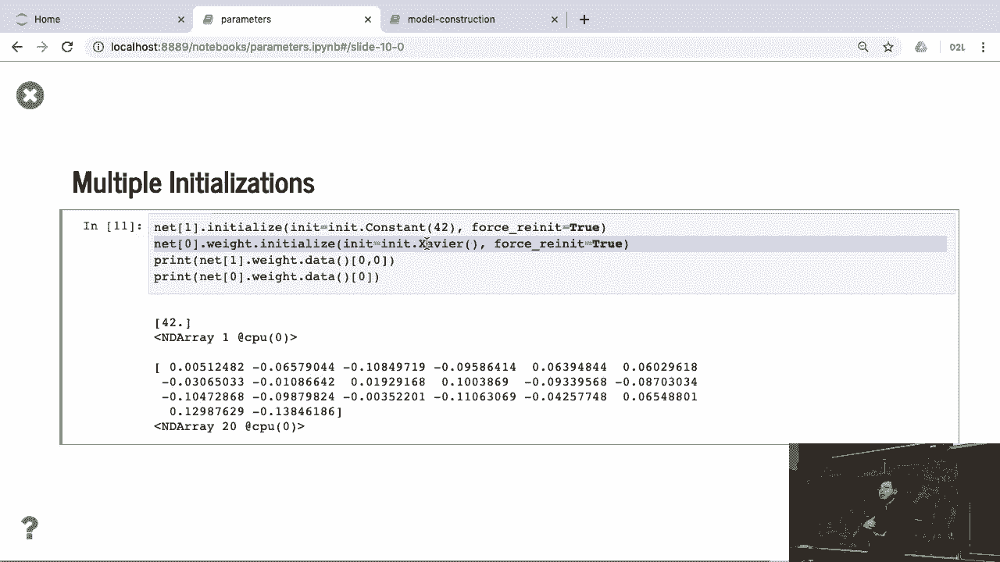
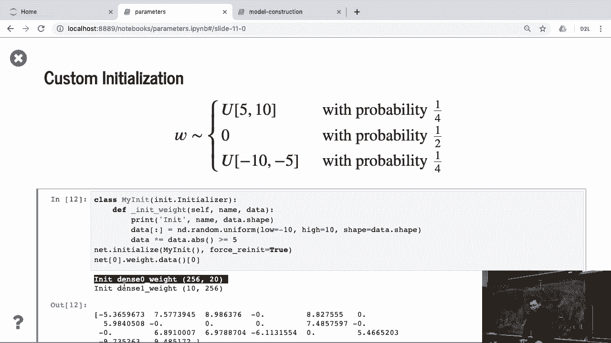
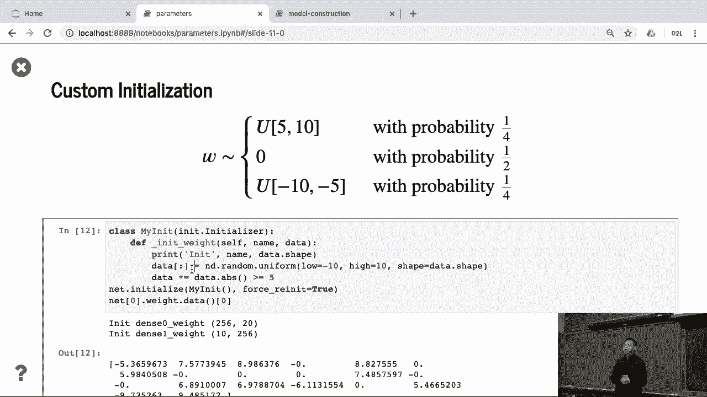

# P50：50. L10_3 管理参数 - Python小能 - BV1CB4y1U7P6

一旦定义了网络，另一个重要的事情就是如何访问参数。所以在这个基础块中，我们既有网络定义，也有参数。我们想要访问并修改所有参数。

所以这里我们定义了一个类似于之前的MLPS，两个密集层，并初始化它，给定随机X并获取输出。

因为我们有两层，所以我们使用非顺序方式。我们可以用零和一来索引每一层。所以对于每一层，`dot_prance`会告诉你我们拥有的所有参数。这个是第一个密集层。它的参数是字典，其中有一个叫做dense_zero的名字，后面跟着下划线weight。

这是权重，并告诉你权重的形状。输入大小是20，上层大小是256。类似的，我们这里有偏置。对于第二层，我们可以通过net one来访问，但是`prance`仍然会获取所有这些权重和偏置。

然后，因为它是字典，我们可以通过字符串名称来访问这些参数。这里我告诉你dense_zero，underscore weight，我们无法获取weight，它是参数的一个实例。如果你调用`dot data`，实际上可以获取参数中所有元素的数组。好的。

所以有时候记住所有这些名称不是那么方便。

实际上，你可以通过`dot bias`来访问偏置。所以第二层，第二个dense_zero_bias是一个参数，并且调用`dot data`后，你不能得到数组。全是零。所以默认情况下，我们将所有偏置初始化为零。

类似的，我们可以获取权重。这是第一个密集层的权重，`dot grad`会给你梯度矩阵。所以这是相对于权重的梯度矩阵，它的形状与权重相同，默认全是零。所以因为我们还没有进行反向传播。好的。

我们还可以通过连接关键字获取所有参数。

所以这是一个网络，我们连接了所有的参数，我们有两层。每一层都有权重和偏置。现在我们得到了一个包含四个项的字典。dense_zero_weight，dense_zero_bias，dense_one_weight，dense_one_bias。所以因为它是字典，我们可以通过名称访问特定的偏置。

之前有一点小混乱。这里有用的是，我们可以访问模式。

这意味着不同层的所有权重。所以这是dense_zero_weight，dense_one_weight。dense_zero，这是第一层，你所有的关键字。权重和偏置，你可以通过模式来获取。好的。

现在，谈到初始化。在作业中你可能会看到，初始化非常重要。如果你初始化得好，运行多次后会得到随机的结果，也会得到许多稳定的结果。所以我们只展示了如何使用默认的初始化方式。现在你可以做，比如，你可以使用init来选择不同的初始化方式。例如，使用常规的初始化。

使用正态分布，标准差σ等于0.01。我们使用`force init`，因为网络已经有初始化器了。我们将调用两次。有时由于批量操作，通常会生成警告信息。所以你会告诉我，我将强制初始化这些参数。

现在我们可以访问权重、第一层的权重和数据。

数据的第一行。你可以看到，这些随机变量是根据这个分布生成的。

我们还可以进行常量初始化，也就是说，常量不应该发生变化。你可以这么做，没问题。我可以使用一个常量等于1。你也可以做，比如，给一个DRA。例如，我知道我从不同的网络抓取了这个权重。我要使用另一个网络来初始化这个权重。你只需要抓取这个DRA。

你也可以使用常量。

你可以为不同的层指定不同的初始化器。默认情况下，我们将使用常量。但在第二层，我们将使用常量。在第一层，对于权重，我们将使用X-VIR初始化器。如果你的网络有非常不同的部分，这种方法非常有用。

你也可以用一个网络的预训练方法初始化一部分，用随机变量初始化另一部分。

你也可以做更复杂的事情。

你可以编写一个自定义函数来做任意的事情。例如，我创建了一个名为`my_init`的类，它是初始化器`init`的子类。我定义了一个`init_with`函数。所以名称你可以忽略，这个是层的名称。数据实际上就是数据。它的作用是，这个函数会重写数据中的元素。

你可以做任何你想做的事情。例如，这里我将创建并初始化数据，然后将其调用到这个分布中。所以我们可以看到，我用某些东西替换了数据，但我不能深入探讨。然后这里还做了一些防御性操作。所以，当我初始化时。

我可以传递`my_init`初始化器的实例。然后，如果我调用它，我可以显示出日志信息。比如，这就是零层的权重，和初始化器生成的Dense层的权重。

而且原因函数是用来传递数据的。好的，通过这种方式，你可以写出来。你可以使用非主控，你可以修改你想要的权重。

一种更紧张的方式是你先通过随机初始化，然后抓取数据并自己修改它。例如，在这里我做了密集层。获取权重，获取数据，并将它们全部加一。然后对于第一个元素，我将其改为 42，然后我打印第一行，你可以看到第一个元素是 42。

还有其他类似的，至少有很多这样的。好的。

这里最后一个是我们已经展示了使用 unblock。我们可以为不同的层共享参数。在这里我们可以再次这样做，但使用 un-sequential。我们首先创建密集层。然后使用 un-sequential。我们首先插入另一个密集层，之前创建的那个密集层，以及这个。

然后将 prance 传递给共享的 prance。这意味着我可以从共享的参数中创建密集层，这意味着这两层将共享相同的参数。为了计算梯度，我们计算这两层上的梯度，然后一些数据一起用于参数。

所以这实际上不是复制，而是共享。这里有一些你可以展示的内容。如果我修改了第一个和第二个密集层的权重，实际上我也可以修改第三个层的权重，因为它们只是共享一个点。到目前为止有问题吗？好的。这些技巧让你可以做一些花哨的网络。

并且做一些花哨的训练字母，但在大多数情况下，你不太需要这样做。

