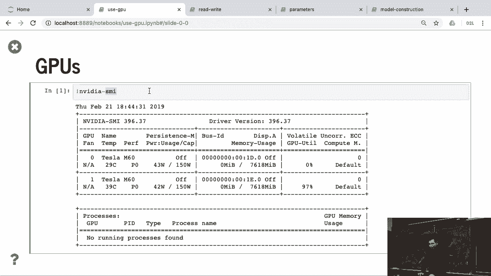
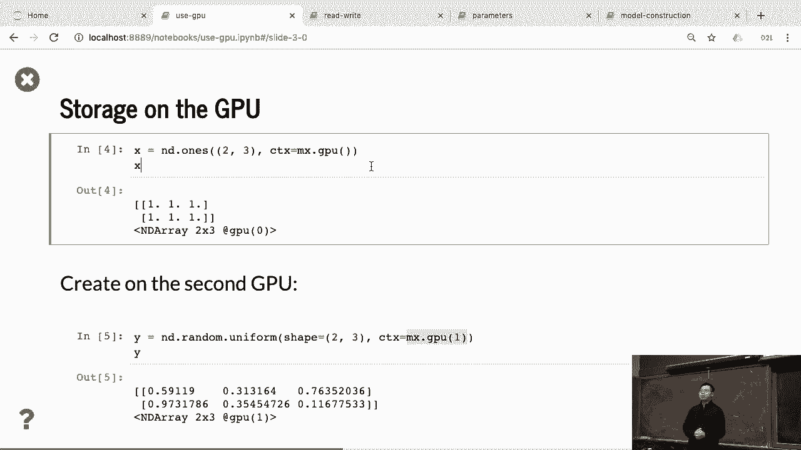

# P51：51. L10_5 使用GPU - Python小能 - BV1CB4y1U7P6

>> 使用GPU，我的实验室没有GPU。

所以我无法运行这个笔记本。你可以使用AWS，或者也可以使用Core Lab。所以你可以通过运行这个`media-smi`来检查你是否有GPU。这里我展示的是我有两个小GPU。

好的，关于GPU，你可以引入一个概念，那就是核心设备。它们可以是CPU或GPU，在你使用第一个GPU之前，你可以指定你要使用哪个GPU。GPU 1表示你拥有的第二个GPU。所以在这里你可以看到CPU是CPU 0。数字0其实没有任何意义。

所以无论你有多少GPU，你只有一个CPU 0。对于GPU来说，这很重要。如果你有两个GPU，你需要区分这两个GPU。所以默认情况下，你会有GPU 0，然后你给1，我就会得到第二个GPU。

所以如果我创建一个数组，访问设备时，可以通过使用`x.contact`来查看。默认情况下，它会放在CPU内存上。

如果我要更改它，我们可以通过使用GPU来指定CTX是context的缩写。所以当你这么做时，你可以看到这里是设备。现在这个x我们放在GPU上。你已经可以看到整个工作的效果了。嗯，你也可以做随机数，但在GPU 1上。因为我在AWS机器上运行这个程序，它有两个GPU。我们实际上可以在GPU 1上运行。

但如果你没有GPU，那么你可以——如果你没有那么多GPU，你会收到错误信息。

这里有一个问题，GPU上的数据是什么？我们可以进行计算。我们进行的计算发生在设备上，数据在哪里，计算就在哪里进行。例如，如果x在GPU 0上，y在GPU 1上，我就无法进行计算，因为它们在不同的GPU上。如果你想让数据在GPU 1上，任何时候都可以将x复制到GPU 1。

我们希望用户明确将数据复制到GPU，同一设备上的原因不仅仅是因为错误。我们无法实现这一点。它只是告诉你，我们可以偷偷地为你复制数据。但如果你这么做，程序可能会非常慢，因为从GPU到GPU复制数据是可以的，但GPU到CPU的速度非常慢。我们真的希望你明确将数据复制到特定的GPU上。

所以你知道我们正在进行计算。但也许在未来，GPU到GPU的带宽非常高，GPU到GPU的带宽也非常高，我们可能就忽略这一点。你不需要强制每次都这样做——你可以自动调度。但在这里，你需要把x复制到第二个GPU，z，并执行结果。

由于y被分配到了第二个GPU上，你可以看到y和z都会放在第二个GPU上。所以操作会发生在设备上，输入在哪里，输出也会在同一设备上。

同样。你也可以像在上下文中一样操作，而不是复制到。

几乎给你相同的结果。但不同之处在于，如果y已经在第二个GPU上，并且在上下文中使用第二个GPU时，我们不做任何事情。只需返回y本身。所以这里。y作为上下文GPU 1实际上就是y。所以你可以在代码中写很多“作为上下文”的操作。你不需要频繁地复制和移动数据。如果你执行复制到操作，不管你使用的是哪个GPU。

我们总是复制它。这只是一个副本。所以如果你对它进行大量复制，要小心。这会让你的程序变得更慢。而使用谷歌，你在这里做的是什么。

也就是说，在进行初始化时，我可以指定上下文。你可以指定你要使用的GPU的上下文。你还可以选择在CPU上初始化，然后复制到GPU。不过这里。正常的初始化方式是在特定的GPU上进行。一旦主程序在那个GPU上。

你需要复制x。确保x也在GPU上。所以在我们之前已经把x复制到GPU 0上，这样就能正常进行。所以你可以看到结果也会发生在第一个GPU上。而且权重也在GPU 0上。所以如果你要切换到另一个GPU。

你可以切换到另一个GPU。你可以将x复制到另一个GPU。原始数据也可以复制到另一个GPU。所以将来。我们会告诉你如何使用多GPU。你可以在多个GPU上运行这个程序，但今天不讲这个。[BLANK_AUDIO]

