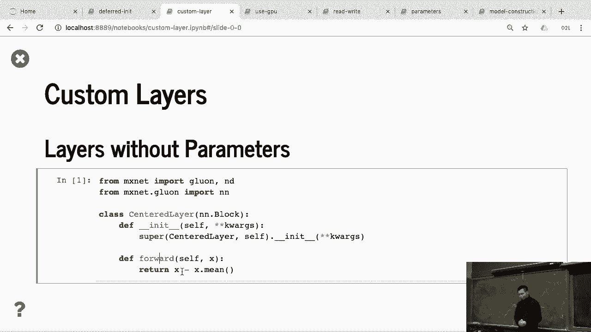
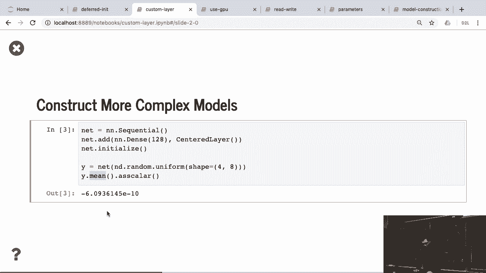
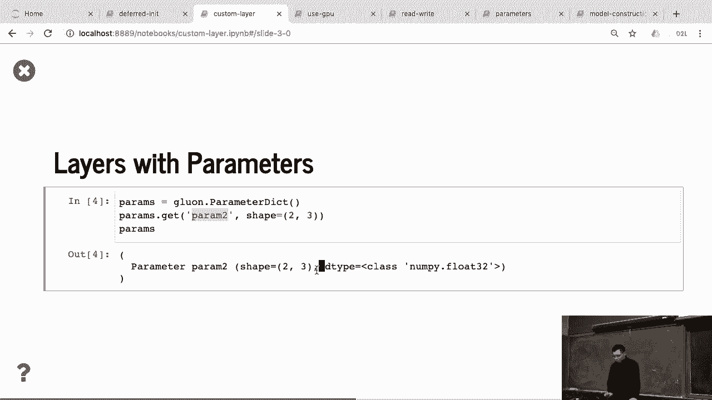
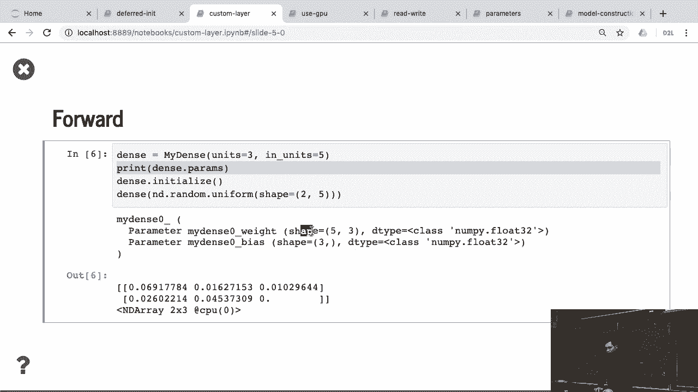

# P52：52. L10_6 定制层 - Python小能 - BV1CB4y1U7P6

好的，这里是如何定义一个 cosmous 层的。

这是，如果你做研究，可能会设计出一个新想法，关于如何制作精美的层和在那项工作中的变更，那么我可以设计出新的层。所以在这里，例如，我做了一个中心层。我在这里做的事情是让输入值具有零中心化。因此，我做的事情类似于我们之前定义 MLP 的方式。

我们创建了一个名为 center layer 的类，它是 unblock 的子类。同样地，我们定义了 init 函数，但由于我们没有该层的原始数据，因此我们只调用了 unblock 的初始化器。在 fold 函数中，给定 x，我们通常将 x 减去它的最小值。因此，现在我们得到的输出是零中心化的。你使用它吗？

这非常类似于我们创建的一个类似于宇宙 MLP 的实例，输入数据为 1、2、3、4、5，你可以看到输出已经中心化，比如 -2，-1，0，1，2。好了，你可以把它看作一个网络。

你也可以将其视为一个层。例如，我可以创建一个非顺序层，给定一个密集层和我定制的中心层。所以在 Grown 中，层之间没有区别。网络就在 block 中。因为将来我们会看到，通常我们创建网络不仅仅是逐层创建，而是组织成两个块或多个块，并且有许多后续操作。

所以那个层的网络以及其他所有东西其实只是 unblock 的子类。因此，给定一个定制层，我们可以初始化它并给定一个随机的 x，得到结果。我们看到结果的最小值实际上是一个相当小的数字，它并不接近零。所以之前的层没有任何参数。

现在我们可以创建一个具有自己参数的层。我们在这里做的第一件事是，知道所有的参数都是字典，叫做参数字典。对于字典，你可以通过给定层的名称、参数的名称和参数的形状来创建一个层。

所以现在我们不需要设备，因为我们无法获取设备字典。如果你获取这个并且参数是正确的，我们实际上会将一个新参数插入到这个字典中，你可以看到这个字典中有一个参数，长度为 prime two，形状在这里。但你也可以指定数据类型。现在开始使用它。

现在我们可以创建一个密集层，我的密集层与我们之前的类似。

同样地，我们可以有两个函数，一个是 init 函数，一个是 forward 函数。init 函数输出单位，输出大小，初始化单位，即输入大小。因此我们重新初始化它，这里有两个关键点。从参数中，我们创建了一个新的参数，叫做权重。它的形状是输入大小和输出大小。

并将其保存在`self.weight`中。同样，我们从参数中创建偏置并将其保存到`bias`中。在损失函数中，给定x，我们可以进行x与`self.weight.data`之间的乘法，因为我们需要数据来获取参数，并且加上偏置。所以这里有两件事。与从零开始实现时的不同之处。

我们还没有指定初始化器。我们只是告诉系统，好的，我可以创建一个具有这个形状的参数。然后可以选择在哪个设备上、使用什么初始化方法，我们可以指定。我们还将参数保存在权重中，这样我们可以通过名称`weight`访问参数，或者我可以通过点`weight`来访问它。这是一个成员。好。

所以使用它的方法，和之前非常相似。

比如，我们创建我的密集层，输出大小是3，输入大小是5。然后我设置参数，你可以看到这里的权重。长度权重。这个层的名字叫做`my_dense_zero`。所以参数长度，层名称和参数名称。我们这里也有形状，类似地，我们初始化它。

给定随机输入，我们可以得到输出。好，目前为止有问题吗？

我们可以用它来构建多层感知机，例如。

给定一个非顺序的我的密集层，输出等于8。唯一不同的地方是，我们需要指定输入形状。之前我们不需要这么做，稍后可以解释原因。另外，对于第二个密集层，我们要告诉你这个密集层的输入大小。然后现在初始化它。

因为我们知道网络的输入维度可能是64，X应该是这里的64的一半。所以形状应该匹配。因此，输入X应该与第一层的输入大小匹配，第一层的输出大小应该与第二层的输入大小匹配。好，计算时，你会得到一个2x1的矩阵Y。好，这就是全部内容。

