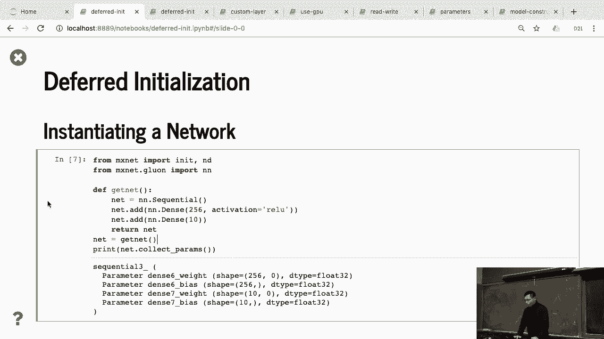
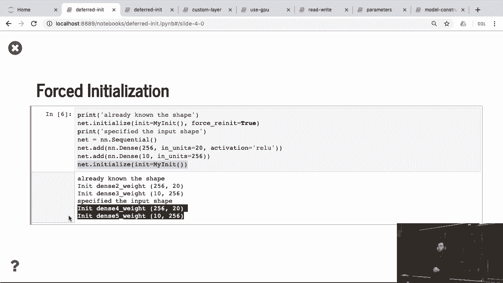

# P53：53. L10_7 延迟初始化 - Python小能 - BV1CB4y1U7P6

它是延迟初始化。所以这里，我们在这里创建网络。再次，这是我们在这节课中使用的例子，两个全连接层。我们得到网络。让我删除这个，让它更简洁。

所以我们创建网络并打印连接参数。

返回你所拥有的所有参数。但是我们可以看到，嗯，这里的权重，形状。我们知道256是我们在这里指定的输出形状。因为我们没有任何简单的输入形状。此刻它是0。所以你可以看到这里是0。类似地，偏置。我们知道无论输入大小如何，偏置已经是一个向量，因为我们有相同的名称。

作为输出。所以偏置，我知道形状。这个层的第二个，依然，我不知道形状。因为我现在从前一层推断出来了。但是偏置没问题。所以此刻。我们给出了一些形状，但已经只有部分信息。所以我们无法推断出所有参数的形状。

还没有。现在，再次，我们调用初始化。这是一个棘手的事情。我们称之为初始化。但这个函数实际上什么也没调用。你只是初始化它。你可以告诉我，OK，使用什么初始化方法，它们会用高斯分布、常数还是X，年份。或者他们将使用哪个设备。但再次，我还是不知道输入大小。

所以如果我们调用连接参数，什么都没变。这里仍然是一堆零。所以如果我们访问数据，你什么都得不到，因为是无效的形状。我现在没有正确分配内存。我们真正做的是，我给了输入X。我把X输入到数据中。现在我知道输入大小了。因为X有20个特征。  

所以现在我推断出网络，形状是20。同时，我运行第二层。我知道它是256。所以这里的棘手之处是，在大多数情况下，如果没有指定输入形状，我们无法访问参数，直到你真正输入实际数据。或者你可以一开始就指定输入形状，但它并没有这么做。

它没有访问到参数。所以这是关键的事情，或许你会记住。所以让我们看看实际上发生了什么。

我定义了我的初始化函数。我什么也不做，只是在需要这个函数时打印。所以再次，我获得一个网络。我共同初始化，给我的初始函数。没有输出，这意味着我的初始化器，暂时没有询问你，因为我还没有。

现在我知道输入形状了。现在，我生成X，通用X，适配X进入第四个函数。你可以看到，OK，现在我有数据了。在运行第四个函数之前，我只是调用我的初始化器，像是调用初始化器权重。嗯。第二次，所有传递的第二次，我不应该这么做。

因为我们要更新它，我不能再次初始化它，所以那只会发生在第一次。

之前并没有调用这个。如果我做第四次，重新初始化，那么——因为如果我那样做，因为在之前我已经拟合了数据，网络已经知道了形状。所以如果我再次调用初始化器，实际上，它需要在这里有一个函数，因为我知道这些形状。另一件事是你真的不想推迟初始化器，你可以做类似的事情。

类似于我自定义的密集层。

之前，你可以指定输入单元。你可以指定这个密集层，输入大小是20，和这个密集层，输入大小是256。现在，我知道一开始的形状。所以如果我调用初始化器，初始化，我其实是立刻调用它。就这些事情。即使我们只做了非常简单的事情。但最终，我们要谈的只是这个手动过程。

层卷积网络，所以推迟初始化，非常重要，因为你不能——现在是简单的网络，我知道每一层的大小，但如果有100层，内部计算就真的很难了。

所以通常我们使用不同的初始化。好的。
