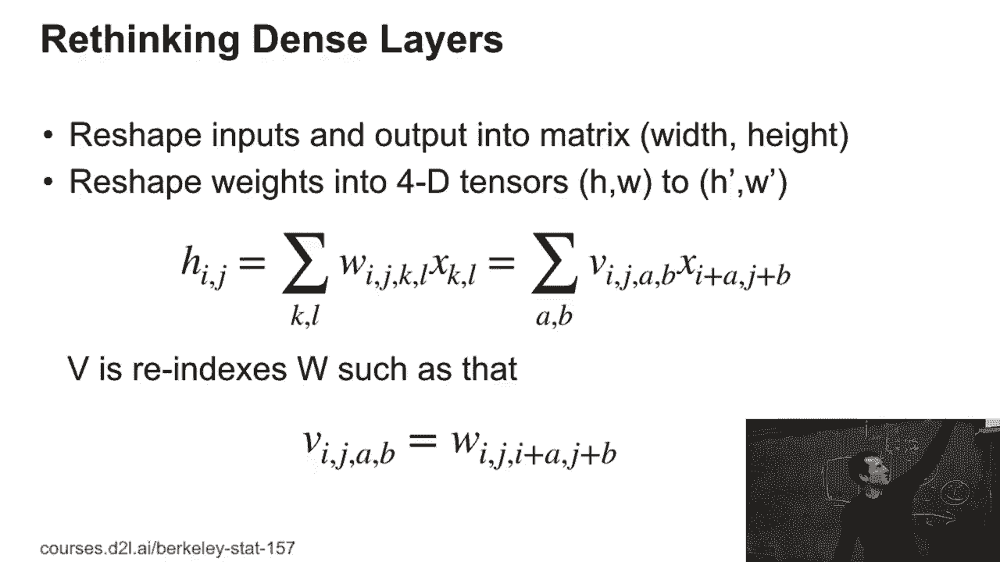
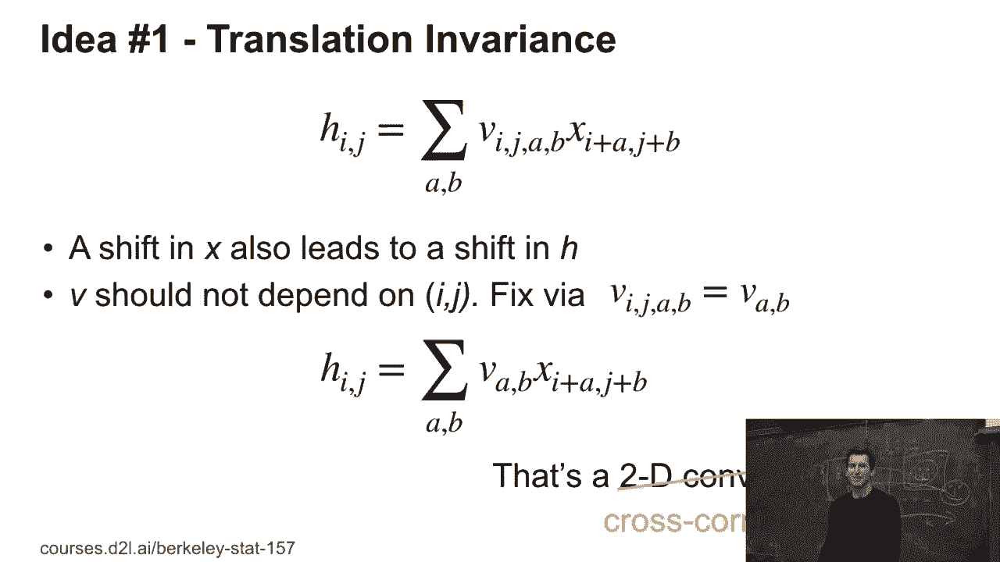
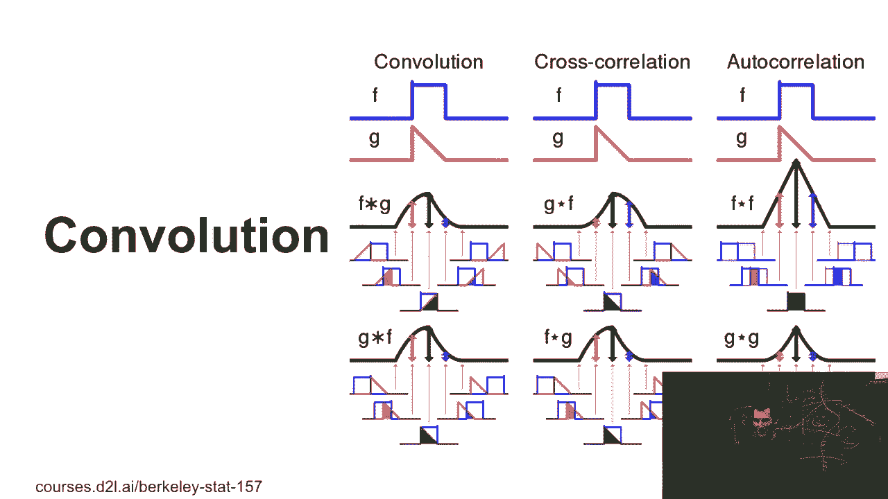
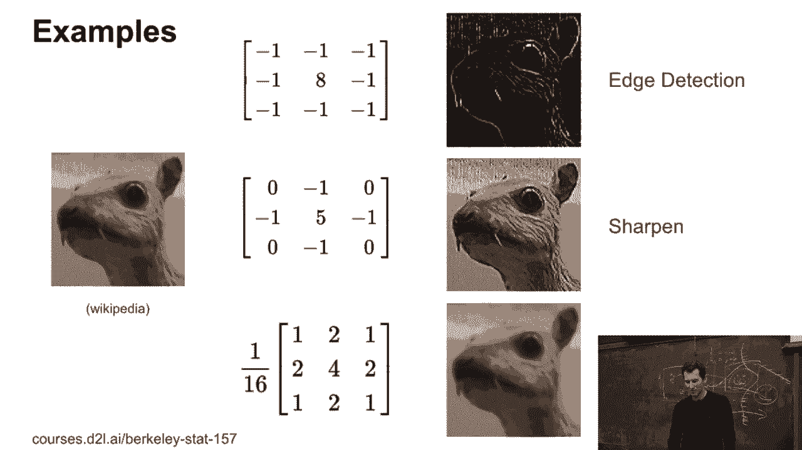
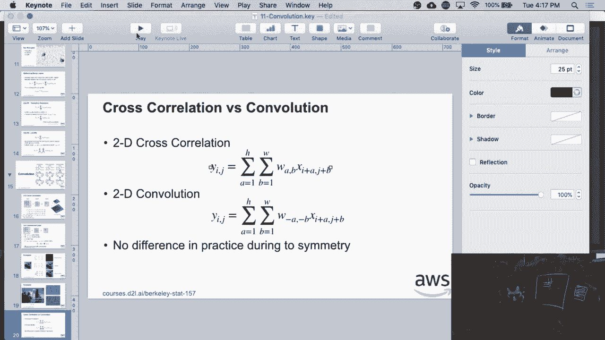
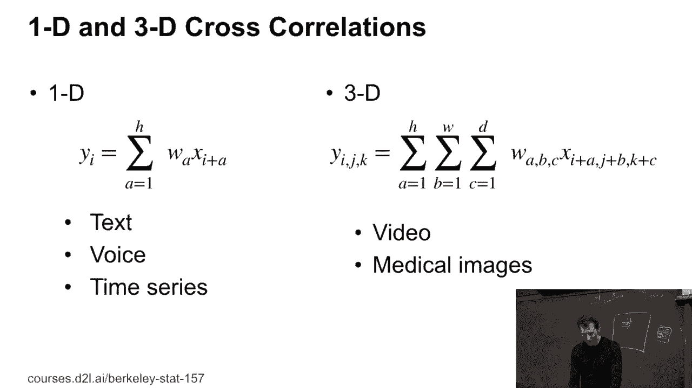

# P54：54. L11_2 卷积 - Python小能 - BV1CB4y1U7P6

卷积神经网络。到目前为止，我们已经达到最先进的技术水平，差不多是 2000 年左右。不，抱歉，是 1990 年，1992 年。所以现在进入了一个非常令人惊叹的时期，基本上，Jan Lickar 和他在 AT&T 的团队发明了卷积神经网络。今天我们会看看我们能讲多远。

可能今天我们无法讲到 Lynette，可能得等到星期四才能讲。不过，还是先开始吧。我们从一些非常简单的内容开始。假设你有一台好相机。就像可能这部手机。这个手机有一颗 1200 万像素的相机。其实它内部有两颗相机。

但那只是一个微不足道的细节。所以它是 1200 万像素。如果你有红色、绿色和蓝色，那就是 3600 万个数字。所以如果我要构建一个有 100 层隐藏层的多层感知器。那么 100 个隐藏单元，仅仅是一个隐藏层。那么这大约是 36 亿个参数，也就是 3600 万乘以 100。而后续的内容基本上是免费的。

但这是一个很大的数字。所以如果你考虑一下，可能你每个参数至少需要一到两个观测值。所以你大约需要 35 亿张猫和狗的照片。但这是一个实际的问题。因为上次我查阅维基百科时，全球大约有 9 亿只狗和 6 亿只猫。

所以那样的做法效果不好。然而，如果你在你喜欢的图像搜索引擎上搜索“猫”和“狗”，并在你的图像数据集中进行搜索，它会做得相当不错。所以很明显，他们肯定是用了不同的方法。

所以这只是为了强调这一点。如果我有一个只有一层隐藏层的神经网络，和一个单一的输出，那么你就是这么做的。当然，h 是 σ(w·x + b)。所以有 36 亿个参数，约 14GB，如果我将其存储为浮点数。是 32 位。如果是 FP16，仍然是 7GB。

这仍然比你的中端图灵 GPU 强大。顺便提一下，显然有些人在尝试设计网络时遇到了一些问题。所以记住，假设我们将这个作为输入。一些人设计了那种架构。换句话说，他们在第一层就进行了简化。

从任意输入维度到一维。然后他们又扩展宽度，再缩小宽度。这是个糟糕的主意，根本行不通。事实上，我记得是 Ryan，后来有人来找他，告诉他他们在这方面遇到问题。然后 Ryan 通过直接去掉这一层，解决了整个问题。结果就是这样。

这个网络实际上工作得相当好。所以发生的事情是，这一层隐藏层，只有一个神经元，强制所有特征都投影到一个维度。这有点过于激进。你可能不希望这样。做这件事的人可能听说过信息瓶颈和其他相关概念。

实际上，你可以拥有这种形式的网络。但是它们永远不会在第一层中压缩掉所有的信息，因为你希望有一个有意义的中间表示。而且你几乎肯定不会将其降维到一维。通常，你会有这样的网络：它们只是逐渐变窄，最后就这样。

这一切并不会发生。我们实际上会看到那种网络结构，当我们讨论各种深度卷积网络时。但是设计决策基本上是一样的。所以，是的，你希望减少维度，但不要过于激进，也不要减少太多。是吗？

[听不清]，是的。所以问题是，我们是否能看到获胜者的惊人架构？

是的。会有一个参考解答，你可以查看它。真的要向那个团队致敬，因为他们实际上进入了，我认为是Kaggle的前十名，这从10,000个提交中脱颖而出，真的很惊人。所以，致敬，做得非常好。无论如何，让我们来看一下计算机视觉。

所以让我们看一个非常简单的问题，即我们要找到瓦尔多。那么这和计算机视觉中的多层感知器有什么关系呢？实际上有很大关系。因为如果你看这张瓦尔多的图片，你会发现图片上有很多瓦尔多。实际上，瓦尔多的特征并不依赖于这个人出现在图片的哪个位置。

而且，这实际上并不太依赖于邻居。换句话说，那两个是完全定义好的瓦尔多。而我并不需要知道很多其他的事情，才能识别它们。所以实际上，当你教孩子们怎么玩这个游戏时，你会告诉他们，嘿，这是瓦尔多。现在去找吧。

然后你给自己泡一杯咖啡，等待他们回来告诉你，嘿，我找到了。而他们非常擅长使用这种非常简单的模板，通过一个单一的图像扫描整个图片，找到这个人。他们利用了这样一个事实：只有局部才重要，瓦尔多可以出现在图像的任何位置。

那这和数学有什么关系呢？让我们来看一下一个密集层是什么样子的。我所做的是让自己的生活更简单一些，我将我的隐藏单元用`hij`进行了索引。所以，与其说我有可能有100维的隐藏单元，不如说我将它们排列成10x10的网格，因为我输入的是一张图像。

我可以总是以这种方式安排它们。假设这些隐藏单元在某个时候应该表示图像中特定部分的Waldo特征。那么通常，我可以写成对k和l的求和，Wijkl xkl。明白吗？所以xkl就是源图像。假设这里是k，这里是l。所以你需要扫描整个图像，找出Waldo在哪里。

如果Waldo恰好在这里，好吧，你仍然需要找到他。那不是Waldo。是笑脸，但没关系。不是常规图像。那么现在我要做的是，我将重新索引整个表达式。所以仅仅通过将它按vijab索引，ab表示相对于ij的偏移量，实际上没有改变任何东西。现在我不是对xkl进行求和。

但是xi加a和j加b。所以这只是一些代数重排。数学上完全没有改变。我可能需要担心边界等问题，但我所做的就是将相应的其他项设为0，一切就好了。大家对第一行都理解了吗？没有。好的，有问题吗？哪里不清楚？好的。

所以再重复一遍，ij是第i个玩家，第j个针单位，以及第i个玩家。不是完全是。那只是第一个隐藏层。这里是x。这是h。现在我只是通过i和j进行索引。所以我只是表示h。所以这个隐藏单元，这个隐藏层，是一个二维对象，而不是一维对象。

我可以通过简单地改变形状来做到这一点。所以那个第一个等式是完全通用的。我可以对任何多层感知机这样做，只要输入维度和输出维度可以分解。我总是可以这样写。可能并不是很有意义，但我可以像这样代数地写出来。

那么大家都理解第一个hij和等式中间的部分了吗？好的。那你们只需要ci加a，j加b吗？是的，必须是i加a，j加b。没错。

好的，抓得很好。我们来修正一下。谢谢。

好的，抓得很好。那么大家都理解中间的等式了吗？现在我们来看最后一个。从中间到最后的转换，实际上只是重新索引。我所做的只是写下k等于i加a，l等于j加b。就是这么简单。这只是重新排序。既然这些都是任意的矩阵，w。

我可以随便选择一个矩阵，v。好，现在如果你看一下，实际上这是一个卷积。只是现在这个东西仍然依赖于许多其他位置。所以从本质上讲，底线就是我如何重新索引。

现在让我们实际应用我们的数学公式。所以记住，我们有hij是vijab，xi加a，j加b。所以我所做的就是表达hijs。假设这是正确的，i和j。这是hij。我将其相对于笑脸先生周围发生的事情进行表达。现在我所做的是，我说，实际上，笑脸先生周围发生的事情，以及周围发生的事情。

那边有一个笑脸。嗯，我应该应用相同的滤波器。换句话说，这个vijab。我可以去掉索引ij。所以我的权重矩阵不再依赖于位置ij，而仅仅依赖于相对于该位置的位移。如果我这样做，并且我有一张1200万像素的图像——换句话说，我有3600万个维度——。

我刚刚将我的权重的维度减少了，仅减少了3600万个。因为我去掉了与图像大小相关的索引。所以这是一个显著的问题简化。因此，现在我们已经能够解决这个问题。如果我们拍摄足够多的猫狗图片的话。之前，我们的参数比猫和狗的数量还要多。

但我们已经将参数数量减少了3600万个。感觉不错。而且这实际上是一个表达式，我可以确定你知道，因为这就是。只是一个互相关。看起来像是卷积。到目前为止有什么问题吗？

接下来是下一步，本地性。如果你看一下笑脸先生和笑脸夫人，你会看到这个卷积滤波器会覆盖在它们身上，带有一些权重。实际上，如果你考虑一下，超出这个框架的部分，我并不关心发生了什么。所以我可以直接截断它。这部分就消失了。这部分就消失了。这部分也消失了。

然后这就消失了。换句话说，我只是应用一个局部的滤波器，仅此而已。因此，我可以将参数A和B的有效范围限制在某个范围内，这些参数决定了偏移量。在实际操作中，人们可能将这个范围设置为两侧各五个像素。所以在很多情况下，人们会选择一个非常窄的范围。现在我们得到的是H ij是A和B上的某个值。

从负的delta到正的delta，V ab xi加A j加B。到目前为止有什么问题吗？

所以也许所有的数学公式看起来有点吓人。但结果是非常简单的，对吧？

你只需用某个滤波器对输入进行卷积，就可以得到一些输出。让我们来看一些数字，因为这个。

这样会更容易理解。所以在数学推导之后，我们来看一些实际的例子。假设我有一个3x3的输入图像，并且我有一个2x2的卷积核。我所做的就是将卷积核中的每个元素与输入图像对应位置的元素逐点相乘。所以假设是0乘0加1乘1加2乘3加3乘4。

这给了我19。然后我将卷积核向右移动1个单位，结果又得到相同的东西。我就一直这样做。因此，我将得到输出。在这种情况下，这是一个2x2的矩阵，或者说是图像，包含这些条目。大家都明白了吗？所以在经历了所有这些可怕的数学之后，操作上你需要做的是，忘记那些可怕的数学。

除非你想从基本原理出发推导卷积。那为什么这会很重要呢？

好吧，如果你有平移不变性，并且你进行了卷积，那么好，问题就解决了。有人担心我们写了那篇论文。但是你可能会有其他对称群，在这种情况下，你还不知道解决方案是什么。在这种情况下，你可以应用对称性和不变性，然后你将得到另一个卷积核。所以如果你看看那个。

这就是发生的情况。如果你拿一个4x4的图像，然后拿一个3x3的卷积核，那么你会得到这个非常漂亮的动画。到目前为止有问题吗？好。

因此，我们有了一个卷积层。它的作用是接收一个输入，大小为nh乘以nw。即高度乘以宽度的输入矩阵。你需要一个卷积核矩阵。这个矩阵可能是方形的，也可能不是。通常，人们使用方形的卷积核，但也有一些非常罕见的应用，可能不会使用方形卷积核。例如，图像可能具有。

它是用某些变形镜头或其他方式录制的。所以有时候人们在为电影录制时会这样做。他们基本上把东西压缩，然后再扩展回来。这就是人们在过去常做的事情，当时电影和胶片宽度是一个实际问题。但嗯。

所以你这么做。然后，当然，最后你会加上一个偏置。偏置只是一个常数。所以你可以检查一下，如果我有一个高乘以宽的图像，以及一个相应的高乘以宽的卷积核，那么输出就是图像高度减去卷积核高度。

再加上1乘以相同的宽度。那么，加1的原因仅仅是因为如果我的卷积核和图像的大小完全相同，我依然得到的是1x1的输出。但当然，除此之外，我可以随意移动它。当然，只要我在任何一方都有空间。因此，如果你不确定，回家找一块乐高砖。

比如那种漂亮的乐高板，你可以在上面建房子。你将图像的输入大小做成一个矩形。你拿你的卷积核当做滤波器，移动它。你看看能得到多少个位置。当然，这就是深度学习。我们想要学习东西。在这种情况下，我们想学习WMB。有问题吗？好。

好的。所以这是一些例子。我可以拿这张图，假设它是一只像啮齿动物的动物的图像。如果我使用这些滤波器，我就得到一个边缘检测器。我可以锐化图像，也可以模糊它们。这些都是手工设计的滤波器。所以如果你使用比如Photoshop或Lightroom，你就可以有锐化、模糊或者其他滤波效果。

那些东西就是这么做的。它们基本上是应用到你图像上的预先计算好的卷积。到现在为止，当然，人们比那时候更聪明了。但本质上，这就是这些简单操作的作用。这是Rob Ferguson课程中的一个例子。

这是一张我认为来自波士顿的图片。如果你有这个卷积操作，并且扫描图像，假设动画正常工作。不是的，它没工作。那么你会得到这个输出。如果你选择另一个不同的卷积滤波器，你会得到其他的结果。这些是深度网络学习到的实际权重。

所以根据应用的滤波器不同，你会看到该网络看到的其他一些视图。嗯，实际上它并不“看”东西，而只是中间的表示。好吧，这只是一个小小的、巧妙的细节。其实我们在谈论的是交叉相关。因为对于卷积操作，你只是翻转下标，但那看起来有点别扭。

更重要的是，就内存访问和局部性而言，这样并不好。所以这就是为什么你不翻转下标。但实际上没有区别，因为你总是可以通过另一种方式表达这个。快速提问，因为我说过，在内存访问方面这并不好。你觉得会发生什么呢？好吧。

让我们画个图。这样就非常清楚了。假设这就是我们的图像。我这里有个滤波器，我就像这样在图像上滑动。所以我是在内存中前进。好吧，我在内存中前进，做一个内存跳跃，做一个跳跃的动作。好了，现在。

计算机在缓存你可能接下来会读取的内容方面非常擅长。而且大多数代码，尤其是计算机代码，都是在内存中前进的，而不是向后走的。所以你计算机中的许多优化是硬件级的，假设下一个操作会是内存中下一个元素，而不是倒序。

换句话说，如果你在那里，你的计算机会缓存这个元素。一旦你到达那里，它会缓存这个，然后继续以此类推。这是一个非常好的前进方式。你的内核也会发生类似的事情。如果我进行卷积操作，我就会最终。倒着走。这样反而会让事情变得更慢，至少在某些情况下是这样的。

如果这一切都适合缓存并且你进行了优化，还有很多其他你可以做的事情。但这就是为什么交叉相关是你的朋友，而卷积操作可能不一定是的原因。好吧。好了。K是卷积核。哦，这里应该只是相应的下标。

这不是我们应该看到的。这里不应该有 K。

这是一个错别字。不错的缓存。[无法听清]，还有另一个。所以如果你通过剪切和粘贴做 LaTeX，就会发生这种情况。

谢谢。不错的缓存。当然，除了二维卷积，还有一维和三维卷积。例如，你可以使用类似的原理来分析文本。不幸的是，很多类比只是部分正确。

因为文本并不是完全具有平移不变性的。有人能告诉我为什么文本不是完全平移不变的吗？嗯，至少它不应该是。对于大多数人来说，它并不是。有谁知道为什么吗？[无法听清]，嗯，马尔可夫部分并不是真正的原因，但这是一个好想法。那么发生了什么？我的意思是。

图像也具有马尔可夫性质。但问题在于，文本具有这样的特性：它有句子，有段落，所以有边界，而这些边界并不是——如果我把一个句子所有的单词向右移动一个，那么我就丢掉了一个句子的第一个单词，并且加上了下一个句子的一个新单词。

现在，你已经把一些可能有意义的东西，变成了胡言乱语。这就是为什么平移不变性并不完全成立，但它只是在句子之间有一定程度的成立。但是在那儿，你还有段落。你还有适用的其他结构。另一个问题是句子长度变化很大。

你可能有一个像“你好”这样的短句，或者你可能有一个非常长的句子，解释为什么句子中的平移不变性并不完全成立。所以这就是为什么你需要一些额外的调整。人们提出了一些聪明的想法，针对句子的卷积。结果是，有些更简单的技术。

像我们稍后会看到的 STMs 或变换器，它们也会解决这个问题。但对于语音来说，这是很正确的。对于时间序列来说，总体上是正确的。而对于三维的情况，你可能会有视频。所以像现在正在录制的东西，你基本上有宽度乘以高度，再乘以时间维度。实际上。

你还有更多的维度，包括红色、绿色和蓝色。所以你这里实际上有四个维度，但这是另一个话题。所以现在，让我们假设这只是三维的。或者你有卫星图像或医学数据。在那里，你通常会对不同波长的整个光谱进行测量。

例如，一个复杂的高光谱卫星，可能记录10种，可能记录100种不同的波长。这将给你一个更详细的想法，比如大气是什么样的。比如，蜜蜂有超过三种不同颜色的光感受器。

或者，如果你身边大多数是色盲男性，他们可能只有三种视锥细胞中的两种。所以，这就是你正在记录的维度。目前有任何问题吗？酷。很好。那么接下来我们就实际操作一下。

实践。[BLANK_AUDIO]。
