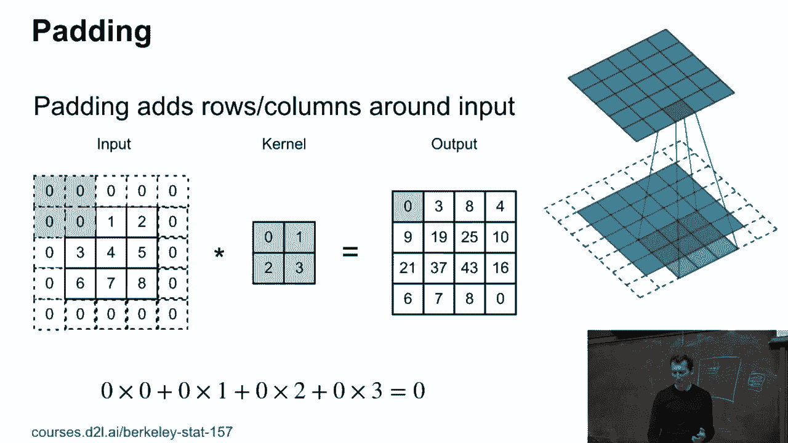

# P55：55. L11_4 填充与步幅 - Python小能 - BV1CB4y1U7P6

好的。填充和步幅。记住，当我们做卷积时，对吧，接着，嗯，你知道。我们的卷积核会扫描图像。这就是，你知道的，那个臭名昭著的时尚，MNIST 毛衣。对吧，毛衣，因为这是德国的数据集，德国的虚拟毛衣就是“pullover”。所以他们翻译得非常字面。是的。所以，反正，你有，像这样。

一个 32×32 的输入图像。如果你应用一个 5×5 的卷积核，经过一层卷积，你会得到一个 28×28 的输出。经过七层卷积，你会得到一个 4×4 的输出。到那时，游戏结束了。你不能再继续卷积下去了。你已经没有像素了。所以，换句话说，你的图像会随着你不断缩小。

总是从边缘开始去除内容。如果你有一张非常大的图像，嗯，你知道，你可能不太在意边缘的一两个像素，但是过一会儿，你会开始发现像素不够了。如果你的卷积核很大，这个过程会非常快。所以如果你看看它，我们有，嗯，图像高度减去卷积核高度再加 1。

宽度也是同样的道理。那么，为了解决这个问题，应该做什么呢？其实非常简单，你只需要在图像周围加上零。

就是这样。如果你这么做，你会得到与输入相同大小的输出。只是，在这种情况下，嗯，你也会对一些垃圾数据求和，而这些数据恰好为零，所以其实也不算太糟糕，但你知道，这也是你可以做的一种方法。所以在这里的例子中，嗯，我们实际上有一个 3×3 的图像与 2×2 的卷积核进行卷积。如果我这样天真地做。

好的，我会得到一个 2×2 的输出。记住，那是 1925，37 和 43。但如果我想可能将东西放大，我可以做的就是。将它周围填充零。然后我得到一个更大的输出。现在，这个更大的输出是否有意义，是另一个问题。

但至少形状上没问题。到目前为止有问题吗？好的。这些其实很简单的内容，但如果你不小心，可能会有问题。

小心。所以有一些常见的做法是，使用方形卷积核，然后使用奇数尺寸。基本上，你取高度减去 1，然后取地板值，-- 嗯，高度减 1 除以 2。宽度也是同理。如果我有一个 3×3 的卷积核，那么我在左右和上下各填充 1 个像素。如果我有一个 5×5 的卷积核，那么我需要在每一边加上 2 个像素。

旁边的东西形状不会变化。当我们将不同的卷积合并在一起时，这将变得很重要。所以，例如，有一个叫做 Inception 的架构。对于它来说，这一点至关重要，因为否则你无法将东西，像你知道的那样，填充在一起。

它在维度上没有任何意义。有问题吗？好吧，继续吧。我们继续。继续操作。继续操作。继续操作。继续操作。继续操作。继续操作。继续操作。所以。

继续操作。继续操作。继续操作。继续操作。继续操作。继续操作。继续操作。继续操作。继续操作。继续操作。

继续操作。一个原因是，这些二维卷积会改变输出的大小，相对于输入。除非你对填充做一些奇怪的处理，我们只在一边填充，而不是另一边。但那真的很怪。好吧。

所以，现在我们需要的是步幅。实际上，在某些情况下，我们希望减少维度。你可以做的是，不必计算所有的条目，而是跳过每隔一个，或者可能是每隔第二个和第三个条目，基本上你会有一个步幅为 K 的子采样矩阵。所以。

如果你看这个矩阵，你可能只对这些条目进行子采样。对吧。可能这些也包括在内。把其他的都省略掉。通过这种方式，你可以非常快速地减少图像的维度。有时也有其他更优雅的方法来做到这一点，尤其是与池化结合使用，在那里你可能取相邻像素的平均值或最大值。但至少使用步幅时。

你还可以调整大小。好的。还有其他问题吗？[听不清]，那是什么？嗯，那些是不同的滤波器。随着你移动，得到的是这个更小的滤波器。好的。

我们来看看实际情况。这里发生了什么。我们有步幅为二和三。嗯，你可以看到这个过程。它相当直接，易于理解。

所以，现在这是稍微详细一点的推理。如果你有步幅，那么你所做的是，使用相应的输出大小除以步幅，然后取相应整数的地板值。地板值。因为，如果没有足够的空间来跳跃，譬如说，可能就不行了。

下一行会在那边。嗯，那就行不通。所以，你总是往下跑。好的。幸运的是，现在大多数现代深度学习框架其实已经使用了自动的尺寸和形状推断，你不需要自己做这些。所以，这听起来还是挺直观的，但如果你有可能是50个。

层次结构中，如果你改变了一层，那么所有这些更改将会传播到后续的层次。因此，编写一些代码变得极其困难。所以，在过去的时代，当人们使用 cafe 或者其他类似的工具时，例如 cafe 版本一，你可能曾遇到过这样一种情况，你实际上需要写一些，可能是。

生成一个 cafe 定义脚本的 Python 代码，用于操作不同的尺寸。所以，你需要编写一些脚本代码来生成代码，以生成一个深度网络。到现在为止，这一切都是自动化的，你不需要再担心了。所以，最后很好。

就这样，迈出了步伐。
