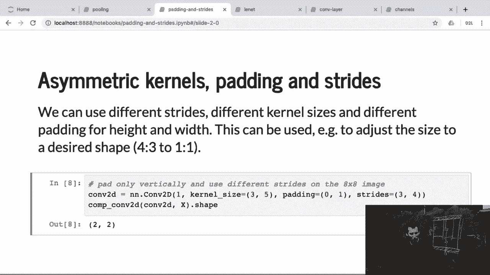

# P56：56. L11_5 Padding 和 Stride 在 Python 中的实现 - Python小能 - BV1CB4y1U7P6

好的。所以，我们现在做的是，我们只是在实现一个非常简单的东西，即它只是去应用卷积于某些数据。这是一个我们以后可能需要用到的有用操作，可能在其他一些情况下会用到，但现在它只是做了一点点计算、重塑之类的操作，来使事情能够运行。

然后它就会调用那些卷积操作。好吧，让我回到这个并执行它。所以，如果我。你知道的，去做，然后你知道。

如果我用一个3x3的卷积核，并且填充为1，输入是8x8，那么输出，真是不可思议，也是8x8。记住，这正是我之前提到的那个技巧。或者，例如，如果我有一个3的卷积核，填充为1，步长为2。

所以，这种方式我跳过每第二个条目，而不是8x8。因为我跳过了每第二个条目，按列滚动，我得到了4x4。所以，这一点是非常不令人惊讶的。现在，如果我有不对称的东西，比如说我有一个。

核心大小为3和5，来做一下计算。我们可以快速验证一下发生了什么。所以这里我们有一个8x8的矩阵，对吧，表示x。我们有一个3x5的卷积核。所以这是我们的卷积核。好的，那么，如果我，并且在这之上，我并没有对行进行填充，而是对列进行填充。所以我们这里有一个额外的像素，另一边也是。

我们的步长是3和4。好的，我们先做水平部分。我们有大小为3。所以我们实际上有6个位置，对吧？但是我们每次跳跃3个位置。那么，实际上，我只能塞进两个这样的过滤器，对吗？

第三维的空间不够，因为它只有8像素宽。所以，我这里有从1到3的像素。我那里有从4到6的像素，进行合成，然后到这里。空间不够。所以，我在这个方向上只有两个维度。现在，对于垂直部分，记住我们的高度是5，总共有10个像素。所以，2个像素正好合适。很好。

如果我完全偏移，实际上我并不会完全偏移，而是每次偏移4个像素。所以，第一组有5个像素。然后偏移4个像素。所以，现在我们到了第9个像素。然后我再偏移4个像素。所以，8加5，对吧？那是13。13超出了范围。所以，我只能水平放2个，垂直放2个。好吧。如果你足够幸运的话。

这是你一生中唯一一次需要重复这个过程的时刻。也许在做作业时会遇到类似的情况，但是，嗯，理解这个过程一次是很重要的，然后剩下的就让你的代码来处理吧。有什么问题吗？有吗？为什么要躲起来？不对的。因为我可能搞错了。但其实没关系，因为这只是第一维和第二维的对比。

它只是将第一维作为宽度，第二维作为高度。但你也可以交换顺序。没错。在幻灯片中，我写的是高度乘以宽度。是的，我只是画了宽度乘以高度，因为，嗯，我弄错了。好眼力。还有其他问题吗？

好的。 很好。

