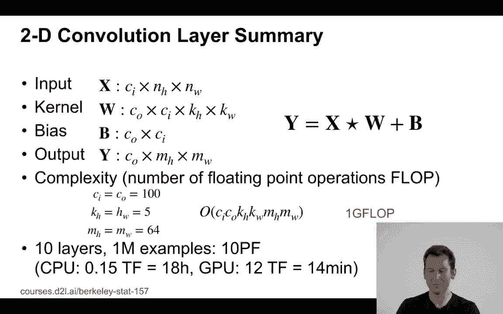
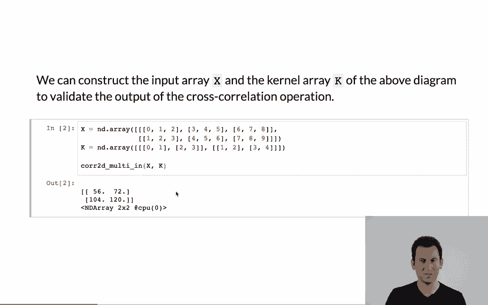
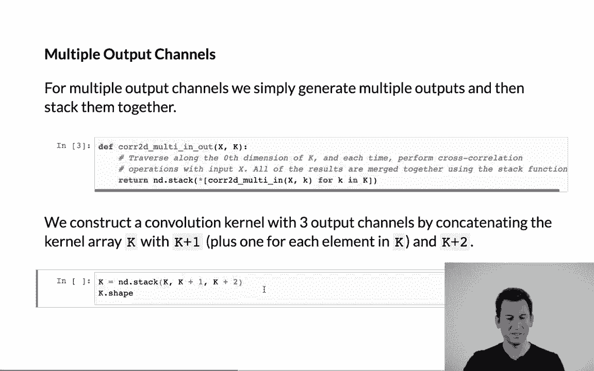
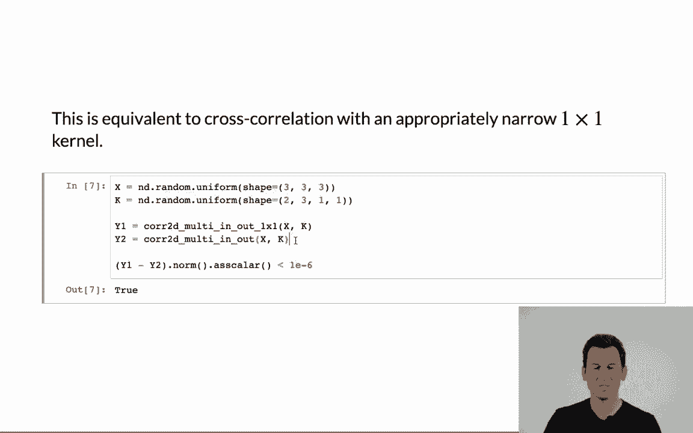

# P58：58. L11_7 Python中的通道 - Python小能 - BV1CB4y1U7P6

让我们看一下在 Python 中处理多个输入和输出通道时的情况。

所以，让我们回顾一下我们拥有的内容。那么，我们有多个输入通道。你可以通过某个卷积核来进行演化。所以，基本上你会遍历输入。在这种情况下，它是一个 2x2 的卷积核，应用到一个 3x3 的图像上。结果就是我们得到的这个输出。好的。那么，为了开始，我们需要导入 MXNet。

我将定义一个相关性多输入的函数。其实我只是使用标准的相关性函数。现在，我将用这个来应用于多个输入通道。最后，我将它们加在一起。也许这不是最优雅的方式，但它能清楚地说明问题。

那么，接下来，让我们看一下如果将这个应用到一些数据上会发生什么。那么，这正是之前的示例。我取了两个 3x3 的通道。为什么？我应用了一个 2x2 的卷积核。再次说明，我需要为每个通道应用一个卷积核。我把它们加在一起，瞧！我得到了之前在幻灯片上看到的完全相同的数字。

好的。那么，如果我想要有多个输出通道，我简单地做的就是：我为每个输出通道应用多个输入通道。这就给我带来了一个多输入多输出的通道。好的，那么为了实现这一点，现在我需要获取一个卷积核，它有多个输出通道。我打算让事情变得简单一些。

我只是取卷积核 K，将 1 加到它上面，然后再加 2，接着把它们堆叠起来。

所以，这给我带来了一个 3x2x2x2 的张量。所以，2x2 是为了 2x2 的卷积操作。这里的另一个 2 是为了两个输入维度，而 3 是为了三个输出维度。好的，那么现在让我们看看应用这个后会发生什么。这就将卷积核应用到一个 3x3 图像的 2 通道输入上，最终得到 3 个输出。

2x2 矩阵。所以它基本上是一个 3x2x2 的张量。这正是我们设计出来的。现在，让我们来看一下 1x1 卷积，我将定义一个替代的 1x1 卷积的定义。我将从 X 中提取偏置和所有其他项。对吧？

获取相应的输出通道，现在我要重新调整 X 的形状，以便让我可以进行矩阵与向量的乘法。这就是输入维度的数量。然后，我对它做同样的事情，知道吗，这就是我的卷积核。它现在变成了一个 2x2 的矩阵，或者说，是一个具有输出和输入维度的矩阵。

然后我执行矩阵向量乘法。最后，我对结果进行重新塑形，得到的就是这个。请注意，我跳过了偏置项，因为否则代码看起来有点懒惰。所以，我们继续。现在让我们真正地比较一下，如果我这么做，并将其与逐一卷积进行比较。应用传统方式。记住，这是我的逐一卷积核。

输入维度为二，输出维度为三。至于图像，抱歉，它是二输出和三输入维度。图像本身是一个三乘三的图像，拥有三通道。在这种情况下，我可以通过使用多输入多输出计算一次输出。而另一种情况则是使用逐一卷积版本。结果证明。

我得到完全相同的结果，这是可以预期的，因为这正是我设计的。这只是为了说明逐一卷积实际上是多层感知机。按像素基础应用。这使得我能够基于通道执行额外的长线性变换。例如，如果我想找出图像中是否有水平边缘或垂直边缘。

我会取水平边缘通道，垂直边缘通道，然后适当组合它们以提取新的特征。而且我可以在像素级别执行此操作。所以，这就完成了关于输入和输出通道的讨论。

